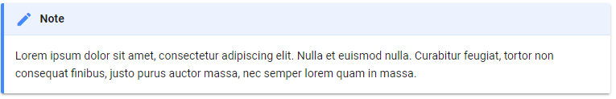

# FarmDyn Documentation
This is the manual for the FarmDyn documentation.
In this document the process on how a) to work on the documentation and b) build the website or PDF version of it will be described.

Please feel encouraged to play around with the documentation: There's nothing that can go broken (everything is under version control), and you'll see that writing Markdown is a breeze!

The latest version of the documentation will be available on
[http://www.ilr.uni-bonn.de/em/rsrch/farmdyn/FarmDynDoku/index.html](http://www.ilr.uni-bonn.de/em/rsrch/farmdyn/FarmDynDoku/index.html)

## Installation

### University of Bonn users
No need to install. Just head to

`\\agpserv7\agpo\work1\Pahmeyer\FarmDyn\FarmDynDoku\FarmDyn`

### External users
In the long run the documentation will be part of the FarmDyn SVN checkout. Until then, please write me a mail (or \@slack) if you would like to contribute.

## Getting up and running
The documentation lives in the docs folder. Instead of a Word document, the documentation is written in Markdown. Markdown is a simple markup language. That means, instead of clicking buttons for making a text bold, italic or else, you can do it through simple commands. Please don't be afraid, as writing in Markdown does require almost no learning and should be as easy to use as Word. The main benefit over a Word file is that we can easily create a Website and a PDF from the same documentation source (among other benefits). You can read more about Markdown [here](https://www.markdownguide.org/getting-started).

Every chapter of the documentation is in it's own file with the file extension `.md`. The `.md` files can be opened and edited with any text editor of your choice (e.g. Notepad, KEdit, TextMate), however, it is recommended to use [Atom](https://atom.io/), because it has many built in features that help you to write in Markdown. The following hints and shortcuts will assume the usage of Atom.

### Starting a development version of the website with live updates
When working on the documentation, it is helpful to see the changes in realtime. This way you can also check if your formulas were typeset correctly or if images appear the way they should.

You can get a quick and nice preview by pressing `ctrl-shift-m` when you have a Markdown file open in Atom. However, this will not show you exactly how the website will look like.

In order to start the development website simply double-click the `startDevServer.cmd` file.


A new browser window (or tab, if the browser was already opened) will appear saying "This Website is not available". Now switch back to the command prompt window that was openend by `startDevServer.cmd` (it's the black icon in the taskbar) and wait until it says `Serving on http:...`.


This will take 0 - 2 minutes. Now reload the browser window, and the Website will be displayed.

#### Changing the structure of the website
The structure of the website is determined by the contents of the `mkdocs.yml` file.


Everything indented after the `pages:` directive will be rendered as a page on the website.

The notation works as follows
```
- This will be the navigation headline: TheMatchingMarkdownFile.md
```

The file names will be relative to the `docs` folder.

As you see, the following contents of the `mkdocs.yml` file
```yml
pages:
    - FarmDyn: index.md
    - About: about.md
    - Introduction: introduction.md
    - Dynamic Character: dynamics.md
    - Risk and Risk behavior: risk.md
    - GHG Accounting: ghgAcc.md
    - Coefficient Generator: coeffGen.md
    - Technical Realization: technical.md
    - Graphical User Interface: gui.md
    - References: References.md
    - Appendix: appendix.md
    - The Template Model:
       - Introduction: template/introduction.md
       - Herd Module: template/herd_module.md
       - Feeding module: template/feeding_module.md
       - Cropping, Land and Land Use: template/cropping__land_and_land_use.md
       - Labour: template/labour.md
       - Stables: template/stables.md
       - Other Type of Buildings: template/other_type_of_buildings.md
       - Farm Machinery: template/farm_machinery.md
       - Investments, Financing and Cash Flow Definition: template/investments__financing_and_cash_flow_definition.md
       - Manure: template/manure.md
       - Synthetic Fertilizers: template/synthetic_fertilizers.md
       - Plant Nutrition: template/plant_nutrition.md
       - Environmental Accounting Module: template/environmental_accounting_module.md
       - Biogas Module: template/biogas_module.md
    - Staff:
       - Development: staff/development.md
```
will be rendered on the website like the following:


As the example shows, all top level indents will be rendered under the **FarmDyn** tab (all vertical links, see FarmDyn, About, Introduction, etc.). A new tab, e.g. **The Template Model** (horizontal links), is introduced by `- The Template Model:` without specifying a file name afterwards. Now all sub-pages of the Template Model tab need to be on the next indentation level, as shown above.

It is good practice to store all markdown files belonging to a certain tab in a subfolder in the `docs` directory (see `template` or `staff` folders.)

### Building the website and publishing it online
If you're happy with the changes you made, you can directly publish the website online. In order to do so, just double click the `buildWebsite.cmd` file.

](assets/folder_overview_buildSite.png)

Obviously, this will only work if you have WRITE access to `\\agpserv2\ilrweb\em\rsrch\farmdyn\FarmDynDoku`.

### Building a PDF / Word document
In case you would like to create a printable (publishable) version of the documentation, just double-click the `createPDFFile.cmd` or respectively `createWordFile.cmd` file.


The resulting documents can be found in the `print` folder once the conversion is done.

#### Changing the structure of the document
The structure of the print documents can be changed by adapting the `tableOfContents.txt` file in the `print` folder.

The following `tableOfContents.txt` file


will result in the following table of contents in a PDF


As you can see, each file path given in the `tableOfContents.txt` file will turn out to be a top-level heading in the Table of Contents, with the sub-level headings specified in those files.

You may notice a couple of things here: in the first line, a file called `print/frontMatter.yml` is referenced. This file will ONLY be used when a PDF file is created (not Word), and stores all information which will be displayed on the first page of the PDF (e.g. Title, Authors, Abstract ...).

Another thing of interest is the next line `docs/index_print.md`. Sometimes, it may be appropriate to have some information on the website that does not need to be in a printable version. In this case, the original `docs/index.md` file features an overview image of the FarmDyn results exploiter. In case we do not want the image to be in the printable version, we can create a copy of the `index.md` file and append the wording `_print` for future reference. In this file, we delete the reference to the image (or may do other alterations). By referencing this other file in the `tableOfContents.txt` file, we now have the chance of adapting the printable version to our needs, while mostly using the same ressources as the website.

### Updating code blocks
Unlike all other edits, the code blocks won't be updated automatically (neither with the live dev server nor the building of the website).
You can update all code blocks in the documentation by double-clicking the `reloadCodeSections.cmd` file.


## Basic Markdown writing reference
The most important reference for working with Markdown is the [Markdown Cheatsheet](https://github.com/adam-p/markdown-here/wiki/Markdown-Cheatsheet).
Also, many things will be self-explanatory when you look through the existing files.
In the following, I will copy (and add to) some of the things that are written in the cheatsheet.

### Headings
You can create a new heading by beginning a line with a `#` (or more depending on the level). Make sure to leave a blank line afterwards.

This markdown:
```
# Heading level 1

## Heading level 2

### Heading level 3

#### Heading level 4

##### Heading level 5

###### Heading level 6

```
Outputs:

# Heading level 1

## Heading level 2

### Heading level 3

#### Heading level 4

##### Heading level 5

###### Heading level 6


### Emphasis
You can write in *italics* or **bold** by doing the following
```
Emphasis, aka italics, with *asterisks* or _underscores_.
Strong emphasis, aka bold, with **asterisks** or __underscores__.
Combined emphasis with **asterisks and _underscores_**.
Strikethrough uses two tildes. ~~Scratch this.~~
```
Outputs:
Emphasis, aka italics, with *asterisks* or _underscores_.
Strong emphasis, aka bold, with **asterisks** or __underscores__.
Combined emphasis with **asterisks and _underscores_**.
Strikethrough uses two tildes. ~~Scratch this.~~

### Lists
(In this example, leading and trailing spaces are shown with with dots: ⋅)

```no-highlight
1. First ordered list item
2. Another item
⋅⋅* Unordered sub-list.
1. Actual numbers don't matter, just that it's a number
⋅⋅1. Ordered sub-list
4. And another item.

⋅⋅⋅You can have properly indented paragraphs within list items. Notice the blank line above, and the leading spaces (at least one, but we'll use three here to also align the raw Markdown).

⋅⋅⋅To have a line break without a paragraph, you will need to use two trailing spaces.⋅⋅
⋅⋅⋅Note that this line is separate, but within the same paragraph.⋅⋅
⋅⋅⋅(This is contrary to the typical GFM line break behaviour, where trailing spaces are not required.)

* Unordered list can use asterisks
- Or minuses
+ Or pluses
```

1. First ordered list item
2. Another item
  * Unordered sub-list.
1. Actual numbers don't matter, just that it's a number
  1. Ordered sub-list
4. And another item.

   You can have properly indented paragraphs within list items. Notice the blank line above, and the leading spaces (at least one, but we'll use three here to also align the raw Markdown).

   To have a line break without a paragraph, you will need to use two trailing spaces.  
   Note that this line is separate, but within the same paragraph.  
   (This is contrary to the typical GFM line break behaviour, where trailing spaces are not required.)

* Unordered list can use asterisks
- Or minuses
+ Or pluses

### Tables
Tables aren't part of the core Markdown spec, but they are part of GFM and *Markdown Here* supports them. They are an easy way of adding tables to your email -- a task that would otherwise require copy-pasting from another application.

```no-highlight
Colons can be used to align columns.

| Tables        |      Are      |  Cool |
|:--------------|:-------------:|------:|
| col 3 is      | right-aligned | $1600 |
| col 2 is      |   centered    |   $12 |
| zebra stripes |   are neat    |    $1 |

There must be at least 3 dashes separating each header cell.
The outer pipes (|) are optional, and you don't need to make the
raw Markdown line up prettily. You can also use inline Markdown.

| Markdown | Less      | Pretty     |
|:---------|:----------|:-----------|
| *Still*  | `renders` | **nicely** |
| 1        | 2         | 3          |
```

Colons can be used to align columns.

| Tables        |      Are      |  Cool |
|:--------------|:-------------:|------:|
| col 3 is      | right-aligned | $1600 |
| col 2 is      |   centered    |   $12 |
| zebra stripes |   are neat    |    $1 |

There must be at least 3 dashes separating each header cell. The outer pipes (|) are optional, and you don't need to make the raw Markdown line up prettily. You can also use inline Markdown.

| Markdown | Less      | Pretty     |
|:---------|:----------|:-----------|
| *Still*  | `renders` | **nicely** |
| 1        | 2         | 3          |


### Images
```no-highlight
Images can be placed just like links, but they have an ! at the beginning.

Inline-style:


Reference-style:
![alt text][logo]

[logo]: docs/media/image1.png "Logo Title Text 2"
```

Images can be placed just like links, but they have an ! at the beginning.

Inline-style:


Reference-style:
![alt text][logo]

[logo]: docs/media/image1.png "Logo Title Text 2"

### Code blocks

```no-highlight
Inline `code` has `back-ticks around` it.
```

Inline `code` has `back-ticks around` it.

Blocks of code on the other hand can be inserted as follows:

<pre lang="no-highlight"><code>```GAMS
p_test = 2;
```
</code></pre>

which will result in:

```GAMS
p_test = 2;
```

When referencing code from the FarmDyn model, we use a small program that automatically pulls the code from the files. This way the documentation stays in sync with the latest model updates.

The syntax for pulling in the code blocks is as follows:

<pre lang="no-highlight"><code>
[embedmd]:# (N:/path/to/gamsFile.gms GAMS /startingPoint/ /endPoint/)
</code></pre>

Where the startingPoint and endPoint need to be [regular expressions](https://docs.microsoft.com/de-de/dotnet/standard/base-types/regular-expression-language-quick-reference). Don't worry, you can copy the most common regular expressions that you will need down below.

Let's say we want to insert the `herdSize_` equation from the `general_herd_module.gms` file in our documentation. In order to do so, we would insert the following markdown

<pre lang="no-highlight"><code>
[embedmd]:# (N:/agpo/work1/FarmDyn_QM/gams/model/general_herd_module.gms GAMS /herdSize_[\S\s][^;]*?\.\./ /;/)
</code></pre>

Once you added such a markdown statement, make sure to double click the `reloadCodeSections.cmd` file as described above. The program will then pull in the code block and update all other ones.

#### Most common code blocks
Keep in mind that the regular expression will always return the FIRST entry it found in the file. That said, your regular expression needs to be precise enough that it is matched only once in the file. Otherwise a code block will be pulled in which you did not want to see at the desired position. In that case, just delete it and try again! It is sometimes even helpful to copy the content of the file to [regex101](https://regex101.com/) and try your regular expression there.

##### A whole function

<pre lang="no-highlight"><code>
[embedmd]:# (N:/path/to/gamsFile.gms GAMS /EquationName_[\S\s][^;]*?\.\./ /;/)
</code></pre>

##### Parameter value assignment

<pre lang="no-highlight"><code>
[embedmd]:# (N:/path/to/gamsFile.gms GAMS /p_someParam("domain1","domain2",domain3)  = 1/ /;/)
</code></pre>

##### Sets or Tables
<pre lang="no-highlight"><code>
[embedmd]:# (N:/path/to/gamsFile.gms GAMS /set setName/ /;/)
[embedmd]:# (N:/path/to/gamsFile.gms GAMS /table tableName/ /;/)
</code></pre>

### Footnotes

#### Inserting the reference
The footnote reference is enclosed in square brackets and starts with a caret, followed by an arbitrary label which may contain numeric identifiers [1, 2, 3, ...] or names [Granovetter et al. 1998]. The rendered references are always consecutive superscripted numbers.

Example:

```md
Lorem ipsum[^1] dolor sit amet, consectetur adipiscing elit.[^2]
```

Result:

Lorem ipsum[^1] dolor sit amet, consectetur adipiscing elit.[^2]

#### Inserting the content
The footnote content is also declared with a label, which must match the label used for the footnote reference. It can be inserted at an arbitrary position in the document and is always rendered at the bottom of the page. Furthermore, a backlink is automatically added to the footnote reference.

**on a single line¶**
Short statements can be written on the same line.

Example:

```md
[^1]: Lorem ipsum dolor sit amet, consectetur adipiscing elit.
```

Result:
See at the bottom of the page
[^1]: Lorem ipsum dolor sit amet, consectetur adipiscing elit.


**on multiple lines**
Paragraphs should be written on the next line. As with all Markdown blocks, the content must be indented by four spaces.

Example:

```md
[^2]:
    Lorem ipsum dolor sit amet, consectetur adipiscing elit. Nulla et euismod
    nulla. Curabitur feugiat, tortor non consequat finibus, justo purus auctor
    massa, nec semper lorem quam in massa.
```

Result:
see at the bottom of the page
[^2]:
    Lorem ipsum dolor sit amet, consectetur adipiscing elit. Nulla et euismod
    nulla. Curabitur feugiat, tortor non consequat finibus, justo purus auctor
    massa, nec semper lorem quam in massa.

### Equations
Typesetting equations in Markdown is done using the powerful LaTeX notation. Already know LaTeX? Then directly go to Step 2. If not, no worries, just keep on reading.

1) A lot of Visual Equation Editors are available online. A really simple, but powerful one is [Gruppy](https://guppy.js.org/site/). Just type your equation in the "Click to start typing math!" field and once done, copy the LaTeX output which is shown below.

2) In the Markdown file, inline math is written by using single dollar signs:

```md
this will be some inline math $2+2=4$ and it will look really pretty
```

outputs:

this will be some inline math $2+2=4$ and it will look really pretty

Equation blocks (on a new line and centered), will be surrounded by two dollars:

```md
this will be a block equation

$$2+2=4$$

and it will look really pretty
```
outputs:

this will be a block equation

$$2+2=4$$

and it will look really pretty


### Admonition blocks
Admonition is an extension included in the standard Markdown library that makes it possible to add block-styled side content to your documentation, for example summaries, notes, hints or warnings.

Admonition blocks follow a simple syntax: every block is started with !!!, followed by a single keyword which is used as the type qualifier of the block. The content of the block then follows on the next line, indented by four spaces.

```md
!!! note
    Lorem ipsum dolor sit amet, consectetur adipiscing elit. Nulla et euismod
    nulla. Curabitur feugiat, tortor non consequat finibus, justo purus auctor
    massa, nec semper lorem quam in massa.
```

will result in



Beware that these blocks won't appear in the printable documents (at least at the time of writing).

You can read more about how to set up admonition blocks [here](https://squidfunk.github.io/mkdocs-material/extensions/admonition/).
