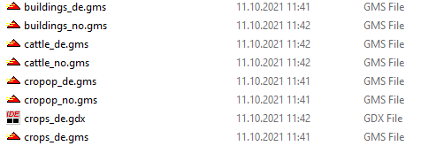

# Data flow

This section provides information on the general data flow in FarmDyn.

{: style="width:100%"}
Figure 1: General data flow  in FarmDyn
Source: Own illustration

Data in Farmdyn is collected from books, literature and online databases.
The collected data populates directly the exogenous parameters or is processed in order to be
harmonized with data from other sources. The parameters are stored in *.gms* or
*.gdx* files, where each file deals with a specific domain of the farm. This
includes, for example, *cattle.gms*, which stores data on all kind of information
for dairy, beef and mothercow farms, or *crops_de.gms* which stores and processes
information for crops and cropping activities. The database is not only domain
specific but also country specific. The suffix in the name of *crops_de.gms*, for
instance, indicate that the parameterization with this file would provide crop
information for German conditions. For some domains FarmDyn also contains information
for the Netherlands, Norway, and Swizz.

{: style="width:100%"}
Figure 2: File structure with exemplary snippet
Source: Own illustration

In line with the idea of modularity in FarmDyn, each data file corresponds to
a certain module. Hence, the model configuration of a certain model run determines
which data is called from the database and used to populate the model for that
specific simulation.
