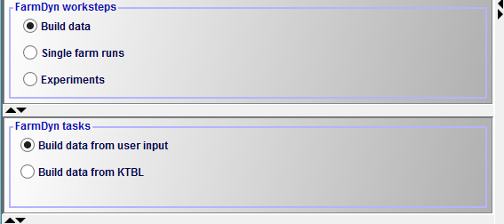
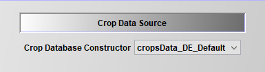

# Data processing

There are multiple stages in the modelling sequence where data is processed to fit
the requirements of the model and the configuration of the user. Before the simulation phase, the collected data has to be harmonized in order to fulfil the requirements
of the model with respect to e.g. time (yearly, monthly, bi-weekly), disaggregation
of production stages of animals (calves, heifers, etc.), and many more. In addition,
parts of the database can be selected in order to process non-used parts of the database.
This pre-simulation processing is further described in the section *Build data*.
During the simulation phase, the configuration made by the user in the Graphical
User Interface triggers another data processing step, where the required data is
retrieved from the databases and further processed. This is described in the section
*Coefficient generator*.

## Build data - User or KTBL defined data files

As a long term goal, the FarmDyn crew plans to develop a flexible construction
of the database in order to facilitate the use of FarmDyn for external users. Thereby,
FarmDyn can be more easily adapted to other countries with different price/cost and policy
structures.

Currently, FarmDyn provides the option to construct data sets for the arable crops.
We differentiate here between the "User defined" and "KTBL defined" construction
of the crop file. In the GUI you can find the different options to generate
the data files as seen in the picture below:

{: style="width:100%"}
Figure 1: Build data in the GUI
Source: Own illustration

Each option to generate a new file for the database is presented in the following.

### User defined files

For each data file which is to be adapted to a certain region, the user can alter the default values given in the pre-set default file. For example, crops has the default data for Germany given in the file *cropsData_DE_Default.gms*, which can be copied and changed in order to fit to crop data from other countries/regions and their corresponding agronomic and policy related differences. This file is then used to generate a *.gdx* file, which can be chosen in the GUI to introduce the specific crops.

{: style="width:100%"}
Figure 1: User defined crop file
Source: Own illustration

### KTBL defined files

## Coefficient generator - Concept and file structure

The coefficient generator comprises a number of small modules, realised in GAMS, which define the various exogenous parameters comprised in the template. It is designed such that it can generate from a few central characteristics of the farm (herd size, current milk yield, existing stables and their construction year, labour force and available land) and the realised crop yields a plausible set of coefficients for the
template model. The coefficient generator can also be set-up to load
parameters for a specific region.

The coefficient generator is divided in:

-   **Beef:**: length of production, costs per year and animal,
    and average age of animals to determine exact LU

-   **Buildings:** includes bunker silos for silage maize and
    potatoes.

-   **Calves:**: length of production, costs per year and animal,
    and average age of animals to determine exact LU

-   **Cows**: cows, heifers and calves are defined that have different
    milk yield potentials. Additionally, a maximum number of lactation
    is defined. It depends on the milk output level of the lactating
    cows (diminishes with increasing milk output potential).

-   **Credit**: different credit types are defined. These vary by
    interest rate and payback time.

-   **Cropping**: defines different activities for cash-crop production
    with specific restrictions concerning crop rotation, fertilizer
    demand and yield potentials.

-   **Initial stables**: Stable size and types, capacities and calculation
    of required stables places.

-   **Environmental accounting**: defines environmental impact due to
    manure and fertiliser application.

-   **Farm constructor**: the farm constructor defines the relationships
    between benchmark data of the farms and production specific
    endowments e.g. of land, stables and machinery in the initial
    situation.

-   **Farm\_Ini:** Initialises the farms land endowment and plot
    distribution

-   **Feeds**: possible fodder compounds are listed with their specific
    contents of ingredients (N, C, DM, XP,\...).

-   **Fermenter\_tech**: includes all data regarding the technical
    aspects of the biogas fermenter, the different inputs and their
    related biogas yields.

-   **Fertilising**: defines coefficients for various application
    techniques for organic and synthetic fertilisers.

-   **Greening**: Adds the restrictions of the CAP
    Greening into the model.

-   **Ini\_herds**: it defines the initial herds of the farm.

-   **Labour**: defines labour needs on a monthly basis for herds and
    crops and wages for the off-farm work.

-   **Mach**: defines the different types of machinery that are
    available for the farmer and it quantifies the useful lifetime
    (defined according to years or on hourly basis) as well as
    investments and variable costs.

-   **Manure**: quantifies amount of animal excreta with respect to
    livestock category. For cows manure amount is controlled by yearly
    milk output level. Furthermore, coefficients for different manure
    storage and application types are derived by this module.

-   **Pigs:** defines output coefficients, production lengths and other
    variable costs for fatteners and sows.

-   **Prices**: different default values are defined if prices for
    variables are not defined by the GUI.

-   **Prices\_eeg**: contains the prices applied in the different EEGs
    as well as investment prices for different biogas plant parts.

-   **Requ**: definitions of requirement functions for lactating cows in
    relation to their milk yield, live weight etc., as well as for
    heifers and calves are included in this module.

-   **Silos**: in this module the definition of different types of
    surface reservoirs for liquid manure is set. It differentiates
    concerning capacity and related investment costs. Furthermore,
    additional costs of specific coverage types of the surface manure
    reservoirs are defined for straw coverage and coverage with foil.

-   **Social_accounting:**: conversion of animal output in calories and proteins

-   **Stables:** stable types with stable places and required workload
    for the respective stables for all herd types

-   **StochProg**: defines the decision tree and further GAMS symbols
    used in the stochastic programming version

-   **Tech:** defines all machinery, crop specific operation
    requirements and field working days.
