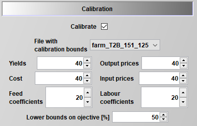
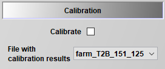

# Calibration

## General Concept

To generate a reasonable baseline for policy analysis, FarmDyn provides the option to calibrate the model to observed farms. The calibration is implemented as a bi-level optimisation approach which is segmented in an upper and lower problem. The upper problem represents the minimisation of the deviation between the observed values and the previously fixed values. These fixed values against which the model is calibrated can be set on the one hand by the user and on the other hand are taken from key parameters in FarmDyn. The user can define crop rotations and the number of animals as calibaration targets. Data on the prices for input and output, yields, labour coefficients and feeding coefficients are used and adapted to steer the FarmDyn model to reproduce the observed crop rotations and animal numbers. The lower problem of the bi-level optimisation process is the FarmDyn model itself.

For a general introduction of the calibration method in FarmDyn you can refer to:

Britz, W. (2021): Automated Calibration of Farm-Sale Mixed Linear Programming Models using Bi-Level Programming, *German Journal of Agricultural Economics*, 70(3): 165-181.

## Short User Guide

In the figure below you see the set-up of the calibration process in the graphical user interface (GUI). As "File with calibration bounds" you have to select the file in which you define your personal calibration targets for the crop rotation and the animal numbers. This file must have the same structure as the example files "with calibration bounds" which are stored in FarmDyn in the directory *gams/calibFiles* and must also be saved there. Further, you can set the calibration bounds for yields, output prices, costs, input prices, feed coefficients and labour coefficients in the GUI. The steering of these values allows a +/- percentage deviation of the given FarmDyn parameters. Optionally, one can also set the lower bound on the objective function. This is realised by using the overall farm profit from a "normal" solve which then can be enabled to define a lower bound on the objective function.

Figure 1: GUI calibration options
Source: Own illustration.

The calibration results are stored in a *.gdx* container which can be called in the GUI to simulate the given farm.

Figure 2: Farm simulation based on calibration
Source: Own illustration.
