#Modularity

## Modularity Concept in FarmDyn

Russel (2012) describes the general idea of modularity as following:
"Modularity describes specific relationships between a whole system
and its particular components. A modular system consists of smaller
parts (modules) that fit together within a predefined system of architecture.
Modules feature standardized interfaces, which facilitate their
integration with the overarching system architecture. A key feature of
each module is that it should encapsulate (or ‘black box’) its messy
internal details […] to display only a consistent interface. The designers
of modular systems are therefore able to swap modules in a ‘plug-and-play’
manner, which increases the system’s flexibility.”

In line with this broad definition and the description of preferred generic and modular
implementations of bio-economic farm-scale models (Britz et al. 2021), FarmDyn is
structured as a modular system where each module comprises a block of equations
and variables which can be activated depending on the user case. Practically,
each module captures a specific farm management or methodology domain within
a file. Further, the definition of parameters is either
done in a module if it is only used in that specific file or is organized
globally in the set and parameter declaration module, *templ\_decl.gms*. Each module can be either
a stand alone module or is linked to other modules and grouped together to build
a specific aspect of the farm, e.g. the farm branch, or the *core model*. To illustrate
the idea of the modular structure and the different groupings, we can look at the
following graph:

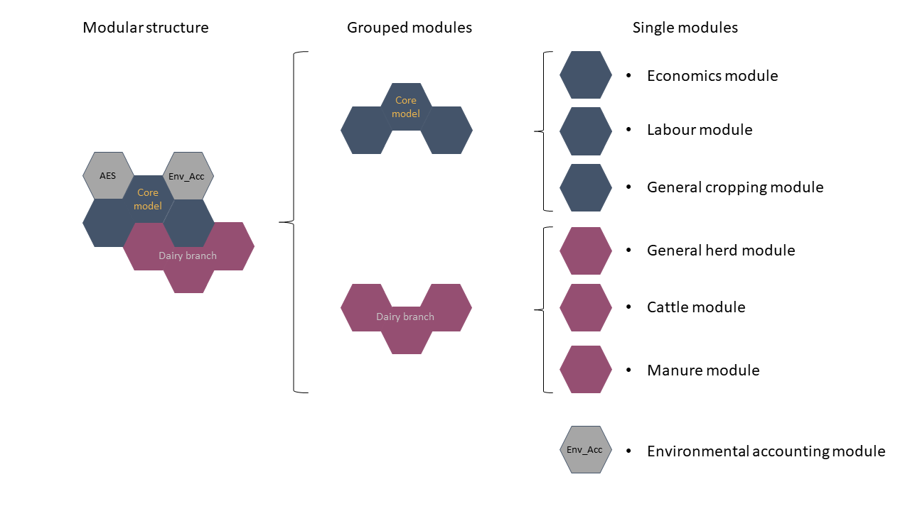{: style="width:100%"}
Figure 1: Depiction of the modular structure of a dairy farm which has to
comply with the greening obligation and is able to use agri-environmental measures on-farm.
Source: Own illustration.

The *core model* is composed of three modules, which are always activated regardless
of any other set-up option in the Graphical User Interface (GUI). The three modules build
the base of almost all real-life farms with an *economic module*, also containing
the objective function, the *labour module* for the simulation of on- and off-farm
labour use, and the *general cropping module*, which determines the land use of
arable and grassland on-farm.

Other grouped modules build the basis for the different branches in FarmDyn. This
includes the *dairy branch*, the *mothercows branch*, the *beef branch*,
the *sows branch*, the *fattners branch*, and the *biogas branch*. Each of the
branches is based on at least two modules, with some of the branches sharing
a module, such as all livestock branches sharing the *general herd module*.

Next to the grouped modules, there are stand-alone modules which comprise only
a specific topic, such as the *greening module* or the *agri-environmental scheme module.*

## Modularity, Data and Reporting Structure

The modular structure does not only require domain separated variables and equations
files, but has to be reflected in the data base/ processing as well as the
reporting of simulation results. This is illustrated by the following modified figure,
by Britz et al. (2021):

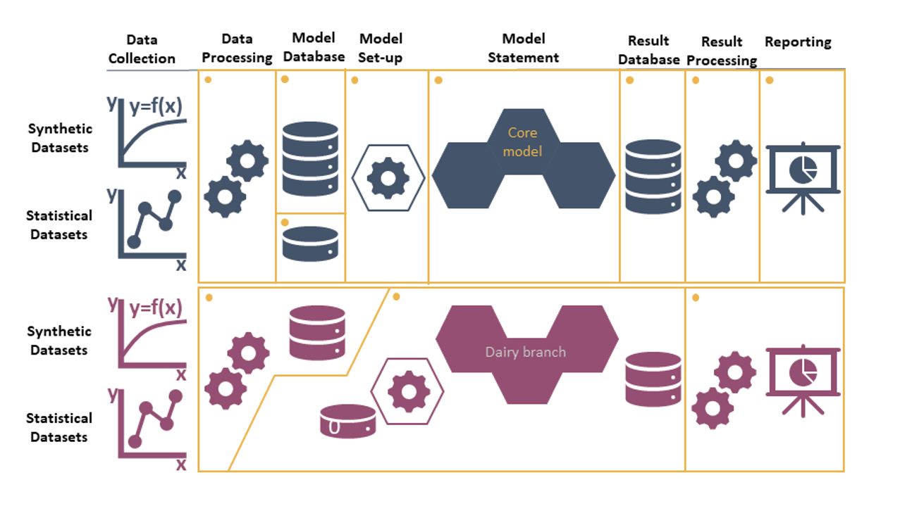{: style="width:100%"}
Figure 2: Variable and equation part (core model) embedded in the data and reporting
structure.
Source: Taken and modified from Britz et al. (2021)

The figure shows that each module or group of modules provides their own data set
including the pre-processing of the data and additional options for the model
set-up in the GUI. Further, in addition to the provided data set each module comes
together with a result and reporting section to facilitate the result analysis.

<!-- ## Modularity as a key to multiple projects and collaborations -->

## List of Current Grouped Modules and the Individual Modules

### Grouped Modules

<!--

|Name | Type | File/s|
|------------|------|-------|
|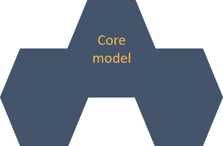{: style="width:250px; height:125px"}| Core Model| templ.gms, labour_module.gms, general_cropping_module.gms|  
|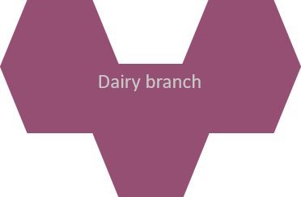{: style="width:250px; height:125px"}| Branch | general_herd_module.gms, cattle_module.gms, manure_module.gms|
|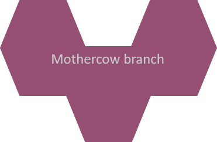{: style="width:250px; height:125px"}| Branch| general_herd_module.gms, cattle_module.gms, manure_module.gms|  
|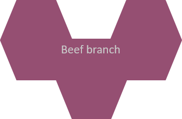{: style="width:250px; height:125px"}| Branch| general_herd_module.gms, cattle_module.gms, manure_module.gms|  
|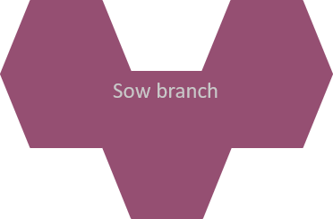{: style="width:250px; height:125px"}| Branch|  general_herd_module.gms, pig_module.gms, manure_module.gms|  
|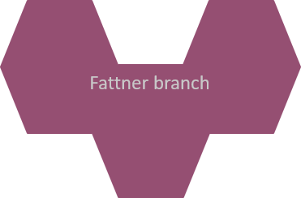{: style="width:250px; height:125px"}| Branch|general_herd_module.gms, pig_module.gms, manure_module.gms|  
|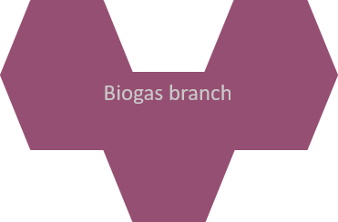{: style="width:250px; height:125px"}| Branch| biogas_module.gms, manure_module.gms|  

-->

<table>
<thead>
<tr>
<th>Name</th>
<th>Type</th>
<th>File/s</th>
</tr>
</thead>
<tbody>
<tr>
<td></td>
<td>Core Model</td>
<td>templ.gms labour_module.gms general_cropping_module.gms</td>
</tr>
<tr>
<td></td>
<td>Branch</td>
<td>general_herd_module.gms cattle_module.gms manure_module.gms</td>
</tr>
<tr>
<td></td>
<td>Branch</td>
<td>general_herd_module.gms cattle_module.gms manure_module.gms</td>
</tr>
<tr>
<td></td>
<td>Branch</td>
<td>general_herd_module.gms cattle_module.gms manure_module.gms</td>
</tr>
<tr>
<td></td>
<td>Branch</td>
<td>general_herd_module.gms pig_module.gms manure_module.gms</td>
</tr>
<tr>
<td></td>
<td>Branch</td>
<td>general_herd_module.gms pig_module.gms manure_module.gms</td>
</tr>
<tr>
<td></td>
<td>Branch</td>
<td>biogas_module.gms manure_module.gms</td>
</tr>
</tbody>
</table>

### Individual Modules

<!--
| Module Name | File (* - gms*)| Description|
|----------------|------|-------|
|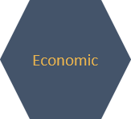{: style="width:150px; height:125px"} |templ* | The template/economic module is the leading file to collect all other modules. In addition, the primary economic aspects of the model are defined in the module. This includes: (1) the objective function, (2) the cash flow structure, (3) the income tax calculation, (4) the premium payments, (5) the sales and production levels, (6) the variable cost structure, and (7) the investment costs.  |
|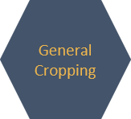{: style="width:150px; height:125px"} |general_cropping_module*| The cropping module optimises the cropping pattern subject to land availability, reflecting yields, prices, machinery and fertilising needs, and other variable costs for a selectable list of arable crops. The crops can be differentiated by production system (conventional, organic), tillage (plough, minimal tillage, no tillage) and intensity level (normal and reduced fertilisation in 20 % steps). Machinery use is linked to field working-day requirements depicted with a bi-weekly resolution during the relevant months. Crop rotational constraints can be either depicted by introducing crop rotations or by simple maximal shares. The model can capture plots which are differentiated by soil and land type (grassland, arable land and pasture), size and distance. |
|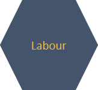{: style="width:150px; height:125px"} |labour_module* | The labour module optimises work use on- and off-farm with a monthly resolution, depicting detailed labour needs for different farm operations, herds and stables, management requirements for each farm branch, and the farm as a whole. Off-farm work distinguishes between half- and full-time work (binaries) and working flexibly for a low wage rate. |
|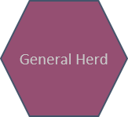{: style="width:150px; height:125px"} |general_herd_module* | The general herd module captures all facets of a herd which are not animal type specific: (1) It integrates the intra- and inter-year dynamic of the herd for all types of animals: dairy, mothercows, heifers, bulls, male and female calves, sows, fattners, and piglets. (2) It determines the required stable space based on the herd size and steers the buying decision and contains the stable inventory. (3) It implements the excretion quantities and their associated nutrient quantities for all animal types on a monthly basis. |
|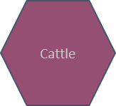{: style="width:150px; height:125px"} |cattle_module* | The cattle module is closely related to the general herd module. It describes the demographic relations between cattle types (dairy, mothercows, male and female calves, heifers, young bulls) on the farm. The cattle feed requirements are calculated considering the animals performance and the lactation phase of cows. The requirements can be met via a mix from own produced and purchased fodder, concentrates and grazing from pastures. |
|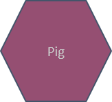{: style="width:150px; height:125px"} |pig_module* | The pig module captures the feeding activities for all pig types (piglets, sows, fattners) based on their production phase. It considers both purchased and own produced fodders. It further calculates the number of new piglets at the start of the simulation based on the number of sows.  |
|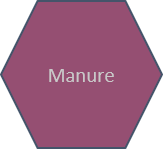{: style="width:150px; height:125px"} |manure_module* | The manure module captures all relevant movements of organic fertiliser and their nutrients after excretion. This includes the investment in storage, the type of storage (subfloor storage or silo), the storage capacity for all organic fertiliser sources (cattle, pigs, biogas plant, imports), their respective nutrients, losses of nutrients due to emissions, and exporting organic fertiliser.|
|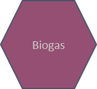{: style="width:150px; height:125px"} |biogas_module* | The biogas module defines the economic and technological relations between components of a biogas plant with a monthly resolution, as well as links to the farm. Thereby, it includes the statutory payment structure and their respective restrictions according to the German Renewable Energy Acts (EEGs) from 2004 up to 2014. The biogas module differentiates between three different sizes of biogas plants and accounts for three different life spans of investments connected to the biogas plant. Data for the technological and economic parameters used in the model are derived from KTBL (2013) and FNR (2013). The equations within the template model related to the biogas module are presented in the following section. |
|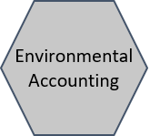{: style="width:150px; height:125px"} |env_acc_module_de* | The environmental accounting module utilises commonly applied methodology for the quantification of methane (CH4), ammonia (NH3), nitrous dioxide (N2O), nitrogen oxides (NOx) and elemental nitrogen (N2), as well as particulate matter formation (PM10 and PM2.5), as laid down in IPCC (2019) and EMEP (2013, 2016). N and P lost through erosion, run-off and leaching are calculated using methodology from Richner et al. (2014) and Prasuhn (2006). Upstream emissions from the provision of mayor farm inputs and services can be included via the ecoinvent database c. Emissions are characterised at midpoint level using characterisation factors from Huijbregts et al. (2016). |
|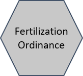{: style="width:150px; height:125px"} |fertord_module* | The fertilisation ordinance (FO) module integrates the national implementation of the Nitrates Directive into Farmdyn. It covers the most prominent measures of the FO, namely: (1) the nutrient balance restrictions, (2) an organic nitrogen application threshold, (3) the binding fertiliser planning, (4) the required manure storage capacities, (5) the banning periods for fertiliser application, (6) the restriction of fertiliser application in autumn, (7) the low-emission manure application techniques and (8) the obligatory catch crop cultivation.|
|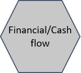{: style="width:150px; height:125px"} |fin_cashflow* | The financial cash flow captures all types of credits, repayments, interest payments and received interests. It is only active in a fully dynamic version.|
|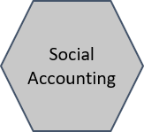{: style="width:150px; height:125px"} |social_acc_module* | The social accounting module contains information about the protein and calorie production on-farm both used for feeding and also as human edible quantitiy. |
|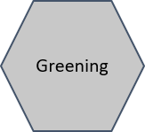{: style="width:150px; height:125px"} |greening_module* | The greening module captures the greening requirements of the Common Agricultural Policy of the European Union (CAP). It integrates the key measures crop diversification (considering multiple requirement tiers based on arable and grass land endowment) and ecological focus areas (mainly legumes) into FarmDyn. |
|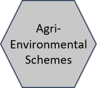{: style="width:150px; height:125px"} |aes_module_de* | The agri-environmental scheme (AES) module contains optional measures for farmers from the CAP Pillar II. The AES design in FarmDyn follows the structure of the German state of North Rhine-Westphalia including (1) diverse crop rotation options, (2) payments for flower strips and (3) catch crop cultivation.   |
|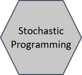{: style="width:150px; height:125px"} |stochprog_module* |  |

-->

<table>
<thead>
<tr>
<th>Module Name</th>
<th>File</th>
<th>Description</th>
</tr>
</thead>
<tbody>
<tr>
<td></td>
<td>templ.gms</td>
<td>The template/economic module is the leading file to collect all other modules. In addition, the primary economic aspects of the model are defined in the module. This includes: (1) the objective function, (2) the cash flow structure, (3) the income tax calculation, (4) the premium payments, (5) the sales and production levels, (6) the variable cost structure, and (7) the investment costs.</td>
</tr>
<tr>
<td></td>
<td>general_cropping_module.gms</td>
<td>The cropping module optimises the cropping pattern subject to land availability, reflecting yields, prices, machinery and fertilising needs, and other variable costs for a selectable list of arable crops. The crops can be differentiated by production system (conventional, organic), tillage (plough, minimal tillage, no tillage) and intensity level (normal and reduced fertilisation in 20 % steps). Machinery use is linked to field working-day requirements depicted with a bi-weekly resolution during the relevant months. Crop rotational constraints can be either depicted by introducing crop rotations or by simple maximal shares. The model can capture plots which are differentiated by soil and land type (grassland, arable land and pasture), size and distance.</td>
</tr>
<tr>
<td></td>
<td>labour_module.gms</td>
<td>The labour module optimises work use on- and off-farm with a monthly resolution, depicting detailed labour needs for different farm operations, herds and stables, management requirements for each farm branch, and the farm as a whole. Off-farm work distinguishes between half- and full-time work (binaries) and working flexibly for a low wage rate.</td>
</tr>
<tr>
<td></td>
<td>general_herd_module.gms</td>
<td>The general herd module captures all facets of a herd which are not animal type specific: (1) It integrates the intra- and inter-year dynamic of the herd for all types of animals: dairy, mothercows, heifers, bulls, male and female calves, sows, fattners, and piglets. (2) It determines the required stable space based on the herd size and steers the buying decision and contains the stable inventory. (3) It implements the excretion quantities and their associated nutrient quantities for all animal types on a monthly basis.</td>
</tr>
<tr>
<td></td>
<td>cattle_module.gms</td>
<td>The cattle module is closely related to the general herd module. It describes the demographic relations between cattle types (dairy, mothercows, male and female calves, heifers, young bulls) on the farm. The cattle feed requirements are calculated considering the animals performance and the lactation phase of cows. The requirements can be met via a mix from own produced and purchased fodder, concentrates and grazing from pastures.</td>
</tr>
<tr>
<td></td>
<td>pig_module.gms</td>
<td>The pig module captures the feeding activities for all pig types (piglets, sows, fattners) based on their production phase. It considers both purchased and own produced fodders. It further calculates the number of new piglets at the start of the simulation based on the number of sows.</td>
</tr>
<tr>
<td></td>
<td>manure_module.gns</td>
<td>The manure module captures all relevant movements of organic fertiliser and their nutrients after excretion. This includes the investment in storage, the type of storage (subfloor storage or silo), the storage capacity for all organic fertiliser sources (cattle, pigs, biogas plant, imports), their respective nutrients, losses of nutrients due to emissions, and exporting organic fertiliser.</td>
</tr>
<tr>
<td></td>
<td>biogas_module.gms</td>
<td>The biogas module defines the economic and technological relations between components of a biogas plant with a monthly resolution, as well as links to the farm. Thereby, it includes the statutory payment structure and their respective restrictions according to the German Renewable Energy Acts (EEGs) from 2004 up to 2014. The biogas module differentiates between three different sizes of biogas plants and accounts for three different life spans of investments connected to the biogas plant. Data for the technological and economic parameters used in the model are derived from KTBL (2013) and FNR (2013). The equations within the template model related to the biogas module are presented in the following section.</td>
</tr>
<tr>
<td></td>
<td>env_acc_module_de.gms</td>
<td>The environmental accounting module utilises commonly applied methodology for the quantification of methane (CH4), ammonia (NH3), nitrous dioxide (N2O), nitrogen oxides (NOx) and elemental nitrogen (N2), as well as particulate matter formation (PM10 and PM2.5), as laid down in IPCC (2019) and EMEP (2013, 2016). N and P lost through erosion, run-off and leaching are calculated using methodology from Richner et al. (2014) and Prasuhn (2006). Upstream emissions from the provision of mayor farm inputs and services can be included via the ecoinvent database c. Emissions are characterised at midpoint level using characterisation factors from Huijbregts et al. (2016).</td>
</tr>
<tr>
<td></td>
<td>fertord_module.gms</td>
<td>The fertilisation ordinance (FO) module integrates the national implementation of the Nitrates Directive into Farmdyn. It covers the most prominent measures of the FO, namely: (1) the nutrient balance restrictions, (2) an organic nitrogen application threshold, (3) the binding fertiliser planning, (4) the required manure storage capacities, (5) the banning periods for fertiliser application, (6) the restriction of fertiliser application in autumn, (7) the low-emission manure application techniques and (8) the obligatory catch crop cultivation.</td>
</tr>
<tr>
<td></td>
<td>fin_cashflow.gms</td>
<td>The financial cash flow captures all types of credits, repayments, interest payments and received interests. It is only active in a fully dynamic version.</td>
</tr>
<tr>
<td></td>
<td>social_acc_module.gms</td>
<td>The social accounting module contains information about the protein and calorie production on-farm both used for feeding and also as human edible quantitiy.</td>
</tr>
<tr>
<td></td>
<td>greening_module.gms</td>
<td>The greening module captures the greening requirements of the Common Agricultural Policy of the European Union (CAP). It integrates the key measures crop diversification (considering multiple requirement tiers based on arable and grass land endowment) and ecological focus areas (mainly legumes) into FarmDyn.</td>
</tr>
<tr>
<td></td>
<td>aes_module_de.gms</td>
<td>The agri-environmental scheme (AES) module contains optional measures for farmers from the CAP Pillar II. The AES design in FarmDyn follows the structure of the German state of North Rhine-Westphalia including (1) diverse crop rotation options, (2) payments for flower strips and (3) catch crop cultivation.</td>
</tr>
<tr>
<td></td>
<td>stochprog_module.gms</td>
<td></td>
</tr>
</tbody>
</table>

