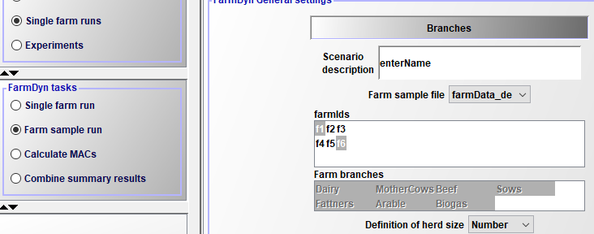

# Farm Population

## Introduction to the Simulation of the Farm Populations

FarmDyn is a single-farm level model. This provides an ideal option to assess certain policies or technologies given a few suitable case study farms. However, often the research question at hand addresses certain populations or examines the effect on many heterogeneous farms. In such research questions, case study farms are not capable to capture all relevant aspects. To address the heterogeneous effect of different farms within a population or the population as a whole, FarmDyn offers to simulate farm populations. Farm populations are introduced as single farms with each one distinct from another. The relevant characteristics which distinguish each of the farms are the:

* Farm type
* Output levels (crop yields and animal outputs)
* Number of labour units on farms
* Arable- and grassland endowments
* Number of animals
* Initial inventory of stables

## Implementation in the Model

The file to generate a farm population can be found in the *dat* directory with an farm population example in the file *farmData\_de.gms*. In this file you can adjust the number of farms your population has and assign values to the parameters from the list above. After filling in all relevant information in the file you can run the file to generate a *.gdx* container. This can be used as the farm population in FarmDyn.

In a second step you can call upon the generated farm population in the graphical user interface (GUI) as seen in the figure below. You can choose your relevant *Farm sample file* which opens up the option to select certain farms to simulate or to automatically run all farms sequentially. Note, that you have to set the FarmDyn task from *Single farm run* to *Farm sample run* on the left hand side of the GUI to run a population simulation.   

Figure 1: GUI farm sample options
Source: Own illustration.
