# Dealing with risk and risk behaviour: deterministic versus stochastic model versions

!!! danger "Prototype feature"
    This feature has not been thoroughly tested and should be used with caution.

> **_Abstract_**  
The default layout of the model maximises the net present value (NPV) over the simulation horizon in a deterministic setting. The stochastic programming extension introduces decision trees based on mean reverting processes for the output and input price levels and renders all variable state contingents, calculating the option value of full flexibility in management and investment decisions over the simulation horizon. An experimental extension allows rendering additionally yields stochastic. A tree reduction algorithm allows exploiting the outcome of large-scale Monte-Carlo simulations while avoiding the curse of dimensionality. Besides risk neutral maximisation of the expected NPV, different types of risk behaviour such as MOTAD, Target MOTAD or value at risk can be used in conjunction with the stochastic programming extension.

## Overview


The FarmDyn model comprises since the first versions optionally stochastic components. In the current version, two set-ups are possible:
1.	A deterministic version
2.	A fully stochastic programming version where all variables are state contingent and unbalanced stochastic trees are used.
In the deterministic version, no parameter is stochastic and hence no variable state contingent. The equations, variables and certain parameter carry nevertheless indices for nodes in the decision tree and state of nature (SON), but these refer in any year to a deterministic singleton. In the partly stochastic simulation version of the FarmDyn model, farm management and investment characters with a longer-term character are not state contingent and hence must allow managing all SONs in any year. For example, in case of machine depreciation based on use, the investment decisions must ensure the maximum use in any year and SON.
The fully stochastic programming (SP) version of the model introduces scenario trees and renders all variables in the model stage contingent to yield a fully dynamic stochastic approach. That is only feasible in conjunction with a tree reduction approach: even if we would only allow for two different states of nature in each year (= decision nodes), we would end up after twenty years with 210 \ ~ 1 million leaves in the trees. Given the number of variables and equations in any year, the resulting model would be impossible to generate and solve. In the following, we briefly discuss the changes to model structure and how the decision tree and the related random variable(s) are constructed.
The SP version of the model can be combined with a number of risk behavioural models to maximise the expected utility or an implementation of prospect theory. Given the complex character of the remaining modules in the model, only such behavioral models were chosen which can be implemented in a MIP framework, hence, non-linear approaches such as an E-V approach are not considered. The available risk models (value at risk (var), conditional value at risk, MOTAD and target MOTAD) are discussed in the risk behaviour section.


### Objective Function in the deterministic version

In the deterministic version of the model, we consider a maximisation of the NPV of the farm household income under a given discount rate. The farm is assumed to be liquidated at the end of the planning horizon, i.e. the cow herd, machinery and land are sold and loans are paid back. Any remaining equity is discounted to its NPV; therefore, a definition close to the flow-to-equity approach is used:

[embedmd]:# (N:/em/work1/Pahmeyer/FarmDyn/FarmDynDoku/FarmDyn_Docu/gams/model/templ.gms GAMS /OBJE_/ /;/)
```GAMS
OBJE_           ..
*
       v_obje =L=
                v_objeMean
*
*       --- penalty for negative deviation from mean NPV (similar MOTAD) or target MOTAD / ES
*
      + [ 0

$ifi %stochProg%==true - v_expNegDevNPV * p_negDevPen  $ (not p_expShortFall)
$ifi %stochProg%==true - v_expShortFall * p_negDevPen  $ (not p_expShortFall)
$ifi %stochProg%==true + v_expShortFall * p_negDevPen  $ p_expShortFall
        ] $ sum(t_n(tCur,nCur) $  (v_hasFarm.up(tCur,nCur) ne 0),1)
    ;
```

Further on, the fully dynamic optimisation assumes that the decision maker is fully informed about the deterministic future such that the economically optimal farm plan over the chosen planning horizon is simulated.

## The Stochastic Programming version with full stage contingency

As opposed to the deterministic version, in the SP version all variables are state contingent. The stochastic version considers different future developments over time, currently implemented for selected output and input prices, i.e. price paths, and crops yields. These paths do not need to have equal probability. The simulated paths can be mapped back into a distribution for a comparative-static stochastic experiment.

The SP approach includes a decision tree that reflects decision nodes where each node can have multiple leaves with different probabilities of occurrence. All decisions are contingent on the SON in the current year, and decisions in subsequent years depend on decisions made on previous nodes (=stages) on the path to a final leave. In the SP, all production and investment decisions in any year are hence depicted as state-contingent, i.e. they reflect at that time point the different futures which lay ahead, including future management flexibility. Also the timing of investments is hence state contingent.

All variables and equations carry the index nCur, which indicates the current node in the decision tree. Equally, the node needs to be linked to the correct year, which is achieved by a dollar operator and the t\_n set, for instance as in the following equation which was already shown above. Whereas in the deterministic version, there is just one dummy node for each year, in the stochastic version, potentially different states and thus nodes are found for decision variables and equations in any one year.
The revised objective function maximises the probability weighted average of the final liquidity for each final leave in the decision tree:


[embedmd]:# (N:/em/work1/Pahmeyer/FarmDyn/FarmDynDoku/FarmDyn_Docu/gams/model/templ.gms GAMS /OBJE_/ /v_objeMean/)
```GAMS
OBJE_           ..
*
       v_obje =L=
                v_objeMean
```

The number of uncompressed scenarios to start with and the desired number of leaves in the final reduced tree are defined via the graphical user interface (GUI) if the SP module is switched on:

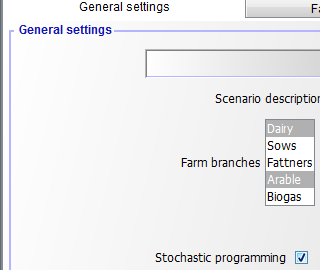{: style="width:100%; height:400px"}

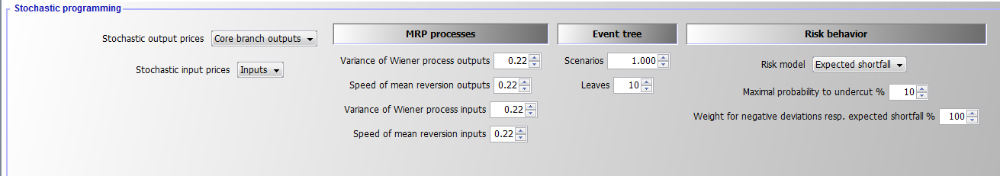{: style="width:100%"}

That information enters the declarations in model\templ\_decl.gms. If the SP extension is switched off, there is only one node (which is indicated by a blank space, " ") and the model collapses to a deterministic one:

[embedmd]:# (N:/em/work1/Pahmeyer/FarmDyn/FarmDynDoku/FarmDyn_Docu/gams/model/templ_decl.gms GAMS /\$iftheni\.sp/ /= 1;/)
```GAMS
$iftheni.sp not "%stochProg%"=="true"
*
*  --- dummy implementation of SP frameworK
*      there is one universal node, i.e. that is the deterministic version
*

   set n "Decision nodes in tree" / " " /;
   set t_n(t,n) "Link betwen year and decision node";
   t_n(t," ") = YES;

   set anc(n,n) "Is the second node the node before first one?";
   anc(" "," ") = YES;

   set isNodeBefore(n,n) "Is the second node before first one?";
   isNodeBefore(" "," ") = YES;

   set sameScen(n,n) "The two nodes belong to the same scenario";
   sameScen(" "," ") = YES;

   set leaves(n) / " " /;


   parameter p_probN(n);
   p_probN(" ") = 1;
```

The changes in the listing are minimal compared to the previous version without the SP extension, only one point more in each variable or equation name is included, which indicates the blank common node (between the dots), for example as following:

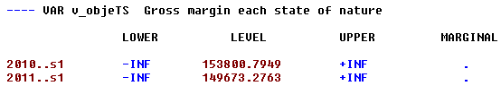{: style="width:100%"}

With the SP extension, information is needed about ancestor nodes and nodes before the current one:

[embedmd]:# (N:/em/work1/Pahmeyer/FarmDyn/FarmDynDoku/FarmDyn_Docu/gams/model/templ_decl.gms GAMS /\$else\.sp/ /\$endif\.sp/)
```GAMS
$else.sp

   $$evalglobal nt %lastYear%-%firstYear%+1
   $$ifi "%dynamics%" == "Comparative-static" $setglobal nt 20
   $$evalGlobal nNode (%nt%-1) * %nOriScen% + 1
*
*  --- sets and parameters are population in coeffgen/stochProg.gms
*
   set n /n1*n%nNode%/;
   set t_n(t,n) "Link betwen year and decision node";
   set anc(n,n) "Is the second node the node before first one?";
   set isNodeBefore(n,n) "Is the second node before first one?";
   set sameScen(n,n) "The two nodes belong to the same scenario";
   set leaves(n);
   parameter p_probN(n);

$endif.sp
```

### Generating Random Variable(s) and the decision tree

The generation of decision tree and related random variable(s) consists
of three major steps:

1.  **Generation of a predefined number of scenarios** which describe equally probable future developments for the random variables considered. In the resulting uncondensed tree, the probabilities of each node and of the resulting scenarios are identical.

2.  **Generating a reduced decision tree** from all possible scenarios where most of the nodes are dropped and the remaining representative nodes receive different probabilities.

3.  **Defining the symbols in GAMS** according to step 1 and 2.

As GAMS can become quite slow with complex loops, the first step is implemented in Java. Currently, two random variables (one for output and one for input price changes) are generated based on two independent logarithmic mean-reverting processes (MRPs), the log is introduced to avoid negative outcomes. The variance and speed of reversion are defined on the GUI as shown above, under an expected mean of unity. The starting price multiplier is also set to unity. Each path of input and output prices are simulated once in the SP. To these price developments, draws from yield distribution can be added.
The Java program is called from GAMS to pass the information on the number of decision nodes (= simulated time points) and the desired number of scenarios to the program:


[embedmd]:# (N:/em/work1/Pahmeyer/FarmDyn/FarmDynDoku/FarmDyn_Docu/gams/coeffgen/stochProg.gms GAMS /\$ift.*?Ou.*?N/ /\$endif\.stochPrices/)
```GAMS
$iftheni.stochPrices not "%StochPricesOutputs%"=="None"
    execute "java -Djava.library.path=..\gui\jars -jar ..\gui\mrpfan.jar %nt% %nOriScen% %scrdir%\\mrp.gdx 1 1 %varOutputs% %lambdaOutputs% 2>1"
    execute_load "%scrdir%\\mrp.gdx" p_randVar,tn,anc;
    p_randVar("priceOutputs",n) = p_randVar("P1",n);
$endif.stochPrices
```

[embedmd]:# (N:/em/work1/Pahmeyer/FarmDyn/FarmDynDoku/FarmDyn_Docu/gams/coeffgen/stochProg.gms GAMS /\$ift.*?In.*?N/ /\$endif\.stochPrices/)
```GAMS
$iftheni.stochPrices not "%StochPricesInputs%"=="None"
    execute "java -Djava.library.path=..\gui\jars -jar ..\gui\mrpfan.jar %nt% %nOriScen% %scrdir%\\mrp.gdx 1 1 %varInputs% %lambdaInputs% 2>1"
    execute_loadpoint "%scrdir%\\mrp.gdx" p_randVar,tn,anc;
    p_randVar("priceInputs",n) = p_randVar("P1",n);
$endif.stochPrices
```

The Java process stores the generated random developments along with the ancestor matrix in a GDX file. The following figure shows an example of a decision tree as generated by the Java program for five years and four scenarios, illustrated as a fan. The common root node *1*, the only one in the first year, is on the left side of the Figure. The nodes 2, 5, 8, 11, 14 are in the second year. Each second year node has its own set of followers, and all nodes besides *1* have the same probability, here 20% as five nodes are present in any year.

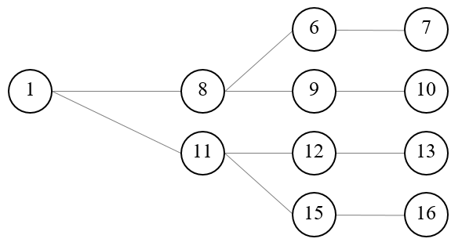{: style="width:100%"}

:   Figure 8: Example of an input decision tree organised as a fan.
    Source: Own illustration

Increasing the number of years leads to a proportional increase in the number of nodes. For complex stochastic processes such as MRPs, many paths are needed, each reflecting a Monte-Carlo experiment, to properly capture the properties of the stochastic process. This leads to the curse of dimensionality, as the number of variables and equations in the model increases quadratic with the number of years and number of Monte-Carlo experiments. As MIP models are NP-hard to solve, that quickly leads to models which cannot be solved in any reasonable time.
Hence, in a next step, the tree must be reduced to avoid that curse of dimensionality, achieved by using the SCENRED2 utility comprised in GAMS (Heitsch & Römisch 2008, 2009). The algorithm deletes nodes from the tree and adds the probability of dropped nodes to a neighboring remaining one.
The example in the Figure 2 below depicts a hypothetical tree after application of the tree reduction algorithm with four final leaves generated from the tree given in Figure 1. Each scenario starts with the same root node, 1, for which the information is assumed to be known for certain, i.e. the probability for this root node N1, which falls in the first year, is equal to unity and ends with one of the final leaves, 7, 10, 13 or 16. In the second year two nodes are kept in the example, each depicting possible states of nature with their specific followers while potentially differing in their probabilities. Node number 8 has a probability of 60% as it represents in the reduced tree three original nodes while node 11 has one of 40%. The strategy chosen for each of these nodes depends simultaneously on the possible future development beyond that node while being conditioned on the decisions in the root node (which itself depends on all follow up scenarios).


:   Figure 9: Example of a reduced tree. Source: Own illustration

The example can also help to understand better some core symbols used in the code and relations in the SP extension. The nodes remaining in the reduced tree are stored in the set nCur. The set t\_n would match the first year with the first node, the second year with the nodes 8 and 11 etc. For the node 15, the ancestor set anc would be set to anc (n15, n11) to indicate that node 11 is the node before 15 on the scenario ending with leave 16. Isbefore (n16, x) would be true for x=16, 15, 11 and 1 and comprises the complete scenario ending with the final leave 16. The probabilities for node 8 and 11 must add up to unity as they relate to the same time point. The same holds for the node set (6, 9, 12, 15) for the third year. Hence, the decision at the root node 1 influences all subsequent scenarios, whereas the stage contingent decisions at node 8 influence directly the scenarios ending with leaves 7 and 10. The root node reflects all scenarios simultaneously and consequently an indirect influence between all nodes exists.
Furthermore, in a programming context no backward or forward recursion solution tactic is possible to find the best strategy as the number of strategies is normally not countable (the solution space is bounded, but there exist typically an infinite number of possible feasible solutions). Finding the optimal (or a nearly optimal) a solution is further complicated by the fact that a larger number of variables have an integer or binary character. MIP problems are NP-hard, i.e. the solution time increases dramatically in the number of integers. This makes it especially important to find an efficient way to reduce the number of nodes considered to keep the solution time in an acceptable range.
In the current implementation, the tree size which also determines the overall model size is steered by setting exogenously the number of final nodes.


[embedmd]:# (N:/em/work1/Pahmeyer/FarmDyn/FarmDynDoku/FarmDyn_Docu/gams/coeffgen/stochProg.gms GAMS /\$setglobal sr2/ /red_prob;/)
```GAMS
$setglobal sr2prefix test
$setglobal treeGen on
$iftheni.runSR2 %treeGen%==on
*
*  --- scenario tree construction from fan
*
   $$libinclude scenRed2
*
*  --- information for SCENRED: option file and options from interface
*
   ScenredParms('sroption')       = 1;
   ScenredParms('num_time_steps') = %nt%;
   ScenredParms('num_nodes')      = card(n);
   ScenredParms('num_random')     = %MRP%;
   ScenredParms('num_leaves')     = %nOriScen%;
   ScenredParms('visual_red')     = 1;
   $$libinclude runScenRed2 %sr2Prefix% tree_con n anc p_probN ancRed p_probRed p_randVar

$endif.runSr2

   ;
*
*  --- load information from ScenRed2
*
   execute_load 'sr2%sr2Prefix%_out.gdx' ancRed=red_ancestor,p_probRed=red_prob;
```

Based on the information returned from the scenario reduction utility, the set of active nodes, *nCur,* is determined:

[embedmd]:# (N:/em/work1/Pahmeyer/FarmDyn/FarmDynDoku/FarmDyn_Docu/gams/coeffgen/stochProg.gms GAMS /\*.*?act/ /probRed\(n\);/)
```GAMS
*  --- actives nodes are those which have an updated probability
*
   option kill=nCur;
   nCur(n) $ p_probRed(n) = YES;
*
*  --- cleanse link between time points and nodes from unused nodes
*
   tn(tnum,n) $ (not nCur(n)) = no;
*
*  --- map into year set used by model
*
   $$iftheni.dyn "%dynamics%" == "Comparative-static"

      option kill=t_n;

      t_n(tCur,nCur) $ sum(tn(tnum,nCur) $ (tnum.pos eq %nt%),1) = YES;
      alias(nCur,nCur1);
      nCur(nCur1) $ (not sum(t_n(tCur,nCur1),1)) = no;

      p_probN(nCur) = p_probN(nCur) * 1 / sum(nCur1, p_probN(nCur1));

      option kill=anc;
      sameScen(nCur,nCur) = YES;
      anc(nCur,nCur)     = YES;
      isNodeBefore(nCur,nCur) = YES;
      leaves(nCur) $ t_n("%lastYearCalc%",nCur) = YES;

      $$setglobal nt 1

   $$else.dyn

      t_n(tCur,nCur) $ sum(tn(tnum,nCur) $ (tnum.pos eq tCur.pos),1) = YES;
      t_n(tBefore,"n1") = YES;

*
*     --- take over cleansed ancestor matrix and probabilities
*
      option kill=anc;
      anc(nCur,nCur1) = ancRed(nCur,nCur1);
      anc("n1","n1")    = YES;
      p_probN(n)  = p_probRed(n);
```

A little bit trickier is to efficiently find *all* nodes that are before a given node in the same scenario (these are often nodes shared with other scenarios such as the root node, see Figure 9 above). This is achieved by an implicit backward recursion over a year loop:

[embedmd]:# (N:/em/work1/Pahmeyer/FarmDyn/FarmDynDoku/FarmDyn_Docu/gams/coeffgen/stochProg.gms GAMS /loop\(tCur/ /\);/)
```GAMS
loop(tCur,
         loop(anc(nCur,nCur1),
           isNodeBefore(nCur,nCur2) $ isNodeBefore(nCur1,nCur2) = YES;
         );
```

As indicated above, the set anc (nCur, nCur1) indicates that decision node nCur1 is the node before the node nCur, i.e. they belong to the same scenario. That is used in lag and lead operators, e.g.:

[embedmd]:# (N:/em/work1/Pahmeyer/FarmDyn/FarmDynDoku/FarmDyn_Docu/gams/model/templ.gms GAMS /hasFarmOrder_.*?\.\./ /;/)
```GAMS
hasFarmOrder_(tCur(t),nCur) $ (tCur(t-1) $ t_n(t,nCur)) ..

       v_hasFarm(t,nCur) =L= sum(t_n(t-1,nCur1) $ anc(nCur,nCur1), v_hasFarm(t-1,nCur1));
```

The *isNodeBefore(nCur,nCur1)* relation depicts all nodes, *nCur1,*
before node *nCur* in the same scenario, including the node *nCur*
itself. An example gives:

[embedmd]:# (N:/em/work1/Pahmeyer/FarmDyn/FarmDynDoku/FarmDyn_Docu/gams/model/cattle_module.gms GAMS /\*.*?starting/ /;/)
```GAMS
*         --- steady state: starting herds before the first fully simulated year are equal to that one
*
      sum(t_n(tBefore,nCur1) $ sameScen(nCur1,nCur),v_herdStart(herds,breeds,tBefore,nCur1,m))
              =E=  v_herdStart(herds,breeds,t,nCur,m);
```

 **Important Aspects to remember!**       

---
1\. Even if the program scales the drawn price changes such that their mean is equal to unity, this does not guarantee that the model, even without stage contingency, would perfectly replicate the deterministic version as the timing of the changes is also relevant (discounting, dynamic effects on liquidity etc.).          

---  

2\. The normal case is that the objective value increases when considering stage contingency under risk neutrality. This is due to the effect that profits increase over-proportionally in output prices under profit maximisation.                                                   

---                                                                         
 3\. The solution time of the model can be expected to increase substantially with the SP extension switched on. MIP models are non-convex and NP-hard problems. To our knowledge there is no existing polynomial-time algorithm for MIP problem, which means that the solution time to optimality increases typically dramatically in the number of considered integers. Even small problems can take quite long to be solved even towards moderate optimality tolerances and not towards full optimality. This holds especially if the *economic signal* to choose between one of the two branches of a binary variable is weak, i.e. if the underlying different strategies yield similar objective values. This is unfortunately exactly the case where the SP programming approach is most interesting. If there is one clearly dominating strategy rather independent e.g. of a reasonable range of output prices, considering different futures inside that reasonable range is not necessary.      

 ---


The interface allows to define the parameters of the logarithmic mean reverting processes with an expected mean and start value of log(1):

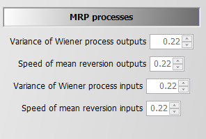{: style="width:100%"}

### Introduction of the Random Variable(s)

The notion *random variable* only implies that the variable has an underlying probability distribution and not that it is a decision variable in our problem. Consequently, the random variables are parameters in GAMS and are not declared as variables. As mentioned in the section above, the MRPs in the SP version of the model are simulated in Java and generate deviations around unity, i.e. we can multiply a given mean price level for an output and/or an input (e.g. defined by user on the interface) with the node specific simulated random price multiplier. If two MRPs are used, they are currently assumed to be uncorrelated. One path from the root to a final leave thus depicts a time series of input and output price deviations from the mean of the stochastic version.

The random variable can impact either revenue, *salRev\_*, by introducing state specific output price(s) and/or cost for buying inputs, *buyCost\_*, by state specific input price(s):

[embedmd]:# (N:/em/work1/Pahmeyer/FarmDyn/FarmDynDoku/FarmDyn_Docu/gams/model/templ.gms GAMS /salRev_.*?\.\./ /;/)
```GAMS
salRev_(curSys(sys),t_n(tCur,nCur))   ..
*
       v_salRev(sys,tCur,nCur)  =e= sum(  (curProds(prodsYearly)) $ (v_saleQuant.up(prodsYearly,sys,tCur,nCur) ne 0),
                                                v_salRevProds(curProds,sys,tCur,nCur));
```

[embedmd]:# (N:/em/work1/Pahmeyer/FarmDyn/FarmDynDoku/FarmDyn_Docu/gams/model/templ.gms GAMS /buyCost_.*?\.\./ /;/)
```GAMS
buyCost_(curInputs(inputs),curSys(sys),t_n(tCur(t),nCur)) $ (p_inputprice%l%(inputs,sys,t) $ (v_buy.up(inputs,sys,t,nCur)  ne 0))  ..

       v_buyCost(inputs,sys,t,nCur) =e= p_inputprice(inputs,sys,t)
$iftheni.sp %stochProg%==true
      * ( 1 + (p_randVar("priceInputs",nCur)-1) $ randProbs(inputs) )
$endif.sp
                                      * v_buy(inputs,sys,t,nCur);
```


The decision whether prices are treated as random variables is steered via the interface:

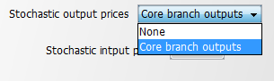{: style="width:100%"}

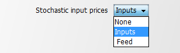{: style="width:100%"}

In the case where neither input nor output prices are random a run time error will occur.
The core branches are defined in *coeffgen\\stochprog.gms*:


[embedmd]:# (N:/em/work1/Pahmeyer/FarmDyn/FarmDynDoku/FarmDyn_Docu/gams/coeffgen/stochProg.gms GAMS /\$if.*?Core/ /\$endif\.stochPrices/)
```GAMS
$iftheni.stochPrices "%StochPricesOutputs%"=="Core branch outputs"
*
   $$ifi "%farmBranchArable%" == "on"   randProbs(set_crop_prods)  = yes;
   $$ifi "%pigHerd%"          == "true" randProbs(set_pig_prods)   = yes;
   $$ifi "%farmBranchDairy%"  == "on"   randProbs(set_dairy_prods) = yes;
   $$ifi "%farmBranchBeef%"   == "on"   randProbs(allBeef_outputs)  = yes;

$endif.stochPrices
```

That means that dairy production takes precedence over other branches and pigs over arable cropping, assuming that arable crops are typically not the core farm branch in mixed enterprises.

## Risk Behaviour


The model allows introducing four different risk behaviour options in the SP version in addition to risk neutral behaviour (None):

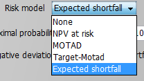{: style="width:100%; height:300px"}

All risk measures relate to the distribution of the NPV, i.e. changes in expected returns aggregated over the full simulation horizon, and do not take fluctuations of the cash flow for individual years into account. This is reasonable as the farmer is assumed to have access to credits which can be used to overcome short-term cash constraints. The cost of using credits as a risk management option is considered endogenously in the model as farmers have to pay interest on these credits which reduces the NPV. Still, considering that risk is accessed here with regard to changes in accumulated final wealth over a long planning horizon is crucial when comparing the approach and results to risk analysis based e.g. on a comparative static analysis of yearly variance of gross margins.

### MOTAD for Negative Deviations against NPV

The first and simplest risk model modifies the objective function, only: it maximises a linear combination of the expected NPV and the expected mean negative deviation from the NPV.

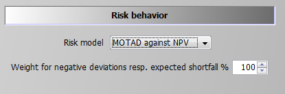{: style="width:100%"}

The formulation builds on MOTAD (Minimization of Total Absolute Deviations) as a linear approximation of the quadratic E-V model proposed by Hazell 1971. The approach was developed at a time where quadratic programming was still not considered feasible for even medium sized problems. Under normality, it can be shown that the absolute deviations and the variance show approximately a linear relationship, the factor between the two depends however in a non-linear way on the number of observations. Mean absolute deviations can also be understood as a robust estimate for the variance.

Our approach builds on an often used modification by only considering down-side risk, i.e. only negative deviations from the simulated mean are taken into account:

[embedmd]:# (N:/em/work1/Pahmeyer/FarmDyn/FarmDynDoku/FarmDyn_Docu/gams/model/stochprog_module.gms GAMS /negDevNPV_.*?\.\./ /;/)
```GAMS
negDevNPV_(nCur) $ t_n("%lastYearCalc%",nCur) ..

        v_objeN(nCur) + v_negDevNPV(nCur)  =G= v_objeMean;
```

This approach is especially relevant if the deviation above and below the objective function are not by definition symmetric. As the distribution of income itself is determined in our stage contingent approach endogenously, symmetry makes limited sense. The expected mean deviation is calculated as:

[embedmd]:# (N:/em/work1/Pahmeyer/FarmDyn/FarmDynDoku/FarmDyn_Docu/gams/model/stochprog_module.gms GAMS /expNegDevNPV_.*?\.\./ /;/)
```GAMS
expNegDevNPV_ ..

        v_expNegDevNPV =E= sum(nCur $ t_n("%lastYearCalc%",nCur), v_negDevNPV(nCur)*p_probN(nCur));
```

And subtracted from the objective function (see equation *OBJE\_*):

[embedmd]:# (N:/em/work1/Pahmeyer/FarmDyn/FarmDynDoku/FarmDyn_Docu/gams/model/templ.gms GAMS /\*.*?penalty/ /;/)
```GAMS
*       --- penalty for negative deviation from mean NPV (similar MOTAD) or target MOTAD / ES
*
      + [ 0

$ifi %stochProg%==true - v_expNegDevNPV * p_negDevPen  $ (not p_expShortFall)
$ifi %stochProg%==true - v_expShortFall * p_negDevPen  $ (not p_expShortFall)
$ifi %stochProg%==true + v_expShortFall * p_negDevPen  $ p_expShortFall
        ] $ sum(t_n(tCur,nCur) $  (v_hasFarm.up(tCur,nCur) ne 0),1)
    ;
```

The reader should note that the standard MOTAD approach by Hazell and described in text books is based on expected gross margins and deviations thereof, whereas in this model an approach in the context of dynamic stochastic programming approach is used. The expected mean returns for each activity and related (co)variances are not known beforehand in our model such that an E-V approach would be numerically demanding. This holds especially for our large-scale MIP problem, such that avoiding quadratic formulations, as required by an E-V approach, has its merits. Finally, it should be noted that these equations are always active for information purposes. The weight in the objective is set to a very small number when other types of risk behaviour are simulated.

### MOTAD for Negative Deviations against Target

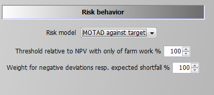{: style="width:100%"}

The only difference to the MOTAD against NPV option described before is that negative deviations are defined against a target set by the user. That target is based on a relative threshold multiplied with the simulated objective value in the case of no farming activity, therefore, income is only drawn from off-farm work, decoupled payments and interest. This income level is used as the absolute benchmark level which can be modified by the user with the percentage multiplier entered in the GUI. This effects the following equation:

[embedmd]:# (N:/em/work1/Pahmeyer/FarmDyn/FarmDynDoku/FarmDyn_Docu/gams/model/stochprog_module.gms GAMS /shortFall_.*?\.\./ /;/)
```GAMS
shortFall_(nCur) $ (t_n("%lastYearCalc%",nCur) $ (p_npvAtRiskLim gt 1))  ..

        v_objeN(nCur) + v_shortFall(nCur) =G= p_npvAtRiskLim;
```

Using this information the expected shortfall is defined:

[embedmd]:# (N:/em/work1/Pahmeyer/FarmDyn/FarmDynDoku/FarmDyn_Docu/gams/model/stochprog_module.gms GAMS /expShortFall_.*?\.\./ /;/)
```GAMS
expShortFall_ $ ( p_expShortFall or p_maxShortFall ) ..

        v_expShortFall =E= sum(nCur $ t_n("%lastYearCalc%",nCur), v_shortFall(nCur)*p_probN(nCur));
```

The expected shortfall then enters the objective function.

### Target MOTAD

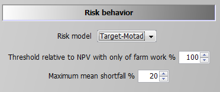{: style="width:100%"}

The second option is what is called Target MOTAD in programming modeling. It has some relation to MOTAD as it also takes negative deviation from a pre-defined threshold into account, p\_npvAtRiskLim*.

The difference to the approach above is that the expected shortfall below the predefined threshold does not enter the objective function, but acts as an upper bound. Hence, the shortfall of NPV cannot be lower than certain level:

[embedmd]:# (N:/em/work1/Pahmeyer/FarmDyn/FarmDynDoku/FarmDyn_Docu/gams/model/stochprog_module.gms GAMS /maxShortFall_.*?\.\./ /;/)
```GAMS
maxShortFall_  $ ( (p_npvAtRiskLim gt 1) $ (p_maxShortFall gt 0) ) ..

        sum(nCur $ t_n("%lastYearCalc%",nCur), v_shortFall(nCur)*p_probN(nCur))
                                                   =L= p_maxShortFall*p_npvAtRiskLim;
```

### Value at Risk Approach

Contrary to the MOTAD approaches discussed before, the Value at Risk (VaR) and conditional value at risk (CVaR) approaches (see next section) require additional binary variables and thus are numerically more demanding.
The value (NPV) at risk approach introduces a fixed lower quantile (i.e., introduced as parameter and determined by the user) for the NPV as shown in following illustration. It requires the following user input:


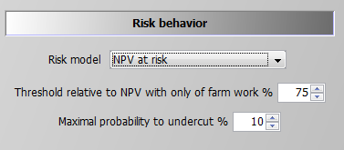{: style="width:100%"}

The second parameter defines the maximal allowed probability for simulated objective values to fall below the resulting threshold. The reader should be aware of the fact that only undercutting matters, not by how much income drops below the given threshold. For the conditional value at risk at approach which takes this into account, see next section.
If the maximal probability is set to zero, the threshold acts as a binding constraint in any SON, i.e. the NPV at any leaf cannot fall below it. The NPV at risk approach does thus not change the equation for the objective function, but introduces additional constraints. The first one drives a binary indicator variable, v_npvAtRisk, which is equal to one if the objective value at a final leaf falls below the threshold:


[embedmd]:# (N:/em/work1/Pahmeyer/FarmDyn/FarmDynDoku/FarmDyn_Docu/gams/model/stochprog_module.gms GAMS /npvAtRisk_.*?\.\./ /;/)
```GAMS
npvAtRisk_(nCur) $ (t_n("%lastYearCalc%",nCur) $ (p_npvAtRiskLim gt 1))  ..

       v_objeN(nCur) =G= p_npvAtRiskLim - v_npvAtRisk(nCur) * p_npvAtRiskLim;
```

If v_npvAtRisk is zero, the objective value (LHS) for each final leave must exceed the given threshold p_npvAtRiskLim. The second constraint, shown below, adds up the probabilities for those final nodes which undercut the threshold (LHS) and ensures that their sum is below the given maximal probability:

[embedmd]:# (N:/em/work1/Pahmeyer/FarmDyn/FarmDynDoku/FarmDyn_Docu/gams/model/stochprog_module.gms GAMS /maxProbNpvAtRisk_.*?\.\./ /;/)
```GAMS
maxProbNpvAtRisk_ $ ( ( (p_npvAtRiskLim gt 1) or p_expShortFall) $ p_npvAtRiskmaxProb) ..

      sum(t_n("%lastYearCalc%",nCur), v_npvAtRisk(nCur) * p_probN(nCur)) =L= p_npvAtRiskmaxProb;
```

As long as off-farm income is considered deterministic and the relative threshold is below 100%, a solution where only off-farm income is generated should always be a feasible.

### Conditional Value at Risk

The conditional value at risk approach is also referred to as the expected or mean shortfall. It is the most complex and numerically demanding of the options available and it can be seen as the combination of the VaR approach and target MOTAD with an endogenously determined limit. The decision taker defines hence a quantile, say 10% as in the screen shot below, and the model calculates endogenously the expected shortfall for the lowest 10% of the scenarios. The objective function in the model maximises a linear combination of the expected NPV and the endogenous mean shortfall, subject to the predefined lower quantile:

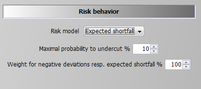{: style="width:100%"}

A first constraint, which is also used for the VaR option, ensures that the sum of the considered cases does not fall below the now endogenously defined limit (this equation was already shown above in the section on the Value at Risk Approach):

[embedmd]:# (N:/em/work1/Pahmeyer/FarmDyn/FarmDynDoku/FarmDyn_Docu/gams/model/stochprog_module.gms GAMS /maxProbNpvAtRisk_.*?\.\./ /;/)
```GAMS
maxProbNpvAtRisk_ $ ( ( (p_npvAtRiskLim gt 1) or p_expShortFall) $ p_npvAtRiskmaxProb) ..

      sum(t_n("%lastYearCalc%",nCur), v_npvAtRisk(nCur) * p_probN(nCur)) =L= p_npvAtRiskmaxProb;
```

Additionally, the expected shortfall for any of the final nodes which do not contribute to an active lower quantile must be zero, based on a so-called BIGM formulation, i.e. the binary variable v_npvAtRisk is multiplied with a very large number, here with 1.E+7. If v_npvAtRisk for that final leave is zero (= it does not belong to the leaves with the worst NPVs), the shortfall for that leave is actually positive and can become arbitrarily large as the RHS value of 1.E+7 in the case of v_npvAtRisk equal unity never becomes binding.

[embedmd]:# (N:/em/work1/Pahmeyer/FarmDyn/FarmDynDoku/FarmDyn_Docu/gams/model/stochprog_module.gms GAMS /shortFallTrigger1_.*?\.\./ /;/)
```GAMS
shortFallTrigger1_(nCur) $ ( t_n("%lastYearCalc%",nCur) $ p_expShortFall ) ..

        v_shortFall(nCur) =L= p_objeRmip * v_npvAtRisk(nCur);
```

Besides this, any leaves which is not in worst cases set (v_npvAtRisk = 0) must at least generate a NPV which exceeds the best of the worst cases:

[embedmd]:# (N:/em/work1/Pahmeyer/FarmDyn/FarmDynDoku/FarmDyn_Docu/gams/model/stochprog_module.gms GAMS /shortFallBound_.*?\.\./ /;/)
```GAMS
shortFallBound_(nCur)  $ ( t_n("%lastYearCalc%",nCur) $ p_expShortFall  ) ..

        v_objeN(nCur)     =G= v_bestShortFall+1 - v_npvAtRisk(nCur) * p_objeRmip;
```

For cases at or below the quantile which contribute towards the expected mean shortfall, both the own expected NPV and the best NPV act simultaneously as lower bounds:

[embedmd]:# (N:/em/work1/Pahmeyer/FarmDyn/FarmDynDoku/FarmDyn_Docu/gams/model/stochprog_module.gms GAMS /shortFallTrigger2_.*?\.\./ /;/)
```GAMS
shortFallTrigger2_(nCur) $ ( t_n("%lastYearCalc%",nCur) $ p_expShortFall ) ..

        v_slackNPV(nCur)  =L= p_objeRmip * (1-v_npvAtRisk(nCur));
```

[embedmd]:# (N:/em/work1/Pahmeyer/FarmDyn/FarmDynDoku/FarmDyn_Docu/gams/model/stochprog_module.gms GAMS /shortFallTrigger3_.*?\.\./ /;/)
```GAMS
shortFallTrigger3_(nCur) $ ( t_n("%lastYearCalc%",nCur) $ p_expShortFall ) ..

        v_shortFall(nCur) + v_slackNPV(nCur) =E= v_objeN(nCur);
```

Accordingly, the v_bestShortFall splits the expected NPVs in those below and above the relevant quantile.
The cases below that bound define the expected shortfall:


[embedmd]:# (N:/em/work1/Pahmeyer/FarmDyn/FarmDynDoku/FarmDyn_Docu/gams/model/stochprog_module.gms GAMS /expShortFall_.*?\.\./ /;/)
```GAMS
expShortFall_ $ ( p_expShortFall or p_maxShortFall ) ..

        v_expShortFall =E= sum(nCur $ t_n("%lastYearCalc%",nCur), v_shortFall(nCur)*p_probN(nCur));
```

The expected shortfall adds to the objective (in opposite to target MOTAD).
The objective function is hence a trade-off between a higher expected mean NPV and the expected shortfall of cases x% relative to that endogenous mean.
