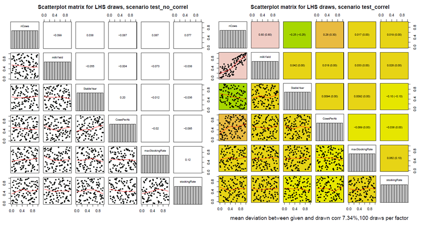
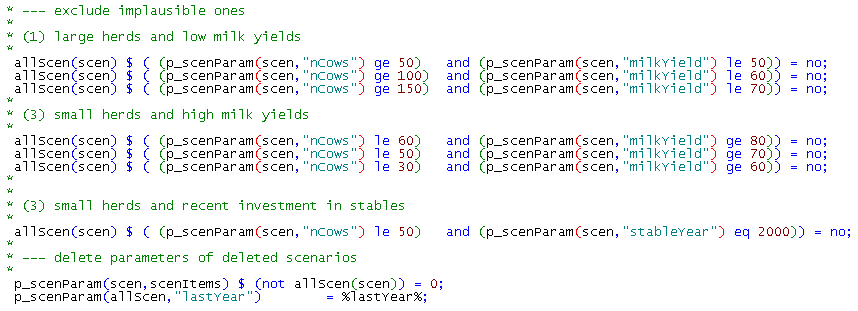
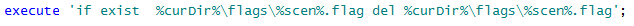

# Systematic sensitivity analysis based on Design of Experiments

FarmDyn offers the option to perform a systematic sensitivity analysis based on Design of Experiments. To execute a sensitivity analysis one has to generate a large number of farm instances to either analyze distributions of key indicators or to develop a meta-model. In the past, this feature was used intensively for publications including  e.g. Lengers et al. (2014), Kuhn et al. (2019), Seidel et al. (2020). In order to establish a meta-model such as used in the aforementioned papers, one has to follow the following steps:

1.  Setting up of appropriate sensitivity experiments which cover the distribution of farm attributes in an appropriate sample (such as     the farm structure survey for North-Rhine-Westphalia). Consequently, this requires the use of an efficient and space filling random sampling design to lower the necessary sample size for the derivation of a meta-model. At the same time, it has to be ensured that the randomised factor level combinations are smoothly distributed over the range of factor level permutations. [^1]

2.  Running the single farm model on these experiments and collecting key results.

3.  Deriving a meta model from these experiments.

In the following the technical aspects and their implementation are presented.

The overall strategy consists of combining a Java based package for
interface generation and result exploitation which also comprises a
machine learning package with GAMS code. For the definition of
representative sensitivity experiments a sampling routine, *lhs\_0.10*
implemented in *R version 2.6.1*, is combined with the GAMS code to
generate sample farms under recognition of correlations between factors.

The GAMS code *(gams\\scen\_gen.gms*) modifies settings entered via the interface
to define attributes for each experiment. A single
farm run is then executed as a child process with these settings. The
user is able to define upper and lower bounds for single factors to
define a solution room in which factor levels can vary between scenarios
for different production specific attributes of the farm. The interface also allows defining if correlations between
selected variables should be recognized during the sample randomization
procedure. Furthermore, depending on the number of draws and the
complexity of the assumed correlation matrix a maximum number of
sampling repetitions can be selected [^2].

Only the factors for which the selected maximum value differs from the
minimum value are varied between model runs. Hence, the user is able to
fix factor levels for single factors over all experiments by defining
the minimum and maximum factor level. The upper and lower bounds of the
variables define the solution space of possible factor level
combinations of different factors. If the chosen minimum and maximum
values are equal, the factor level of the specific attribute is holding
constant during the scenario definitions. For the definition of wage
rates and prices for concentrates, the user is able to select constant
differences to the full time wage rate or the concentrate type 1.

With increasing number of factors that can vary between scenarios and
increasing possible factor levels per factor, the number of possible
scenarios (factor level permutations) will increase exponentially (up to
a few thousands). Hence, to create model outputs representative for all
admissible scenarios, a large number of scenario runs would have to be
processed to get reliable outputs for the derivation of a meta-model.

As this would cause long computing time also on a multi-core processor
(several days), the number of scenario runs have to be restricted to a
manageable number while at the same time being representative for the
real life distribution of farm attributes.

Therefore, the scenario definition is done by Latin Hypercube Sampling
(LHS) to create an efficient sample with a small sample size (to lower
computing time) while guaranteeing a space filling sample design over
the full range of admissible scenarios (McKay et al. 1979, Iman and
Conover 1980). This is done, using a bridge from GAMS to the statistical
software R. Therefore the LHS package of R has to be installed for being
able to create LHS samples for a defined number of draws *n* and factors
*k* (in our case taking the command "*improvedLHS(n,k*)"). LHS sampling
creates a sample matrix of size n\*k incorporating random values between
0 and 1, which are interpretable as percentages. These are drawn
assuming an uniform distribution between 0 and 1. Further on, LHS
sampling outputs ensure orthogonality of the output matrix and that
factor level combinations evenly distributed over the possible
permutation area.

The GAMS side of the technical implementation is shown in the following:

[embedmd]:# (N:/em/work1/Pahmeyer/FarmDyn/FarmDynDoku/FarmDyn_Docu/gams/scen_gen.gms GAMS /\* Use R to / /putclose;/)
```GAMS
* Use R to define the DOE
*
*------------------------------------------------------------------------------
*
 file rIncFile / "%curDir%/rBridge/incFile.r" /;
 put rIncFile;
 $$setglobal outputFileD  "%scrdir%/fromR"
 $$setglobal inputFile    "%scrdirR%/toR.gdx"

 put ' plotFile    <- "%resdirR%/scenGen/lhs_%scenDes%.pdf"; '/;
 put ' outputFile  <- "%outputFile%"; '/;
 put ' inputFile   <- "%inputFile%"; '/;
 put ' useCorr     <- "%useCorr%"; '/;
 put ' useColors   <- "true"; '/;
 put ' maxRunTime  <- %maxRunTime%; '/;
    putclose;
```

The maximal run time for finding a sample can be defined, *maxRunTime.*
If correlations between variables are known and should be recognised
within the sampling procedure, the command *useCorr* has to be set to
*"true"*. Then the correlation matrix can be defined specifically.

[embedmd]:# (N:/em/work1/Pahmeyer/FarmDyn/FarmDynDoku/FarmDyn_Docu/gams/scen_gen.gms GAMS /\*.*?set correlation/ /;/)
```GAMS
*    --- set correlation matrix
*
*        correlation coefficients are derived from data collections from AMI for prices and
*        from LWK-NRW (Milchviehreport NRW, verschiedene Jahrg�nge, 2007 bis 2011)as well as
*        a data collection of the LKV-NRW in 2012 for 5000 dairy farms in NRW. Correlation between
*        nCows and CowsPerAK stem from the Forschungsdatenzentrum des Bundes und der L�nder after
*        analysis on the "Landwirtschaftsz�hlung 2010", results were aligned with results derived
*        from KTBL (2010,p.541).

     table p_cor1(*,*)

                          WinterCerePrice SummerCerePrice MaizCornPrice WinterRapePrice SummerBeansPrice SummerPeasPrice PotatoesPrice SugarBeetPrice SummerTriticalePrice
     WinterCerePrice                            0.8            0.7            0.5            0.5                0.5          0.5             0.5             0.7
     SummerCerePrice                                           0.7            0.5            0.5                0.5          0.5             0.5             0.8
     MaizCornPrice                                                            0.5            0.5                0.5          0.5             0.5             0.7
     WinterRapePrice                                                                         0.5                0.5          0.5             0.5             0.5
     SummerBeansPrice                                                                                           0.7          0.5             0.5             0.5
     SummerPeasPrice                                                                                                         0.5             0.5             0.5
     PotatoesPrice                                                                                                                           0.5             0.5
     SugarBeetPrice                                                                                                                                          0.5
     SummerTriticalePrice
     ;
```

The names of the set of varying factors, the factor names, the scenario name, the desired number of draws and, if activated, also the correlation matrix are send to R. Then the R file "*rbridge\\lhs.r*" is executed.

[embedmd]:# (N:/em/work1/Pahmeyer/FarmDyn/FarmDynDoku/FarmDyn_Docu/gams/scen_gen.gms GAMS /set factor_name/ /display p_testDoe;/)
```GAMS
set factor_name(*,*) / name.factors /;
     set scen_name(*,*) / name."%scendes%"/;

     execute_unload "%inputFile%" p_n,factor_name,scen_name,factors,p_cor;
     $$setglobal rFile "%curDir%/rbridge/lhs.r"

     $$if exist "%outputFileD%_doe.gdx" execute "rm %outputFileD%_doe.gdx"
     $$batinclude 'util/title.gms' "'execute %rexe% %rFile%'";
     $$if exist %rexe% execute "%rexe% %rFile% %curDir%/rBridge/incFile.r";

$endif.onlyCollect

*
* --- read output from LHS sampling provided by R
*
 parameter p_doe(*,*);
 execute_load "%outputFile%_doe" p_doe;
 if ( card(p_doe) eq 0, abort "Error generating doe, no data found";);
 display p_doe;

 parameter p_testDoe "Check for mean of draws";
 p_testDoe(factors) = sum(draws, p_doe(draws,factors))/card(draws);
 display p_testDoe;
```

The R-bridge is hence activated (R side). Therefore, several packages are
installed in R from the R library to be able to do the LHS sampling:

[embedmd]:# (N:/em/work1/Pahmeyer/FarmDyn/FarmDynDoku/FarmDyn_Docu/gams/rbridge/lhs.r R /#install/ /library\(reshape2\);/)
```R
#install.packages("d:\r\R-2.15.1\library\mc2d_0.1-13.zip",repos=NULL);
#install.packages("d:\r\R-2.15.1\library\mvtnorm_0.9-9992.zip",repos=NULL);
#install.packages("d:\r\R-2.15.1\library\lhs_0.10.zip",repos=NULL);
#install.packages("d:\\temp\\gclus_1.3.1.zip",repos=NULL);
# install.packages("t:\\britz\\gdxrrw_0.0-2.zip",repos=NULL);
# install.packages("D:\\temp\\gdxrrw_1.0.2.zip", repos = NULL, type="source");
 library(lhs);
 library(gdxrrw);
 igdx("N:/soft/gams24.7new/24.7");
 library(mc2d);
 library(mvtnorm);
 library(Matrix);
 library(gclus);
 library(reshape2);
```

The parameter *p_n* denotes the number of draws defined via the GUI which is equivalent to the number of scenarios resulting from the sampling routine. *Sys.getenv(....)* asks for commands or
information given by the environment (for example if correlations have
to be recognised or not).

[embedmd]:# (N:/em/work1/Pahmeyer/FarmDyn/FarmDynDoku/FarmDyn_Docu/gams/rbridge/lhs.r R /#useCorr/ /\)\)/)
```R
#useCorr    <- Sys.getenv("useCorr")
#useColors  <- Sys.getenv("useColors")
#inputFile  <- Sys.getenv("inputFile");
#plotFile   <- Sys.getenv("plotFile")
#outputFile <- Sys.getenv("outputFile");
#maxRunTime <- as.numeric(Sys.getenv("maxRunTime"))
```

We decided to use the "*improvedLHS"* type for randomisation [^3] which
produces a sample matrix of *n* rows and *k* columns (n = number of
draws, k = number of factors). This leads to a quite efficient sample
generation in R:

[embedmd]:# (N:/em/work1/Pahmeyer/FarmDyn/FarmDynDoku/FarmDyn_Docu/gams/rbridge/lhs.r R /out1.*?imp/ /\);/)
```R
out1 <- improvedLHS(n,k);
```

Usually, input variables for sensitivity analysis in computer models are assumed to be independent from each other (Iman et al., 1981a;b). LHS sampling was also designed to create a sample of factor level combinations for different factors avoiding correlations between factors in random draws to ensure a space filling output. But, for our purposes, it is important to incorporate as much information about the multivariate input distribution as possible to get more realistic sample scenarios and exclude factor combinations which are rather impossible in reality. Hence, following Iman and Conover (1982:p.331-332) correlation structure information among input variables should be recognised within
the sampling process, if available. Otherwise "the theoretical properties of the statistics formed from the output may no longer be valid." (Iman and Conover 1982:p.331)

To also incorporate information about dependencies between interesting variables during the sampling procedure we expanded the sampling method by an approach of Iman and Conover (1982) designing a swapping algorithm which shuffles observations for single factors between the draws to mimic given *k\*k* correlation matrix (therefore the R package *MC2d*
including the routine *cornode* is necessary).

[embedmd]:# (N:/em/work1/Pahmeyer/FarmDyn/FarmDynDoku/FarmDyn_Docu/gams/rbridge/lhs.r R /#.*?load c/ /t\);/)
```R
#   --- load correlation matrix from GAMS
#
    t <- rgdx.param(inputFile,"p_cor",names=c("f1","f2"),compress="true");
    t
    t<-acast(t, f1~f2, value.var="value")
    t<-as.matrix(t);
```

To increase the possibility to randomise a sample which offers a correlation matrix of factors near the proposed one, the routine allows to repeat the random sampling of demanded *n* draws (yielding *n* experiment scenarios) for a maximal given computing time ("*maxRunTime*" e.g. 300 seconds.). The sample (incorporating *n* draws for *k* factors) with the smallest mean percentage deviation (*meanDev*) between the given and the randomised correlation matrix is then selected and send back to GAMS as the random sample representing the possible population. Alternatively, the repetition of *n* draws (*n* x *k* sampling matrix) will be stopped by a threshold value (*if meanDev \< 1*) for the deviation between the assumed and the randomised sample correlation matrix.

[embedmd]:# (N:/em/work1/Pahmeyer/FarmDyn/FarmDynDoku/FarmDyn_Docu/gams/rbridge/lhs.r R /bestFit <\- 1/ /\s}\s\s/)
```R
bestFit <- 10;
    iDraw <- 0;


    while( runTime < maxRunTime ){

       iDraw <- iDraw + 1;

       if ( LHSType == "optimumLHS" ) {
          out1 <- optimumLHS(n,k,2,0.01);

          print("shit");

       } else {
          out1 <- improvedLHS(n,k);
       }
```

[embedmd]:# (N:/em/work1/Pahmeyer/FarmDyn/FarmDynDoku/FarmDyn_Docu/gams/rbridge/lhs.r R /# .*?use c/ /\s}\s\s/)
```R
# --- use cornode to apply Iman & conover 1982 to impose correlation
#     t on the LHS matrix out
#
       out1  <- cornode(out1,target=t)
       c <- cor(out1);

       fit = 0;
       for ( i in 1:k )
            for ( j in 1:k )
                if ( fit < bestFit )

       if ( fit < bestFit )
       {
          out     <-out1;
          bestFit <-fit;

          meanDev = sqrt(fit/k)*100;
       };

       if ( iDraw %% reportDraws == 0){
          curTime <- as.numeric(Sys.time(),units="seconds");
          runTime <- curTime - begTime;
          print(paste(" draw :",iDraw," runTime ",round(runTime)," of ",maxRunTime,"seconds, mean sqrt of squared diff between given corr and best draw: ",round(meanDev,2),"%"));
       }
```

For the case that the correlations between factors are given by the
user, leading to an undefined correlation matrix, the program adjusts
the correlation matrix to the nearest one possible:

[embedmd]:# (N:/em/work1/Pahmeyer/FarmDyn/FarmDynDoku/FarmDyn_Docu/gams/rbridge/lhs.r R /#.*?find/ /mat\);/)
```R
#   --- find nearest positive definite matrix
#

    t1<-nearPD(t);

    t <- as.matrix(t1$mat);
```

As mentioned above the LHS sampling defines random value combinations between all factors in each single draw. Therefore, uniform distributed random values between 0 and 1 are drawn. The total set of draws defines one random sample of n single experiments (factor level combinations (in this stage of the sampling still between 0 and 1)). The routine
implemented into the LHS-module now tries to find the best fitting sample which corresponds to the demanded correlation matrix most properly. Sampling outputs of the LHS draws show efficiency characteristics, also under recognition of correlations. This means that the mean of drawn random values is still 0.5 (as LHS draws lie between 0 and 1). And if the number of draws is large enough (greater than 30), quantiles as well as the mean of the distribution of LHS random values show that we are still consistent with the assumption of an uniform distribution function of the random draws (between 0 and 1), as necessary for efficient LHS outputs, also under recognition of factor correlations. The best fitting sample with the minimal average percentage deviation of correlations between the defined and the randomised correlation matrix is then selected and stored by the program and automatically printed as a PDF-document for visualisation. The PDF gives also information about average percentage bias of the randomised correlation matrix as well as the number of total draws which define the number of resulting sample experiments:

{: style="width:100%"}
:   Figure 12: Scatter plot matrices for different LHS
    samples. With and without the recognition of factor correlations

On the left hand side one can see the scatter plot matrix without any correlations between factors. In contrast, a clear difference in sampled values is visualised by the right hand side matrix. For example, a correlation between *nCows* and *milkYield* was assumed to be 0.8. The best fitting matrix lead to the same correlation between these two factors. The correlation coefficients within brackets are the correlations predefined by the operator. The values in front of the brackets are the correlation coefficients fitted by the sampling matrix. The average mean percentage deviation of the randomised correlation matrix and the assumed correlation matrix is quantified by 7.34 %, meaning, that on average, the randomised correlations deviate by 7.34 % from the predefined ones. The distribution function in the diagonal shows that the sampled values of each factor still  ensure a uniform distribution.

The random values for the scenarios are transformed by GAMS to the real factor levels following the distribution functions of single variables. A uniform distribution of factor levels for the relevant variables is assumed. These are easily to define by the minimal value *a* and the maximum value *b*. A uniform distribution function can be defined by the
following density function (left graph, Figure 13):

(1) $f(x) = \frac{1}{b-a},a \leq b$

Values below *a* or above *b* have a probability of 0. The anti-derivative expresses the cumulative distribution function of the random variable whose values lie within the interval $[0; 1]$ (right graph, Figure 13):

(2) $f(x) = \frac{x-a}{b-a},a \leq x \leq b$

{: style="width:100%"}
:   Figure 13: Density function and cumulative
    distribution function of an uniform distributed variable

From the left hand side density function one can easily derive the right hand side cumulative distribution function. The *y* value of the distribution function equals the integral
$\int_a^x f(x)$ below the density function (cumulative probabilities below x).

The given random values of the R-routine (*F(x)*) enable the allocation of corresponding factor levels (between *a* and *b*) to this random percentage values from the cumulative distribution function. A random cumulative probability value *y* corresponds to the factor level *x* which lies within the real value domain of the interesting factor. Hence
this random sampling procedure produces random values by transforming uniform distributed random percentages (between 0 and 1) to factor levels which are conform to the assumed distribution function of the variable. So far a uniform distribution function is assumed for the real factor levels (this can be adjusted to other functions if, for example, a
known population has to be simulated).

For an assumed uniform distribution function of factor levels this is done following the formula:

(3) $f(x) \cdot (b-a) + a = x$

The randomised value *y* is transformed to the factor level room concerning the given distribution function of the factor. Hence, for each single random draw a value is generated for the interesting variable corresponding to its assumed probability distribution. If a different distribution is assumed, formula 3 changes.

In GAMS code the formula (3) has to be applied for each factor to calculate the sample values whereat *p\_doe(draws,"factor")* is equivalent to F(x). The random percentage *p\_doe(\*,\*)* has to be multiplied by the difference between the possible maximum and minimum value of the factor *(%factorMax% - %factorMin%)*. Afterwards the min value *(%factorMin%)* has to be added to the product to yield the factor level *x* for the specific factor and scenario. This is illustrated for some parameters in the following.

[embedmd]:# (N:/em/work1/Pahmeyer/FarmDyn/FarmDynDoku/FarmDyn_Docu/gams/scen_gen.gms GAMS /\*.*?result r/ /true/)
```GAMS
* --- result related declaration
*
  PARAMETER p_res(*,*,*,*,*,*)
           p_meta;
  set resItems / mac,mean,cows,levl,margArab,margGras,margLand,herdRand,cropRand,ProfitDiff,manExportVol,profit/;


  parameter p_scenParam(draws,allFactors) "Numerical values for the scenario specific items";

*
* --- standard setting for aks
*
  p_scenParam(draws,"Aks") = %aks%;
*
* --- general mapping from DOE to factor ranges as defined on interface
*
  p_scenParam(draws,factors)   = p_doe(draws,factors) * (p_ranges(factors,"max")-p_ranges(factors,"min"))+p_ranges(factors,"min");

$iftheni.obDist %useObsDistr% == true
```

*p\_scenParam(draws,factor)* gives the scenario parameter one factor defined by the random values given by the LHS sampling routine. The combination of factor levels of the different factors for one single draw defines one single sensitivity scenario.

The set *scenItems* defines which settings are (possibly) defined specificly for each scenario:

[embedmd]:# (N:/em/work1/Pahmeyer/FarmDyn/FarmDynDoku/FarmDyn_Docu/gams/scen_gen.gms GAMS /file sc/ /;/)
```GAMS
file scenFile / "incgen/curScen.gms" /;
```

[embedmd]:# (N:/em/work1/Pahmeyer/FarmDyn/FarmDynDoku/FarmDyn_Docu/gams/scen_gen.gms GAMS /alias\(s/ /;/)
```GAMS
alias(scenItems,allFactors);
```

Nevertheless, correlations between factors are able to be recognised during the sample generation to avoid factor level combinations within scenarios which conflict with common statistical knowledge. The model code enables the user to specifically exclude factor level combinations which seem to be implausible - for example high labour input per cow and
low milk yield levels or high numbers of cows per farm and only very low yielding phenotypes.

{: style="width:100%"}

These scenario settings must be stored in a GAMS file which is then picked up by the child processes. To keep the system extendable, firstly, all settings inputted via the GUI are copied over to the specific scenario:

[embedmd]:# (N:/em/work1/Pahmeyer/FarmDyn/FarmDynDoku/FarmDyn_Docu/gams/scengen/gen_inc_file.gms GAMS /\*.*?copy c/ /gms"/)
```GAMS
*  --- copy content of current scen file into new one
*      via OS command
*
   execute "cp %curDir%/incgen/expinc.gms %curDir%/incgen/curScen.gms"
```

Secondly, the modifications defining the specific sensitivity
experiment, i.e. the scenario, are appended with GAMS file output
commands (see *gams\\scenGen\\gen\_inc\_file.gms*):

[embedmd]:# (N:/em/work1/Pahmeyer/FarmDyn/FarmDynDoku/FarmDyn_Docu/gams/scengen/gen_inc_file.gms GAMS /\*.*?put s/ /scenFile;/)
```GAMS
*  --- put statements will append to the new scen file
*      and overwrite standard setting
*
   put scenFile;
```

Finally, the content is copied to a specific scenario input file:

[embedmd]:# (N:/em/work1/Pahmeyer/FarmDyn/FarmDynDoku/FarmDyn_Docu/gams/scengen/gen_inc_file.gms GAMS /put_utility/ /;/)
```GAMS
put_utility batch 'shell' / "cp %curDir%/incgen/curScen.gms %curDir%/incgen/"scen.tl".gms";
```

The code to build and optimise the single farm model is realised in GAMS and uses CPLEX 12.6 in parallel mode as the MIP solver. Automatic tuning is used to let CPLEX use appropriate solver setting on the problem. The model instances are set up to avoid any conflicts with I/O operations to allow for parallel execution.

A single instance has a load of about 1.8 cores on average. In a multi-core machine it seems promising to execute several such processes in parallel. This is realised by a GAMS program which starts each model on its own set of input parameters:

[embedmd]:# (N:/em/work1/Pahmeyer/FarmDyn/FarmDynDoku/FarmDyn_Docu/gams/scen_gen.gms GAMS /\*.*?execute/ /;/)
```GAMS
*     --- execute exp_starter as a seperate program, no wait, program will delete a flag at the end to signal that it is ready
*

      put_utility  batch  'msglog'  / '%GAMSPATH%/gams.exe %CURDIR%/exp_starter.gms --scen='allScen.tl
                           ' --iScen='iLoop:0:0' -maxProcDir=255 -output='allScen.tl'.lst'
                          ' --seed=',uniform(0,1000):0:0,
                          ' -maxProcDir=255 -output='allScen.tl:0'.lst %gamsarg% lo=3'
                          ' --pgmName="'allScen.tl' (',iLoop:0:0,' of ',card(allScen):0:0,')"';
```

The name of the scenario, *allScen.tl* is passed as an argument to the process which will lead a specific include file comprising the definition of the scenario.

The GAMS process will use its own commando processors and run asynchronously to the GAMS thread which has started it. The calling mother process has to wait until all child processes have terminated. That is achieved by generating a child process specific flag file before starting the child process:

[embedmd]:# (N:/em/work1/Pahmeyer/FarmDyn/FarmDynDoku/FarmDyn_Docu/gams/scen_gen.gms GAMS /put_utility batch 's/ /\.lst"';/)
```GAMS
put_utility batch 'shell'    / ' %GAMSPATH%gbin/rm  -f "../results/expFarms/res_',scen.tl,'_until_' p_scenParam(scen,"lastYear"):0:0,'.gdx"';
      put_utility batch 'shell'    / ' %GAMSPATH%gbin/rm  -f "%curdir%/incgen/'scen.tl'.gms"';
      put_utility batch 'shell'    / ' %GAMSPATH%gbin/rm  -f "%curdir%/'scen.tl'.lst"';
```

This flag file will be deleted by the child process when it finalises:

{: style="width:100%"}

A simple DOS script waits until all flags are deleted:

[embedmd]:# (N:/em/work1/Pahmeyer/FarmDyn/FarmDynDoku/FarmDyn_Docu/gams/util/TaskSync.bat GAMS /set \/a/ /\s\)/)
```GAMS
set /a _trys=0
:again
IF %_Mode% EXIST %_FlagFiles% (
  set /a _trys+=1
  if %_trys%.==%_MaxTrys%. goto errorexit
  sleep.exe %_seconds%
  goto again
)
```

Using that set-up would spawn for each scenario a GAMS process which would then execute all in parallel. The mother process would wait until all child processes have deleted their flag files before collecting their results. As several dozen or even hundredth of scenarios might be executed, that might easily block the machine completely, e.g. by
exceeding the available memory.

It is hence necessary to expand the set-up by a mechanism which ensures that only a pre-defined number of child processes are active in parallel. This is established by a second simple DOS script which waits until the number of flag files drops below a predefined threshold:

[embedmd]:# (N:/em/work1/Pahmeyer/FarmDyn/FarmDynDoku/FarmDyn_Docu/gams/util/TaskSyncNFiles.bat GAMS /set \/a _trys=0/ /\s\)/)
```GAMS
set /a _trys=0
:again

set _count=1

for %%x in (%_FlagFiles%) do set /a _count+=1

REM @echo %_count% %_nFiles% >> d:\temp\test.txt

if %_count% gtr %_nFiles% (

  set /a _trys+=1

  if %_trys%.==%_MaxTrys%. goto errorexit

REM @echo %_trys% %_maxTrys% %_seconds% >> d:\temp\test.txt


  sleep.exe %_seconds%

  goto again

)
```

Finally, the results from individual runs are collected and stored. A GAMS facility is used to define the name of a GDX file to read at run time:

[embedmd]:# (N:/em/work1/Pahmeyer/FarmDyn/FarmDynDoku/FarmDyn_Docu/gams/scen_gen.gms GAMS /put_utilities/ /;/)
```GAMS
put_utilities batch 'gdxin' / ' ../results/expFarms/res_',scen.tl,'_until_' p_scenParam(scen,"lastYear"):0:0,'.gdx';
```

We now transformed all MAC estimates which are 0 due to an exit decision of a farm to be able to select these cases for our meta-modeling estimation (Heckman two-stage selection, described in the technical documentation: "R routine to estimate Heckman two stage regression procedure on marginal abatement costs of dairy farms, based on large scale outputs of the model DAIRYDYN" by Britz and Lengers (2012)).

[embedmd]:# (N:/em/work1/Pahmeyer/FarmDyn/FarmDynDoku/FarmDyn_Docu/gams/scen_gen.gms GAMS /\*.*?load t/ /\s\);/)
```GAMS
*        --- load the result
*
              execute_load p_res;
              p_dummy = sleep(.01);
              if ( execerror eq 0,
*
*               --- filter out results of interest (so far only macs, avAcs and totACs)
*
                $$ifi "%scentype%"=="MAC"     $include 'scengen/scen_load_res_mac.gms'

                $$ifi "%scentype%"=="PROFITS" $include 'scengen/scen_load_res_profits.gms'
                $$ifi "%scentype%"=="Fertilizer directive" $include 'scengen/scen_load_res_profits.gms'
         $$ifi "%scentype%"=="Multi indicator" $include 'scengen/scen_load_res_multi_indicator.gms'

             );
```


Further on, the scenario specific settings which can be used as explanatory variables for later regressions are stored, see for example:

[embedmd]:# (N:/em/work1/Pahmeyer/FarmDyn/FarmDynDoku/FarmDyn_Docu/gams/scengen/scen_load_res_mac.gms GAMS /\*.*?add/ /mean"\);/)
```GAMS
*     --- add scen variables to store explanatory vars
*
      p_meta(actInds,redLevl,scenItems,actInds1,scen)
       $ sum(redlevl1, p_res(actInds,redLevl1,"mac",actInds1,"mean")) = p_scenParam(scen,scenItems);

      p_meta(actInds,redLevl,actInds,actInds1,scen)
       $ sum(redlevl1, p_res(actInds,redLevl1,"mac",actInds1,"mean")) = 1;

      p_meta(actInds,redLevl,"redLevl",actInds1,scen)
       $ sum(redlevl1, p_res(actInds,redLevl1,"mac",actInds1,"mean")) =
                                                                         p_res(actInds,redLevl,"redlevl",actInds1,"mean");
```


In a next step, the results are stored in a GDX container

[embedmd]:# (N:/em/work1/Pahmeyer/FarmDyn/FarmDynDoku/FarmDyn_Docu/gams/scen_gen.gms GAMS /\*.*?Store/ /;/)
```GAMS
*   --- Store to disk
*
    execute_unload '../results/scenGen/meta_%scenDes%.gdx' s_meta,p_meta=p_res;
```

The major challenge consists in ensuring that the child processes do not execute write operation on shared files. In the given example, that relates to the GAMS listing, the GDX container with the results and the option files generated by the CPLEX tuning step. For the latter, two options are available: (1) set up child specific directory, copy the
option files into it and use the *optdir* setting in GAMS, or (2) label the option files accordingly. That latter option was chosen which restricts the number of scenarios to 450:

[^Comment][embedmd]:# (N:/em/work1/Pahmeyer/FarmDyn/FarmDynDoku/FarmDyn_Docu/model/def_run.gms GAMS /\*.*?opt3/ /\$else\.iScen/)
```GAMS
* --- opt3 file will by replaced by ###
*     that allows for 300 parallel threads
*
$iftheni.iScen not "%iScen%"==""

$evalGlobal op3 round(%iScen%+100)
$evalGlobal op4 round(%iScen%+400)
$evalGlobal op5 round(%iScen%+700)


$setglobal scenWithoutIncgen  %scen%
$set       scen  incgen/%scen%

$else.iScen
```

In the case of normal single farm run, the standard option files will be used.


 [^1]: This assures also under the restricted number of random values
    for each factor the components are still represented in a fully
    stratified manner over the entire range, each variable has the
    opportunity to show up as important, if it indeed is important
    (Iman, 2008).

 [^2]: This is necessary to restrict sampling time but also guarantees to
    find a random sample that appropriately implies the correlation
    structure as proposed by the user (more detailed explanation of this
    later in this paper)

 [^3]: Another possible routine for LHS sampling is
    "optimumLHS(\*\*\*)". But during our test runs it did not lead to
    more smooth space filling random draws, but increased the runtime of
    the sampling process. For optimal-LHS see also Park (1994).

## References

LENGERS, B., BRITZ, W., HOLM-MÜLLER, K. (2014): [What drives marginal abatement costs of greenhouse gases on dairy farms? A meta-modeling approach](http://dx.doi.org/10.1111/1477-9552.12057), Journal of Agricultural Economics 65(3): 579–599.

KUHN, T., SCHÄFER, D., HOLM-MÜLLER, K., BRITZ, W. (2019): [On-farm compliance costs with the EU-Nitrates Directive: A modelling approach for specialized livestock production in northwest Germany](https://www.sciencedirect.com/science/article/abs/pii/S0308521X18310631?via%3Dihub), Agricultural Systems 173: 233-243.

SEIDEL, C., BRITZ, W. (2020): [Estimating a Dual Value Function as a Meta-Model of a Detailed Dynamic Mathematical Programming Model](https://oaj.fupress.net/index.php/bae/article/view/8147), Bio-Based and Applied Economics, 8(1), 75-99.
