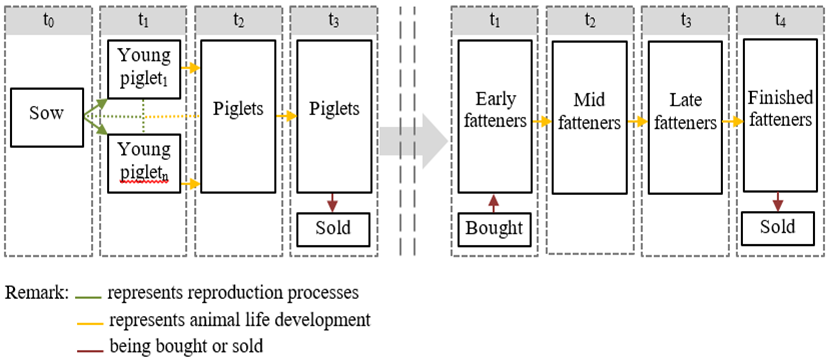

# Pig Module

The pig module, similar to the cattle module, is closely linked with the
general herd module. The herd dynamics of the pig module
are shown in Figure 1.

{: style="width:100%"}
:   Figure 1: Pig Module Management Decisions.
:   Source: Own Illustration.

The piglet production process starts with the production of young
piglets born which are raised to sows as shown in the following equation:

<!-- This is the embedmd for lines 58 - 65 in pig_module.gms (asked for in the word doc) -->
[embedmd]:# (N:/em/work1/Pahmeyer/FarmDyn/FarmDynDoku/FarmDyn_Docu/gams/model/pig_module.gms GAMS /\$\$iftheni.sows/ /\$\$endif.sows/)
```GAMS
$$iftheni.sows "%farmBranchSows%"=="on"

       newPiglets_(t_n(tCur(t),nCur),m) $  sum(feedRegime,actHerds("sows","",feedRegime,t,m)) ..

          v_herdStart("youngPiglets","",t,nCur,m)
              =e=  sum(actHerds("sows","",feedRegime,t,m),
                       v_herdSize("sows","",feedRegime,t,nCur,m) * p_OCoeff("sows","youngPiglet","",t))/card(m);
    $$endif.sows
```


Each sow produces on average 26.7 young piglets per year in the default
parameterisation. After one month young piglets become weaners and
remain 2 months within the herd before they are sold or transferred to
the fattener branch. Labour and feed requirements are chosen according to
a growing period of 41 days and a weight gain from 8 to 30 kg. The
feeding-, stable- and labour requirements of the piglet production branch
are steered by the sows and piglets herd size.

The fattener farm branch distinguishes between four different stages of
fatteners to account for different feeding and excretion values during
the production process. Feeding levels and excretion values are
connected via the set *feedregime*. This set allows to adapt feeding
patterns, for instance to adjust nutrient output in response to
legislatively given fertiliser restrictions. For a more thorough
explanation of the feeding options, please refer to the pig feeds module
in section 2.2.2. The piglets bought in a month are immediately
transferred into early fatteners and to
the next fattening stage after a month until they become fatteners and are sold as
fattened pigs. Each stage lasts for one month. The weight development
during the fattening process is assumed from 28 to 118kg live weight.

As mentioned in the general herd module description, equations such as herd
balance *herdsBal\_* and herd size, *herdSize\_* are used for the herd
dynamic in the pig module. The following model code shows the elements
of the herd used in the farm branch for sows.

<!-- Keep? -->
[embedmd]:# (N:/em/work1/Pahmeyer/FarmDyn/FarmDynDoku/FarmDyn_Docu/gams/coeffgen/ini_herds.gms GAMS /\$\$iftheni.sows "%farmBranchSows%" == "on"/ /\$\$endif.sows/)
```GAMS
$$iftheni.sows "%farmBranchSows%" == "on"

      herds_from_herds("piglets","youngPiglets","")  = yes;

      bought_to_herds("youngSows","","sows")         = yes;

      actHerds("piglets","",feedRegimePigs,t,m)      = yes;
      actHerds("sows","",feedRegimePigs,t,m)         = yes;
      actHerds("youngPiglets","",feedRegimePigs,t,m) = yes;
      actHerds("youngSows","",feedRegimePigs,t,m)    = yes;
   $$endif.sows
```

The statements below show the elements of the herd used in the farm
branch for fatteners:

<!-- Keep? -->
[embedmd]:# (N:/em/work1/Pahmeyer/FarmDyn/FarmDynDoku/FarmDyn_Docu/gams/coeffgen/ini_herds.gms GAMS /\$iftheni.pigHerd %pigHerd% == true/ /\$\$endif.fattners/)
```GAMS
$iftheni.pigHerd %pigHerd% == true
   $$iftheni.fattners "%farmBranchFattners%" == "on"

       actHerds("PigFattened","",feedRegimePigs,t,m)       = yes;
       actHerds("Fattners","",feedRegimePigs,t,m)          = yes;
       actHerds("earlyFattners","",feedRegimePigs,t,m)     = yes;
       actHerds("midFattners","",feedRegimePigs,t,m)       = yes;
       actHerds("lateFattners","",feedRegimePigs,t,m)      = yes;
       actHerds("pigletsBought","",feedRegimePigs,t,m)     = yes;

       bought_to_herds("pigletsBought","","earlyFattners") = yes;

       herds_from_herds("midfattners","earlyfattners","")  = yes;
       herds_from_herds("lateFattners","midFattners","")   = yes;
       herds_from_herds("Fattners","lateFattners","")      = yes;

   $$endif.fattners
```

## Feeding

The feeding requirements for the piglet production branch differentiate
between sows with the attached young piglets and the piglets after
separation from the sows. Requirements are set for energy, crude
protein, lysin, phosphorus feed and dry matter. Further, minimum and
maximum requirements are set for certain feeds in order to reflect
realistic feeding patterns. For example, a minimum requirement for oil
in the feed intake is assumed to assure a correct viscosity.

The fattening branch distinguishes between four fattening stages to
provide the option of nitrogen and phosphorus reduced feeding (N/P). It
includes the stages *earlyFattners*, *midFattners*, and *lateFattners*. Three feeding regimes are applicable, which are: normal feed,
reduced N/P feed and highly reduced N/P feed. The primary differences
between the feeding schemes are the adjustments of daily nutrient
requirements depending on the stage a fattening pig is currently in. For
instance, with the normal feed there are only two different feeding
requirements; a daily requirement for the weight range from 28-40 kg
which is in the early fattening phase and a daily requirement from
40-118 kg which assumes daily feed requirements in the mid, late and
finishing fattening stage. In contrast, the N/P reduced feeding phase
differentiates between daily nutrient requirements for the weight ranges
28-40 kg, 40-70 kg and 70-118 kg. Thus, all stages require different daily
nutrient requirements. In accordance with the piglet production branch,
the fattening branch also imposes maximal and minimal values for certain
products to account for digestibility, correct feeding textures and
mineral provision.

The requirements are used to determine the optimal feeding mix shown in
the equation *reqPigs\_*. Hence, it can be seen which feeding products
are used by which herd type at a certain time. The equation
*feedSourcePig\_* determines the source of feed, i.e. whether it is
purchased or produced on farm.

<!-- This is the embedmd for lines 65 - 74 in pig_module.gms (asked for in the word doc) -->
[embedmd]:# (N:/em/work1/Pahmeyer/FarmDyn/FarmDynDoku/FarmDyn_Docu/gams/model/pig_module.gms GAMS /reqPigs_\(p/ /;/)
```GAMS
reqPigs_(possHerds,feedAttr,feedRegime,t_n(tCur(t),nCur),m) $ ( sum(actHerds(herds,"",feedRegime,t,m),1)
                                           $ p_feedReqPig%l%(possHerds,feedRegime,feedAttr)
                                           $ (not (sameas(possherds,"pigletsBought") or sameas(possherds,"youngSows")
                                                                                     or sameas(possherds,"youngPiglets")))) ..

         v_herdSize(possHerds,"",feedRegime,t,nCur,m) * p_feedReqPig(possHerds,feedRegime,feedAttr)
                =L= sum(feedspig $ sum(sameas(feedsPig,curInputs),1), v_feedingPig(possherds,feedsPig,feedRegime,t,nCur,m) * p_feedAttrPig(feedsPig,feedAttr));
```

<!-- This is the embedmd for lines 76 - 88 in pig_module.gms (asked for in the word doc) -->
[embedmd]:# (N:/em/work1/Pahmeyer/FarmDyn/FarmDynDoku/FarmDyn_Docu/gams/model/pig_module.gms GAMS /feedSourcePig_[\S\s][^;]*?\.\./ /;/)
```GAMS
feedSourcePig_(feedspig,t_n(tCur(t),nCur)) $ (sum(actHerds(herds,"",feedRegime,t,m),1) $ sum(sameas(feedsPig,curInputs),1))  ..

        v_feedOwnPig(feedspig,t,nCur) $ sum(sameas(curProds,feedspig),1)
      + v_feedPurchPig(feedspig,t,nCur)

          =E= sum((possherds,feedRegime,m)
                  $ [   (not (    sameas(possherds,"pigletsBought") or sameas(possherds,"youngSows")
                               or sameas(possherds,"youngPiglets")))
                      $ sum(actHerds(possHerds,"",feedRegime,t,m),1)],
                       v_feedingPig(possherds,feedsPig,feedRegime,t,nCur,m));
```


The upper and lower bound for the feeding mix are then determined by
*feedTotPig\_, feedMaxPig\_, feedMinPig\_* (not additionally shown here) which
allows certain flexibility in the feeding mix.

However, for the fatteners the feeding mix is fixed for different feeding regimes to
precisely reproduce empirically found feeding ratios.

## Pig Specific Manure Excretion

With regard to excretion of animals, relevant equations and variables
can be found in the *general\_herd\_module.gms*. *v\_manQuantM* is the
monthly volume in cubic meter of manure produced. As a default, liquid manure is considered in the model.
The monthly manure excretion, *v\_manQuantM*, is computed in the following equation:

[embedmd]:# (N:/em/work1/Pahmeyer/FarmDyn/FarmDynDoku/FarmDyn_Docu/gams/model/general_herd_module.gms GAMS /manQuantM_[\S\s][^;]*?\.\./ /;/)
```GAMS
manQuantM_(curManChain(manChain),t_n(tCur,nCur),m) $ (not sameas(curManChain,"LiquidBiogas")) ..

        v_manQuantM(manChain,tCur,nCur,m)

          =e=
               sum( actherds(possHerds,breeds,feedRegime,tCur,m) $ (manChain_herd(curManChain,possHerds) $ p_prodLength(possherds,breeds)),
                   p_manQuantMonth(possHerds,curManChain) * ( 1 - 1   $ sameas(feedRegime,"fullGraz")
                                                                - 0.5 $ sameas(feedRegime,"partGraz"))
                    * v_herdSize(possHerds,breeds,feedRegime,tCur,nCur,m));
```

Furthermore, the monthly excretion of nutrients, NTAN (total ammonia nitrogen), Norg (organic nitrogen) and P (phosphorus) is calculated, multiplying *v\_herdsize* and *p\_nut2ManMonth*. For cows, the
excretion rate depends on animal category and feeding regime. Corresponding parameters can be found in *coeffgen\\manure.gms* (not shown here).
