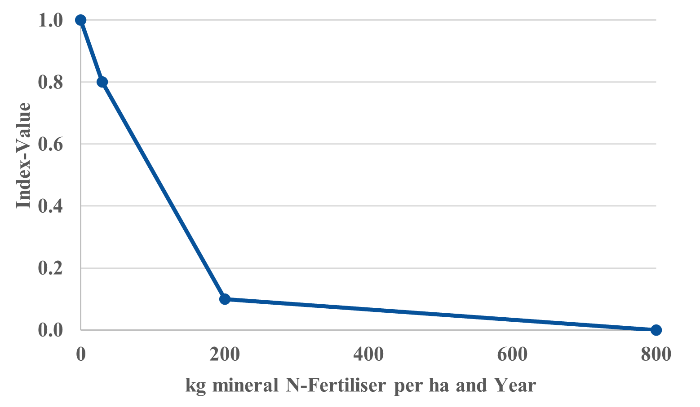
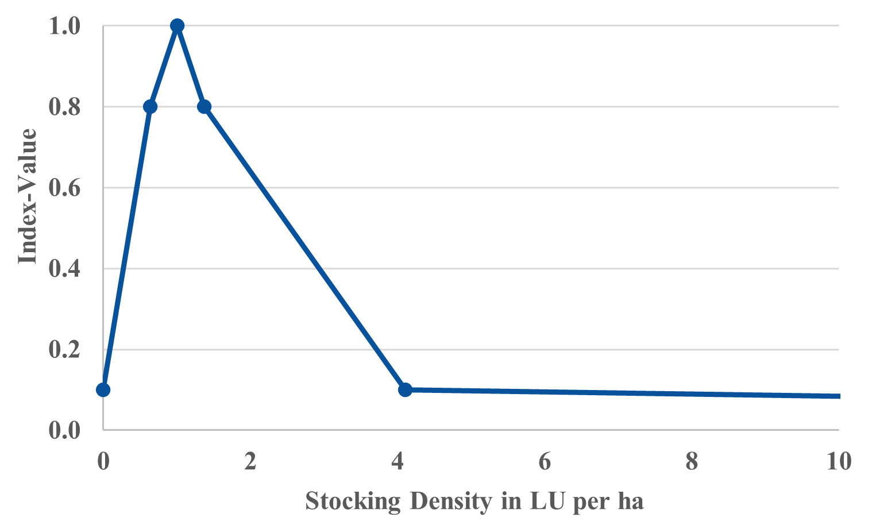

# Paracchini-Britz-Score

The Paracchini-Britz-Score calculated in FarmDyn is a modified version of the common pan-European indicator described by Paracchini and Britz (2010) and is based on the assumptions that agriculture can be beneficial for biodiversity and that diverse crop rotations in combination with low management intensities are best for biodiversity. The Paracchini-Britz-Score consists of three sub-indices: (1) a Modified-Shannon-Index, (2) a N-Fertilisation-Index and (3) a Ruminant-Index. All three indices are standardised to take values between 0 and 1. A higher grade stands for a better biodiversity score. The three indices are weighted to the final Paracchini-Britz-Score based on the area for which they are determined.


## Modified-Shannon-Index

The Modified-Shannon-Index is used to capture the diversity and evenness of the distribution of the crops grown on a farm. The index is used to evaluate the assumption that diverse crop rotations in equal shares are best for biodiversity and is calculated according to the following formula:

Modiefied-Shannon-Index = $ \dfrac{ - \displaystyle\sum_{ i  }^{   } \left( \dfrac{  { n  }_{ i  }    }{ N  }   \cdot   \ln\left(  \dfrac{  { n  }_{ i  }    }{ N  }    \right)   \right)    }{  \ln\left( S  \right)    } $  

*with:*   
*${ n  }_{ i  }$ = hectares of arable land devoted to crop group i*               
*$N$             = endowed hectares of arable land*   
*$S$             = number of crop groups which can potentially be grown (FarmDyn contains 27 crop groups)*

The corresponding GAMS code can be found in the directory *gams\\exploiter\\biodiv\_ind\_simple.gms*.


## N-Fertilisation-Index

The N-Fertilisation-Index is used as a proxy for the overall management intensity. For the calculation, the amount of manure and mineral nitrogen fertiliser applied per ha and year *p\_NFert(t)* is first determined. Using a step-wise linear function described in Paracchini and Britz (2010), this value is then assigned the final index value *p\_NFertIndex(t)*:

[embedmd]:# (N:/em/work1/Pahmeyer/FarmDyn/FarmDynDoku/FarmDyn_Docu/gams/exploiter/biodiv_ind_simple.gms GAMS /p\_NF.*?\$/ /800\)\);/)
```GAMS
p_NFert(t) $ p_totLand(t)  = sum( t_n(t,nCur), v_nutTotalAppliedYear("n",t,nCur)*p_probN(nCur)) / p_totLand(t);

  p_NFertIndex(t) = + (1.0 -  p_NFert(t)        /  30 * 0.2) $((p_NFert(t) <=  30))
                    + (0.8 - (p_NFert(t) -  30) /  70 * 0.3) $((p_NFert(t) >   30)  $(p_NFert(t) <= 100))
                    + (0.5 - (p_NFert(t) - 100) / 100 * 0.4) $((p_NFert(t) >  100)  $(p_NFert(t) <= 200))
                    + (0.1 - (p_NFert(t) - 200) / 800 * 0.1) $((p_NFert(t) >  200)  $(p_NFert(t) <= 800));
```

The figure below illustrates the step-wise linear function for a better understanding of the code:

{: style="width:100%"}
:   Figure 1: Step-wise Linear Function of the N-Fertilisation-Index.
    Source: Own illustration based on PARACCHINI and BRITZ (2010).


## Ruminant-Index  

The Ruminant-Index refers to the stocking density of ruminants in livestock units (LU) per ha as a proxy for the management intensity of grassland and of arable land used for fodder production. For the calculation, the ruminant stocking density of the modelled production programme is first determined:

[embedmd]:# (N:/em/work1/Pahmeyer/FarmDyn/FarmDynDoku/FarmDyn_Docu/gams/exploiter/biodiv_ind_simple.gms GAMS /\$\$ifi/ /0;/)
```GAMS
$$ifi defined v_sumGV p_StockDens(t) $ (p_RumLand(t) > 0) =  sum(t_n(t,nCur),v_sumGV(t,nCur))/p_rumLand(t);
                        p_StockDens(t) $ (p_RumLand(t) = 0) = 0;
```

Subsequently, the final Ruminant-Index is again determined using a step-wise linear function described in Paracchini and Britz (2010). This function considers ruminant stocking densities between 0.64 and 1.368 as beneficial for biodiversity. The mean value of 1,004 therefore serves as the optimum. Below the code and an illustration of this function are shown:

[embedmd]:# (N:/em/work1/Pahmeyer/FarmDyn/FarmDynDoku/FarmDyn_Docu/gams/exploiter/biodiv_ind_simple.gms GAMS /p\_RumI.*?\$/ /3\)\);/)
```GAMS
p_RumIndex(t) $ (p_stockDens(t) = 0) = 0;

    p_RumIndex(t) =   (0.1 + (p_stockDens(t) - 0.00) / p_MinStockDens * 0.7)
                        $((p_stockDens(t) <= p_MinStockDens) $(p_stockDens(t) > 0))

                    + (0.8 + (p_stockDens(t) - p_MinStockDens) / (p_OptStockDens - p_MinStockDens) * 0.2)
                        $((p_stockDens(t) > p_MinStockDens) $(p_stockDens(t) <= p_OptStockDens))

                    + (1.0 - (p_stockDens(t) - p_OptStockDens) / (p_MaxStockDens - p_OptStockDens) * 0.2)
                        $((p_stockDens(t) > p_OptStockDens) $(p_stockDens(t) <= p_MaxStockDens))

                    + (0.8 - (p_stockDens(t) - p_MaxStockDens) / (2 * p_MaxStockDens) * 0.7)
                        $((p_stockDens(t) > p_MaxStockDens) $(p_stockDens(t) <= p_MaxStockDens * 3))

                    + (0.1 - (p_stockDens(t) - p_MaxStockDens * 3) / (p_MaxStockDens *10)*0.1)
                        $((p_stockDens(t) > p_MaxStockDens * 3));
```

{: style="width:100%"}
:   Figure 2: Step-wise Linear Function of the Ruminant-Index.
    Source: Own illustration based on PARACCHINI and BRITZ (2010).


## Final Paracchini-Britz-Score   

The final Paracchini-Britz-Score is calculated by weighting and summing up the three sub-indices. Thereby, the areas which are of relevance for the respective sub-index serve as weights. This is the arable land in case of the Modified-Shannon-Index (*p\_ShanLand(t)*), the total land in case of the N-Fertilisation-Index (*p\_NLand(t)*) and the grassland and the arable land on which fodder is produced in case of the Ruminant-Index (*p\_RumLand(t)*). The sum of these 3 parameters is larger than the actual land endowment of the modelled farm and must therefore be determined in another parameter *p\_ImTotLand(t)* for weighting:  

[embedmd]:# (N:/em/work1/Pahmeyer/FarmDyn/FarmDynDoku/FarmDyn_Docu/gams/exploiter/biodiv_ind_simple.gms GAMS /p\_ImTot.*?\=/ /p_RumLandShare\(t\);/)
```GAMS
p_ImTotLand(t) = p_ShanLand(t) + p_NLand(t) + p_RumLand(t);

  p_ShanLandShare(t) $ (p_ImTotLand(t) > 0) = p_ShanLand(t) / p_ImTotLand(t);

  p_NLandShare(t) $ (p_ImTotLand(t) > 0)    = p_NLand(t) / p_ImTotLand(t);

  p_RumLandShare(t) $ (p_ImTotLand(t) > 0)  = p_RumLand(t) / p_ImTotLand(t);

  p_SollIndex(t) =
                      p_NewShannonIndex(t) * p_ShanLandShare(t)
                    + p_NFertIndex(t)      * p_NLandShare(t)
                    + p_RumIndex(t)        * p_RumLandShare(t);
```
