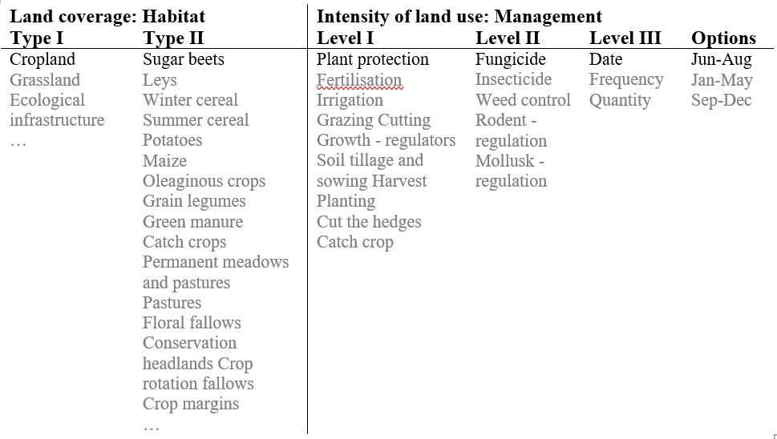

# SALCA-BD Method

SALCA-BD is a highly detailed biodiversity assessment method developed by the Swiss Competence Centre Agroscope. The following explanation of this method is based on JEANNERET et al. (2009; 2014).

SALCA-BD examines the impact of agricultural activities on eleven indicator species groups (ISGs), focusing on organismic diversity. These ISGs are depicted in the set *s\_bioType_e*:
[embedmd]:# (N:/em/work1/Pahmeyer/FarmDyn/FarmDynDoku/FarmDyn_Docu/gams/exploiter/biodiv_ind_salca.gms GAMS /set biodType_e / /;/)
```GAMS
set biodType_e /
      "Grassland flora"
      "Flora arable land"
      "Birds"
      "Small mammals"
      "Amphibians"
      "Mollusks"
      "Spiders"
      "Ground beetles"
      "Butterflies"
      "Wild bees"
      "Grasshoppers"
/;
```

Inventories are used to calculate biodiversity scores. These inventories describe the agricultural practices of a cultivated crop in detail and distinguishes between 2 habitat type levels and 3 management levels. The following figure gives an overview of the structure of such an inventory:

{: style="width:100%"}
:   Figure 1: General Structure of SALCA Inventories.
    Source: Own illustration based on JEANNERET et al. (2009; 2014).
    Remark: One example in black, further selection options in grey.

SALCA inventories were created for all FarmDyn crops, differentiated by cropping system and mechanisation. The inventories are stored externally and are read into the GAMS code in GDX format:

[embedmd]:# (N:/em/work1/Pahmeyer/FarmDyn/FarmDynDoku/FarmDyn_Docu/gams/exploiter/biodiv_ind_salca.gms GAMS /\* --- parameter storing the SALCA/ /\$\$LOAD p_salcaInv/)
```GAMS
* --- parameter storing the SALCA inventory IDs differentiated by crop and system
  parameter p_salcaInv(*,*,*);
$GDXIN "%datDir%/SALCAPrep/InventareGDX/biod_ind_salca_Inv.gdx"
  $$LOAD p_salcaInv
```

The SALCA-BD method offers grades evaluating the impact for each management option on each ISG. The grades are confidentially stored in separate file linked to the inventories and also read in to the GAMS code in GDX format:
[embedmd]:# (N:/em/work1/Pahmeyer/FarmDyn/FarmDynDoku/FarmDyn_Docu/gams/exploiter/biodiv_ind_salca.gms GAMS /\* --- load the salca weights and grades/ /3;/)
```GAMS
* --- load the salca weights and grades from salcaWeights.gdx
  parameter p_salcaWeigthsCompact(ID,biodType,BewNiv1,coeffs)
            p_salcaWeigthsCompact3(ID,BewNiv1,BewNiv2,BewNiv3,biodType,coeffs);
  execute_load  "%datDir%/SALCAPrep/salcaWeights.gdx" p_salcaWeigthsCompact,p_salcaWeigthsCompact3;
```
The grades range from 0 - 5. Grade 0 refers to the ISG being not affected as it does not occur in the habitat. The grades from 1-5 refers to the population change, grade 1 to a strong depletion, grade 3 to a neutral impact on the population size and grade 5 to strong populational increase. The grades are weighted by a coefficient ranging from 0 - 10, referring to the importance of the habitat type and of the management type (e.g. fertilisation vs. plant protection) for the ISG under consideration. The grade weighted by the coefficient results in the biodiversity score for the option. If multiple options belonging to one management level III are selected, either the mean or the minimum of the biodiversity scores is used, depending on the ISG’s ability to recover from management activities. The habitat score for one agricultural activity is calculated by building the mean of the biodiversity scores of all management level III.

[embedmd]:# (N:/em/work1/Pahmeyer/FarmDyn/FarmDynDoku/FarmDyn_Docu/gams/exploiter/biodiv_ind_salca.gms GAMS /\* --- Sum of all biodiversity scores, each BewNiv3 enters sum with one entry/ /p_salcaRes3\(curCrops,sys,"",biodType,"","","","cur","CountGAV"\);/)
```GAMS
* --- Sum of all biodiversity scores, each BewNiv3 enters sum with one entry
  p_salcaRes3(curCrops,sys,"",biodType,"","","","cur","SumScore")
      = sum((BewNiv3,BewNiv2,BewNiv1), p_salcaRes3(curCrops,sys,"",biodType,BewNiv1,BewNiv2,BewNiv3,"cur","ScoreBewNiv3"));

* --- Count BewNiv3
    p_salcaRes3(curCrops,sys,"",biodType,"","","","cur","CountGAV") = sum((BewNiv1,BewNiv2),p_salcaRes3(curCrops,sys,"",biodType,BewNiv1,BewNiv2,"","cur","CountGAV"));

* --- Calculation of overall biodiversity score (each BewNiv3 has the same weight)
  p_salcaRes3(curCrops,sys,"",biodType,"","","","cur","impactGAV") $p_salcaRes3(curCrops,sys,"",biodType,"","","","cur","CountGAV")
     = p_salcaRes3(curCrops,sys,"",biodType,"","","","cur","SumScore")/p_salcaRes3(curCrops,sys,"",biodType,"","","","cur","CountGAV");
```

For each ISG, this habitat score is compared to the maximum achievable and minimum achievable score to standardise the score and get a potential ranging from 0 to 1:

[embedmd]:# (N:/em/work1/Pahmeyer/FarmDyn/FarmDynDoku/FarmDyn_Docu/gams/exploiter/biodiv_ind_salca.gms GAMS /\* --- Storing maximum and minimum/ /p_biodTypeMinMaxGrades\(biodType,"min"\);/)
```GAMS
* --- Storing maximum and minimum possible SALCA Scores for each species in the result parameter
    p_salcaRes(curCrops,sys,"",biodType,"","max","impactGAV")  $ (sum(id,p_salcaInv(id,curCrops,sys)) $ p_ha(curCrops,sys))=  p_biodTypeMinMaxGrades(biodType,"max");
    p_salcaRes(curCrops,sys,"",biodType,"","min","impactGAV")  $ (sum(id,p_salcaInv(id,curCrops,sys)) $ p_ha(curCrops,sys))=  p_biodTypeMinMaxGrades(biodType,"min");
```

[embedmd]:# (N:/em/work1/Pahmeyer/FarmDyn/FarmDynDoku/FarmDyn_Docu/gams/exploiter/biodiv_ind_salca.gms GAMS /\* --- Standardization of the results/ /;/)
```GAMS
* --- Standardization of the results:
 p_salcaSummary3(curCrops,biodType,"pot",impactCat) $ ((p_salcaSummary3(curCrops,biodType,"cur",impactCat) AND (p_salcaSummary3(curCrops,biodType,"max",impactCat)-p_salcaSummary3(curCrops,biodType,"min",impactCat) gt 0 ) AND (p_salcaSummary3(curCrops,biodType,"cur",impactCat)-p_salcaSummary3(curCrops,biodType,"min",impactCat) gt 0 )))
      =  (p_salcaSummary3(curCrops,biodType,"cur",impactCat)-p_salcaSummary3(curCrops,biodType,"min",impactCat))
        / (p_salcaSummary3(curCrops,biodType,"max",impactCat)-p_salcaSummary3(curCrops,biodType,"min",impactCat)) ;
```

Habitat scores can be aggregated temporally, spatially, and over the indicator species groups. Temporal aggregation is possible as soon as multiple crops per year are entered, e.g. crops and
catch crops. Depending on the ISG’s ability to recover from harming management activities, either the mean or the minimum of both habitat scores is used. Spatial aggregation refers to the aggregation of the scores of plots into scores of the whole farm. For the spatial aggregation, the ISG’s biodiversity scores of the plots are weighted by their plot size. For the aggregation from individual habitat scores for each ISG into one general habitat score for all ISGs the so-called G weighting coefficients provided by SALCA-BD are used. These coefficients take the subspecies richness of a species and the trophic relations between the different ISGs into account. This type of aggregation can also be done on the level of a plot, using the temporally aggregated scores, and on the level of a farm, using the spatially aggregated scores.

All described calculations and aggregations were reconstructed in FarmDyn. Besides, another aggregation was built such that each management level I enters the habitat score with the same weight instead of each management level III. Thus, a distinction between SALCA Original and SALCA Modified can be chosen in FarmDyn’s graphical user interface. The complete code of the SALCA-BD method with additional explanations can be found in the directory *gams/exploiter/biodiv_ind_salca.gms*. Links to other code locations where preparations for the SALCA-BD method are made can be taken from this file. It should be noted that confidential SALCA data cannot be found on FarmDyn's head revision but can only be viewed on request.
