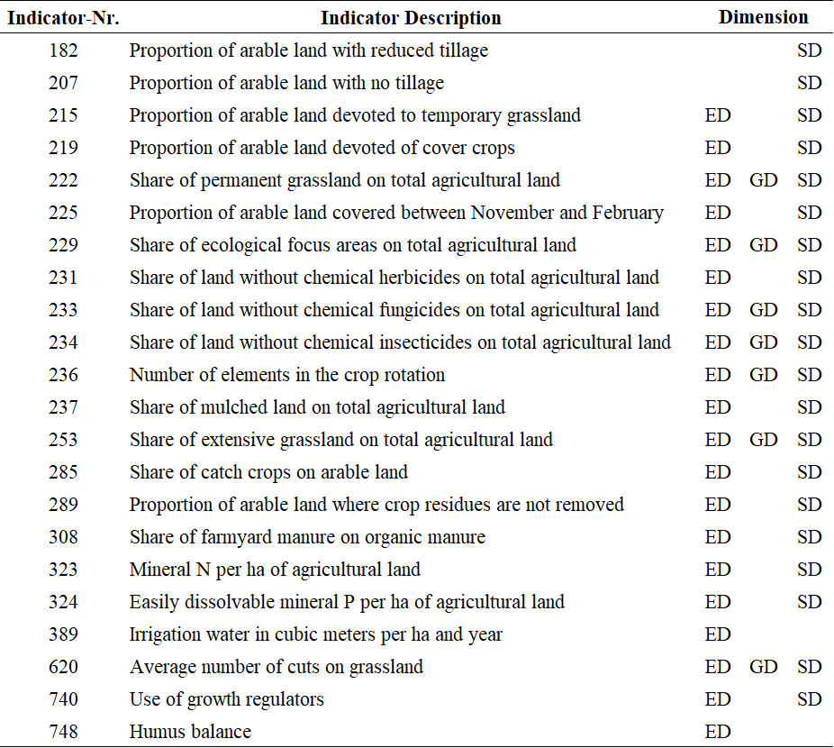

# SMART Score

SMART is an acronym for Sustainability Monitoring and Assessment Routine, an comprehensive sustainability assessment method developed by the Swiss FibL-Institute. The full SMART method is described by Schader et al. (2016). The implementation in FarmDyn relies on the biodiversity part only and covers 22 out of the 72 SMART biodiversity indicators. This discrepancy is due to limitations imposed by the FarmDyn model. The following table shows the 22 implemented SMART biodiversity indicators:  

:   Table 1: SMART Indicators.
{: style="width:100%"}
    Source: Own illustration based on SCHADER et al. (2016).

As can be seen in the table, the SMART method does not only estimate the overall impact of the agricultural production programme on biodiversity but distinguish the impact on (1) ecosystem diversity (ED), (2) genetic diversity (GD) and (3) species diversity (SD).

The SMART biodiversity indicators take values between 0 (worst) and 1 (best). Their calculation is done in three steps: determination of the **Relevance**, the **Driver** and the **Value**. In the following, these 3 steps are explained in more detail using the example of indicator 236 which captures the number of crops in the crop rotation:


## Relevance of Individual SMART Biodiversity Score

The **Relevance** is a binary variable which becomes 0 if the indicator is not relevant for the farm and 1 if it is. With a **Relevance** of 0 an indicator does not get included in the calculation of the SMART-Score. Indicator 236 is relevant if the farm has any endowment of arable land which can be seen in the following lines of code:  

[embedmd]:# (N:/em/work1/Pahmeyer/FarmDyn/FarmDynDoku/FarmDyn_Docu/gams/exploiter/biodiv_ind_SMART.gms GAMS /p\_Ind\("236",/ /;/)
```GAMS
p_Ind("236","rel")    $ sum( (landType,soil,t_n(tCur,nCur)), v_croppedLand(landtype,soil,tCur,nCur)*p_probN(nCur)) = 1;
```


## Driver of Individual SMART Biodiversity Score

The **Driver** captures a parameter, variable or similar of FarmDyn which describes the indicator. Thus, the **Driver** serves as the link to the model. In the case of indicator 236, the **Driver** captures the number of crops grown by the farm (excluding catch crops).

[embedmd]:# (N:/em/work1/Pahmeyer/FarmDyn/FarmDynDoku/FarmDyn_Docu/gams/exploiter/biodiv_ind_SMART.gms GAMS /p\_Ind\("236".*?\$ p\_Ind/ /;/)
```GAMS
p_Ind("236","driver") $ p_Ind("236","rel")
 =  sum(arabCrops(CurCrops) $ sum((c_p_t_i(curCrops,plot,till,intens),t_n(tCur,nCur)) $ ((not  catchCrops(curCrops)) $ v_cropHa(curCrops,plot,till,intens,tCur,nCur)),1),1);
```


## Value of Individual SMART Biodiversity Score

The **Value** converts the **Driver** of an indicator to fit the scale between 0 and 1. Step-wise linear functions are frequently used for this purpose. The **Driver** of indicator 236 can take any value depending on the number of different crops a farm grows. For example, if a farm cultivates 3 crops, the **Driver** is 3. Using a step-wise linear function, the 3 is then converted into the **Value** 0.25.

[embedmd]:# (N:/em/work1/Pahmeyer/FarmDyn/FarmDynDoku/FarmDyn_Docu/gams/exploiter/biodiv_ind_SMART.gms GAMS /p_ind\("236","val"\) =   0/ /;/)
```GAMS
p_ind("236","val") =   0                                   $(p_ind("236","driver") < 3)
                      + 0.25 $((p_ind("236","driver") >= 3) $(p_ind("236","driver") < 4))
                      + 0.50 $((p_ind("236","driver") >= 4) $(p_ind("236","driver") < 5))
                      + 0.75 $((p_ind("236","driver") >= 5) $(p_ind("236","driver") < 6))
                      + 1.00 $( p_ind("236","driver") >= 6);
```


## Aggregation to Final SMART Scores

The individual SMART biodiversity scores are summarized into 3 indicators for each of the 3 biodiversity dimensions.

*p\_EcoDiv* estimates the effect of the agricultural production progamme on ED:

[embedmd]:# (N:/em/work1/Pahmeyer/FarmDyn/FarmDynDoku/FarmDyn_Docu/gams/exploiter/biodiv_ind_SMART.gms GAMS /p_ind\(smartInds,"ecoSys"\)/ /\);/)
```GAMS
p_ind(smartInds,"ecoSys") $ ecoDivInd(smartInds) = 1;

 p_EcoDiv $ sum(ecoDivInd(smartInds), p_ind(smartInds,"rel"))
 = sum(ecoDivInd(smartInds) $ p_ind(smartInds,"rel"),p_ind(smartInds,"val"))
   /sum(ecoDivInd(smartInds), p_ind(smartInds,"rel"));
```

*p\_GenDiv* estimates the effect of the agricultural production progamme on GD:

[embedmd]:# (N:/em/work1/Pahmeyer/FarmDyn/FarmDynDoku/FarmDyn_Docu/gams/exploiter/biodiv_ind_SMART.gms GAMS /p_ind\(smartInds,"genetic"\)/ /\);/)
```GAMS
p_ind(smartInds,"genetic") $ genDivInd(smartInds) = 1;

 p_GenDiv $ sum(genDivInd(smartInds), p_ind(smartInds,"rel"))
 = sum(genDivInd(smartInds) $ p_ind(smartInds,"rel"),p_ind(smartInds,"val"))
   /sum(genDivInd(smartInds), p_ind(smartInds,"rel"));
```

And *p\_SpecDiv* estimates the effect of the agricultural production programme on SD:  

[embedmd]:# (N:/em/work1/Pahmeyer/FarmDyn/FarmDynDoku/FarmDyn_Docu/gams/exploiter/biodiv_ind_SMART.gms GAMS /p_ind\(smartInds,"species"\)/ /\);/)
```GAMS
p_ind(smartInds,"species") $ specDivInd(smartInds) = 1;

  p_SpecDiv $ sum(specDivInd(smartInds), p_ind(smartInds,"rel"))
  = sum(specDivInd(smartInds) $ p_ind(smartInds,"rel"),p_ind(smartInds,"val"))
    /sum(specDivInd(smartInds), p_ind(smartInds,"rel"));
```

Finally, the mean of *p\_EcoDiv*,*p\_GenDiv* and *p\_SpecDiv* summarises the overall impact on biodiversity - *p\_BioDiv*:

[embedmd]:# (N:/em/work1/Pahmeyer/FarmDyn/FarmDynDoku/FarmDyn_Docu/gams/exploiter/biodiv_ind_SMART.gms GAMS /p_BioDiv =/ /;/)
```GAMS
p_BioDiv =[ + p_EcoDiv
             + p_GenDiv
             + p_SpecDiv ]/ 3;
```
