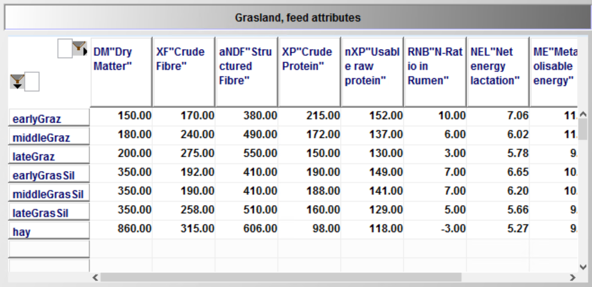
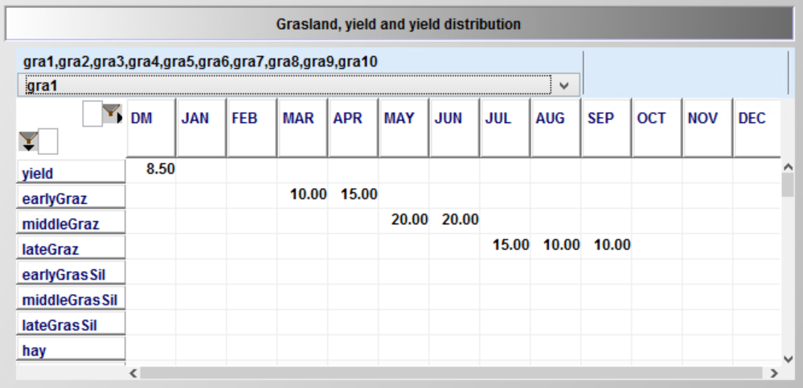
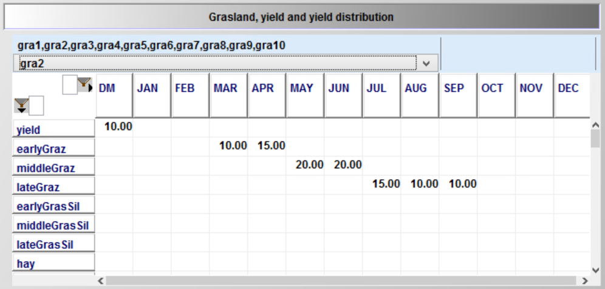
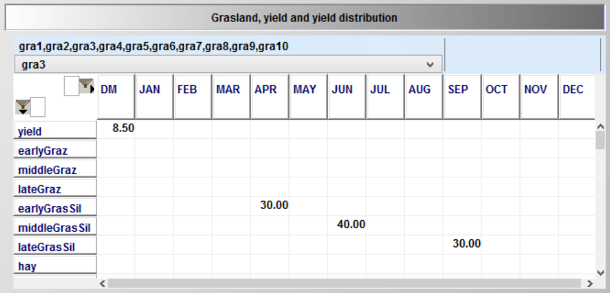
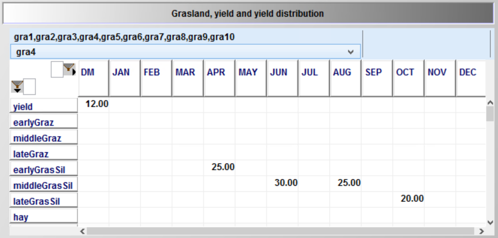

# Cropping, Land and Land Use

> **_Abstract_**  
The cropping module optimises the cropping pattern subject to land availability, reflecting yields, prices, machinery and fertilising needs, and other variable costs for a selectable list of arable crops. The crops can be differentiated by production system (conventional, organic), tillage (plough, minimal tillage, no tillage) and intensity level (normal and reduced fertilisation in 20 % steps). Machinery use is linked to field working-day requirements depicted with a bi-weekly resolution during the relevant months. Crop rotational constraints can be either depicted by introducing crop rotations or by simple maximal shares. The model can capture plots which are differentiated by soil and land type (grassland, arable land and pasture), size and distance.

## Cropping Activities in the Model

Crop activities are differentiated by crop, *crops*, soil types, *soil,*
management intensity, *intens*, and tillage type, *till*. The use of
different management intensities and tillage types is optional.
Management intensities impact yield levels.
Necessary field operations and thus variable costs, machinery and labour
needs reflect intensity and tillage type as well.

The farmer is assumed to be able to adjust on a yearly basis its land use  as long as the labour, machinery and further restrictions allow for it. Land is differentiated into arable and permanent grass land, *landType*. Land use decisions can be restricted by maximal rotational shares for the individual crops. The set *plot* differentiates the land with regard to plot size, soil type and climate zone. The attributes of plots and the number of plots from 1 to 20, is defined in the Graphical User Interface (GUI).

The total land endowment is calculated in the equation *totPlotLand\_*
as the sum of the initial endowment, *p\_plotSize(plot)*, and land
purchased, *v\_buyLand*, in the past or current year.

[embedmd]:# (N:/em/work1/Pahmeyer/FarmDyn/FarmDynDoku/FarmDyn_Docu/gams/model/general_cropping_module.gms GAMS /totPlotLand_[\S\s][^;]*?\.\./ /;/)
```GAMS
totPlotLand_(plot,tCur(t),nCur) $ (p_plotSize(plot) $ t_n(t,nCur)) ..

       v_totPlotLand(plot,t,nCur)

            =E=
*
*            --- initialize of plots
*
             p_plotSize(plot)
*
*            --- plus bought adjacent plots (= merged)
*
$ifi %landBuy% == true + sum(t_n(t1,nCur1) $ (tcur(t1) $ isNodeBefore(nCur,nCur1) $ (ord(t1) le ord(t))), v_buyPlot(plot,t1,nCur1))
             ;
```

Total cropped land is defined by the land occupied by the different
crops, *v\_cropHa*. The *c\_p\_t\_i* set defines the active possible
combinations of crops, soil type, tillage type/system and management intensity.

[embedmd]:# (N:/em/work1/Pahmeyer/FarmDyn/FarmDynDoku/FarmDyn_Docu/gams/model/general_cropping_module.gms GAMS /croppedLand_[\S\s][^;]*?\.\./ /;/)
```GAMS
croppedLand_(landType,soil,t_n(tCur(t),nCur)) ..

       v_croppedLand(landType,soil,t,nCur)
          =e= sum( (curCrops(crops),plot_lt_soil(plot,landType,soil),till,intens)
                    $ c_p_t_i(crops,plot,till,intens), v_cropHa(crops,plot,till,intens,t,nCur)
                             $( not catchcrops(crops) ));
```

The total land *v\_totPlotLand* can be either used for cropping
(including permanent grassland), *v\_croppedLand*, or rented out,
v*\_rentOutLand*, on a yearly basis. The option to rent out land can be
activated in the GUI:

[embedmd]:# (N:/em/work1/Pahmeyer/FarmDyn/FarmDynDoku/FarmDyn_Docu/gams/model/general_cropping_module.gms GAMS /\splotland_[\S\s][^;]*?\.\./ /;/)
```GAMS
 plotland_(plot,t_n(tCur(t),nCur)) $ p_plotSize(plot) ..
*
           sum(sys,v_croppedPlotLand(plot,sys,t,nCur))
*
$ifi %landLease% == true + v_rentOutPlot(plot,t,nCur)*p_plotSize(plot)
*
              =E= v_totPlotLand(plot,t,nCur);
```

That a farm stays within a maximum stocking rate ceiling, expressed in
livestock units per ha, is ensured by the following equation. The
maximal allowed stocking rate can be adjusted in the GUI:

[embedmd]:# (N:/em/work1/Pahmeyer/FarmDyn/FarmDynDoku/FarmDyn_Docu/gams/model/general_herd_module.gms GAMS /luLand_[\S\s][^;]*?\.\./ /;/)
```GAMS
luLand_(t_n(tCur(t),nCur)) ..

       sum( plot $ p_plotSize(plot), v_totPlotLand(plot,t,nCur)

$ifi %landLease% == true            -v_rentOutPlot(plot,t,nCur) * p_plotSize(plot)

           ) * p_maxStockRate  =G=  v_sumGV(t,nCur);
```


## Optional Crop Rotational Module

Alternatively to the use of maximum rotational shares, the model offers an option of a three year crop rotation
system. The rotation names (shown in the following list, see
*dat\\crops\_de.gms*), set *rot*, displays the order of the crops in the rotations. Each line depicts sequences of three crop types (do not have
to be different) in a rotation with only the order being differently.
This avoids unnecessary rigidities in the model.

[embedmd]:# (N:/em/work1/Pahmeyer/FarmDyn/FarmDynDoku/FarmDyn_Docu/dat/crops_de.gms GAMS /set.*?rot.*?PO,WC/ /;/)
```GAMS
set rot "Rotations" / WC_WC_PO,WC_PO_WC,PO_WC_WC
                          WC_WC_SC,WC_SC_WC,SC_WC_WC
                          WC_WC_SU,WC_SU_WC,SU_WC_WC
                          WC_WC_OT,WC_OT_WC,OT_WC_WC
                          WC_WC_ID,WC_ID_WC,ID_WC_WC

                          WC_SC_PO,SC_PO_WC,PO_WC_SC
                          WC_SC_SU,SC_SU_WC,SU_WC_SC
                          WC_SC_OT,SC_OT_WC,OT_WC_SC
                          WC_SC_ID,SC_ID_WC,ID_WC_SC

                          SC_WC_SC,SC_SC_WC,WC_SC_SC
                          SC_SC_ID,SC_ID_SC,ID_SC_SC
                          SC_SC_PO,SC_SC_SU,SC_SC_OT
                          WC_PO_ID,WC_SU_ID,WC_OT_ID
                          SC_PO_ID,SC_SU_ID,SC_OT_ID
                          WC_ID_ID,ID_WC_ID,ID_ID_WC
                          SC_ID_ID,ID_SC_ID,ID_ID_SC
                          PO_ID_ID,SU_ID_ID,OT_ID_ID
                          ID_ID_ID
                          PO_OT_WC,OT_WC_PO,WC_PO_OT
                          SU_OT_WC,OT_WC_SU,WC_SU_OT
                          PO_OT_SC,OT_SC_PO,SC_PO_OT
                          SU_OT_SC,OT_SC_SU,SC_SU_OT
                          SU_OT_PO,OT_PO_SU,PO_SU_OT
                        /;
```

Remark: WC: winter cereals, SC: summer cereals, PO: potatoes, SU: sugar
beets, ID: idling land, OT: other

The *rotations* are linked to groups of crops in the first, second and
third year of the rotation as can be seen in the following equation
(only cross-set definitions *rot\_cropTypes* for the first rotation are
shown).

[embedmd]:# (N:/em/work1/Pahmeyer/FarmDyn/FarmDynDoku/FarmDyn_Docu/dat/crops_de.gms GAMS /set.*?rot_cropTypes/ /;/)
```GAMS
set rot_cropTypes(rot,cropTypes,cropTypes,cropTypes)  "Rotation, first / second / third year crop type"
                                         /
                                           WC_WC_PO.WinterCere.WinterCere.potatoes
                                           WC_PO_WC.WinterCere.potatoes.WinterCere
                                           PO_WC_WC.potatoes.WinterCere.WinterCere

                                           WC_WC_OT.WinterCere.WinterCere.other
                                           WC_OT_WC.WinterCere.other.WinterCere
                                           OT_WC_WC.other.WinterCere.WinterCere

                                           WC_WC_ID.WinterCere.WinterCere.idle
                                           WC_ID_WC.WinterCere.idle.WinterCere
                                           ID_WC_WC.idle.WinterCere.WinterCere

                                           WC_WC_SU.WinterCere.WinterCere.sugarBeet
                                           WC_SU_WC.WinterCere.sugarBeet.WinterCere
                                           SU_WC_WC.sugarBeet.WinterCere.WinterCere

                                           WC_WC_SC.WinterCere.WinterCere.summerCere
                                           WC_SC_WC.WinterCere.summerCere.WinterCere
                                           SC_WC_WC.summerCere.WinterCere.WinterCere

                                           WC_SC_PO.WinterCere.summerCere.potatoes
                                           SC_PO_WC.summerCere.potatoes.WinterCere
                                           PO_WC_SC.potatoes.WinterCere.summerCere

                                           WC_SC_SU.WinterCere.summerCere.sugarBeet
                                           SC_SU_WC.summerCere.sugarBeet.WinterCere
                                           SU_WC_SC.sugarBeet.WinterCere.summerCere

                                           WC_SC_ID.WinterCere.summerCere.idle
                                           SC_ID_WC.summerCere.idle.WinterCere
                                           ID_WC_SC.idle.WinterCere.summerCere

                                           WC_SC_OT.WinterCere.summerCere.other
                                           SC_OT_WC.summerCere.other.WinterCere
                                           OT_WC_SC.other.WinterCere.summerCere


                                           SC_WC_SC.summerCere.WinterCere.summerCere
                                           WC_SC_SC.WinterCere.summerCere.summerCere
                                           SC_SC_WC.summerCere.summerCere.WinterCere

                                           WC_ID_ID.WinterCere.idle.idle
                                           ID_WC_ID.idle.WinterCere.idle
                                           ID_ID_WC.idle.idle.WinterCere

                                           SC_ID_ID.summerCere.idle.idle
                                           ID_SC_ID.idle.summerCere.idle
                                           ID_ID_SC.idle.idle.summerCere

                                           SC_SC_ID.summerCere.summerCere.idle
                                           SC_ID_SC.summerCere.idle.summerCere
                                           ID_SC_SC.idle.summerCere.summerCere

                                           SC_SC_PO.summerCere.summerCere.potatoes
                                           WC_PO_ID.WinterCere.potatoes.idle
                                           SC_PO_ID.summerCere.potatoes.idle
                                           ID_ID_ID.idle.idle.idle
                                           PO_ID_ID.potatoes.idle.idle

                                           SC_SC_SU.summerCere.summerCere.sugarBeet
                                           WC_SU_ID.WinterCere.sugarBeet.idle
                                           SC_SU_ID.summerCere.SugarBeet.idle
                                           SU_ID_ID.sugarBeet.idle.idle


                                           SC_SC_OT.summerCere.summerCere.other
                                           WC_OT_ID.WinterCere.other.idle
                                           SC_OT_ID.summerCere.other.idle
                                           OT_ID_ID.other.idle.idle

                                           PO_OT_WC.potatoes.other.WinterCere
                                           OT_WC_PO.other.WinterCere.potatoes
                                           WC_PO_OT.WinterCere.potatoes.other

                                           PO_OT_SC.potatoes.other.summerCere
                                           SU_OT_WC.SugarBeet.other.WinterCere
                                           OT_WC_SU.other.WinterCere.SugarBeet
                                           WC_SU_OT.WinterCere.SugarBeet.other

                                           SU_OT_SC.SugarBeet.other.summerCere
                                           OT_SC_SU.other.summerCere.SugarBeet
                                           SC_SU_OT.summerCere.SugarBeet.other

                                           SU_OT_PO.SugarBeet.other.potatoes
                                           OT_PO_SU.other.potatoes.SugarBeet
                                           PO_SU_OT.potatoes.SugarBeet.other

                                         /;
```

The link between individual crops and crop types used in the rotation
definitions is as follows:

[embedmd]:# (N:/em/work1/Pahmeyer/FarmDyn/FarmDynDoku/FarmDyn_Docu/dat/crops_de.gms GAMS /set\scropTypes_/ /;/)
```GAMS
set cropTypes_crops(cropTypes,crops) / winterCere.(set.winterCere)
                                          summerCere.(set.SummerCere,set.Maize)
                                          other.(set.Other,set.catchCrops)
                                          potatoes.(set.potatoes)
                                          sugarbeet.(set.sugarbeet)
                                          idle.idle
                                      /;
```

To use the crop rotations in the model equations, three cross
sets are generated which define the crop type in the first, second and
third year for each rotation:

[embedmd]:# (N:/em/work1/Pahmeyer/FarmDyn/FarmDynDoku/FarmDyn_Docu/dat/crops_de.gms GAMS /set\scropType0/ /YES;/)
```GAMS
set cropType0_rot(cropTypes,rot);cropType0_rot(cropTypes,rot) $ sum(rot_cropTypes(rot,cropTypes,cropTypes1,cropTypes2),1) = YES;
```

[embedmd]:# (N:/em/work1/Pahmeyer/FarmDyn/FarmDynDoku/FarmDyn_Docu/dat/crops_de.gms GAMS /set\scropType1/ /YES;/)
```GAMS
set cropType1_rot(cropTypes,rot);cropType1_rot(cropTypes,rot) $ sum(rot_cropTypes(rot,cropTypes1,cropTypes,cropTypes2),1) = YES;
```

[embedmd]:# (N:/em/work1/Pahmeyer/FarmDyn/FarmDynDoku/FarmDyn_Docu/dat/crops_de.gms GAMS /set\scropType2/ /YES;/)
```GAMS
set cropType2_rot(cropTypes,rot);cropType2_rot(cropTypes,rot) $ sum(rot_cropTypes(rot,cropTypes1,cropTypes2,cropTypes),1) = YES;
```

For each simulation, crops can be selected to be available for cropping  on farm, therefore, it is possible that not all rotations are operational.
Accordingly, in *coeffgen\\coeffgen.gms*, the set of available crop
rotations is defined:

[embedmd]:# (N:/em/work1/Pahmeyer/FarmDyn/FarmDynDoku/FarmDyn_Docu/gams/coeffgen/coeffgen.gms GAMS /cropType0.*?Type0/ /NO;/)
```GAMS
cropType0_rot(cropTypes,rot) $ (not sum( (cropType0_rot(cropTypes1,rot),curCrops) $ cropTypes_crops(cropTypes1,curCrops),1)) = NO;
```

[embedmd]:# (N:/em/work1/Pahmeyer/FarmDyn/FarmDynDoku/FarmDyn_Docu/gams/coeffgen/coeffgen.gms GAMS /\scropType0.*?Type1/ /NO;/)
```GAMS
 cropType0_rot(cropTypes,rot) $ (not sum( (cropType1_rot(cropTypes1,rot),curCrops) $ cropTypes_crops(cropTypes1,curCrops),1)) = NO;
```

[embedmd]:# (N:/em/work1/Pahmeyer/FarmDyn/FarmDynDoku/FarmDyn_Docu/gams/coeffgen/coeffgen.gms GAMS /\scropType0.*?Type2/ /NO;/)
```GAMS
 cropType0_rot(cropTypes,rot) $ (not sum( (cropType2_rot(cropTypes1,rot),curCrops) $ cropTypes_crops(cropTypes1,curCrops),1)) = NO;
```

[embedmd]:# (N:/em/work1/Pahmeyer/FarmDyn/FarmDynDoku/FarmDyn_Docu/gams/coeffgen/coeffgen.gms GAMS /\scropType1.*?Type1/ /NO;/)
```GAMS
 cropType1_rot(cropTypes,rot) $ (not sum( (cropType1_rot(cropTypes1,rot),curCrops) $ cropTypes_crops(cropTypes1,curCrops),1)) = NO;
```

[embedmd]:# (N:/em/work1/Pahmeyer/FarmDyn/FarmDynDoku/FarmDyn_Docu/gams/coeffgen/coeffgen.gms GAMS /\scropType1.*?Type0/ /NO;/)
```GAMS
 cropType1_rot(cropTypes,rot) $ (not sum( (cropType0_rot(cropTypes1,rot),curCrops) $ cropTypes_crops(cropTypes1,curCrops),1)) = NO;
```

[embedmd]:# (N:/em/work1/Pahmeyer/FarmDyn/FarmDynDoku/FarmDyn_Docu/gams/coeffgen/coeffgen.gms GAMS /\scropType1.*?Type2/ /NO;/)
```GAMS
 cropType1_rot(cropTypes,rot) $ (not sum( (cropType2_rot(cropTypes1,rot),curCrops) $ cropTypes_crops(cropTypes1,curCrops),1)) = NO;
```

[embedmd]:# (N:/em/work1/Pahmeyer/FarmDyn/FarmDynDoku/FarmDyn_Docu/gams/coeffgen/coeffgen.gms GAMS /\scropType2.*?Type2/ /NO;/)
```GAMS
 cropType2_rot(cropTypes,rot) $ (not sum( (cropType2_rot(cropTypes1,rot),curCrops) $ cropTypes_crops(cropTypes1,curCrops),1)) = NO;
```

[embedmd]:# (N:/em/work1/Pahmeyer/FarmDyn/FarmDynDoku/FarmDyn_Docu/gams/coeffgen/coeffgen.gms GAMS /\scropType2.*?Type0/ /NO;/)
```GAMS
 cropType2_rot(cropTypes,rot) $ (not sum( (cropType0_rot(cropTypes1,rot),curCrops) $ cropTypes_crops(cropTypes1,curCrops),1)) = NO;
```

[embedmd]:# (N:/em/work1/Pahmeyer/FarmDyn/FarmDynDoku/FarmDyn_Docu/gams/coeffgen/coeffgen.gms GAMS /\scropType2.*?Type1/ /NO;/)
```GAMS
 cropType2_rot(cropTypes,rot) $ (not sum( (cropType1_rot(cropTypes1,rot),curCrops) $ cropTypes_crops(cropTypes1,curCrops),1)) = NO;
```

The rotations enter the model via three constraints (see *model\\general_cropping_module.gms*). The right hand side sums up the crop hectares of a certain crop type in the current year in all three constraints, while the left hand side exhausts these hectares in the current, next and year after next year based on the rotations grown in these years.

[embedmd]:# (N:/em/work1/Pahmeyer/FarmDyn/FarmDynDoku/FarmDyn_Docu/gams/model/general_cropping_module.gms GAMS /rotHa0_\(.*?"g/ /;/)
```GAMS
rotHa0_(cropTypes,plot,t_n(tCur(t),nCur)) $ (not sum(plot_lt_soil(plot,"gras",soil),1))

            $ (sum(cropType0_rot(cropTypes,curRot(rot)),1)
               $ sum( (cropTypes_crops(cropTypes,crops),c_p_t_i(crops,plot,till,intens))
                           $ (v_cropHa.up(crops,plot,till,intens,t,nCur) ne 0),1))) ..

        sum( (cropTypes_crops(cropTypes,crops),c_p_t_i(crops,plot,till,intens)), v_cropHa(crops,plot,till,intens,t,nCur))

            =E=   sum(cropType0_rot(cropTypes,curRot(rot)), v_rotHa(rot,plot,t,nCur));
```

[embedmd]:# (N:/em/work1/Pahmeyer/FarmDyn/FarmDynDoku/FarmDyn_Docu/gams/model/general_cropping_module.gms GAMS /rotHa1_\(.*?"g/ /;/)
```GAMS
rotHa1_(cropTypes,plot,tCur(t),nCur) $ ((not sum(plot_lt_soil(plot,"gras",soil),1) )

            $ (sum(cropType1_rot(cropTypes,curRot(rot)),1)
               $ sum( (cropTypes_crops(cropTypes,crops),c_p_t_i(crops,plot,till,intens))
                           $ (v_cropHa.up(crops,plot,till,intens,t,nCur) ne 0),1)
                           $ tCur(t+1)) $ t_n(t,nCur)  ) ..

        sum( (cropTypes_crops(cropTypes,crops),c_p_t_i(crops,plot,till,intens)), v_cropHa(crops,plot,till,intens,t,nCur))

            =E=   sum((cropType1_rot(cropTypes,curRot(rot)),t_n(t+1,nCur1)), v_rotHa(rot,plot,t+1,nCur1));
```

[embedmd]:# (N:/em/work1/Pahmeyer/FarmDyn/FarmDynDoku/FarmDyn_Docu/gams/model/general_cropping_module.gms GAMS /rotHa2_\(.*?"g/ /;/)
```GAMS
rotHa2_(cropTypes,plot,tCur(t),nCur) $ ((not sum(plot_lt_soil(plot,"gras",soil),1))

            $ (sum(cropType2_rot(cropTypes,curRot(rot)),1)
               $ sum( (cropTypes_crops(cropTypes,crops),c_p_t_i(crops,plot,till,intens))
                           $ (v_cropHa.up(crops,plot,till,intens,t,nCur) ne 0),1)
                           $ tCur(t+2)) $ t_n(t,nCur) ) ..

        sum( (cropTypes_crops(cropTypes,crops),c_p_t_i(crops,plot,till,intens)), v_cropHa(crops,plot,till,intens,t,nCur))

            =E=   sum((cropType2_rot(cropTypes,curRot(rot)),t_n(t+2,nCur1)), v_rotHa(rot,plot,t+2,nCur1));
```

The rotations restrict the combination of crops and enter into the
optional soil pool balancing approach.


## Grassland Management

### Grazing of Herds

For cows, bulls, heifers and calves, the user can define on the interface if no grazing (= all day long in stable), partial grazing (= half day in stable) or full grazing (= no time in stable) can be used. Figure XY illustrates the grazing of calves as specified in the GUI. The entries would imply that calves have to kept in stable during JAN,FEB,NOV,DEC as no other option is open, partial grazing is additionally possible in MAR and OCT, and during the period APR-SEP, the farmer has the choice of all three types.
{: style="width:100%"}

The labour needs differ between the three options:

[embedmd]:# (N:/em/work1/Pahmeyer/FarmDyn/FarmDynDoku/FarmDyn_Docu/dat/cattle_de.gms GAMS /p\_he.*?heifs.*?noG/ /;/)
```GAMS
p_herdLab("heifs","noGraz",m)        =   9 / card(m);
```

[embedmd]:# (N:/em/work1/Pahmeyer/FarmDyn/FarmDynDoku/FarmDyn_Docu/dat/cattle_de.gms GAMS /p\_he.*?heifs.*?partG/ /;/)
```GAMS
p_herdLab("heifs","partGraz",m)      =   9 / card(m) + 0.5;
```

[embedmd]:# (N:/em/work1/Pahmeyer/FarmDyn/FarmDynDoku/FarmDyn_Docu/dat/cattle_de.gms GAMS /p\_he.*?heifs.*?fullG/ /;/)
```GAMS
p_herdLab("heifs","fullGraz",m)      =   5 / card(m);
```

The additional work load for partial grazing is calculated as follows: It is assumed that it takes one hour a day to move the herd form the stable to the pasture and back (= 15 hours in total in a month). The average herd driven is assumed to be equal to 60 animals for cows and 30 animals for heifers/bulls. For calves which are assumed to be driven with other herds, 0.25 hours a month are added.
The introduction of these grazing feeding regimes (part of the set “feedRegime”) requires a change in the logic of the program. The *v\_herdStart* variable now is no longer indexed with the feed regime – reflecting that e.g. a heifer entering the cow herd might during its lifetime as a cow sometimes be grazed and sometimes not. The *herdsSize\_* equation (see *gams\model\general_herd_module*) equilibrates the herd sizes in the different months (left hand side) to the herds starting in the yearly and months before:

[embedmd]:# (N:/em/work1/Pahmeyer/FarmDyn/FarmDynDoku/FarmDyn_Docu/gams/model/general_herd_module.gms GAMS /sum\(feedRegime \$/ /;/)
```GAMS
sum(feedRegime $ actHerds(herds,breeds,feedRegime,t,m),
    v_herdSize(herds,breeds,feedRegime,t,nCur,m))
  =E=
*
*         --- herds which started in the months before the production length, in case for piglets a separate construct is used
*
  sum((t_n(t1,nCur1),m1)
    $ ((((-p_mDist(t,m,t1,m1) le (p_prodLength(herds,breeds)-1))
        $ (p_mDist(t,m,t1,m1) le 0))
        or
        ((abs(p_mDist(t,m,t1,m1)-12) le (p_prodLength(herds,breeds)-1))
        $ (p_mDist(t,m,t1,m1)-12 le 0)) $ p_compStatHerd
       )
       $ sum(feedRegime,actHerds(herds,breeds,feedRegime,t1,m1))
       $ isNodeBefore(nCur,nCur1)
       $$iftheni.sows "%farmBranchSows%" == "on"
         $(not sameas(herds,"piglets"))
       $$endif.sows
     ),
      v_herdStart(herds,breeds,t1,nCur1,m1)

      $$iftheni.ch %cowHerd%==true
*
*       --- minus, in case of cows, slaughtered before reaching the final age
*
        -sum( (slgtCows,cows)
          $ (sum(feedRegime, actHerds(slgtCows,breeds,feedRegime,t1,m1))
            $ sameas(cows,herds) $ (slgtCows.pos eq cows.pos)),
          v_herdStart(slgtCows,breeds,t1,nCur,m1))
      $$endif.ch
    )
*
*  --- add herds multiple times if their process length is longer than 12
*

  +  sum((t_n(t1,nCur1),m1)
      $ (((-p_mDist(t,m,t1,m1) le (p_prodLength(herds,breeds)-1))
          $
          (   (abs(p_mDist(t,m,t1,m1)-12) le (p_prodLength(herds,breeds)-1))$ (p_mDist(t,m,t1,m1) le 0)
          or  (abs(p_mDist(t,m,t1,m1)-24) le (p_prodLength(herds,breeds)-1))$ (p_mDist(t,m,t1,m1) ge 0)
          ) $ p_compStatHerd $
                                  $$ifi defined cows (not cows(herds) $ (p_prodLength(herds,breeds) gt 12))
                                  $$ifi not defined cows (1 eq 1)
         )
         $ sum(feedRegime,actHerds(herds,breeds,feedRegime,t1,m1))
         $ isNodeBefore(nCur,nCur1)
         $$iftheni.sows "%farmBranchSows%" == "on"
           $(not sameas(herds,"piglets"))
         $$endif.sows
      ),
         v_herdStart(herds,breeds,t1,nCur1,m1)
*
*       --- minus, in case of cows, slaughtered before reaching the final age
*
      $$iftheni.ch %cowHerd%==true
        -sum( (slgtCows,cows)
          $ (sum(feedRegime, actHerds(slgtCows,breeds,feedRegime,t1,m1))
            $ sameas(cows,herds) $ (slgtCows.pos eq cows.pos)),
          v_herdStart(slgtCows,breeds,t1,nCur,m1))
      $$endif.ch
         )
*
*         --- Herd size dynamic for piglets separately to depict a correct transfer from year t to year t1 as well as account for temporal resolution adjustments
*

  $$iftheni.sows "%farmBranchSows%" == "on"
    +  sum( (t_n(t1,nCur1),m1)
      $ ((abs(p_mDist(t,m,t1,m1)) le (p_prodLengthB(herds,breeds) -1
        $ (p_prodLengthB(herds,breeds) eq 1)))
      $ (p_mDist(t,m,t1,m1) le 0)
      $ isNodeBefore(nCur,nCur1)
      $ sum(feedRegime,actHerds(herds,breeds,feedRegime,t1,m1))
      $ (sameas(herds,"youngPiglets") or sameas(herds,"piglets"))
      $ {
        (sameas(t,t1) $ (not sameas(m  - p_prodLengthB(herds,breeds),m1)))
        or ((not sameas(t,t1)) $ (sameas("Jan",m))$ (sameas( m + 11, m1)))
      }
      ),
         v_herdStart(herds,"",t1,nCur1,m1))
  $$endif.sows
;
```

An additional equation (see *model\cattle_module.gms*) ensures that the feeding phase variable is linked to herd in a specific feed regime:

[embedmd]:# (N:/em/work1/Pahmeyer/FarmDyn/FarmDynDoku/FarmDyn_Docu/gams/model/cattle_module.gms GAMS /herdsByFeedRegime/ /;/)
```GAMS
herdsByFeedRegime_(herds,breeds,feedRegime,t,n,m)         "Distribute herds to feed regimes"
      herdsreqsPhase_(herds,breeds,reqsPhase,m,t,n)             "Animal herds in a certain phase in a certain month"
      reqsPhase_(herds,breeds,feedRegime,reqs,reqsPhase,m,t,n)  "Animal requirements need to be covered"
      sumReqs_(reqs,t,n)                                        "Total requirements per year"
      sumReqsBought_(reqs,t,n)                                  "Total requirements per year from bought feed"
      feedUse_(feeds,t,n)                                       "Definition of total feed use"
      feedUseHerds_(herds,feeds,t,n)                            "Definition of total feed use"
      feedUseM_(feeds,m,t,n)                                    "Definition of total feed use"
      prodsM_(prods,m,t,n)                                      "Monthly feed use definition"
      herdsBefore_(herds,breeds,feedRegime,t,t,n,m)             "First two years"
      herdsStartBefore_(herds,breeds,t,t,n,m)                   "First two years"
      sumHerdsYY_(sumHerdsY,breeds,t,n)                          "Summary herd definition, per year, sold herds"
      avgLactations_(breeds,t,n)                                "Recover average lactation length from short and long"
      maxHerdChange1_(herds,breeds,feedRegime,t,n,n)            "Special restricton for heifer and calves raisingherd"
      maxHerdChange2_(herds,breeds,feedRegime,t,n,n)            "Special restricton for heifer and calves raisingherd"
      hasHerdOrderDairy_(t,n)
      hasHerdOrderMotherCows_(t,n)

$iftheni.dh %cowherd%==true
      newCalves_(breeds,t,n,m)                                  "Born calves (male and female)"
      maleFemaleRel_(breeds,t,n,m)                              "Born calves, keep male/female relation"
      calvesRaisBal_(herds,breeds,t,n,m)
$elseifi.dh "%buyCalvs%"=="true"
      calvesRaisBal_(herds,breeds,t,n,m)
$endif.dh

      herdExcrPast_(herds,grazRegime,t,n,m)                     "Allocate grazing to grazing plots"
      nutExcrPast_(allNut,t,n,m)                                "N and P excretion on pasture"
      nut2ManurePast_(crops,plot,till,intens,allNut,t,n,m)
      manQuantPast_(crops,plot,till,intens,manChain,t,n,m) "Defintion of manure quantity in m3 per month on pastures"
      FixGrasLand_(t,n)                                         "Ensures that there is no grassland on arable land"
      FixPastLand_(t,n)                                         "Distribution of gras and past land on total land  "

      buyCowStablesSos2_(hor,t,n,cowStables)
      buyMotherCowStablesSos2_(hor,t,n,motherCowStables)
      buyYoungStablesSos2_(hor,t,n,youngStables)
      buyCalvStablesSos2_(hor,t,n,calvStables)
;
```

### Nutrient Content of Different Grassland Outputs

The model now supports three types of fresh gras (labelled early – middle – late), three types of gras silage (labelled early – middle – late) and hay based on their feed attributes per unit of dry matter. Dry matter content is inputted as well:

{: style="width:100%"}

### Grassland Management

The user can define up to 10 different types of grassland management by the following two attributes:
1.	Total dry matter output,
2.	Distribution of outputs (see above) over months.
The default setting defines two differently intensive grazing schemes, which only differ in dry matter output and two different silage use schemes:

{: style="width:100%"}

{: style="width:100%"}

{: style="width:100%"}

{: style="width:100%"}

Embedded phyton code (see *gams\util\grasAttr.gms*) introduces more easily interpretable labels for the grassland reporting:
After the original label follows the annual dry matter yield, followed by the number of cuts (where applicable) and the share of biomass used for grazing resp. silage or hay.
The assignment of machinery needs and (related) labour hours in defined in “*gams\model\coeffgen\tech.gms*” and “*dat\cropop_de.gms*”:

[embedmd]:# (N:/em/work1/Pahmeyer/FarmDyn/FarmDynDoku/FarmDyn_Docu/dat/cropop_no.gms GAMS /\*.*?definition.*?op/ /;/)
```GAMS
* --- definition of basic field operations for graslands
*
 set.gras     .    soilSample          .  SEP2                                      0.25                 0.25  0.25   0.25    0.25
 set.gras     .    weederlight         .  MAR2                                      0.25                 0.25  0.25   0.25    0.25
 set.gras     .    sowMachine          .  MAR2                                      0.75                 0.75  0.75   0.75    0.75
 set.gras     .    grasReSeeding       .  APR1                                      0.25                 0.25  0.25   0.25    0.25
 set.gras     .    roller              .  APR1                                      0.25                 0.25  0.25   0.25    0.25
 ;
```

The operations shown above occur on all type of grasslands in the given frequency.
The operations related to cuts are defined as follows:

[embedmd]:# (N:/em/work1/Pahmeyer/FarmDyn/FarmDynDoku/FarmDyn_Docu/gams/coeffgen/tech.gms GAMS /\*.*?definition.*?cut/ /baleT.*?0\.86/)
```GAMS
* --- definition of cuts for grasland
*
$ifthen.gras defined noPastOutputs


  set toSilage(noPastOutputs) / earlyGrasSil,middleGrasSil,lateGrasSil /;
  set toHay(noPastOutputs) / hay /;
  set toPast(grasOutputs) /earlyGraz,middleGraz,lateGraz /;

  set grasToOutput(crops,grasOutputs);
  grasToOutput(crops,grasOutputs) $ sum((m) $(p_grasAttr(crops,grasOutputs,m)), 1) = YES;

  table p_opPerCut(operation,noPastOutputs,till) "Field operations for one gras cut per cutting process (either silo or bales)"
                                     silo     bales  hay
     mowing.set.noPastOutputs        1.00      1.00  1.0
     tedding.set.noPastOutputs       1.00      1.00  1.0
     raking.set.noPastOutputs        1.00      1.00  1.0
*
*   --- these operations are changed by harvested biomas
*
    closeSilo.set.toSilage          1.00
    silageTrailer.set.toSilage      1.00
    balePressWrap.set.toSilage               1.00
    balePressHay.hay                               1.00
    baleTransportSil.set.toSilage            1.00
    baleTransportHay.hay                           1.00
  ;

  parameter p_bioMassOpsFac(operation) "Factor in order to correct dry matter content to witted silage content (35% DM) or hay (86% DM)"
  /
    silageTrailer        0.35
    balePressWrap        0.35
    baleTransportSil     0.35
    balePressHay         0.86
    baleTransportHay     0.86
```

And are used to define the machinery needs:

[embedmd]:# (N:/em/work1/Pahmeyer/FarmDyn/FarmDynDoku/FarmDyn_Docu/gams/coeffgen/tech.gms GAMS /\*.*?count.*?cut/ /labPeriod\);/)
```GAMS
* --- count lab period where gras is cut
*
  parameter p_cutPeriod(crops,*) "Count # of labour period where grass is cut";

  p_cutPeriod(curCrops(grassCrops),labPeriod)
    = sum( (labPeriod_to_month(labPeriod,m),noPastOutputs) $ p_grasAttr(grassCrops,noPastOutputs,m),1);

*  p_cutPeriod(gras,labPeriod) = sum( labPeriod_to_month(labPeriod,m),p_cutPeriod(gras,m));
*
* --- silo cut for silage
*

  p_crop_op_per_till(curCrops(grassCrops),operation,labPeriod,"org","graz")
    = p_crop_op_per_till(grassCrops,operation,labPeriod,"noTill","graz");


  p_crop_op_per_till(curCrops(grassCrops),operation,labPeriod,"org","silo")
    = p_crop_op_per_till(grassCrops,operation,labPeriod,"noTill","silo");

  p_crop_op_per_till(curCrops(grassCrops),operation,labPeriod,"org","bales")
    = p_crop_op_per_till(grassCrops,operation,labPeriod,"noTill","bales");

  p_crop_op_per_till(curCrops(grassCrops),operation,labPeriod,"org","hay")
    = p_crop_op_per_till(grassCrops,operation,labPeriod,"noTill","hay");

  set grassTill(till) / noTill,org /;

  p_crop_op_per_till(curCrops(grassCrops),operation,labPeriod,grassTill,"silo")
     $ sum(toSilage, (p_cutPeriod(grassCrops,labPeriod) $ p_opPerCut(operation,toSilage,"silo") $ grasToOutput(grassCrops,toSilage)))
    =   sum( (labPeriod_to_month(labPeriod,m),toSilage) $ p_grasAttr(grassCrops,toSilage,m),
          p_opPerCut(operation,"middleGrasSil","silo")/2
*
*            --- change machinery needs (or not) depending on harvested dry matter
*
                 * (    1 $ (not p_bioMassOpsFac(operation))
                     +  (p_grasAttr(grassCrops,toSilage,m) * ( 1 $ sameas(grassTill,"noTill") + p_organicYieldMult(grassCrops) $ sameas(grassTill,"org"))
                            /p_bioMassOpsFac(operation)/op_attr(operation,"67kw","2","amount")) $ p_bioMassOpsFac(operation))
          )/ p_cutPeriod(grassCrops,labPeriod);
```
