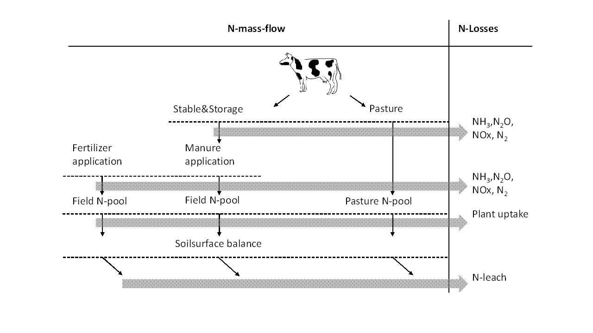

# Environmental Accounting Module

> **_Abstract_**  
The environmental accounting module utilises commonly applied methodology for the quantification of methane (CH4), ammonia (NH3), nitrous dioxide (N2O), nitrogen oxides (NOx) and elemental nitrogen (N2), as well as particulate matter formation (PM10 and PM2.5), as laid down in IPCC (2019) and EMEP (2013, 2016). N and P lost through erosion, run-off and leaching are calculated using methodology from Richner et al. (2014) and Prasuhn (2006). Upstream emissions from the provision of mayor farm inputs and services can be included via the ecoinvent database c. Emissions are characterised at midpoint level using characterisation factors from Huijbregts et al.(2016).


## Gaseous emissions

All calculations related to the environmental accounting are listed in *model\\env\_acc\_module\_de.gms* while the respective emission factors, characterisation factors and other input data are specified in *coeffgen\\env\_acc\_de.gms*. An overview of the methodology, data and the respective (primary) sources used are presented in the table below.

| Source/Sub-source | Pollutant | Methodology | Tier |
|-----------------------------------------------------------------|------------------------------------------------------------------------------|-------------------------------------------------------------------------------------------------------------------------------------------------------|-----------------------------------------------------------------------------------------|
| Enteric fermentation | CH4 | IPCC (2019) | 2 |
| Manure management | CH4 | IPCC (2019) | 2 |
|  | NH3, N2O, NOx, N2 | EEA (2016)  | 2 |
|  | Particulate matter | EEA (2013) | 2 |
| Pasture | CH4 | IPCC (2019)  | 2 |
|  | NH3 |  EEA (2016)  | 2 |
|  | N2O, NOx, N2 | IPCC (2019) | 1 |
| Field & Pasture / Manure application | NH3 | EEA (2016) | 2 |
|  | N2O, NOx, N2 | IPCC (2019) | 1 |
| Field & Pasture / Fertilizer application | NH3 | EEA (2016) | 2 |
|  | N2O, NOx, N2 | IPCC (2019) | 1 |
| Field / Lime application | CO2 | IPCC (2019) | 1 |
| Field / Crop residues  | N2O, N2 | IPCC (2019) | 1 |
| Field | Particulate matter | EEA (2016) | 1 |
| Field & Pasture  | NO3- | Richner et al(2014) |  |
|  | P | Prasuhn (2006) |  |
| Indirect N2O | N2O | IPCC (2019) | 1 |


The considered emissions are listed in the set *emissions*, the included sources in the set *sources*. The cross set *source\_emissions* links emissions to relevant sources. The set *emCat* lists midpoint emission categories according to Huijbregts et al.(2016).

[embedmd]:# (N:/em/work1/Pahmeyer/FarmDyn/FarmDynDoku/FarmDyn_Docu/gams/model/templ_decl.gms GAMS /set\semissions/ /;/)
```GAMS
set emissions / NO3,NH3,N2O,NOx,N2,N2Oind,CH4,CO2,TSP,PM25,PM10,P
$iftheni.upstream "%upstreamEF%" == "true"
                  m2aA_eq,CO2_eq,oil_eq,FETP_DCB_eq,P_eq,HTP_DCB_eq,
                  U235_eq,METP_DCB_eq,N_eq,Fe_eq,m2_eq,CFC11_eq,
                  PM10_eq,NMVOC_eq,SO2_eq,TETP_DCB_eq,m2aU_eq,m3_eq
$endif.upStream
               /;
```

[embedmd]:# (N:/em/work1/Pahmeyer/FarmDyn/FarmDynDoku/FarmDyn_Docu/gams/model/templ_decl.gms GAMS /set\ssource\s/ /;/)
```GAMS
set source
   /
                                             entFerm
                                             staSto
                                             past
                                             manAppl
                                             minAppl
                                             field
                                             input
    $$iftheni.upStream "%upstreamEF%" == "true"
                                             machine
                                             building
                                             stable
                                             silo
                                             straw
    $$endif.upStream
    /;
```

[embedmd]:# (N:/em/work1/Pahmeyer/FarmDyn/FarmDynDoku/FarmDyn_Docu/gams/model/templ_decl.gms GAMS /set\ssource_/ /;/)
```GAMS
set source_emissions(source,emissions) /
                                           staSto.(NH3,N2O,NOx,N2,N2Oind,CH4,TSP,PM25,PM10)
                                           past.(NH3,N2O,NOx,N2,N2Oind,CH4)
                                           manAppl.(NH3,N2O,NOx,N2,N2Oind)
                                           minAppl.(NH3,N2O,NOx,N2,N2Oind)
                                           field.(NO3,N2Oind,CO2, N2O,TSP,PM25,PM10,P)
                                           entFerm.CH4

  $$iftheni.upStream "%upstreamEF%" == "true"
                                            input.(m2aA_eq,CO2_eq,oil_eq,FETP_DCB_eq,P_eq,HTP_DCB_eq,
                                                   U235_eq,METP_DCB_eq,N_eq,Fe_eq,m2_eq,CFC11_eq,
                                                   PM10_eq,NMVOC_eq,SO2_eq,TETP_DCB_eq,m2aU_eq,m3_eq)
                                          machine.(m2aA_eq,CO2_eq,oil_eq,FETP_DCB_eq,P_eq,HTP_DCB_eq,
                                                   U235_eq,METP_DCB_eq,N_eq,Fe_eq,m2_eq,CFC11_eq,
                                                   PM10_eq,NMVOC_eq,SO2_eq,TETP_DCB_eq,m2aU_eq,m3_eq)
                                         building.(m2aA_eq,CO2_eq,oil_eq,FETP_DCB_eq,P_eq,HTP_DCB_eq,
                                                   U235_eq,METP_DCB_eq,N_eq,Fe_eq,m2_eq,CFC11_eq,
                                                   PM10_eq,NMVOC_eq,SO2_eq,TETP_DCB_eq,m2aU_eq,m3_eq)
                                           stable.(m2aA_eq,CO2_eq,oil_eq,FETP_DCB_eq,P_eq,HTP_DCB_eq,
                                                   U235_eq,METP_DCB_eq,N_eq,Fe_eq,m2_eq,CFC11_eq,
                                                   PM10_eq,NMVOC_eq,SO2_eq,TETP_DCB_eq,m2aU_eq,m3_eq)
                                             silo.(m2aA_eq,CO2_eq,oil_eq,FETP_DCB_eq,P_eq,HTP_DCB_eq,
                                                   U235_eq,METP_DCB_eq,N_eq,Fe_eq,m2_eq,CFC11_eq,
                                                   PM10_eq,NMVOC_eq,SO2_eq,TETP_DCB_eq,m2aU_eq,m3_eq)
                                            straw.(m2aA_eq,CO2_eq,oil_eq,FETP_DCB_eq,P_eq,HTP_DCB_eq,
                                                   U235_eq,METP_DCB_eq,N_eq,Fe_eq,m2_eq,CFC11_eq,
                                                   PM10_eq,NMVOC_eq,SO2_eq,TETP_DCB_eq,m2aU_eq,m3_eq)
$$endif.upStream
                                           / ;
```

[embedmd]:# (N:/em/work1/Pahmeyer/FarmDyn/FarmDynDoku/FarmDyn_Docu/gams/model/templ_decl.gms GAMS /set\semCat/ /;/)
```GAMS
set emCat "Emission categories according to ReCiPe(2016)"
  /
       ALOP           "agricultural land occupation"
       GWP            "climate change"
       FDP            "fossil depletion"
       FETPinf        "freshwater ecotoxicity"
       FEP            "freshwater eutrophication"
       HTPinf         "human toxicity"
       IRP_HE         "ionising radiation"
       METPinf        "marine ecotoxicity"
       MEP            "marine eutrophication"
       MDP            "metal depletion"
       NLTP           "natural land transformation"
       ODPinf         "ozone depletion"
       PMFP           "particulate matter formation"
       POFP           "photochemical oxidant formation"
       TAP            "terrestrial acidification"
       TETPinf        "terrestrial ecotoxicity"
       ULOP           "urban land occupation"
       WDP            "water depletion"
/;
```


[embedmd]:# (N:/em/work1/Pahmeyer/FarmDyn/FarmDynDoku/FarmDyn_Docu/gams/model/env_acc_module_de.gms GAMS /\* --- all monthly emissions, differentiated by emissions from herds, cropping and not allocatable emissions/ /;/)
```GAMS
* --- all monthly emissions, differentiated by emissions from herds, cropping and not allocatable emissions
*

  emissions_(chain_source(curChain,source),emissions,t_n(t,nCur)) $ (tCur(t) $ source_emissions(source,emissions)  $ envAcc )  ..

     v_emissions(curChain,source,emissions,t,nCur)

       =E=
$iftheni.h %herd% == true
       sum((singleHerds(herds),breeds)$ ( sum(actHerds(herds,breeds,feedRegime,t,m),1) $ source_emiHerd(source,emissions)),
                                                 v_emiherds(herds,breeds,curChain,source,emissions,t,nCur))
$endif.h
           + sum(curCrops $ source_emiCrops(source,emissions), v_emiCrops(curCrops,curChain,source,emissions,t,nCur) )

           + v_emiOther(curChain,source,emissions,t,nCur)

;
```

The actual calculation of the emissions is realised in the equation *emissions\_* presented above. The time resolution allows for reporting of emissions on a monthly basis. In this equation all emissions from different sources (herds, cropping and other emissions) are summed up. The different compartments of the equation represent the order of emission accounting, by emissions and sources, based on IPCC (2019). Using conditional *sameas* statements, only relevant emissions and sources are activated in the respective equations. Here we present all different equations building up the three compartments of the general equation *emissions_*.


###	Methane Emissions from Enteric Fermentation

Among the emissions directly related to the herds *v_emiherds*, methane emissions from enteric fermentation (in kg of CH4) are calculated based based on Dong et al. (2006, p.10,31). The actual feed  intake of different herds, *v_feeduse*, measured in gross energy, is used to calculate emissions. CH4 conversion factors, *p_Ym*, represent animal specific emission rates, for cattle and pig herds, in % of gross energy converted to methane.   

[embedmd]:# (N:/em/work1/Pahmeyer/FarmDyn/FarmDynDoku/FarmDyn_Docu/gams/model/env_acc_module_de.gms GAMS /\* --- emissions directly relateable to herds per herd/ /"entFerm"\)  \)/)
```GAMS
* --- emissions directly relateable to herds per herd
*
$iftheni.h %herd% == true

 emiherds_(singleHerds(herds),breeds,chain_source(curChain,source),emissions,t_n(t,nCur)) $ (tCur(t) $ source_emiHerd(source,emissions)
                                $ envAcc $ sum(actHerds(herds,breeds,feedRegime,t,m),1)) ..

    v_emiherds(herds,breeds,curChain,source,emissions,t,nCur)

      =E=
*     --- Calculation of CH4 emissions from enteric fermentation linked to gross energy intake (IPCC, 2006, eq. 10.21)
*         in kg CH4 per month (yearly emissions averaged for monthly reporting),

        + [  (
   $$iftheni.ch %cattle% == true

    +  sum(curFeeds(feeds),p_feedContFMton(feeds,"GE")
                 * sum((feedregime,reqsPhase,m) $ (feedRegime_feeds(feedRegime,curFeeds)
                                                      $ actHerdsf(herds,breeds,feedRegime,reqsphase,m)),
                            v_feeding(herds,breeds,feedRegime,reqsPhase,m,curfeeds,t,nCur) *
                                  [     p_Ym("dcows","") $  sum(sameas(herds,dcows),1)
                                     +  p_Ym("mcows","") $  sum(sameas(herds,mcows),1)
               $$ifi defined heifs   +  p_Ym("heifs","") $  sum(sameas(herds,heifs),1)
               $$ifi defined bulls   +  p_Ym("bulls","") $  sum(sameas(herds,bulls),1)
                                     +  p_Ym("calvs","") $  sum(sameas(herds,calvs),1) ]))

   $$endif.ch
   $$iftheni.fat "%farmBranchfattners%" == "on"
                   +  sum((sameas(herds,fatHerd),feedregime,m) $ (actHerds(fatHerd,breeds,feedRegime,t,m)
                                    $ p_feedReqPig%l%(fatHerd,feedRegime,"energ")),
                             p_feedReqPig(fatHerd,feedRegime,"energ")  * 1000 * v_herdsize(fatHerd,breeds,feedRegime,t,nCur,m) * p_YM("fatHerd",""))
   $$endif.fat
   $$iftheni.sows "%farmBranchSows%" == "on"
                    +  sum((sameas(herds,"sows"),feedregime,m) $  (actHerds("sows",breeds,feedRegime,t,m)
                                   $ p_feedReqPig%l%("sows",feedRegime,"energ")),
                             p_feedReqPig("sows",feedRegime,"energ") * 1000  * v_herdsize("sows",breeds,feedRegime,t,nCur,m) * p_YM("sows",""))
   $$endif.sows
                    )/(100 * 55.65)

        ]   $ ( sameas(emissions,"CH4") $ sameas(source,"entFerm")  )
```


###  Methane Emissions from Manure Storage

CH4 emissions stemming from manure storage are included among other emissions *v_emiOther* and they are calculated according to the volume in the different storage systems, *v\_volInStorageType*. The amount of volatile solids in the slurry is estimated based on the stored volume using the average dry matter, *p\_avDmMan*, and the share of volatile solids in the dry matter, *p\_oTSMan*. The effect of different slurry cover types on emissions is incorporated via different methane conversion factors, *p\_MCF*, in percentage of volatile solids. Furthermore, different manure types are considered in the maximum methane producing capacity, *p\_BO*. The emission factor is divided by 12 according to the monthly resolution.

[embedmd]:# (N:/em/work1/Pahmeyer/FarmDyn/FarmDynDoku/FarmDyn_Docu/gams/model/env_acc_module_de.gms GAMS /emiOther\_\(curChain,source,em/ /"staSto"\)  \)/)
```GAMS
emiOther_(curChain,source,emissions,t_n(t,nCur)) $ (tCur(t)  $ envAcc $source_emissions(source,emissions) $chain_source(curChain,source))  ..

   v_emiOther(curChain,source,emissions,t,nCur)

     =E=
     $$iftheni.man %manureStorage% == true

*  --- Calculation of CH4 from storage according to Haenel et al. (2018) p. 42 No. 3.28 and 3.29 Following IPCC, 2006, eq. 10.23;  in kg CH4 per month
         +   [  sum( (sameas(curManChain,curChain),manStorage,m),   v_volInStorageType(curManChain,manStorage,t,nCur,m)
                         *  1000 * p_avDmMan(curManChain) * p_oTSMan(curManChain) * p_BO(curManChain)
                         * p_densM * p_MCF(Manstorage,curManChain)
                         /12)
             ] $ ( sameas(emissions,"CH4") $ sameas(source,"staSto")  )
```


###	Methane emissions from excreta on pastures

Excreta on pastures also emits CH4. The calculation of those emissions is conducted analog to the emissions from storage with a specific methane conversion factor, *p\_MCFPast* and using the volume of manure excreted on pastures. Emissions from excreta on pastures are considered among the emissions directly related to crop production:

[embedmd]:# (N:/em/work1/Pahmeyer/FarmDyn/FarmDynDoku/FarmDyn_Docu/gams/model/env_acc_module_de.gms GAMS /emicrops_\(curCrops,chain_source\(curChain,source\)/ /grasCrops\(curCrops\)\)/)
```GAMS
emicrops_(curCrops,chain_source(curChain,source),emissions,t_n(t,nCur)) $ (tCur(t) $ source_emiCrops(source,emissions)  $ envAcc )  ..

   v_emiCrops(curCrops,curChain,source,emissions,t,nCur)

   =E=

*  --- Calculation of CH4 from storage according to Haenel et al. (2018) p. 42 No. 3.28 and 3.29 Following IPCC, 2006, eq. 10.23;
*      in kg CH4 per month
*   Pasture:
*
   $$iftheni.ch %cattle% == true

        + [  sum( (c_p_t_i(curCrops,plot,till,"graz"),curManChain,m),  v_manQuantPast(curCrops,plot,till,"graz",curManChain,t,nCur,m)
                   *  1000 * p_avDmMan(curManchain) * p_oTSMan(curManChain) * p_BO(curManchain)
                   * p_densM * p_MCFPast)
          ] $ ( sameas(emissions,"CH4") $ sameas(source,"past") $ grasCrops(curCrops))
```


### N Emissions from Stable and Storage

N-emissions are calculated using a mass-flow approach starting with the N excretion by farm animals. Three N-pools are considered, N-TAN, N-Org and total N. The correction of the N pools by previous losses are not part of the *env\_acc\_module* but are considered in the *manure\_module*.  The considered N flows and emissions are depicted in the figure below :

{: style="width:100%"}

Figure 1: N mass flow approach with considered stages and emissions in FarmDyn

NH3 emissions at the stable stage are calculated according to the N-TAN in manure as excreted by the animals, *v\_nut2ManureM*. NH3 emissions from storage are calculated based on the N-TAN pool in storage, *v\_nutPoolInStorage*. The emission factors differentiate between cattle and pig slurry.
While NH3 emissions are based only on the N-TAN pool, other N emissions are based on the total N pool as depicted in *v\_nut2manureM*. Considered emissions are N2O and NOx. N2 is generally not considered as an emission. For the completeness of the N-flow model, N losses in the form of N2 are still calculated in the environmental accounting. Indirect N2O emissions (N2Oind) are determined based on prior emissions of reactive N species, namely NH3 and NOx. For the sake of simplicity, the stages stable and storage are summarized in the calculation of emissions. Compared to total N2O and NOx emissions on farm the emissions at this stage are rather small and the generalisation is not expected to distort the results. N emissions from stable and storage are calculated based on IPCC (2019) and EMEP (2016) and included in the emissions directly related to the herds *v_emiherds*.

[embedmd]:# (N:/em/work1/Pahmeyer/FarmDyn/FarmDynDoku/FarmDyn_Docu/gams/model/env_acc_module_de.gms GAMS /\*     --- Calculation of NH3, N2O, NOx, N2, N2Oind from stable and storage/ /sameas\(source,"staSto"\)/)
```GAMS
*     --- Calculation of NH3, N2O, NOx, N2, N2Oind from stable and storage (staSto) Haenel et al. 55

  +    [


         sum((sameas(curManChain,curChain),m) $ sum(actherds(herds,breeds,feedregime,t,m),1),
                  (v_nut2ManureHerds(herds,breeds,curManChain,"NTAN",t,nCur,m)  $ (not sameas(curmanchain,"LiquidBiogas"))
                                              * (p_EFSta("NH3",curManChain) + p_EFSto("NH3",curManChain)))) $( sameas(emissions,"NH3"))

        + sum((sameas(curManChain,curChain),m) $ sum(actherds(herds,breeds,feedregime,t,m),1),
                                            (v_nut2ManureHerds(herds,breeds,curManChain,"NTAN",t,nCur,m)$ (not sameas(curmanchain,"LiquidBiogas"))
                                          +  v_nut2ManureHerds(herds,breeds,curManChain,"NOrg",t,nCur,m)$ (not sameas(curmanchain,"LiquidBiogas")))
                                          *  ( p_EFStaSto("N2O",curManChain)    $ sameas(emissions,"N2O")
                                             + p_EFStaSto("NOx",curManChain)    $ sameas(emissions,"NOx")
                                             + p_EFStaSto("N2",curManChain)     $ sameas(emissions,"N2")
                                             ))

        + (sum(sameas(curManChain,curChain), v_emiHerds(herds,breeds,curChain,"stasto","NOx",t,nCur)
                                            + v_emiHerds(herds,breeds,curChain,"stasto","NH3",t,nCur)
                                            ) * p_EFN2Oind ) $ sameas(emissions,"N2Oind")
      ]  $ sameas(source,"staSto")
```


### N Emissions from Pasture

The calculation of N emissions from pastures follows the same logic as the calculation of emissions from the stable and storage stage. The emission factors, *p_EFpasture*, represent the conditions of manure excreted on pastures. The source of the applied methodology can be found in EMEP (2016, p. 20f) and Klein (2006, p.6 f). As for methane emissions nitrogen emissions from pasture are included in *v_emiCrops*.

[embedmd]:# (N:/em/work1/Pahmeyer/FarmDyn/FarmDynDoku/FarmDyn_Docu/gams/model/env_acc_module_de.gms GAMS /\*     --- Calculation of NH3, N2O, NO and N2 losses from manure excretion on pasture/ /\(sameas\(source,"past"\) \$ grasCrops\(curCrops\)\)/)
```GAMS
*     --- Calculation of NH3, N2O, NO and N2 losses from manure excretion on pasture for cattle according to Haenel et al. (2018)p.55 and p.332 and IPCC(2006)-11.6 ff
*         in kg NH3-N, N2O-N, NO-N and N2 per month

        + [
              + sum((c_p_t_i(curCrops,plot,till,intens),m)
                         $ ( (p_grazMonth(curCrops,m)>0) $ sum(actHerds(possHerds,breeds,grazRegime,t,m)
                          $ sum(nut2,p_nutExcreDueV(possHerds,grazRegime,nut2)),1)),

                     v_nut2ManurePast(curCrops,plot,till,intens,"NTAN",t,nCur,m)
                      * (  p_EFPasture("NH3")       $ sameas(emissions,"NH3")  )

                  +  (   v_nut2ManurePast(curCrops,plot,till,intens,"NTAN",t,nCur,m)
                       + v_nut2ManurePast(curCrops,plot,till,intens,"Norg",t,nCur,m))
                      * (  p_EFPasture("N2O")        $ sameas(emissions,"N2O")
                         + p_EFPasture("NOx")        $ sameas(emissions,"NOx")
                         + p_EFPasture("N2")         $ sameas(emissions,"N2")
                         ))

*     --- Calculation of N2Oind from manure excretion on grassCropsure for cattle
*         in kg N2O-N per month
                + (( v_emiCrops(curCrops," ","past","NH3",t,nCur) + v_emiCrops(curCrops," ","past","NOx",t,nCur))
                     * p_EFN2Oind ) $ sameas(emissions,"N2Oind")

          ] $ (sameas(source,"past") $ grasCrops(curCrops))
```


###	N Emissions from Manure Application

NH3 emissions from the application of manure are calculated based on the N-TAN pool in the slurry leaving the storage stage. The amount is estimated using the total amount of slurry in cubic meter *v_manDist* and of nutrients in the slurry as determined by *p_nut2inMan* in kg N-TAN. The emission factors vary between grassland and arable land, different application devices and pig and cattle slurry. N2O, NOx and N2 emissions are calculated based on the total N pool at the application stage, *v_nut2manApplied*. The emission factor (*p_EFAPpplMin *) is equal to the emission factors for the application of synthetic fertilisers, as proposed by IPCC (2019). The calculation of N2O emission follows Klein (2006, p.7ff), the calculation of NOx EMEP (2016) and N2 from Roesemann (2015, p. 317). Indirect N2O emissions are based on prior emissions of NH3 and NOx.

[embedmd]:# (N:/em/work1/Pahmeyer/FarmDyn/FarmDynDoku/FarmDyn_Docu/gams/model/env_acc_module_de.gms GAMS /\*     --- Calculation of NH3, N2O, NOx, N2 from manure application/ /sameas\(source,"manAppl"\)/)
```GAMS
*     --- Calculation of NH3, N2O, NOx, N2 from manure application
*         NH3 losses depending on technology, source EMEP (2016)p.22ff for NH3; IPCC (2006)-11.7 for N2O; EMEP (2016)-3.D-11 for NOx
*         in kg NH3-N, N2O-N, NO-N and N2 per month:

     + [   sum( (c_p_t_i(curCrops,plot,till,intens),manApplicType_manType(ManApplicType,curManType),m)
                           $ (sum(sameas(curChain,curManChain) $ manChain_type(curManChain,curManType),1)
                           $ (not catchcrops(curcrops))),
              v_manDist(curCrops,plot,till,intens,ManApplicType,curManType,t,nCur,m)
                      * sum(manChain,p_nut2inMan("NTAN",curManType,manChain))
                  * p_EFapplMan(curCrops,curManType,manApplicType,"NTAN",m)) $ sameas(emissions,"NH3")

         + sum((sameas(curManChain,curChain),nut2,m) $ (not sameas(nut2,"P")),
                    v_nut2ManApplied(curCrops,curManChain,nut2,t,nCur,m)
                         * (    p_EFApplMin("N2O") $ sameas(emissions,"N2O")
                              + p_EFApplMin("NOx") $ sameas(emissions,"NOx")
                              + p_EFApplMin("N2")  $ sameas(emissions,"N2")))

         + (sum(sameas(curManChain,curChain) ,  v_emiCrops(curCrops,curChain,"manAppl","NH3",t,nCur)
                                              + v_emiCrops(curCrops,curChain,"manAppl","NOx",t,nCur))
                               * p_EFN2Oind ) $ sameas(emissions,"N2Oind")

       ] $ sameas(source,"manAppl")
```


###	N Emissions from Mineral Fertiliser Application

N-emissions from the application of mineral fertiliser, except for NH3, follow the same logic as from the application of manure. In synthetic fertiliser all N is present as N-TAN. The emission factor for NH3 emissions distinguishes between different fertiliser types, according to EMEP (2016, p.161). For the calculation of emissions, only the emission factor changes from *p_EFApplMinNH3* to *p_EFApplMin*. The pool of applied N from mineral fertiliser is determined by the total amount of applied fertiliser *v_syntDist* in kg multiplied by the share of N in the fertiliser, *p_nutInSynt*

[embedmd]:# (N:/em/work1/Pahmeyer/FarmDyn/FarmDynDoku/FarmDyn_Docu/gams/model/env_acc_module_de.gms GAMS /\*    --- Calculation of NH3, N2O, NOx, N2 from mineral fertilizer application/ /sameas\(source,"minAppl"\)/)
```GAMS
*    --- Calculation of NH3, N2O, NOx, N2 from mineral fertilizer application
*        Based on IPCC (2006)-11.7 for N2O; EMEP (2016)-3.D-11 for NOx, Roesemann et al. 2015, pp. 316-317 for N2
*         in kg NH3-N, N2O-N, NO-N and N2 per month

     + [sum( (c_p_t_i(curcrops,plot,till,intens),curInputs(syntFertilizer),m),
                      v_syntDist(curCrops,plot,till,intens,syntFertilizer,t,nCur,m)  * p_nutInSynt(syntFertilizer,"N")
                 * (    p_EFApplMinNH3(syntFertilizer) $ sameas(emissions,"NH3")
                      + p_EFApplMin("N2O") $ sameas(emissions,"N2O")
                      + p_EFApplMin("NOx") $ sameas(emissions,"NOx")
                      + p_EFApplMin("N2")  $ sameas(emissions,"N2")))

             + (( v_emiCrops(curCrops," ","minAppl","NH3",t,nCur) + v_emiCrops(curCrops," ","minAppl","NOx",t,nCur))
                           * p_EFN2Oind ) $ sameas(emissions,"N2Oind")
       ] $  sameas(source,"minAppl")
```


###	N Emissions from Crop Residues

The calculation of N2O emissions from crop residues is divided into three parts: At first the above and below ground N pool from crop residues are determined. Then the removal of N in crop residues through the harvest of straw is deducted. In a last step, the remaining N pool is multiplied with an emission factor. The methodology is adapted from Klein (2006, p.11 ff). The parameter *p_cropResi* inherits all further information needed for the derivation of the amount of N in crop residues. The different information is controlled through the set *resiEle*. The parameter includes information about the duration of the cropped system (“duration”), the frequency of harvesting (“freqHarv”), the dry matter content of the fresh matter yield (“DMyield”), the dry matter content of above ground residues (“DMresi”), the ratio of above ground crop residues to yield (“aboveRat”), the nitrogen content of the above-ground crop residues (“aboveN”), the ratio of below ground crop residues to above ground biomass (“belowRat”), and the nitrogen content of below ground crop residues (“belowN”). At first, the above ground N from organic material is calculated based on the main output, which is determined by the cropped area *v_cropHa* (in ha), multiplied by the main output of the respective crop *p_OCoeffC* in t fresh matter per ha of the respective crop:

[embedmd]:# (N:/em/work1/Pahmeyer/FarmDyn/FarmDynDoku/FarmDyn_Docu/gams/model/env_acc_module_de.gms GAMS /\*  --- Calculation of N2O emissions from crop residues on field/ /sameas \(source,"field"\)\)/)
```GAMS
*  --- Calculation of N2O emissions from crop residues on field in kg N2O-N per month; devided by 12 to account for monthly resolution; IPCC(2006)-11.11 ff

    + [(  sum(c_p_t_i(curcrops,plot,till,intens),
*     --- arable land residues abvove ground
           + v_cropHa(curCrops,plot,till,intens,t,nCur)
            * sum( (plot_soil(plot,soil),curProds) $ p_OCoeffC%l%(curCrops,soil,till,intens,curProds,t), p_OCoeffC(curCrops,soil,till,intens,curProds,t) * 1000)
             * p_cropResi(curCrops,"duration") * p_cropResi(curCrops,"freqHarv") *  p_cropResi(curCrops,"aboveRat") * p_cropResi(curCrops,"aboveN")

*     --- arable land residues below ground
           + v_cropHa(curCrops,plot,till,intens,t,nCur) *  sum( (plot_soil(plot,soil),curProds) $ p_OCoeffC%l%(curCrops,soil,till,intens,curProds,t) ,
              p_OCoeffC(curCrops,soil,till,intens,curProds,t) * 1000)
              * p_cropResi(curCrops,"duration") * p_cropResi(curCrops,"freqHarv")
              * ( p_cropResi(curCrops,"DMyield")$(not sameas(curCrops,"potatoes") and not sameas(curCrops,"sugarBeet"))
               + p_cropResi(curCrops,"aboveRat") * p_cropResi(curCrops,"DMresi"))
               * p_cropResi(curCrops,"belowRat") * p_cropResi(curCrops,"belowN")  )

*      --- deduction for straw removal
            -sum( c_p_t_i(curcrops,plot,till,intens) $ cropsResidueRemo(curCrops),  v_residuesRemoval(curCrops,plot,till,intens,t,nCur)
                * sum( (plot_soil(plot,soil),prodsResidues), 10 * p_OCoeffResidues(curCrops,soil,till,intens,prodsResidues,t)
                                                                   * p_nutContent(curCrops,prodsResidues,"conv","N")))

      )  * p_EFApplMin("N2O")
     ] $ ( sameas (emissions,"N2O") $ sameas (source,"field"))
```


###	CO2 Emissions from Liming

Lime is commonly used in agriculture to manage soil acidity. CO2 emissions stemming from lime application are introduced in the cropping related section. The amount of applied lime is paired with a simple emission factor *p_EFLime*,  and it is determined from the bought inputs, *v_buy* in t.

[embedmd]:# (N:/em/work1/Pahmeyer/FarmDyn/FarmDynDoku/FarmDyn_Docu/gams/model/env_acc_module_de.gms GAMS /\* --- Calculation of CO2 emissions from liming in kg/ /sameas \(source,"field"\)\)/)
```GAMS
* --- Calculation of CO2 emissions from liming in kg CO2 per month; devided by 12 for monthly resolution; IPCC (2006) 11.27

+  [  sum(c_p_t_i(curcrops,plot,till,intens) $ (p_costQuant(curCrops,till,intens,"lime")),
         v_cropHa(curCrops,plot,till,intens,t,nCur) * p_costQuant(curCrops,till,intens,"lime") /
           (p_inputPrices("lime","conv")  $ (not sameas(till,"org"))
            + p_inputPrices("lime","org") $ (    sameas(till,"org"))) * v_costQuant(curCrops,"lime")) 
           *  p_EFLime("lime")
   ] $ ( sameas (emissions,"CO2") $ sameas (source,"field"))
```


### Emissions from Production of External Inputs and Services

Up-stream emissions stemming from the production of farm inputs and services are included to gain insides on the environmental outcome of production beyond the farm boundaries. Emissions are considered via the ecoinvent database (Wernet et al. 2016). Due to licensing fees the data base is not part of the main model code but may be forwarded if requested. Therefore, the calculation of emissions is restricted through conditional assignments triggered by a checkbox in the interface.

Emissions from production of mineral fertilizers are considered based on the amount of applied fertilizers *v_syntDist*.

* --- Calculation of emissions stemming from synthetic fertilizer production

   +  [  sum( (c_p_t_i(curcrops,plot,till,intens),sameas(inputs,syntFertilizer),m),
              v_syntDist(curCrops,plot,till,intens,syntFertilizer,t,nCur,m) * p_EFInput(syntFertilizer,emissions))
      ] $sameas(source,"input")


Other crop specific inputs are estimated based on the bought quantity or costs as specified in *p_costQuant*.

    + [ sum( (c_p_t_i(curCrops,plot,till,intens),inputs) $ p_costQuant(curcrops,till,intens,inputs),
          v_cropHa(curCrops,plot,till,intens,t,nCur)
            *( p_costQuant(curCrops,till,intens,inputs) * v_costQuant(curCrops,inputs)) $(not sameas(inputs,"seed"))
              * p_EFInputCrops(curCrops,till,intens,inputs,emissions))
      ] $sameas(source,"input")


Emissions from field operations include the production, use and transportation of machines as well as diesel and pesticides. They are calculated using
*p_crop_op_per_till*. For manure application emissions are calculated based on the amount of applied manure *v_manDist*.

    +  [
*        --- crops times their need for field operations, yield depression effect is missing here
        sum((c_p_t_i(curcrops,plot,till,intens),operation),
            v_cropHa(curCrops,plot,till,intens,t,nCur)
               * sum(labPeriod, p_crop_op_per_till(curCrops,Operation,labPeriod,till,intens)
                                    * p_EFoperations(curCrops,plot,till,intens,operation,emissions,t)/12 ))

*        ---- machine need for the application of manure
           $$iftheni.man %manure% == true

            + sum( (c_p_t_i(curCrops,plot,till,intens),manApplicType_manType(ManApplicType,curManType),m)
                     $ (v_manDist.up(curCrops,plot,till,intens,manApplicType,curManType,t,nCur,m) ne 0),
                       v_manDist(curCrops,plot,till,intens,ManApplicType,curManType,t,nCur,m)
                         * sum(sameas(operation,"manDist"), p_EFoperations(curCrops,plot,till,intens,operation,emissions,t)) )
           $$endif.man

       ] $sameas(source,"machine")


Emissions from machine use and production in stables is calculated based on the machine need *p_machNeed* and the herd size *v_herdSize*  

      * --- Calculation of emissions from machine provision and use related to herds

           +  [  sum((machtype,machLifeUnit) $ p_lifeTimeM(machType,machLifeUnit),

                    sum(actHerds(herds,breeds,feedRegime,t,m) $ p_prodLength(herds,breeds),
                       v_herdSize(herds,breeds,feedRegime,t,nCur,m)
                        * p_machNeed(herds,"plough","normal",machType,machLifeUnit)
                                    * 1/min(12,p_prodLength(herds,breeds)))

                        * (p_machAttr(machType,"diesel_h") * p_EFInput("diesel",emissions) ) $(sameas(machType,"tractorSmall") $sameas(machLifeUnit,"hour"))
                        )
              ] $sameas(source,"machine")$((not sum(sameas(sumherds,herds),1)) or sum(sameas(calvsRais,herds),1) )


Emissions from bought feedstuff and straw for bedding in stables is calculated based on the bought amounts in *v_feedusebuy* and *v_buy*

       +  [
                    sum(sys$ p_inputPrice%l%("straw",sys,t),     v_buy("straw",sys,t,nCur)  *  p_EFInput("straw",emissions))
          ]$sameas(source,"straw")

       +  [ sum((sameas(feeds,inputs)) $ sum(sys $p_inputPrice%l%(inputs,sys,t),1),
                          v_feedusebuy(feeds,t,nCur)  *  p_EFInput(inputs,emissions))

          ]$sameas(source,"input")


## Particulate Matter Formation

Particulate matter emissions are categorised into three compartments depending on the size of the particles: particulate matter smaller than 2.5 μm (PM2.5), particulate matter smaller than 10 μm (PM2.5) (PM10) and total suspended particles (TSP) according to EMEP (2016).
Although all compartments are calculated in FarmDyn only the smallest particles (PM2.5) enter the later characterization step according to Huijbregts et al. (2016). Indirect emissions can form from prior NH3, NO3 and NOX emissions (WHO 2003).

Direct emissions of particulate matter from animal husbandry are calculated according to EMEP (2013) using a tier 2 approach considering different animal types, stable systems and the time animals spend in the stable. As stable systems are considered as an exogenous decision in the model, an emission factor (*p_EFpmfHerds*) is linked to the variable *v_herdsize*.

[embedmd]:# (N:/em/work1/Pahmeyer/FarmDyn/FarmDynDoku/FarmDyn_Docu/gams/model/env_acc_module_de.gms GAMS /\* --- Calculation of particulate matter emission from animal husbandry EME/ /sameas\(source,"staSto"\)/)
```GAMS
* --- Calculation of particulate matter emission from animal husbandry EMEP(2013)
*     3.3(“Tier 2 technology-specific approach“), Haenel et al (2018) p.66

   +  [ sum((actHerds(herds,breeds,feedRegime,t,m),sameas(curmanchain,curChain))
            $ (p_manQuantMonth(herds,curManChain) $ p_prodLength(herds,breeds)),
                  v_herdSize(herds,breeds,feedRegime,t,nCur,m)  *  p_EFpmfHerds(herds,feedregime,curmanchain,emissions)/12 )
      ]   $ sameas(source,"staSto")
```

Similarly, direct emissions of particulate matter from crop cultivation, harvesting and processing are calculated according to EMEP (2016, p.19) considering the type of crop, the crop specific cultivation operations, harvesting operations and the storage and processing of harvested goods (drying and cleaning). The activity data entering the equation is the cropped area per crop, *v_cropHa* and the emission factor *p_EFpmfCrops*.

[embedmd]:# (N:/em/work1/Pahmeyer/FarmDyn/FarmDynDoku/FarmDyn_Docu/gams/model/env_acc_module_de.gms GAMS /\* --- Calculation of particulate matter emission from cropping/ /sameas\(source,"field"\)/)
```GAMS
* --- Calculation of particulate matter emission from cropping EMEP(2016) 3D p.19,
*     if upstream emissions are considered this is included in machine operations

$$iftheni.eco  not "%upstreamEF%" == "true"
   +  [  sum(c_p_t_i(curcrops,plot,till,intens),
            v_cropHa(curCrops,plot,till,intens,t,nCur)
                  * sum((operation,labperiod), p_crop_op_per_till(curCrops,Operation,labPeriod,till,intens)
                             * p_EFpmfCrops(curCrops,operation,emissions) ))
      ]   $ sameas(source,"field")
```


## Nitrate Leaching Losses

In FarmDyn, an advanced N balance, i.e. the model Salca NO3, is used to calculate N leaching losses based on the methodology of Richner (2014). Conceptually, the underlying assumption of the model is that inputs of N from mineralization of soil-organic-N, fertilisation, or excretion of grazing animals is either taken up by plants or leached. The total loss of N through leaching on farm-level therefore is calculated as the sum of N inputs into the soil after gaseous N losses from fertilisation, from mineralization and from excreta of grazing animals. The inputs are deducted by the amount of N taken up by plants. The remaining N is then the leaching loss which is finally filtered for positive values only (negative emissions not possible):

[embedmd]:# (N:/em/work1/Pahmeyer/FarmDyn/FarmDynDoku/FarmDyn_Docu/gams/model/env_acc_module_de.gms GAMS /\* --- Calculation of leaching on farm level adapted from SALCA NO3/ /v_leachpositive\(curCrops,t,nCur\)\);/)
```GAMS
* --- Calculation of leaching on farm level adapted from SALCA NO3 (Richner (2014)) in kg NO3-N per year
*     (only for crops with a nutrient need, exempts idling land, flowerstripes etc.)
*
 leachCrops_(curCrops,t_n(tCur(t),nCur)) $( sum((c_p_t_i(curCrops,plot,till,intens),plot_soil(plot,soil)),p_nutNeed(curCrops,soil,till,intens,"N",t))
                                          $ envAcc ) ..

    v_leachCrops(curCrops,t,ncur) =e=

*    --- leached N from applied manure
    $$iftheni.h %herd% ==true
        sum( (plot,till,intens,manApplicType_manType(ManApplicType,curManType),m)
                 $ (manApplicType_manType(ManApplicType,curManType)
                 $ (v_manDist.up(curCrops,plot,till,intens,manApplicType,curManType,t,nCur,m) ne 0)
                 $ ( not catchcrops(curcrops) ) $c_p_t_i(curCrops,plot,till,intens)),
            v_manDist(curCrops,plot,till,intens,ManApplicType,curManType,t,nCur,m)
                 * sum(curManChain, p_nut2inMan("NTAN",curManType,curManChain))  * p_EfLeachFert(curCrops,m)  )

                 -  sum( (curChain,NiEmissions(Emissions)) $ chain_source(curChain,"manAppl"),
                       v_emiCrops(curCrops,curChain,"manAppl",emissions,t,nCur) )
    $$endif.h

*    --- leached N from applied mineral fertilizer
      + sum( (plot,till,intens,syntFertilizer,m)$c_p_t_i(curCrops,plot,till,intens),
            v_syntDist(curCrops,plot,till,intens,syntFertilizer,t,nCur,m) * p_nutInSynt(syntFertilizer,"N")  * p_EfLeachFert(curCrops,m) )

            -  sum( (curChain,NiEmissions(Emissions)) $ chain_source(curChain,"minAppl"),
                  v_emiCrops(curCrops,curChain,"minAppl",emissions,t,nCur) )

*    --- leached N from mineralization

     +  sum((plot,till,intens,m)$c_p_t_i(curCrops,plot,till,intens), p_LeachNorm(m) * v_cropHa(curCrops,plot,till,intens,t,nCur))

*    ---  correction of mineralisation for longterm effects of organic fertilization (+10% per DGVE per ha; 1DGVE = 110kgN/h and a)

  $$iftheni.h %herd% ==true
    +  sum( m,p_LeachNorm(m)) * 0.1
      *  [sum( (plot,till,intens,manApplicType_manType(ManApplicType,curManType),m)
              $ ( (v_manDist.up(curCrops,plot,till,intens,manApplicType,curManType,t,nCur,m) ne 0)
                  $( not catchcrops(curcrops) )  $c_p_t_i(curCrops,plot,till,intens)),

                 v_manDist(curCrops,plot,till,intens,ManApplicType,curManType,t,nCur,m)
                   * (sum(manChain,p_nut2inMan("NORG",curManType,manChain))
                   +  sum(manChain,p_nut2inMan("NTAN",curManType,manChain)) )   )

                  -  sum( (curChain,NiEmissions(Emissions)) $ chain_source(curChain,"manAppl"),
                        v_emiCrops(curCrops,curChain,"manAppl",emissions,t,nCur)) -110  ]/110
  $$endif.h

*    --- additional mineralization in month with intensive cultivation operation

   +  sum( (plot,till,intens,m)$(c_p_t_i(curCrops,plot,till,intens) $sum(arabCrops(crops)$sameas(crops,arabcrops),1)),
          p_CfIntensTill(m,curCrops)* p_CfNLeachTill(m) * v_cropHa(curCrops,plot,till,intens,t,nCur) )

*      --- correction for reduced mineralization under grassland
  -  sum[ (plot,till,intens) $(c_p_t_i(curCrops,plot,till,intens) $ sum(grasCrops(crops)$sameas(crops,grascrops),1)),
         v_cropHa(curCrops,plot,till,intens,t,nCur) * p_CfNLeachGrass(curCrops) ]

*     --- plant removal deduction
    -   sum ( (plot_soil(plot,soil),till,intens) $c_p_t_i(curCrops,plot,till,intens),
                  p_nutNeed(curCrops,soil,till,intens,"N",t) * v_cropHa(curCrops,plot,till,intens,t,nCur))

*     --- leaching from grazed pastures

    $$iftheni.ch %cattle% == true
 +
          sum((plot,till,intens,m)
                      $ ( (p_grazMonth(curCrops,m)>0) $ sum(actHerds(possHerds,breeds,grazRegime,t,m)
                      $ sum(nut2,p_nutExcreDueV(possHerds,grazRegime,nut2)),1)
                      $c_p_t_i(curCrops,plot,till,intens)),
                (   v_nut2ManurePast(curCrops,plot,till,intens,"NTAN",t,nCur,m)
                  + v_nut2ManurePast(curcrops,plot,till,intens,"NORG",t,nCur,m)

                  - sum((curChain,NiEmissions(Emissions)) $ (chain_source(curChain,"past")) ,
                           v_emiCrops(curCrops,curChain,"past",emissions,t,nCur))/12

                )*p_leachPast(m)
            )$sum(grasCrops(crops)$sameas(crops,grascrops),1)

    $$endif.ch
;

* --- equations to filter for positive values only, negative emissions are not possible in this case

slackLeach_(curCrops,t_n(tCur(t),nCur)) $ (sum((c_p_t_i(curCrops,plot,till,intens),plot_soil(plot,soil)),p_nutNeed(curCrops,soil,till,intens,"N",t))
                                             $ envAcc) ..

  v_leachCrops(curCrops,t,nCur) - v_leachpositive(curCrops,t,nCur)+ v_leachnegative(curCrops,t,nCur) =E= 0;

finalLeach_(curCrops,t_n(tCur(t),nCur)) $ (sum((c_p_t_i(curCrops,plot,till,intens),plot_soil(plot,soil)),p_nutNeed(curCrops,soil,till,intens,"N",t))
                                             $ envAcc)..

 2* v_leachpositive(curCrops,t,nCur) =e= v_leachCrops(curCrops,t,nCur) + v_leachpositive(curCrops,t,nCur) + v_leachnegative(curCrops,t,nCur) ;

leachTotal_(t_n(t,nCur))  $ (tCur(t) $ envAcc) ..

        v_leach(t,nCur) =e=

      Sum(curCrops $ sum((c_p_t_i(curCrops,plot,till,intens),plot_soil(plot,soil)),p_nutNeed(curCrops,soil,till,intens,"N",t)),
          v_leachpositive(curCrops,t,nCur));
```


## Phosphorus Losses

In the model “SALCA Phosphor” from Prasuhn (2006) was utilised to calculate phoshorus losses. The model comprises losses for the mentioned pathways above: erosion, leaching  and runoff. The total loss of P, is determined through the sum of the single compartments.
The underlying principle is to apply default loss factors for all pathways that are adapted to local management and pedo-climatic conditions. The advantage of the approach is the possibility to dynamically adjust the level of detail depending on the data availability.

P loss through soil erosion, in kg P, is calculated using a default value for the eroded soil, *p_erosion*, the share of the eroded soil that reaches water pathways,*p_lossfactor*, the P content of the eroded soil, *p_PContSoil*, and a factor taking into account the particle size and texture of the eroded soil P, *p_PAccuSoil*.

P lost through leaching, EP,Leaching in kg P, is calculated considering soil properties (included int the parameter *p_soilFactLeach*), effects of fertilisation with slurry, and the P content of the soil. The default values for P losses, *p_PLossLeach*, are depending on the land use. The factor *p_PSoilClass* is based on Walther et al. (2001).

The P loss through runoff, is calculated considering a default value, depending on the land use, a soil factor, a slope factor, a factor for the P content of the top soil and a factor considering effects of fertilisation.

[embedmd]:# (N:/em/work1/Pahmeyer/FarmDyn/FarmDynDoku/FarmDyn_Docu/gams/model/env_acc_module_de.gms GAMS /\*  --- Calculation of phosphorus losses through erosion, leaching/ /v_lossphosCrops\(curCrops,t,nCur\)\);/)
```GAMS
*  --- Calculation of phosphorus losses through erosion, leaching and runoff according to SALCA P (Prasuhn 2006)
*

lossPhosCrops_(curCrops(crops),t,nCur) $ (tCur(t) $ t_n(t,nCur) $ envAcc  )  ..

   v_lossPhosCrops(curCrops,t,nCur) =e=

*    --- Loss through erosion

      sum((plot,till,intens)$c_p_t_i(curCrops,plot,till,intens), v_cropHa(curCrops,plot,till,intens,t,nCur) * p_erosion * p_lossfactor * p_PContSoil * p_PAccuSoil  )

*    --- Loss through leaching grassland
$$iftheni.ch %cattle% == true

      + [sum((plot,till,intens)$c_p_t_i(curCrops,plot,till,intens), p_PLossLeach("grass") * p_soilFactLeach * p_PSoilClass * v_cropHa(curCrops,plot,till,intens,t,nCur))

         + p_PLossLeach("grass") * p_soilFactLeach * p_PSoilClass *
            sum((plot,till,intens,manApplicType_manType(manApplicType,curMantype),m) $(c_p_t_i(curCrops,plot,till,intens)$(not sameas (ManApplicType,"applSolidSpread"))),
                     p_PLossFert("low") * v_manDist(crops,plot,till,intens,ManApplicType,curManType,t,nCur,m) * sum((manChain),p_nut2inMan("P",curManType,manChain)))
        ]$sum(grasCrops(crops)$sameas(crops,grascrops),1)
$$endif.ch

*    --- Loss through leaching arable land

    +[ sum((plot,till,intens)$c_p_t_i(curCrops,plot,till,intens), p_PLossLeach("arable") * p_soilFactLeach * p_PSoilClass * v_cropHa(curCrops,plot,till,intens,t,nCur))
  $$iftheni.man %manure% == true

      + p_PLossLeach("arable") * p_soilFactLeach * p_PSoilClass * sum((plot,till,intens,manApplicType_manType(manApplicType,curMantype),m) $(c_p_t_i(curCrops,plot,till,intens)$(not sameas (ManApplicType,"applSolidSpread"))),
                        p_PLossFert("low") * v_manDist(crops,plot,till,intens,ManApplicType,curManType,t,nCur,m) * sum((manChain),p_nut2inMan("P",curManType,manChain)))

  $$endif.man
     ]$sum(arabCrops(crops)$sameas(crops,arabcrops),1)

*    --- loss thorugh runoff grassland
$$iftheni.ch %cattle% == true

      +[ sum((plot,till,intens)$c_p_t_i(curCrops,plot,till,intens), p_PLossRun("grass") * p_soilFactRun * p_PSoilClass * p_slopeFactor * v_cropHa(curCrops,plot,till,intens,t,nCur) )

            + p_PLossRun("grass") * p_soilFactRun * p_PSoilClass * p_slopeFactor *

                 ( sum((plot,till,intens,manApplicType_manType(manApplicType,curMantype),m) $(c_p_t_i(curCrops,plot,till,intens)$(not sameas (ManApplicType,"applSolidSpread"))),
                     p_PLossFert("high") * v_manDist(crops,plot,till,intens,ManApplicType,curManType,t,nCur,m) * sum((manChain),p_nut2inMan("P",curManType,manChain)))

                 + sum((plot,till,intens,manApplicType_manType(manApplicType,curMantype),m) $(c_p_t_i(curCrops,plot,till,intens)$sameas (ManApplicType,"applSolidSpread")),
                     p_PLossFert("medium") * v_manDist(crops,plot,till,intens,ManApplicType,curManType,t,nCur,m) * sum((manChain),p_nut2inMan("P",curManType,manChain)))

                 + sum((plot,till,intens,curInputs(syntFertilizer),m)$c_p_t_i(curCrops,plot,till,intens),
                     p_PLossFert("low") * v_syntDist(crops,plot,till,intens,syntFertilizer,t,nCur,m) * p_nutInSynt(syntFertilizer,"P"))  )
      ]$sum(grasCrops(crops)$sameas(crops,grascrops),1)
$$endif.ch
*    --- loss through runoff arable land

      +[ sum((plot,till,intens)$c_p_t_i(curCrops,plot,till,intens), p_PLossRun("arable") * p_soilFactRun * p_PSoilClass * p_slopeFactor * v_cropHa(curCrops,plot,till,intens,t,nCur) )

         + p_PLossRun("arable") * p_soilFactRun * p_PSoilClass * p_slopeFactor *  (

            $$iftheni.man %manure% == true
              sum((plot,till,intens,manApplicType_manType(manApplicType,curMantype),m) $(c_p_t_i(curCrops,plot,till,intens)$(not sameas (ManApplicType,"applSolidSpread"))),
                 p_PLossFert("high") * v_manDist(crops,plot,till,intens,ManApplicType,curManType,t,nCur,m) * sum((manChain),p_nut2inMan("P",curManType,manChain)))

            + sum((plot,till,intens,manApplicType_manType(manApplicType,curMantype),m) $(c_p_t_i(curCrops,plot,till,intens) $sameas (ManApplicType,"applSolidSpread")),
                 p_PLossFert("medium") * v_manDist(crops,plot,till,intens,ManApplicType,curManType,t,nCur,m) * sum((manChain),p_nut2inMan("P",curManType,manChain)))
            $$endif.man
            + sum((plot,till,intens,syntFertilizer,m)$c_p_t_i(curCrops,plot,till,intens),
                 p_PLossFert("low") * v_syntDist(crops,plot,till,intens,syntFertilizer,t,nCur,m) * p_nutInSynt(syntFertilizer,"P"))  )
       ]$sum(arabCrops(crops)$sameas(crops,arabcrops),1)
  ;

  lossphos_(t_n(t,nCur))  $ (tCur(t) $ envAcc) ..

          v_lossphos(t,nCur) =e= Sum(curCrops$ ( not (sameas(curCrops,"idle") or sameas (curCrops,"idlegras"))), v_lossphosCrops(curCrops,t,nCur));
```


## Humus Balance

Humus balancing is a methodology often applied by practitioners to assess management effects on Soil Organic Matter (SOM). Most tools are designed for farmers in order to maintain SOM levels that sustain high yield levels. As a consequence, these methods, from a methodological point of view, cannot quantify SOM changes but rather assess the relative impact of different management scenarios. To counteract those shortcomings, the inclusion of side specific data, can improve the prediction accuracy (Brock 2016).

This module applies the balancing method from Ebertseder et al. (2014).
The change in soil carbon, is calculated through the C removal through harvesting of the grown plants,the  C input from humification of incorporated crop residues, the removal of C through the harvest of crop residues, and the C input through organic fertilisation.

[embedmd]:# (N:/em/work1/Pahmeyer/FarmDyn/FarmDynDoku/FarmDyn_Docu/gams/model/env_acc_module_de.gms GAMS /\*   ---   Humus balance according to VDLUFA/ /v_humBalCrops\(arabCrops,t,nCur\)\);/)
```GAMS
*   ---   Humus balance according to VDLUFA(2010) only for arable
*

  humBalCrops_(curCrops(arabCrops),t_n(t,nCur))  $ (tCur(t) $ envAcc) ..

          v_humBalCrops(arabCrops,t,nCur) =e=

*  ---  C removal thorugh harvested products

                        - sum((plot,till,intens)$c_p_t_i(curCrops,plot,till,intens), v_cropHa(arabCrops,plot,till,intens,t,nCur) * p_humCrop(arabCrops) )

*  --- Additional humification if crop residues are incorporated

                        + sum( (plot,till,intens) $c_p_t_i(curCrops,plot,till,intens),  (v_cropHa(arabCrops,plot,till,intens,t,nCur) -v_residuesRemoval(arabCrops,plot,till,intens,t,nCur))
                               * sum( (plot_soil(plot,soil)),  p_resiCrop(arabCrops,soil,till,intens,t)) * p_resiInc(arabCrops))

*  ---  Deduction for straw removal

                        - sum( (plot,till,intens) $ (cropsResidueRemo(arabCrops)$c_p_t_i(curCrops,plot,till,intens)),  v_residuesRemoval(arabCrops,plot,till,intens,t,nCur)
                               * sum( (plot_soil(plot,soil),curProds), 10 * p_OCoeffResidues(arabCrops,soil,till,intens,curProds,t)) * p_resiInc(arabCrops))

* --- Addition through organic fertilizer inputs

$$iftheni.man %manure% == true
   + sum((plot,till,intens,manApplicType_manType(manApplicType,curMantype),m)$c_p_t_i(curCrops,plot,till,intens),
                                         v_manDist(arabCrops,plot,till,intens,ManApplicType,curManType,t,nCur,m) * p_humfact(ManApplicType) )
$endif.man
;
   humBal_(t_n(t,nCur))  $ (tCur(t) $ envAcc) ..

           v_humBal(t,nCur) =e= Sum(curCrops(arabCrops), v_humBalCrops(arabCrops,t,nCur));
```

To ease the calculation of the emissions along the N mass flow N-emissions are calculated according to their N-weight. The equation *emissionsMass\_* converts the weight into the actual mass of the molecule as a preliminary step for further calculations, characterisations and weightings.

[embedmd]:# (N:/em/work1/Pahmeyer/FarmDyn/FarmDynDoku/FarmDyn_Docu/gams/model/env_acc_module_de.gms GAMS /\*  --- Calculation of actual weight of N-emissions in kg NH3, N2O,/ /;/)
```GAMS
*  --- Calculation of actual weight of N-emissions in kg NH3, N2O, NO and N2 per month
*
    emissionsMass_(chain_source(curChain,source),emissions,t_n(t,nCur)) $ (tCur(t) $ source_emissions(source,emissions)  $ envAcc  )   ..

         v_emissionsMass(curChain,source,emissions,t,nCur)  =e=

                       v_emissions(curchain,source,emissions,t,nCur) * p_corMass(emissions)
        ;
```


## Impact Assessment

The impact assessment phase of a LCA typically involves assigning the inventory data to impact categories, the modelling of the inventory data within impact categories and, in specific cases, the aggregation of results. For the impact assessment, we use the ReCiPe method for impact assessment at mid-point level (Huijbregts et al. 2016). The yearly aggregated emissions from the inventory analysis are related to the impact categories via characterization factors that transform the emissions into impact scores. The categorized emissions are summarized in the variable *v_emissionsCat*. The categorization is conducted using the characterization factors *p_emCat* and the yearly emissions, *v_emissionsYear*.

[embedmd]:# (N:/em/work1/Pahmeyer/FarmDyn/FarmDynDoku/FarmDyn_Docu/gams/model/env_acc_module_de.gms GAMS /\* --- Different emissions and sources per year, includes / /p_emCat\(emCat,emissions\)\);/)
```GAMS
* --- Different emissions and sources per year, includes calculation of soil surface balance and N leaching
*     since monthly values do not make sense
*

  emissionsYear_(chain_source(curChain,source),emissions,t_n(t,nCur)) $ (tCur(t) $ source_emissions(source,emissions)  $ envAcc  )  ..

    v_emissionsYear(curChain,source,emissions,t,nCur)
        =e=  v_emissionsMass(curChain,source,emissions,t,nCur)


            +   (v_leach(t,nCur) * p_corMass("NO3"))  $ ( sameas(emissions,"NO3") $ sameas(source,"field") )
*    --- Calculation of indirect N2O emissions based on leached N based on Haenel et al. (2018) , p. 365 and IPCC (2006) Table 11.24 table 11.3)

            + [ v_leach(t,nCur) * p_EFN2OindLeach * p_corMass("N2Oind")] $ ( sameas(emissions,"N2Oind") $ sameas(source,"field") )


            +   v_lossPhos(t,nCur)   $ ( sameas(emissions,"P") $ sameas(source,"field") )  ;
*
*  --- Characterization of emission via ReCiPe 2016 in kg eq per year
*
   emissionsCat_(chain_source(curChain,source),emCat,t_n(t,nCur))$ (tCur(t) $ t_n(t,nCur) $ envAcc )..

       v_emissionsCat(curChain,source,emCat,t,ncur)  =e=
                     sum(source_emissions(source,emissions),
                           v_emissionsYear(curChain,source,emissions,t,nCur)  *  p_emCat(emCat,emissions));
```

Buendia, Eduardo; Tanabe, Kiyoto; Kranjc, Andrej; Jamsranjav, Baasansuren; Fukuda, Maya; Ngarize, Sekai et al. (2019): 2019 Refinement to the 2006 IPCC Guidelines for National Greenhouse Gas Inventories. Available online at https://www.ipcc-nggip.iges.or.jp/public/2019rf/index.html.

Brock, C.; Oltmanns, M.; Leithold, G. (2016): What do humus balances really tell about soil organic matter?. Acta Fytotechnica et Zootechnica, 18(5), 50-52.

Dong, H.; Mangino, J.; McAllister, T. A. (2006): EMISSIONS FROM LIVESTOCK AND MANURE MANAGEMENT. In IPCC (Ed.): 2006 IPCC Guidelines for national Greenhouse Gas Inventories, pp. 10.1-10.87.

Ebertseder, Engels, Heyn, Reinhold, Brock, Fürstenfeld, Hülsbergen, Isermann, Kolbe, Leithold, Schmid, Schweitzer, Willms, Zimme (2014). Humusbilanzierung - Eine Methode zur Analyse und Bewertung der Humusversorgung von Ackerland. Bonn: VDLUFA.

EEA (2013): EMEP/EEA air pollutant emission inventory guidebook 2013. Technical guidance to prepare national emission inventories Eur. Environ. Agency, Tech. Rep. 12.

EEA (2016): EMEP/EEA air pollutant emission inventory guidebook 2016. Technical guidance to prepare national emission inventories Eur. Environ. Agency, Tech. Rep. 21.

Haenel, H. D., Rösemann, C., Dämmgen, U., Döring, U., Wulf, S., Eurich-Menden, B., ... & Osterburg, B. (2018). Calculations of gaseous and particulate emissions from German agriculture 1990-2016: Report on methods and data (RMD) Submission 2018 (No. 57). Thünen Report.

Huijbregts, Mark A. J.; Steinmann, Zoran J. N.; Elshout, Pieter M. F.; Stam, Gea; Verones, Francesca; Vieira, Marisa et al. (2017): ReCiPe2016: a harmonised life cycle impact assessment method at midpoint and endpoint level. In Int J Life Cycle Assess 22 (2), pp. 138–147. DOI: 10.1007/s11367-016-1246-y.

Klein, C. de; Novoa, R.S.A.; Ogle, S.; Smith, K. A.; Rochette, P.; Wirth, T. C. (2006): N2O EMISSIONS FROM MANAGED SOILS, AND CO2 EMISSIONS FROM LIME AND UREA APPLICATION. In IPCC (Ed.): 2006 IPCC Guidelines for national Greenhouse Gas Inventories, pp. 11.1-11.54.

Prasuhn, Volker (2006): Erfassung der PO4-Austräge für die Ökobilanzierung. In Salca-Phosphor. Agroscope, Switzerland.

Richner, W.; Oberholzer, H. R.; Freiermuth Knuchel, R.; Huguenin, O.; Ott, S.; Nemecek, T.; Walther, U. (2014): Modell zur Beurteilung der Nitratauswaschung in Ökobilanzen‐SALCA-NO3. Version 2.

Rösemann, C.; Haenel, H.-D.; Dämmgen, U.; Freibauer, A.; Wulf, S.; Eurich-Menden, B. et al. (2015): Berechnung von gas- und partikelförmigen Emissionen aus der deutschen Landwirtschaft 1990 - 2013. Report zu Methoden und Daten (RMD) Berichterstattung 2015. Johann Heinrich von Thünen-Institut. Braunschweig (Thünen Report, 27).

Walther, U., Rieser, J. P.; Fliesch, R. (2001): "Grundlagen für die Düngung im Futter-und Ackerbau (GRUDAF)." FAL Agroscope Reckenholz. Zürich.

Wernet, Gregor; Bauer, Christian; Steubing, Bernhard; Reinhard, Jürgen; Moreno-Ruiz, Emilia; Weidema, Bo (2016): The ecoinvent database version 3 (part I): overview and methodology. In: Int J Life Cycle Assess 21 (9), S. 1218-1230. DOI: 10.1007/s11367-016-1087-8.

World Health Organization. (2003). Health aspects of air pollution with particulate matter, ozone and nitrogen dioxide: report on a WHO working group, Bonn, Germany 13-15 January 2003 (No. EUR/03/5042688). Copenhagen: WHO Regional Office for Europe.
