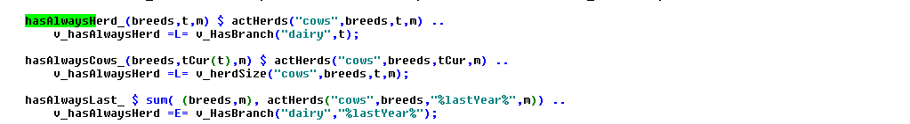

# MIP Solution Strategy

In opposition to purely linear problems, Mixed-Integer problem models
(MIPs) are harder to solve. To find the optimum, in theory the combinatorial set of all binaries respectively general integer variables would need to be evaluated. Depending on the simulation horizon of FarmDyn, the number of farm branches considered and the time resolution for investment and labour use decisions, a model instance can comprise between a few dozens to more than a thousand binary variables, with often several ten thousand variables and equations in total.

There are huge differences in the quality of LP and MIP solvers. Industry solvers such as CPLEX or GUROBI reflect continuous investments into algorithmic improvements over decades. Fortunately, both offer free academic licenses. The code is set-up to work with both solvers to be secured should license conditions change as well as switch in cases one of the solvers outperforms considerably the other. Current tests seem to
show a slight advantage for CPLEX. Both solvers can benefit from parallel processing. Model instances should therefore if possible be solved on a multi-core computing server. The option files for the solvers are currently defined such that one core is not used by the program and left free for other processing load.

The relaxed version of the model (where binaries and integers are
removed and treated as continuous variables) can typically be solved in
a few seconds, and once such a starting point is given, slight
modifications to the model take very little time to solve despite the
model size. However, regardless of tremendous algorithmic improvements
in solving MIPs, the MIP version could take quite long to solve without
some solution tactic.

The model code therefore integrates different strategies to speed up the
solution process for the MIP. Some of those are generally applicable to
MIP problems, typically offered by GAMS and/or the MIP solvers, others
follow tactics proposed to speed up the solution time of MIP problems,
but require a specific implementation reflecting the model structure. In
the following, these strategies are roughly described, starting first
with the model generic.

To define a lower bound on the objective which allows the solver to cut-off parts of the tree of solution paths, the model is first solved in a relaxed mode (RMIP) with the farm switched off such that income can only be generated by working off-farm (*v\_hasFarm* is fixed to zero). Solving this variant takes less than a second. The solution is used to define the lower cut-off for the MIP solver. Next, the model is solved as RMIP with only one state of nature (SON), and afterwards, the state contingent variables are copied to all other SONs, before the RMIP is solved again. The main statements are given in the *exp\_starter.gms* file.

The relaxed (RMIP) solution defines the upper cut-off. Forcing certain variables to only take on integer values can only reduce the objective function. At the same time, it proves a basis for solving the MIP. However, in many instances it has not proven useful to use the solution of RMIP as MIP start starting point, both CPLEX and GUROBI seem to spend considerable time to construct a feasible integer solution from the RMIP
solution.

As stated above, solving a MIP problem to its true optimum can be
tremendously time consuming. Therefore, MIP problems are typically only
solved given an optimality tolerance. The branch-and-cut algorithm used
in MIP solvers always provide a safe upper limit for the objective value
stemming from a relaxed version of the current tree node. Accordingly,
they can quantify the maximal absolute and relative gap to the
potentially maximal objective function. Generally, the smaller the
desired gap, the larger the number of combination of integer variables
the solver needs to test. Forcing the gap to zero requires a test of (almost) all combination, i.e. ten-thousands of solves of a LP version of the model with binaries and integers fixed.
In most production runs, a relative gap of 0.5 % has proven as acceptable. The solver will then stop further search for a better solution once a MIP solution has been
found which differs by less from the relaxed best node.

The problem with this gap is clearly that differences between two
simulations can not only stem from different model inputs (prices,
policy etc.), but also simply from the fact that the gap at the best
solutions returned by the solver for each run differs.

MIP solvers can also "tune" their options based on one or several given
model instance. Tuning is available both with CPLEX and GUROBI, and can
be switched on via the interface. This process takes quite long as the
model is repeatedly solved with different solver options. The parameters
from the tuning step are stored in an option and can be used by
subsequent runs.


## Fractional investments of machinery

An option to reduce the number of binaries is to treat certain
investment decisions as continuous. For machinery, the model allows to
replace the binary variable *v\_buyMach* by a fractional replacement
*v\_buyMachFlex*. The replacement depends on a threshold for the
depreciation costs per ha or hour which can be set in the GUI.
The larger the threshold, the lower is the number of integer variables
and the higher the (potential) difference to the solution where more
indivisibilities in machine investments are taken into account.

The relevant code section is defined in "gams\\solve\\define\_starting\_bounds.gms" and shown below:

[embedmd]:# (N:/em/work1/Pahmeyer/FarmDyn/FarmDynDoku/FarmDyn_Docu/gams/solve/define_starting_bounds.gms GAMS /v_buyMach\.fx\(machType,t_n\(t,nCur\)\)/ /;/)
```GAMS
v_buyMach.fx(machType,t_n(t,nCur))
    $ ( (    (p_machAttr(machType,"depCost_ha")     le %buyMachFlexThreshold%) $ p_machAttr(machType,"depCost_ha")
          or (p_machAttr(machType,"depCost_hour")   le %buyMachFlexThreshold%) $ p_machAttr(machType,"depCost_hour") )
                                      $ (not p_machAttr(machType,"years"))) = 0;
```

[embedmd]:# (N:/em/work1/Pahmeyer/FarmDyn/FarmDynDoku/FarmDyn_Docu/gams/solve/define_starting_bounds.gms GAMS /v_buyMachFlex\.fx/ /;/)
```GAMS
v_buyMachFlex.fx(machType,t_n(t,nCur))
    $  (    (p_machAttr(machType,"depCost_ha")    gt %buyMachFlexThreshold%)
         or (p_machAttr(machType,"depCost_hour")  gt %buyMachFlexThreshold%)
         or p_machAttr(machType,"years")) = 0;
```


## Heuristic reduction of binaries

On demand, the RMIP solution can be used in combination with some
heuristic rules to reduce the set of endogenous variables. As the RMIP
solution will e.g. build a fraction of larger stables and thus save
costs compared to the MIP solution, the herd size in the MIP solution
can be assumed to be upper bounded by the solution of the MIP.
Similarly, as investment costs for machinery will be underestimated by
the MIP, it can be assumed that machinery not bought in the RMIP
solution will not be found in the optimal solution of the MIP.

An example is shown below for investment decisions into stables. The
program first defines the maximal amount of stable places used in any
year. Investments into stables and their usage which are larger than the
maximal size or smaller than 2/3 of the maximal size are removed from
the MIP. Equally, investment in stables is set to zero if there was no
investment in the RMIP solution.

Similar statements are available for investments into manure silos,
buildings and machinery. These heuristics are defined in
"*gams\\solve\\reduce\_vars\_for\_mip.gms*". It is generally recommended to
use these statements as they can considerably reduce solving time.
However, especially after structural changes to the code, checks should
be done if the rules do not prevent the model from finding the
(optimal) MIP solution.


## Binary fixing heuristics

To speed up the solution, the heuristics discussed above are
coupled with repeated RMIP solves where integer variables from the last
fractional solution are moved to zero or unity depending on the solution
and heuristics rules. To give an example: If parts of machinery are
bought over time such that their sum exceeds a threshold, for instance
half a tractor, the *v\_machBuy* variable in the first year where the
machine is bought is fixed to zero. These pre-solves can lead to start
points for the MIP solves where most integer variables are no
longer fractional. Thereby, they can speed up the solution.


## Equations which support the MIP solution process

Another tactic to ease the solution of MIPs is to define equations
which decrease the solution space for the integer variables based on the
level of fractional variables respectively defining logical ordering for
the integer decisions. These equations are not necessarily truly
restricting the solution space, they only reinforce existing relations
between variables. The additional equations often reduce the overall
solution time by improving the branching more than by increasing single
LP iterations due to the increase in the constraints.

One way to improve the branching order is to link binaries with regard to dynamics. There are currently *three ordering equations over time*. The first two prescribe respectively that if a farm has a cow herd in t+1 this implies that a cow herd in the previous year existed:

[embedmd]:# (N:/em/work1/Pahmeyer/FarmDyn/FarmDynDoku/FarmDyn_Docu/gams/model/cattle_module.gms GAMS /hasHerdOrderDairy_.*?\.\./ /;/)
```GAMS
hasHerdOrderDairy_(tCur(t),nCur) $ (tCur(t-1) $ t_n(t,nCur)) ..

       v_HasBranch("dairy",t,nCur) =L= sum(t_n(t-1,nCur1) $ anc(nCur,nCur1), v_hasBranch("dairy",t-1,nCur1));
```

[embedmd]:# (N:/em/work1/Pahmeyer/FarmDyn/FarmDynDoku/FarmDyn_Docu/gams/model/templ.gms GAMS /hasFarmOrder_.*?\.\./ /;/)
```GAMS
hasFarmOrder_(tCur(t),nCur) $ (tCur(t-1) $ t_n(t,nCur)) ..

       v_hasFarm(t,nCur) =L= sum(t_n(t-1,nCur1) $ anc(nCur,nCur1), v_hasFarm(t-1,nCur1));
```

Another tactic is to define logical high level binaries which dominate others. These *general binaries* are partly already shown above: the *v\_hasFarm* and *v\_workOffB* variables. The later one is linked to the individual off-farm working possibilities:

To support the solving process, *v\_workOff* is defined as a
*SOS1* variable which implies that at most one of the *workType*
options is greater than zero in any year.

The *v\_hasFarm* variables dominates the *v\_hasBranch* variables:

[embedmd]:# (N:/em/work1/Pahmeyer/FarmDyn/FarmDynDoku/FarmDyn_Docu/gams/model/templ.gms GAMS /hasFarmOrder_.*?\.\./ /;/)
```GAMS
hasFarmOrder_(tCur(t),nCur) $ (tCur(t-1) $ t_n(t,nCur)) ..

       v_hasFarm(t,nCur) =L= sum(t_n(t-1,nCur1) $ anc(nCur,nCur1), v_hasFarm(t-1,nCur1));
```

This equation is additionally linked to the logic of the model as
*v\_hasFarm* implies working hours for general farm management.

Furthermore, a general binary exists which controls if a herd is present
in any year, *v\_hasAlwaysHerd*. If it is switched on, it will imply a
dairy herd in any year. This is based on the equation *hasAlwaysLast\_*
together with the order equation *hasHerdOrder\_* shown below.

{: style="width:100%"}

The equations which support the MIP solution process by linking
fractional variables to binary ones relate to investment decisions.
Firstly, investments in machinery are only possible if there is matching
machinery need:

[embedmd]:# (N:/em/work1/Pahmeyer/FarmDyn/FarmDynDoku/FarmDyn_Docu/gams/model/templ.gms GAMS /machBuyFlex_\(curMachines/ /;/)
```GAMS
machBuyFlex_(curMachines(machType),machLifeUnit,tFull(t),nCur)
        $ (   (v_machInv.up(machType,machLifeUnit,t,nCur) ne 0)
            $ v_buyMachFlex.up(machType,t,nCur)  $ p_lifeTimeM(machType,machLifeUnit)
            $ (not sameas(machLifeUnit,"years")) $ p_priceMach(machType,t) $ t_n(t,nCur))  ..

        v_buyMachFlex(machType,t,nCur) * p_lifeTimeM(machType,MachLifeUnit)
            =L= v_machNeed(machType,machLifeUnit,t,nCur) $ tCur(t)

              + [sum( (t_n(t1,nCur1)) $ ( tCur(t1) $ isNodeBefore(nCur,nCur1)),
                                 v_machNeed(machType,machLifeUnit,t1,nCur1))/card(tCur)
                 ]  $ ( (not tCur(t)) and p_prolongCalc);
```

Secondly, two equations link the dairy herd to investment decisions into stables and manure storage silos:

[embedmd]:# (N:/em/work1/Pahmeyer/FarmDyn/FarmDynDoku/FarmDyn_Docu/gams/model/general_herd_module.gms GAMS /stableBuy_.*?\.\./ /;/)
```GAMS
stableBuy_(stables,hor,t_n(tFull(t),nCur)) $ (v_buyStables.up(stables,hor,t,nCur) gt 0) ..

       v_buyStables(stables,hor,t,nCur) =L= sum(stableTypes_to_branches(stableTypes,branches)
                                              $ p_stableSize(stables,stableTypes), v_HasBranch(branches,t,nCur));
```

[embedmd]:# (N:/em/work1/Pahmeyer/FarmDyn/FarmDynDoku/FarmDyn_Docu/gams/model/general_herd_module.gms GAMS /stableInv_.*?nCur/ /;/)
```GAMS
stableInv_(stables,hor,tFull(t),nCur)
       $ (   (p_priceStables(stables,hor,t) gt eps)
               $ (      sum( (t_n(t1,nCur1),hor1) $ ((isNodeBefore(nCur,nCur1) or sameas(nCur,nCur1)) and (p_year(t1) le p_year(t))),
                         (v_buyStables.up(stables,hor1,t1,nCur1) ne 0))
                    or  sum( tOld, p_iniStables(stables,hor,tOld)))
                     $ (sum(stableTypes,p_stableSize(stables,StableTypes)) gt eps)
                     $ t_n(t,nCur) ) ..

       v_stableInv(stables,hor,t,nCur)

          =L=
*
*         --- old stables according to building date and lifetime
*             (will drop out of equation if too old)
*
          sum( tOld $ (   ((p_year(tOld) + p_lifeTimeS(stables,hor)) gt p_year(t))
                              $ ( p_year(told)                       le p_year(t))),
                           p_iniStables(stables,hor,tOld))

*
*         --- plus (old) investments - de-investments
*
       +  sum( t_n(t1,nCur1) $ ( isNodeBefore(nCur,nCur1)
                                   $  (   ((p_year(t1)  + p_lifeTimeS(stables,hor) ) gt p_year(t))
                                   $ (      p_year(t1)                               le p_year(t)))),
                                                    v_buyStablesF(stables,hor,t1,nCur1));
```

These supporting restrictions can be switched off from the model via the
GUI to check if they unnecessarily restrict the solution domain
of the solver. It is generally recommended to use them as they have
proven to speed up the solution process.


## Priorities

Finally, there are options to help the MIP solver to decide which
branches to explore first. The variable field .prior in GAMS allows
setting priorities which are passed to the MIP solver; lower priorities
are interpreted as having precedence. The file "gams\\solve\\def\_priors.gms"
defines such priorities.

The model is instructed to branch first on the decision to have a herd
in any year, next on having a farm and the individual branches:

[^Comment][embedmd]:# (N:/em/work1/Pahmeyer/FarmDyn/FarmDynDoku/FarmDyn_Docu/gams/solve/def_priors.gms GAMS / v_hasAlwaysHerd\.prior/ /;/)
```GAMS
 v_hasAlwaysHerd.prior                           = %priorOperator%  (p_priorMax*20);
```
[embedmd]:# (N:/em/work1/Pahmeyer/FarmDyn/FarmDynDoku/FarmDyn_Docu/gams/solve/def_priors.gms GAMS / v_hasFarm\.prior/ /;/)
```GAMS
 v_hasFarm.prior(t_n(tCur(t),nCur))                   = %priorOperator% ( %timeWeight% * 10000 );
```
[embedmd]:# (N:/em/work1/Pahmeyer/FarmDyn/FarmDynDoku/FarmDyn_Docu/gams/solve/def_priors.gms GAMS / v_hasBranch\.prior/ /;/)
```GAMS
 v_hasBranch.prior(branches,t_n(tCur(t),nCur))        = %priorOperator% ( %timeWeight% * 8000 );
```
[embedmd]:# (N:/em/work1/Pahmeyer/FarmDyn/FarmDynDoku/FarmDyn_Docu/gams/solve/def_priors.gms GAMS /v_hasBranch\.prior\(branches,t_n\(tCur\(t\),nCur\)\)/ /;/)
```GAMS
v_hasBranch.prior(branches,t_n(tCur(t),nCur))        = %priorOperator% ( %timeWeight% * 8000 );
```

Generally, early years are given precedence:

[embedmd]:# (N:/em/work1/Pahmeyer/FarmDyn/FarmDynDoku/FarmDyn_Docu/gams/solve/def_priors.gms GAMS /\$setglobal timeWeight/ /\*0\.5/)
```GAMS
$setglobal timeWeight [(card(t)-ord(t)+1)/card(t)]**0.5
```

The *p_priorMax* is the maximal priority assigned to stables which
is defined by a heuristic rule: large stables are tried before smaller
ones, cow stable before young cattle and calves stables, and finally
long-term investment in the whole building are done before maintenance
investments:

[^Comment][embedmd]:# (N:/em/work1/Pahmeyer/FarmDyn/FarmDynDoku/FarmDyn_Docu/gams/solve/def_priors.gms GAMS /parameter p_priorStables/ /1;/)
```GAMS
parameter p_priorStables(stables);

       p_priorStables(stables) $ sum(stableTypes $ p_stableSize(stables,stableTypes), stableTypes.pos)
          = sqr(1/sum(stableTypes $ p_stableSize(stables,stableTypes), stableTypes.pos)*10)

                                  * sqrt( sum(stableTypes $ p_stableSize(stables,stableTypes),
                                                      p_stableSize(stables,stableTypes))
                                       / smax((stables1,stableTypes) $ p_stableSize(stables,stableTypes),
                                                 p_stableSize(stables1,stableTypes)));

       p_priorMax              = smax(stables, p_priorStables(stables)) * card(hor);
       p_priorStables(stables) = p_priorStables(stables)/p_priorMax;
       p_priorMin              = smin(stables, p_priorStables(stables));
       p_priorMax              = 1;
```

Off-farm work decisions currently receive a lower priority compared to
investments into stables:

[embedmd]:# (N:/em/work1/Pahmeyer/FarmDyn/FarmDynDoku/FarmDyn_Docu/gams/solve/def_priors.gms GAMS /v_buyStables\.prior/ /;/)
```GAMS
v_buyStables.prior(stables,hor,t_n(tCur(t),nCur))
          $ sum( (stableTypes,t1,nCur1) $ ( p_buyStables(stableTypes,"size",hor,t1,nCur1) $ p_stableSize(stables,stableTypes) $ t_n(t1,nCur1)),1)
           = %priorOperator% ( hor.pos * %timeWeight%
                              * ( 10
                                     $$ifi defined youngStables - 7 $  youngStables(stables)
                                   ))
                                 * sum(stableTypes $ p_stableSize(stables,stableTypes), (1/stables.pos)
                                    * sum(stables1 $ p_stableSize(stables1,stableTypes), 1));
```

[^Comment][embedmd]:# (N:/em/work1/Pahmeyer/FarmDyn/FarmDynDoku/FarmDyn_Docu/gams/solve/def_priors.gms GAMS /v_stableInv\.prior/ /;/)
```GAMS
v_stableInv.prior(stables,hor,t,n)  $ t_n(t,n)  = %priorOperator%  [(p_priorStables(stables)*hor.pos + %timeWeight%)*0.95];
```

[embedmd]:# (N:/em/work1/Pahmeyer/FarmDyn/FarmDynDoku/FarmDyn_Docu/gams/solve/def_priors.gms GAMS /v_labOffB\.prior/ /;/)
```GAMS
v_labOffB.prior(t_n(tCur(t),nCur))                   = %priorOperator% ( %timeWeight% * 4000 );
```

[embedmd]:# (N:/em/work1/Pahmeyer/FarmDyn/FarmDynDoku/FarmDyn_Docu/gams/solve/def_priors.gms GAMS /v_laboff\.prior/ /;/)
```GAMS
v_laboff.prior(t_n(tCur(t),nCur),workType)    = %priorOperator% ( (card(workType)+1-workType.pos) * %timeWeight%
                                                                     * [100 + 900 $ v_laboff.l(t,nCur,workType)
                                                                            + 400 $ v_laboff.l(t,nCur,workType-1)
                                                                            + 400 $ v_laboff.l(t,nCur,workType+1)] );
```

For other investment decisions, the investment sum is used for priority
ordering, e.g:

[^Comment][embedmd]:# (N:/em/work1/Pahmeyer/FarmDyn/FarmDynDoku/FarmDyn_Docu/gams/solve/def_priors.gms GAMS /p_rank\(buildings/ /;/)
```GAMS
p_rank(buildings) = p_priceBuild(buildings,"%firstYear%") / ( p_building(buildings,"lifeTime") + 15 $ (not p_building(buildings,"lifeTime")));
```

The SOS1 variables should have all the same priorities. Therefore, no
distinction is introduced for the *v\_workOff* and *v\_siCovComb* variables, with the exemption of the time dimension.

Generally, it is recommend using these priorities as they have proven to
speed up the solution process.
