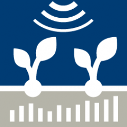

# Introduction

From it's development in the DFG project "The relation between indicators for the crediting of emission rights and abatement costs - a systematic modeling approach for dairy farms", FarmDyn has constantly progressed in various projects. Initially only simulating a dairy farm model parameterized for the German condition, it is now covering a variety of farm branches with parameterizations for the Netherlands, Norway, Germany and Switzerland. In the following you will find the current and past projects, where FarmDyn was further developed or was used.

# Current Projects

##BrightSpace (2022-2027)
{: style="width:200px", align="left"}
Lorem ipsum dolor sit amet, consetetur sadipscing elitr, sed diam nonumy eirmod tempor invidunt ut labore et dolore magna aliquyam erat, sed diam voluptua. At vero eos et accusam et justo duo dolores et ea rebum. Stet clita kasd gubergren, no sea takimata sanctus est Lorem ipsum dolor sit amet. Lorem ipsum dolor sit amet, consetetur sadipscing elitr, sed diam nonumy eirmod tempor invidunt ut labore et dolore magna aliquyam erat, sed diam voluptua. At vero eos et accusam et justo duo dolores et ea rebum. Stet clita kasd gubergren, no sea takimata sanctus est Lorem ipsum dolor sit amet.

##LAMASUS - Land management for sustainability (2022-2026)
{: style="width:200px", align="left"}
Lorem ipsum dolor sit amet, consetetur sadipscing elitr, sed diam nonumy eirmod tempor invidunt ut labore et dolore magna aliquyam erat, sed diam voluptua. At vero eos et accusam et justo duo dolores et ea rebum. Stet clita kasd gubergren, no sea takimata sanctus est Lorem ipsum dolor sit amet. Lorem ipsum dolor sit amet, consetetur sadipscing elitr, sed diam nonumy eirmod tempor invidunt ut labore et dolore magna aliquyam erat, sed diam voluptua. At vero eos et accusam et justo duo dolores et ea rebum. Stet clita kasd gubergren, no sea takimata sanctus est Lorem ipsum dolor sit amet.

##PhenoRob (2020-2024)
{: style="width:200px", align="left"}
Lorem ipsum dolor sit amet, consetetur sadipscing elitr, sed diam nonumy eirmod tempor invidunt ut labore et dolore magna aliquyam erat, sed diam voluptua. At vero eos et accusam et justo duo dolores et ea rebum. Stet clita kasd gubergren, no sea takimata sanctus est Lorem ipsum dolor sit amet. Lorem ipsum dolor sit amet, consetetur sadipscing elitr, sed diam nonumy eirmod tempor invidunt ut labore et dolore magna aliquyam erat, sed diam voluptua. At vero eos et accusam et justo duo dolores et ea rebum. Stet clita kasd gubergren, no sea takimata sanctus est Lorem ipsum dolor sit amet.

##MIND STEP (2019-2023)
{: style="width:200px", align="left"}
The European Union’s future Common Agricultural Policy (CAP) plays a pivotal role in developing a sustainable agricultural sector. The future CAP will be more flexible and adaptable to the needs of EU Member States and the individual decision making (IDM) units in the sector. To achieve this Member States develop strategic plans for the CAP that should define measurable objectives and means to achieve them. The EU-funded MIND STEP project will make use of agricultural and biophysical data and include individual decision making (IDM) unity in new and existing policy models for impact assessments. Using agricultural statistics and big datasets, the new IDM models will be estimated and calibrated, drawing on established economic and evolving machine learning techniques.

##Transform2Bio (2019-2022)
{: style="width:200px", align="left"}
The phase-out of coal mining initiates major transition processes in the the Rheinische Revier, a lignite mining region, thereby creating a unique opportunity for understanding the socio-technical dynamics and implementation options towards an entire sustainable bioeconomy region. Against this background, Transform2Bio aims to systematically identify transformation trajectories for the implementation of a bioeconomy in the Rheinische Revier that are desirable from a sustainability perspective, feasible from a techno-economic perspective, and acceptable from a stakeholder consensus perspective. In this context FarmDyn is used to identify farm-scale adaptations to bio-economy trajectories by (1) the extension and application of the FarmDyn simulation model to samples of farms and by (2) developing a linkage between FarmDyn and CGEBox (WP3.1c) which provides regional-scale economic simulation for the Rheinische Revier.

##CLIMPLEMENT (2020-2023)
{: style="width:200px", align="left"}
The project will develop analytic tools based on Norwegian conditions to measure greenhouse gas reducing potentials in various productions and consequences for food production and farm economy. The aim of the project is to advance and disseminate knowledge about how farmers can succeed in implementing emission-reducing operating models, including which system factors are important for such changes. The project results will be used to further develop advisory services and educational programs in terms of disseminating knowledge about more climate-friendly farming.

#Past Projects

##LIFT (2018-2022)
{: style="width:200px", align="left"}
FARMDYN was used in the H2020 project LIFT (Low-Input Farming and Territories - Integrating knowledge for improving ecosystem-based farming) by the team in Bonn and a team at INRA, Rennes, to compare different farming systems with regard to sustainability indicators. The overall objective of LIFT was to to identify and understand how socio-economic and policy drivers impact on the development of ecological approaches to farming and assess the performance and sustainability of such approaches, taking into account different farming systems at farm, farm-group and territorial scales.

##SustainBeef (2017-2020)
{: style="width:200px", align="left"}
The 3-year ERA-NET project SUSTAINBEEF, jointly funded by the EU and the BMEL, links researcher focusing on beef production system with stakeholders to develop and assess innovative ways to improve the sustainability of beef production system. FarmDyn is used for a detailed, quantiative bio-eonomic analysis of beef production systems in Germany based on the application. Further, the core group provided support to partners in applying the model to study regions in their own country.

##USL Project (2016-2019)

###Modeling structural change and agricultural nutrient flows across scales in regions of North Rhine-Westphalia", 2016-2019
{: style="width:200px", align="left"}
The project analyzed nutrient exchanges between farms in regions of North Rhine-Westphalia based on the combination of FARMDYN with bio-physical and agent based modeling.

##DFG Project (2015-2018)
###Understanding spatial interactions and structural change in the dairy production chain with a dynamic regional Agent-Based Model covering dairy farms and dairy processing
{: style="width:200px", align="left"}
Dual profit functions for different farming systems were estimated from FARMDYN simulations to source an Agent Based Model

##DFG Project (2010-2014)
###The relation between indicators for the crediting of emission rights and abatement costs - a systematic modeling approach for dairy farms
{: style="width:200px", align="left"}
The original model version was developed in the project "The relation between indicators for the crediting of emission rights and abatement costs - a systematic modeling approach for dairy farms", financed by the German Science Foundation and carried out by Karin Holm-Müller, Wolfgang Britz, Bernd Lengers and David Schäfer. In the context of the pdh-thesis of Johanna Budde, a first version of the pig module was developed (2012-2013).
