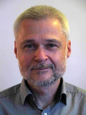
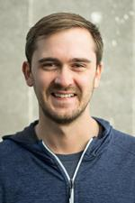
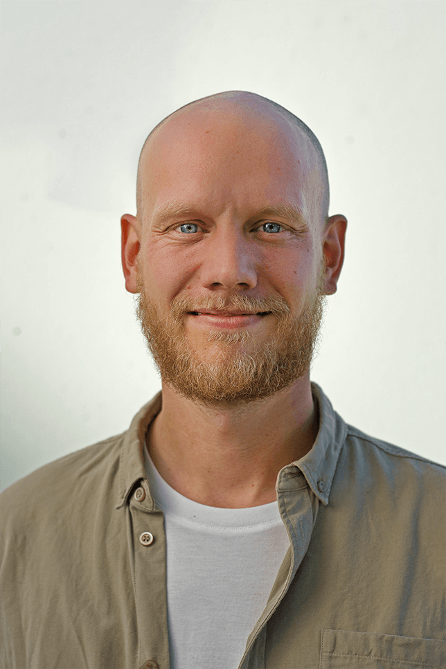

# History

FarmDyn was initially developed by the Economic Modeling of Agricultural Systems Group of the Institute of Food and Resource Economics at the University of Bonn. The model is under constant development and used for various research projects including external universities and research institutions. In the following the core group of FarmDyn developers is presented below.

## Core group

### PD Dr. agr. Wolfgang Britz
{: style="width:200px", align="left"}
Wolfgang Britz is the head of the working group "Economic Modeling of Agricultural Systems" and contributes to all research on and around FarmDyn. He developed the model and still contributes significantly to the technical and content development of the model. Latest work in FarmDyn includes the development of the calibration module and extension of the risk module with an estimated utility function.

&nbsp;

&nbsp;

&nbsp;  

&nbsp;  

### Dr. agr. Till Kuhn
{: style="width:200px", align="left"}
Till Kuhn is a post-doc researcher in the working group "Data Science in Agricultural Economics" at the University of Bonn specialised in environmental policies such as the Agri-Environmental Schemes and Fertilization Ordinance. Latest work includes the implementation of novel technology (e.g. greenRelease) and agri-envrionmental policies.
&nbsp;

&nbsp;

&nbsp;

&nbsp;  

&nbsp;  

&nbsp;  

### Dr. agr. David Schäfer
{: style="width:200px", align="left"}
David Schäfer is a post-doc researcher in the working group "Economics Modeling of Agricultural Systems" at the University of Bonn. Initially, he developed the pig and biogas modules and is focusing now on the development of FarmDyn as a generic and modular model to improve usability for external researchers.  
&nbsp;

&nbsp;

&nbsp;

&nbsp;  

&nbsp;  

&nbsp;  

### Dr. agr. Christoph Pahmeyer
{: style="width:200px", align="left"}
Christoph Pahmeyer is a post-doc researcher working in the group "Data Science in Agricultural Economics" at the University of Bonn and at the Thünen-Institute in Braunschweig contributing to the modelling of production economics and agricultural policies.
&nbsp;

&nbsp;

&nbsp;

&nbsp;  

&nbsp;  

&nbsp;

### M. Sc. Julia Heinrichs
{: style="width:200px", align="left"}
Julia Heinrichs is a PhD Student in the working group "Economics Modeling of Agricultural Systems" at the University of Bonn. Her research aims to map systematic changes in production systems in FarmDyn and to capture their impact on the environment.
&nbsp;

&nbsp;

&nbsp;

&nbsp;  

&nbsp;  

&nbsp;

### M. Sc. Lennart Kokemohr
{: style="width:200px", align="left"}
Lennart Kokemohr is a PhD Student working at the Norwegian institute RURALIS (Institutt for rural og- regionalforskning). His research focuses on the development of environmental accounting schemes in the model in connection to various cattle farming types.

&nbsp;

&nbsp;

&nbsp;

&nbsp;  

&nbsp;  

&nbsp;

&nbsp;
