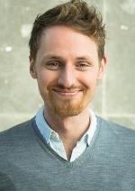
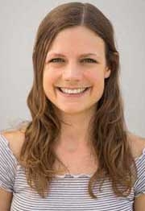
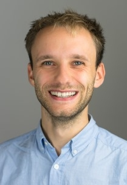

# Team

FarmDyn was developed by the Economic Modeling of Agricultural Systems Group of the Institute of Food and Resource Economics at the University of Bonn. This working group is continuously researching and developing the model. In addition, scientists from other institutions are working on and with FarmDyn in the context of various research projects. All scientists working on FarmDyn are briefly introduced below.

## Economic Modeling of Agricultural Systems Group

### PD Dr. agr. Wolfgang Britz
{: style="width:200px", align="left"}
Wolfgang Britz is the head of the working group and contributes to all research on and around FarmDyn. He contributes significantly to the technical development of the model. In 2020, for example, he incorporated the bi-level calibration into the model.
&nbsp;

&nbsp;

&nbsp;

&nbsp;  

&nbsp;  

### Dr. agr. Till Kuhn
{: style="width:200px", align="left"}
Till Kuhn is a post-doc researcher in the working group specialised in environmental policies such as the Agri-Environmental Schemes and plant nutrition.
&nbsp;

&nbsp;

&nbsp;

&nbsp;  

&nbsp;  

&nbsp;  

### Dr. agr. David Schäfer
{: style="width:200px", align="left"}
David Schäfer is a post-doc researcher in the working group. His research currently focuses on the design of FarmDyn as a generic and modular model.
&nbsp;

&nbsp;

&nbsp;

&nbsp;  

&nbsp;  

&nbsp;  

### M. Sc. Christoph Pahmeyer
{: style="width:200px", align="left"}
Christoph Pahmeyer is a PhD Student in the working group contributing to the modelling of production economics and agricultural policies.
&nbsp;

&nbsp;

&nbsp;

&nbsp;  

&nbsp;  

&nbsp;

### M. Sc. Julia Heinrichs
{: style="width:200px", align="left"}
Julia Heinrichs is a PhD Student in the working group. Her research aims to map systematic changes in production systems in FarmDyn and to capture their impact on the environment.
&nbsp;

&nbsp;

&nbsp;

&nbsp;  

&nbsp;  

&nbsp;

### M. Sc. Lennart Kokemohr
{: style="width:200px", align="left"}
Lennart Kokemohr is a PhD Student in the working group focusing on the modelling of beef farms.
&nbsp;

&nbsp;

&nbsp;

&nbsp;  

&nbsp;  

&nbsp;

&nbsp;

## Wageningen University & Research

The two research institutions Wageningen Economic Research and Wageningen Environmental Research are involved in the work with FarmDyn via the MIND STEP Project.

### Dr. John Helming
John Helming is a senior researcher at the Wageningen Economic Research institution and an expert in applied economic modelling and environmental and agricultural policy analysis. He contributes to FarmDyn by ...  

### Dr. Marc Müller
Marc Müller is a Microeconomicst and Model Developer at the Wageningen Economic Research institution. He develops farm-scale models to analyse the EU’s common agricultural policies under changing framework conditions. He contributes to FarmDyn by ...
