# The Graphical User Interface (GUI)

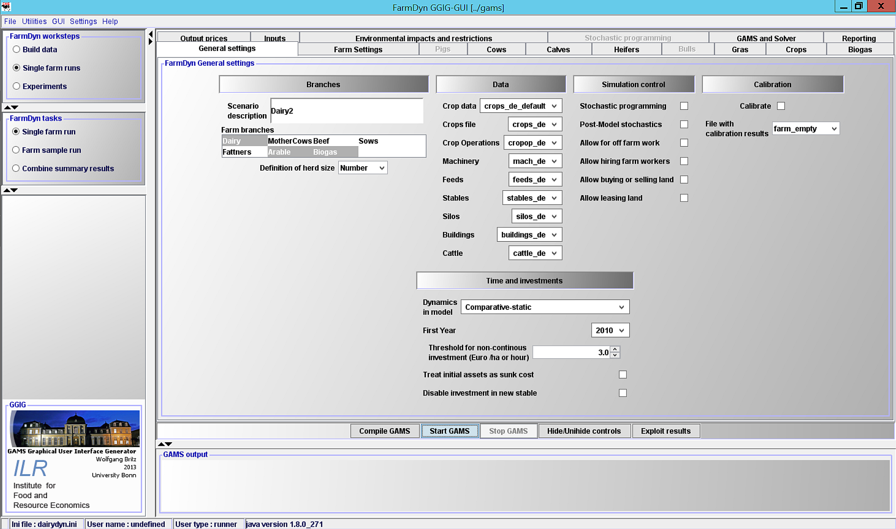{: style="width:100%"}

The Graphical User Interface (GUI) is based on GGIG (GAMS Graphical Interface Generator, Britz 2014). It serves three main purposes:

**1. To prepare the data base for the model runs**

**2. To steer model runs**

**3. To exploit results from one or several model runs**

The creation of a visual user interface is also described as "visual debugging" (Grimm, 2002) to allow for an easy adjustment of parameters and quantitative and graphical examinations. With the help of only a few adjustments one can define single or multiple model farm runs for the interesting farm types with their specifications. Thereby, the former described coefficient generator helps to condense the necessary information for farm run definition by adjusting and calculating all production specific parameters to be consistent with the defined farm type (initial arable land, grass land, initial stables, initial manure storages, initial machine endowment\...). After simulating the experiments, the GUI enables the user to systematically analyse the simulated model variables and results.

A separate user handbook for the general use of the GUI is available at:

Britz, W. (2010), GGIG Graphical Interface Generator User Guide,
Institute for Food and Resource Economics, University Bonn, 147 pages,
<http://www.ilr.uni-bonn.de/em/rsrch/ggig/GGIG_user_Guide.pdf>

In the following, the different tabs of the GUI are shown and shortly described.

## Work Step and Task Selection (Left Hand Side)

### Built Data
In the **Build data** work step, the user can select raw data for the model run. Under the task **Build data from user input**, standard crops are available or the user can read in own data. **Build data from KTBL** provides a link to the German agricultural database of the "Kuratorium für Technik und Bauwesen in der Landwirtschaft" (KTBL). This task can be used to select KTBL data for various crops for the model run. To finish the "Build data" work step, the model must be started by clicking on **Start Gams**. A GAMS RC 0 indicates that the selection of raw data has worked.

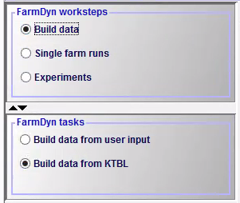{: style="width:100%; height:450px"}

### Single Farm Runs
In the **Single farm runs** work step, all run specific settings are to be set manually in the GUI. As these settings are very extensive, they will be explained in detail in the next sub-chapter. Again, a single farm run can be started by clicking on **Start Gams** and a GAMS RC 0 indicates a complete and successful model run.

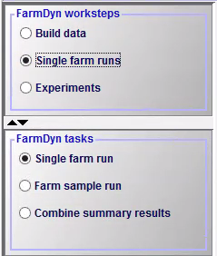{: style="width:100%; height:500px"}

The workstop **Single farm runs** provides also the option to run a farm sample,
i.e. that not only one specific and predefined farm is simulated but multiple
predefined farms can be run.

### Experiments
In the **Experiment** work step, the user can define ranges for selected settings which are varied based on stratified random sampling using Design of Experiments for a defined number of experiment. For each experiment, a single farm run is solved. These single farm runs are typically solved in parallel. After they are finalized, their results are combined into one result set. The experiment tasks distinguish different farm branches. Additionally, an experiment to estimate the profit function can be selected. The Run Specific Settings are broadly similar to those of the Single Farm Run. In addition, there is the "DOE" and, depending on the selected task, the "Factor Ranges" and "Input prices in experiments" tab. These three are also explained in the next sub-chapter. An experiment model run is started with the same procedure as the other work steps.

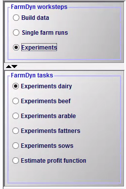{: style="width:100%"}

## Run Specific settings

In the following, the run specific settings of all tabs of the GUI are explained. In addition, a subchapter deals with how this information can be stored.

### General Settings

{: style="width:100%"}

The general settings are subdivided into five components:

1. Branches: The model run is named by the scenario description. FarmDyn uses this name to store the results of a model run. Therefore, it is important to change the name for a new model run to ensure that previous results are not overwritten. Additionally, the user can define active farm branches and the herd size definition for the current model run.

2. Data: The user can determine regional data for the calculations in the model.

3. Simulation Control: Additional settings regarding the model stochastics, the use of labour (off-farm work, hiring workers) and  the use of land (selling and leasing land) can be made.

4. Calibration: FarmDyn can be calibrated on case study data if desired. By default, the check mark for calibrate is **not** set. FarmDyn in this case can either read in results from previous calibrations to use them for different simulations or resort to “farm_empty” (the standard parameter). To perform a calibration on case study data, a checkmark must be set for calibrate. Additionally, a file with calibration targets must be stored under *gams/calibFiles* and be selected in the GUI as the "file with calibration bounds". The calibration bounds must be manually defined. 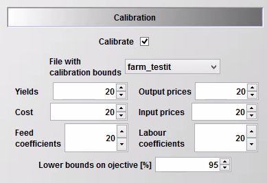{: style="width:100%"}

5. Time and Investments: The user can define the model dynamics, the simulation period, the construction year of stables and the age of machinery. The model allows choosing between the following four mode to describe dynamics (or not): 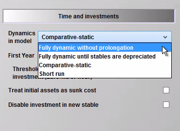{: style="width:100%"}

### Farm Settings

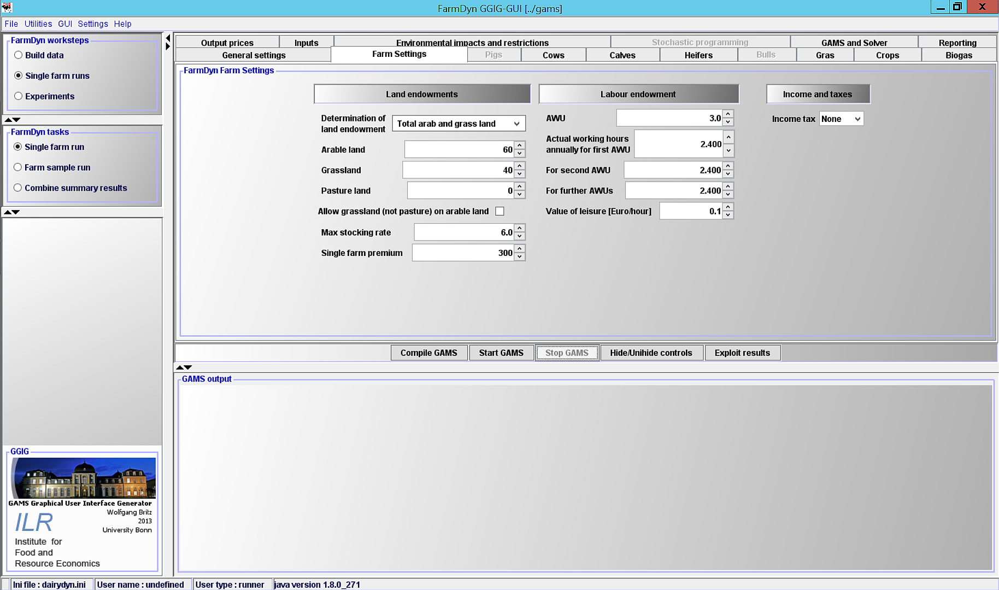{: style="width:100%"}

The farm settings are subdivided into three components:

1. Land Endowments: The land endowment of the farm is specified. The user can decide in which way this information should be provided, e. g. as *Total arab and grass land* or *Land endowment per animal*. The requested information must then simply be filled in.

2. Labour Endowments: This is where labour force available in the simulation is defined.

3. Income and Taxes: The user can determine the tax system.

### Animals (Pigs, Cows, Calves, Heifers and Bulls)

Depending on the chosen farm branches different tabs to further specify the simulated farm are activated. For pigs and sows only one tab exists, *Pigs*. In this tab, the user can specify the initial herd sizes. For cattle there are several tabs (*Cows*, *Calves*, *Heifers* and *Bulls*). These also allow the definition of the initial herd size. In addition, they allow further settings, which are explained below. Generally, the initial herd sizes are used to determine the stable endowment and manure storage capacities on the farm.

In the tab *Cows*, the cows breed, the milk yield, the herd size, premiums, manure management in the stable, breeding attributes, grazing periods and calving and cow attributes are to be specified by the user. The grazing period is distinguished into grazing (animals outside day and night) and partial grazing (animals in stable over night).

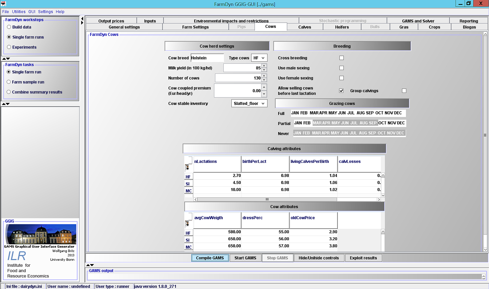{: style="width:100%"}

The other cattle related tabs allow for the specification of the length of different growth periods and the respective start and end-weight, prices and the dress percentage of the potentially slaughtered animals. Similar to the cows, the grazing period and manure management system have to be specified. The tab *Heifers* is shown below as an example:

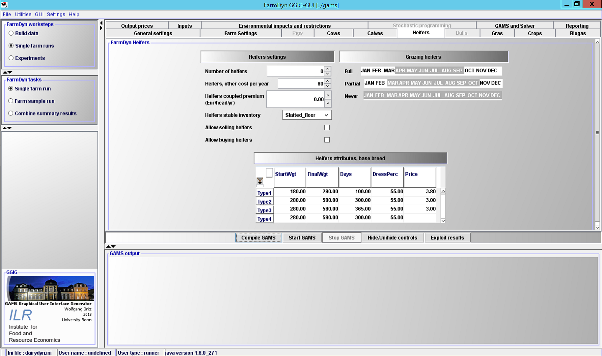{: style="width:100%"}

### Gras

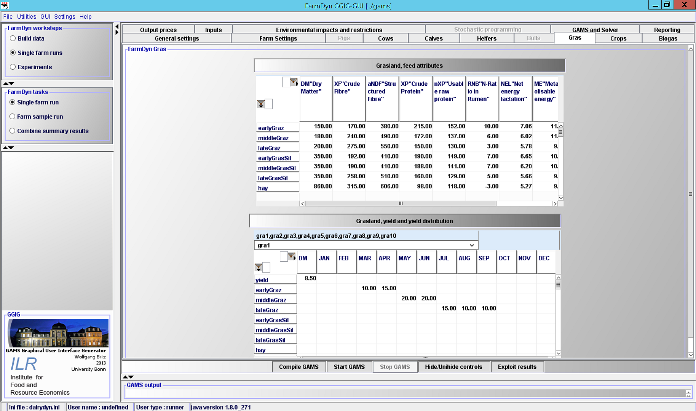{: style="width:100%"}

The gras tab is subdivided into two components:

1. Grassland, feed attributes: The user can change the different ingredients of the harvested products. The products are silage gras, grazed gras and hay. The products are further divided by the time of harvest: early, middle and late.

2. Grassland, yield and yield distribution: This table specifies the month of harvest of the respective products, the total yield in dry matter (DM) and the distribution of the yield over the harvest month. Up to 10 different grassland usage options are derivable with differing management, yields and harvested products.

### Crops

{: style="width:100%"}

The crops tab is subdivided into five components:

1. Crops: A selection of crops predefined in the Build data work step can be seen. From these, the crops relevant to the present model run must be selected.

2. Yield: This field shows default yields which the user can change manually.

3. Management system, rotation: The user can make further settings concerning the crop intensity, the cultivation system, the technology, the tillage system, the use of crop rotations and the handling of catch crops.  

4. Fertilization: Additional information on fertilizer planning can be provided.

5. Plots and soil: The number of plots, the mechanization level and the climatic zone can be predefined.

### Biogas

!!! danger "Information:"
    The biogas module has not been tested under the current FarmDyn version, therefore run time errors are very likely to occur when it is used.

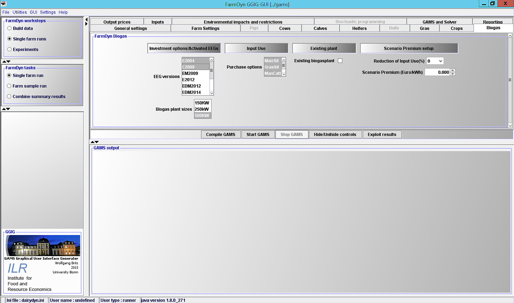{: style="width:100%"}

The biogas tab is subdivided into four components:

1. Investment options/ activated EEGs: The user can specify the underlying Renewable Energy Act (EEG) version and the biogas plant size.

2. Input use: The inputs provided for biogas use can be determined.

3. Existing plant: This tab allows the set up of an existing biogas plant with the options to choose the size, the valid EEG and the construction year. However, to use this function the plant size and EEG has to be activated in the "Investment options" panel.

4. Scenario premium setup: Additional settings regarding the scenario premiums can be defined here.

### Output and Input Prices

In these two tabs, standard input and output prices are shown, which the user can adjust if necessary. It is also determined whether roughages may be bought and sold and the conditions for contract work are specified:

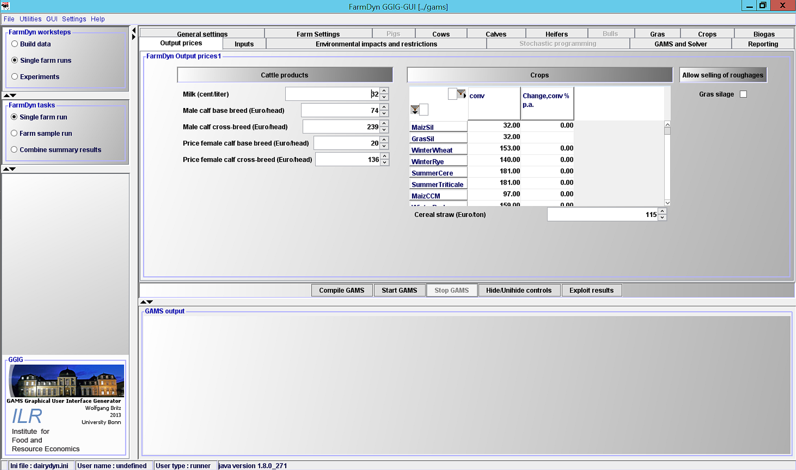{: style="width:100%"}

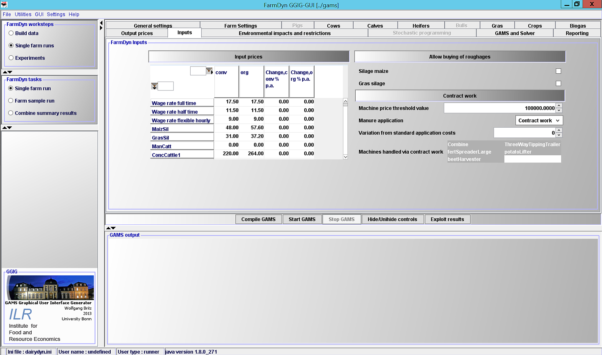{: style="width:100%"}

### Environmental Impacts and Restrictions

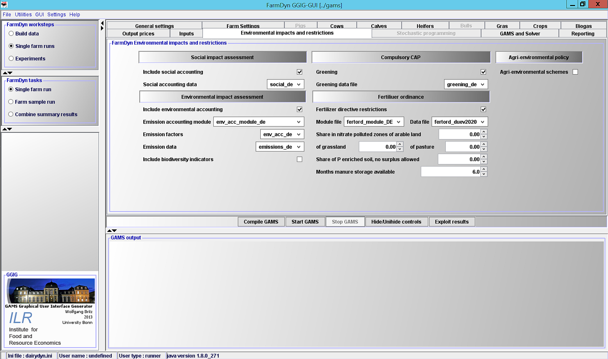{: style="width:100%"}

The environmental impact and restrictions tab is subdivided into five components:

1. Social impact assessment: A social impact assessment can be included in the model run if desired. For this purpose, a data basis must be determined.

2. Compulsory CAP: The compulsory policy measure "Greening" of the Common Agricultural Policy (CAP) of the European Union is activated by default. Corresponding data is read into the model.

3. Agri-environmental policy: In addition to the Greening policy, FarmDyn allows the modelling of further agri-environmental policies. By setting the corresponding check marks, new fields open up to read in data for these policies and to make further settings.

4. Environmental impact assessment: In this tab, environmental accounting can be included in the model calculations. To do this, again the corresponding data must be read in. If desired, FarmDyn can also calculate various post-model biodiversity indicators to assess the impact of the modelled farm programme on regional biodiversity. This option must be activated by setting a check mark.
<!-- Auswahlmöglichkeit der Indikatoren fehlt im GUI -->

5. Fertilizer ordinance: In this tab, the modelled farm can be restricted to different German fertilizer ordinances (2007, 2017 and 2020). The user is able to set limits and thresholds himself.

### GAMS and Solver

This tab defines the chosen solver to optimise the fully dynamic MIP problem and further precision adjustments. Furthermore options for the resulting listing files and debug options are offered depending on the user type. In general it is recommended to use CPLEX as the MIP solver.

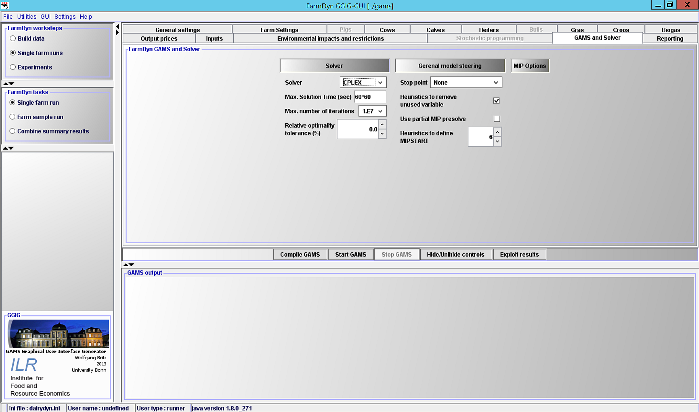{: style="width:100%"}

### DOE and Factor Ranges

In the *design of experiments* one can select the number of farms that are supposed
to be simulated. Further, other options are available to setup the experiment from
a more technical viewpoint such as the number of parallel farm simulations, loading
of previous results etc.

Based on the selected farm branch on the left hand side under *FarmDyn tasks*,
factor options are presented in a list. They differentiate between general factors
(e.g. investment prices *invPrice* or wage rates *wageRateFull*), branch specific
factors (e.g. number of cows *nCows* or grassland *nGrasLand*), and crop specifics
price factors (e.g. winterWheat prices *WinterWheatPrice*, etc\.)

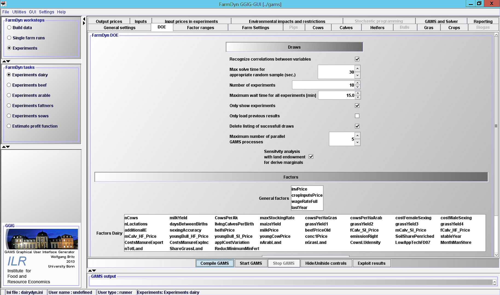{: style="width:100%"}
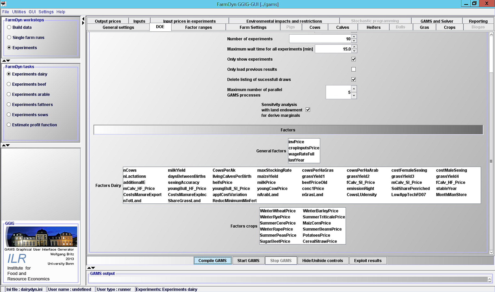{: style="width:100%"}

After the selection of factors for the experiments, one has to define their ranges
which are to vary between each simulation. From the predefined factor range a value
is chosen based on a stratified random sampling (Latin-Hyper cube) approach.

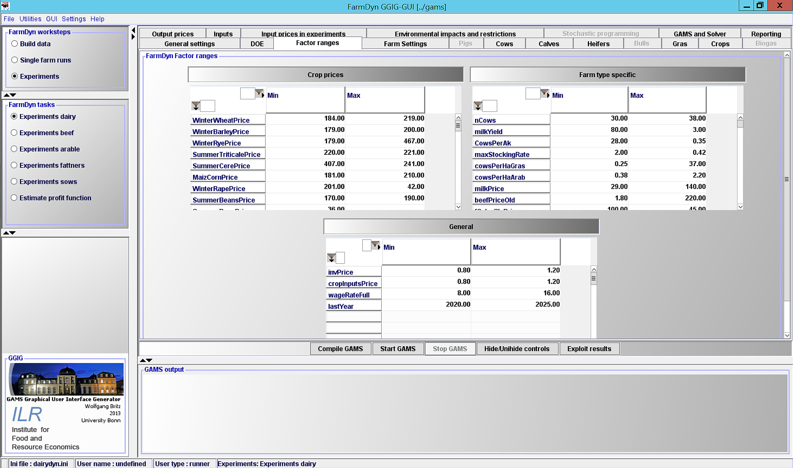{: style="width:100%"}

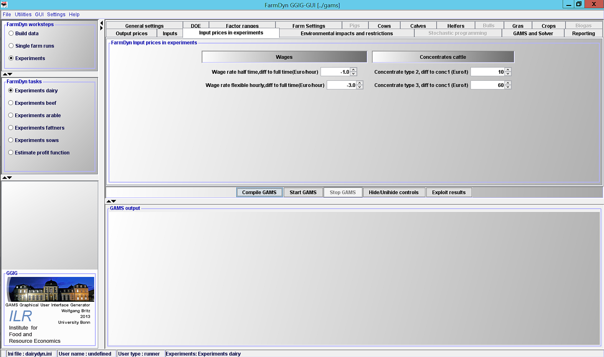{: style="width:100%"}

### Saving Run Specific Settings

By default, FarmDyn saves the run specific settings in an .ini file - "dairydyn.ini". This can be seen in the main menu of the GUI at the bottom left:

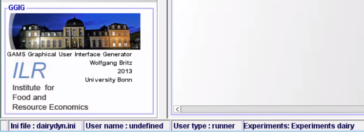{: style="width:100%"}

Via **Settings** in the toolbar at the top left, the user has the possibility to save the current settings in another .ini file, so that they will not be overwritten by FarmDyn the next time the GUI is used. To do this, the user must click on the field **save current settings to ini file**:

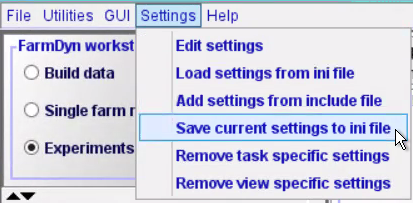{: style="width:100%"}

The run specific settings from an .ini file can also be read back into the GUI under **Settings** and then **Load settings from ini file**:

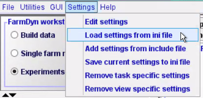{: style="width:100%"}

In addition, FarmDyn stores the run specific settings after a successful model run in a GAMS include file. By default, this is located under *gams/incgen* and is called "runInc.gms". To be on the safe side, it is recommended to copy and rename the "runInc.gms" file in addition to saving the run specific settings in an .ini file so that it is not overwritten in a new model run. If an .ini file is damaged or lost, it is possible to load the run specific settings from the runInc file in the GUI. To do this, the user must click on **Add settings from include file** under **Settings**:

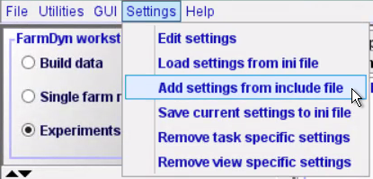{: style="width:100%"}

## Visualising and Analysing Results in the GUI

After a successful simulation (GAMS RC 0, status "normal completion") the results are saved in a GDX file under *results/expFarms*.

The results can be viewed with any GDX Viewer. However, the GUI of FarmDyn also offers a result analysis tool with which the user can plot the results in tables or graphs. There are numerous possibilities to adapt the tables and graphs to one's own analysis goals. In addition, the data in the GUI's result analysis tool can also be copied or exported.

To be redirected to the result analysis section, one has to press **Exploit results** to the right of **Start Gams**. Now, the scenarios for which results should be analysed can be selected. Keep in mind that results are stored with the scenario description given under *General Settings - Branches*:

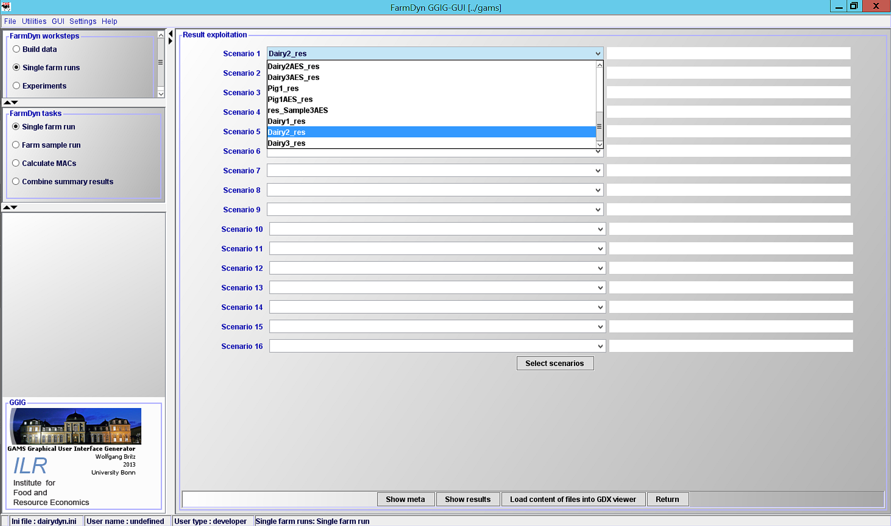{: style="width:100%"}

Another click on **Show results** then opens the actual results analysis section.

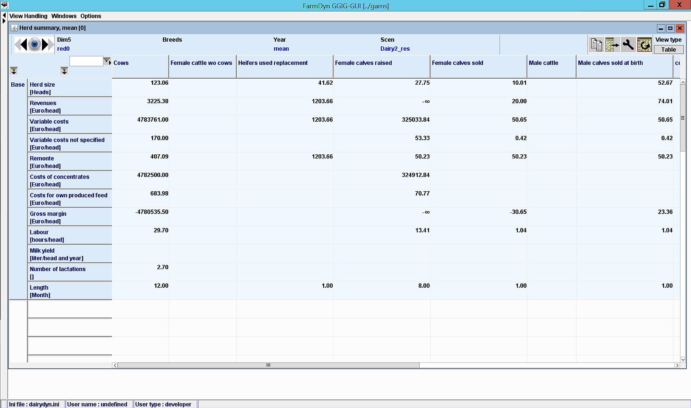{: style="width:100%"}

The result analysis is based on a set of pre-defined reports, grouped by themes. Currently, the following themes (and reports) are available:

-   Farm program - Animal, mean (incl. herd summary, feeding by herds and stable utilization)
-   Farm program - Animal, time series (incl. herd summary, feeding by herds and stable utilization)
-   Farm program - Crops, mean (incl. crop summary and tillage type)
-   Farm program - Crops, time series (incl. crop summary and tillage type)
-   Assets, mean (incl. buildings and machines)
-   Assets, time series (incl. buildings and machines)
-   Work, mean (incl. work and off-farm work)
-   Work, time series (incl. work and off-farm work)
-   Economics, mean (incl. revenues, costs, cash balance, production and related revenues)
-   Economic, time series (incl. revenues, costs, cash balance, production and related revenues)
-   Nitrogen (incl. mean and time series information per ha and as N balance)
-   Phosphate (incl. mean and time series information per ha and as P2O5 balance)
-   Environmental policy (incl. core variables, emissions, N balance and P balance)
-   Biodiversity (incl. SMART, SALCA, SALCA crop perspective and Paracchini)
-   Algorithm (incl. model attributes)

A blue-grey eye can be seen at the top left. This allows you to switch back and forth between the different results tables.

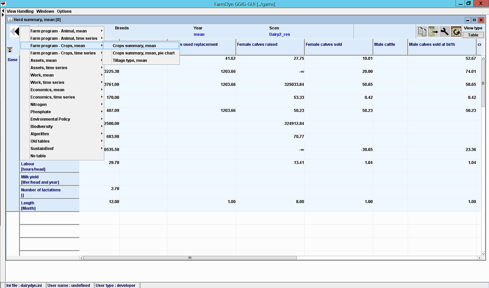{: style="width:100%"}

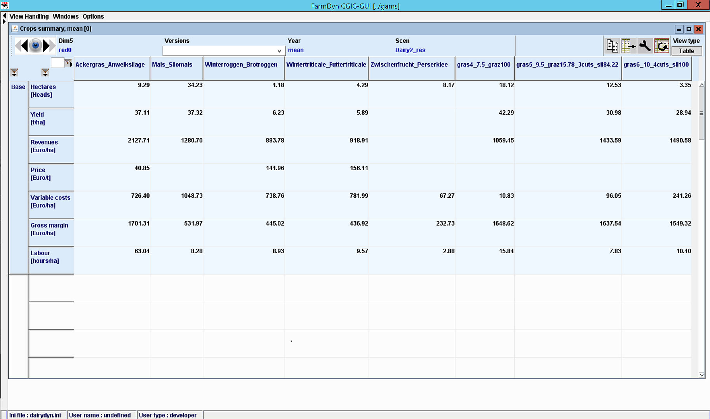{: style="width:100%"}

The results analysis section has other useful functions that support the results analysis. A toolbar can be seen at the top right:

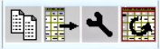{: style="width:100%"}

The tools from left to right allow to copy the data, export the data, customize the table view and to pivot the table.

## Working with Projects
When applying FarmDyn to a set of different case studies, keeping track of the individual case study settings in the `.ini` files may become tedious.

In order to ease the handling, you can define so called projects. These projects can be managed from the user interface. The concept of projects is similar for any model using [GGIG](http://www.ilr.uni-bonn.de/em/staff/britz/ggig_e.htm) (FarmDyn, Capri etc.), so one can also refer to the official [user guide](http://www.ilr.uni-bonn.de/em/rsrch/ggig/GGIG_user_Guide.pdf).

### Setting up a New Project

To create a new project, the user needs to be logged in with the user type **Administrator**. The current user type can be seen in the status bar at the bottom left of the GUI window:

{: style="width:100%"}

The user type can be changed by clicking on **Settings** in the menu bar at the top left and then on **Edit Settings**. A new project can then be created in the user type **administrator** by clicking on **File** in the toolbar and then **New Project**. The following dialog box then opens:

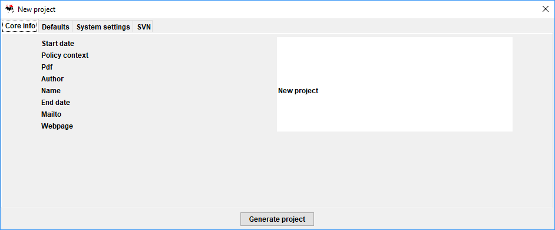{: style="width:100%"}

The dialog comprises four tabs. The first tab “Core info” shown above comprises information on the project itself. The entries “Pdf”, “Mailto” and “Webpage” generate new items in the top menu bar and provide information on the application context to the user.

The second tab “Defaults” comprises a list of GUI controls of the tool with their title and its default setting:

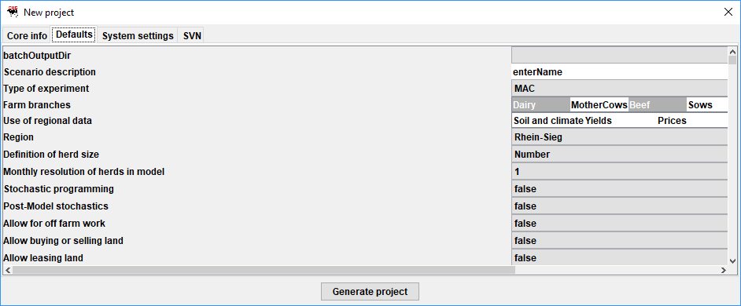{: style="width:100%"}

The left hand side shows the title of the control, the right hand side comprises a text field with the default settings as stored in the XML-definition file for the GUI. This default can be overwritten with a project specific one. Only these differences are stored.

Similarly, the two remaining tables show under “System settings” the location of system directories, and under "SVN" optional project specific SVN settings.

Once you press the **Generate project** button, a new file called `project_YourProjectName_default.ini`, where "YourProjectName" will be replaced by the name you entered for the project, will be created in FarmDyn's *GUI* directory.

### Switching Projects
To switch between projects klick on **File** -> **Set Project** -> **Project Name** in the menu bar at the top left:

{: style="width:100%"}

The currently selected project will be displayed in the status bar at the bottom left corner:

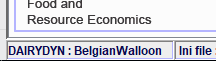{: style="width:100%"}

### Editing Projects

This option is also only possible in the user type **administrator** (see [here](#Setting-up-a-New-Project)).

An existing project can then be edited by choosing **File** -> **Edit Project** -> **Project Name**. The project dialog as described under [*Setting up a new Project*](#Setting-up-a-New-Project) will then be opened. The necessary changes can be done there.

The changes have to be saved by clicking on the **Update project** button. Notice that the dialog window will not close automatically after the changes were saved.

### Important Information on the Project Workflow

Please notice that the projects default settings from the GUI tabs **cannot** be changed. The idea is as follows: In the project settings, the default values displayed in the GUI tabs are stored. However, changing these settings in the GUI will not affect the project defaults. This way sensitivity analysis or tests with certain settings can be done without losing the default project values and without breaking any important project specifics. If the tests turn out to be working fine, you may update the project defaults as described [*above*](#Editing-Projects).

## References

Britz, W. (2010): GGIG Graphical Interface Generator User Guide, Institute for Food and Resource Economics, University Bonn, 147 pages, <http://www.ilr.uni-bonn.de/em/rsrch/ggig/GGIG_user_Guide.pdf>.

Britz, W. (2014): A New Graphical User Interface Generator for Economic Models and its Comparison to Existing Approaches, German Journal of Agricultural Economics, 63(4): 271-285.

(Grimm, 2002)
<!-- Reference missing -->
