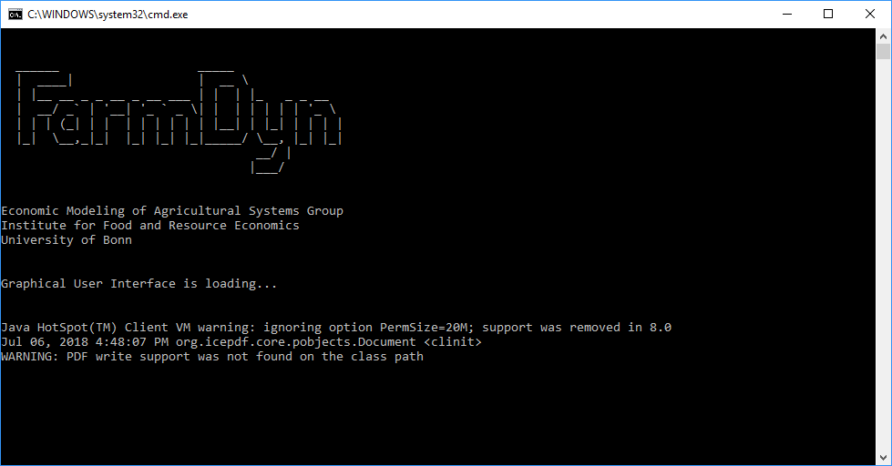

# FarmDyn Installation

To obtain the latest model version from the version control server **login credentials** (username, password) are required. If you are not a registered user yet please feel free to [contact us](http://www.ilr.uni-bonn.de/em/em_e.htm).

## Prerequisites

### Java
To run the FarmDyn model, a working Java installation with a Version > 8 is required and needs to be in the path variable. It can be acquired free of charge from the official Java [website](https://java.com/de/download/).

### SVN

FarmDyn is using the centralized version control system *Subversion* (short [*SVN*](https://subversion.apache.org/)). In order to obtain, be able to update, or eventually commit changes to the model, a so called SVN client needs to be installed on the computer. The client of choice depends on the operating system in use:

#### Windows
[TortoiseSVN](https://tortoisesvn.net/downloads.html) is used at our Institute. The following examples are thus conducted using TortoiseSVN. However, other SVN clients (or CLIs) may work as well.

#### MacOS
[SnailSVN](https://langui.net/snailsvn/) is a TortoiseSVN look-alike for MacOS. Most features therefore look and act like their Windows counter-part. The free version offers only one repo to be checked out, which should be sufficient in most use cases.

#### Linux
[RabbitVCS](http://rabbitvcs.org/) is a graphical SVN-client for Linux. It hasn't been officially tested with FarmDyn yet.

### GAMS (optional)
FarmDyn may be operated without an installation of GAMS. However, without a valid GAMS installation, including a valid license file, the model cannot be run (-> only existing results may be inspected). FarmDyn requires a GAMS Version > 25.0 to fully operate.
GAMS can be acquired from the official [website](https://www.gams.com/). Note that degree granting institution may qualify for a [free GAMS license](https://support.gams.com/solver:academic_programs_by_solver_partners).

## Installation Process

To start the installation, navigate to a directory where you would like to store the FarmDyn main folder, e.g. your `Documents` folder.

In this directory, create a new folder, e.g. `FarmDyn`.

Perform a right click on the folder and select `SVN checkout`

{: style="width:100%"}

Enter the SVN URL you received from our institute in the *Checkout* dialog box which appeared and click the **OK** button.

{: style="width:100%"}

If you did not enter your credentials before, you will be asked to input these before the checkout will proceed.

Once the checkout process is finished, close the dialog box by clicking **OK** again.

To finish the installation, we must now open the Graphical User Interface (GUI) of the model.

## Starting FarmDyn

To do so, navigate into the `GUI` folder in the directory where you saved FarmDyn.

If you followed the above example with TortoiseSVN, the path will look similar to:

`C:\Users\YourUsername\Documents\FarmDyn\GUI`

In the `GUI` folder, double-click the `dairydyn.bat` file to open FarmDyn's GUI.

{: style="width:100%"}

If everything was set-up correctly, you will see the following loading screen:

{: style="width:100%"}

Upon first start, a dialog window will appear asking to enter the path to the GAMS version with which the model is to run in the settings.

{: style="width:100%"}

Proceed by clicking the **OK** button. You will then be presented with the main menu of the program.

{: style="width:100%"}

## Setting up GAMS

In case you have a valid GAMS installation on your computer, you may finalize the installation by setting up the correct GAMS path.
Therefore, select **Settings** -> **Edit Settings** in the main menu of FarmDyn.

{: style="width:100%"}

A dialog box will open. Select the **GAMS and R** tab.

In the `Path to GAMS.exe` input field, paste the path to the GAMS executable on your system. In most cases, this will be similar to `C:\GAMS\win64\25.x\gams.exe`, where x needs to be substituted by the actual GAMS version number on your system.

Once you are done, click the **Save in dairydyn.ini** button. FarmDyn is now fully operational (as long as a valid GAMS license is present).

{: style="width:100%"}
