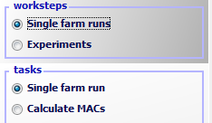
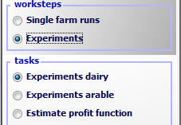
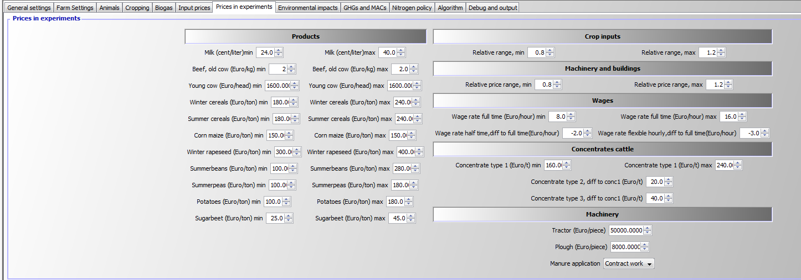
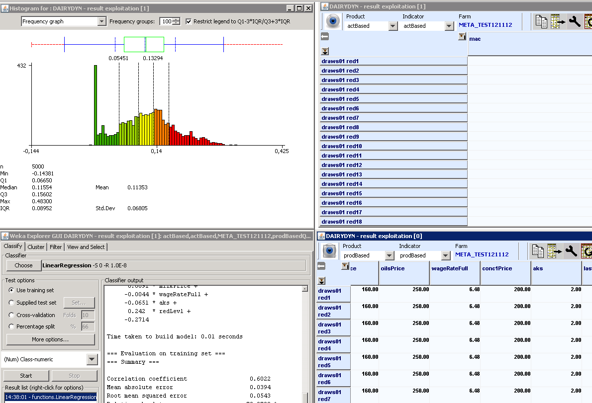

# Graphical User Interface

The Graphical User Interface (GUI) is based on GGIG (GAMS Graphical
Interface Generator, Britz 2014). It serves two main purposes: to steer
model runs and to exploit results from one or several runs. The creation
of a visual user interface is also described as "visual debugging"
(Grimm, 2002) to allow for an easy adjustment of
parameters and quantitative and graphical examinations. With the help of
only a few adjustments one can define single or multiple model farm runs
for the interesting farm types with their specifications. Thereby, the
former described coefficient generator helps to condense the necessary
information for farm run definition by adjusting and calculating all
production specific parameters to be consistent with the defined farm
type (initial arable land, grass land, initial stables, initial manure
storages, initial machine endowment\...). After simulating the
interesting experiments, the GUI enables the user to systematically
analyse the simulated model variables and results.

A separate user handbook for the general use of the GUI is available at:

Britz, W. (2010), GGIG Graphical Interface Generator User Guide,
Institute for Food and Resource Economics, University Bonn, 147 pages,
<http://www.ilr.uni-bonn.de/agpo/staff/britz/GGIG_user_Guide.pdf>

## Model farm and scenario specifications

In the following, the different tabs of the GUI are shown and shortly
described.

### Workstep and task selection

In „Single farm runs" mode, all run specific settings (input and output
prices, farm assets etc.) are set by the user in the interface. This is
discussed in the following.

In the experiment mode the user instead define ranges for selected
settings which are varied based on stratified random sampling using
Design of Experiments for a defined number of experiment. For each
experiment, a single farm run is solved. These single farm runs are
typically solved in parallel. After they are finalized, their results
are combined into one result set.

### General Settings

The first tab in *General settings* defines the name of the scenario
under which the results are stored. Further on, the user chooses general
farm characteristics and options for the run: (1) the active farm
branches, (2) if different states of nature (with regard to prices) are
used, (3) if land can be leased or bought. Furthermore, the threshold to
consider machinery investments as binary variables can be set.

The options under *Time* determine the last simulation year, if
information from this simulation period is used to estimate economic
returns until stables are depreciated and the time resolution for
investment / farm labour and feeding decisions.

The model allows to choose between the following four mode to describe
dynamics (or not):

The stochastic programming extension can only be switched on *Fully
dynamic without prolongation mode.* For details on these settings, see
section 3.3 above:

In experiment mode, upper and lower ranges for certain settings can be
set, as well as the number of experiments and some further algorithmic
details:

### Farm Settings

The farm settings panel carries general information about the
farm-household and general price increases as shown in the following:

### Animals

The tab "animals" allows setting the initial herd sizes and other
attributes related to animal husbandry. The herd size will be used to
derive the initial stable and silo inventory, the current stocking rate
the land endowment in case of a dairy farm. Note, the herd size which
can be set depend on the active farm branches.

In the experiment mode, ranges can be defined:

### Cropping

The tab "Crops and yields" comprises the selection of the crops and the
yields and their growth rates (if arable farming is active).

A further tab "Crop management" comprises the steering options related
to land use: if different tillage type, cropping intensities and crop
rotations are used. Moreover, the average plot size, mechanization level
and the climate zone as well as the distribution of the soil type can be
chosen.

### Biogas

The biogas tab includes different Renewable Energy Acts (EEGs) choices
for the investment options as well as available biogas plant sizes.
Moreover, it provides the option to select from potential inputs.
Additionally, one can set up an existing biogas plant with the options
to choose the size, the valid EEG as well as the construction year.
However, in order to use this function the plant size and EEG has to be
activated in the \"Investment options\" panel. Lastly, some options for
scenario premiums are included.

### Output Prices

That panel *Output prices* allows to set the price of the outputs
present in the model.

### Input Prices

That table *Input prices* allows to set the price of the outputs present
in the model.

### Prices in Experiments

### Environmental Impacts

### MACs

As the aim of the overall constructed model is to compare different
designed emission indicator schemes, the GUI sheet "MACs" offers an
assortment of the available indicators, usable to force abatement
ceilings by the simulated farm to create marginal abatement cost curves.
In addition the number of reduction emission reduction steps within the
simulation runs and the percentage reduction per step (compared to
baseline emissions) has to be defined to define the maximal emission
reduction (GHG reduction steps time reduction per step).

### Algorithm and Debugging Options

The last tab of the GUI which is shown here defines the chosen solver to
optimize the fully dynamic MIP problem and further precision
adjustments.

In general it is recommended to use CPLEX as the MIP solver, see section
7.2.

### GAMS

## Visualizing and analysing results

After a successful simulation (statement "normal completion" in the
simulation window) the user can use the model interface to view results,
plot them in tables or in graphs in order to make further analysis and
interpretations. The analysis is based on a set of pre-defined reports,
grouped by themes. Currently, the following reports are available:

-   Model attributes

-   Herd summary, mean

-   Land use, mean

-   Crops, mean

-   Crops, intensities

-   Crops, tillage

-   Crop costs, mean

-   Crop intensities, mean

-   Tillage type, mean

-   Cows, mean

-   Cows, by yield

-   Feeding overview, mean

-   Production and related revenues, mean

-   Feeding cows, mean

-   Herd summary, time series

-   Land use, time series

-   Crops, time series

-   Crops,tillage, time series

-   Crops,intensities, time series

-   Crop intensities, time series

-   Tillage type, time series

-   Cows, time series

-   Cows, by yield, time series

-   Feeding overview, time series

-   Production and related revenues, time series

-   Feeding cows, time series

-   Stables overview, mean

-   Stables, mean

-   Machines, mean

-   Stables overview, time series

-   Stables, time series

-   Machines, time series

-   Overview work, mean

-   OffFarm, mean

-   Overview work, time series

-   OffFarm, time series

-   Manure, mean

-   Manure, time series

-   N Crops, total, mean

-   P2L5 Crops, total, mean

-   N total, mean

-   P2O5 total, mean

-   Storages, per month, mean

-   Storages, total, mean

-   N Crops, total, time series

-   N Crops, per ha, mean

-   N Crops, per ha, time series

-   P2O5 crops, total, mean

-   P2O5 Crops, per ha, time series

-   N in different soil depths

-   N in soil, by weather and month

-   N in soil, by weather and soil depth

-   N Balance, per month, mean

-   P2O5 balance, per month, mean

-   N balance, per month, per ha

-   N balance, per month, time series

-   N balance, yearly, time series

-   N balance per ha, yearly, time series

-   P2O5 balance, per month, time series

-   P2O5 balance, yearly, time series

-   Overview GHGs

-   GHGs by source

-   MACs and GHGs

-   Revenues, mean

-   Revenues per ha, mean

-   Costs, mean

-   Costs per ha, mean

-   Cash balance, mean

-   Cash balance per ha, mean

-   Revenues minus costs per SON, mean

-   Crop costs, mean

-   Revenues, time series

-   Cash balance, time series

-   MACs

## Using the exploitation tools for meta-modeling

!!! info
    The model code comprises post-solution processing with various aggregations such as by branch, over time and calculations of indicators which can be exploited by a viewer in tables and graphs and compared across scenarios.

In the interface, the "exploit results" button will open a selection
dialog to choose results from parallel runs:

When *show results* are clicked the interface the results in tables:

There are views necessary to use the machine learning package:

1.  A view with the variable to estimate, in our case provide by the
    table *Meta analysis, MACs*

2.  A view with the explanatory attributes, in our chase provided by the
    table *Meta analysis, explanatory vars*.

In the first view, a click in the table will open a pop-up menu from
which "Classify, Classify current view" should be chosen:

Similarly, in the second view, "Classify, Use current view to provide
explanatory attributes for numeric classification should be chosen". The
WEKA Explorer can then be used to apply different algorithms from
machine learning to the instance, the screen shot below shows the
application of the multiple regression model with automatic variable
transformation (automatically builds logs, square roots and inverses of
the variable values) and variable selection [^16]:

Additionally, the user has the possibility to view Figures, histograms
or graphs of the interesting output values for graphical visualization.
Statistical characteristics like minimum, maximum or median values are
automatically generated as well as mean value of the selected results
and the standard deviation.

## Working with Projects
When applying FarmDyn to a set of different case studies, keeping track of the individual case study settings in the `.ini` files may become tedious.

In order to ease the handling 

[^16]: The problem here arises, that the simple WEKA regression routines
    are not prepared for two stage regressions (like e.g. Heckman two
    stage regression (Heckman, 1979)) like in some cases demanded for
    our data set as farms which have already exited are in the
    regression relevant dataset. This may cause a sample selection bias
    and lead to potentially small explanatory character of the estimated
    linear regression model. Therefore generated data should be analyzed
    by a routine, written in R (also designed by Britz and Lengers in
    2012 (2012) which is available on enquiry from the responsible
    authors.
