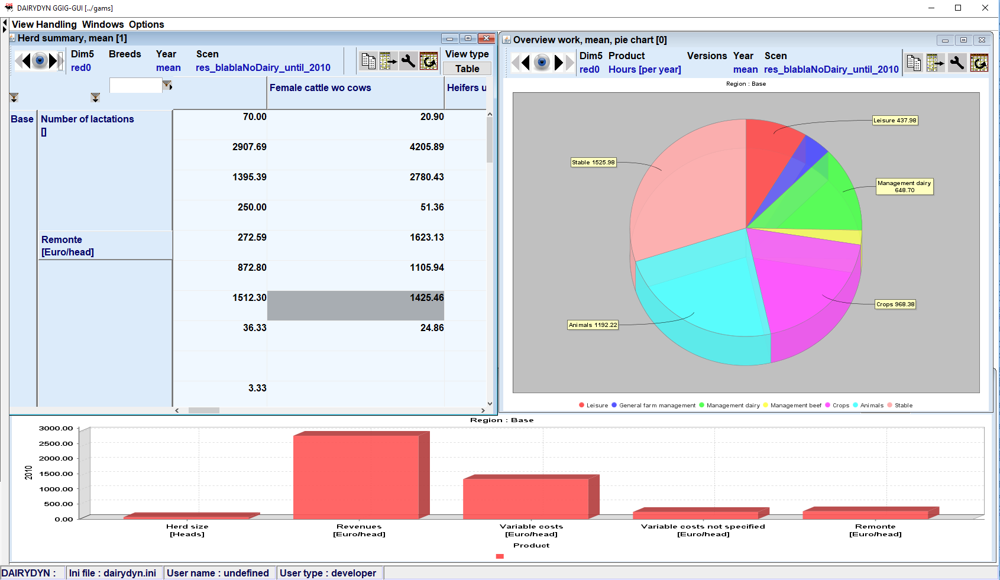
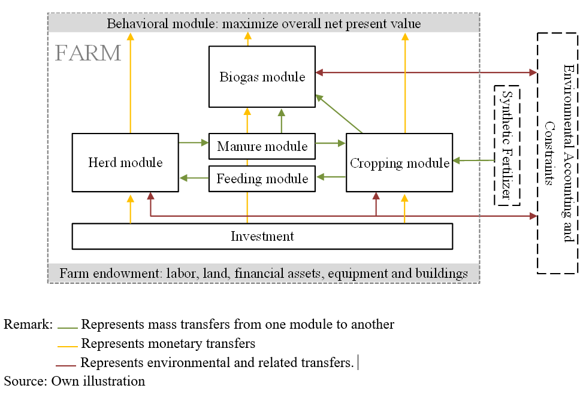

# FarmDyn

## A dynamic mixed integer bio-economic farm scale model

FARMDYN provides a **flexible, modular template** to simulate
**different farming systems (dairy, mother cows, beef fattening, pig fattening, piglet
production, arable farming, biogas plants)** at single farm scale.

{: style="width:100%"}

Universität Bonn 
Institute for Food and Resource Economics 
[Economic Modeling of Agricultural Systems Group](http://www.ilr.uni-bonn.de/em/em_e.htm)

## Main characteristics

-   Multiple dynamics including **comparative-static**,
    short run, or fully dynamic, with simulations covering several decades
-   Integer variables capture **indivisibilities in investments**
    (machinery, buildings) and **labour use**
-   Selected farm management decisions (e.g. feeding, manure management,
    labour use) depicted with a **sub-annual temporal resolution**,
    partially bi-weekly  
-   Farm labour, machinery and stable use are modelled in rich detail
-   **Highly detailed farm branch activities** (e.g. intensities for arable and grass crops,
    differentiated feeding schemes for all animal types accounting for lactation/feeding
    phase, etc.)
-   The machinery park is available in **different mechanization levels**
-   **Environmental accounting modules** including the flow from different nitrogen compounds, CO2eq, phosphorus compounds
-   A wide range of **agri- and agrienvironmental policies** including CAP, German implementation
    of Nitrate Directive, agri-environmental schemes, etc.
-   Multiple **biodiversity indicators**     
-   Parameterized for **multiple countries** besides Germany it includes Switzerland, Norway, Netherlands
-   **Deterministic or stochastic** programming version. The latter
        treats all variables as state dependent, allows for sceneario tree
        reduction and covers different risk measures (value at risk, MOTAD
        ...)

{: style="width:100%"}

For the German version, the model is parameterized  using
highly detailed farm planning data provided by
[KTBL](https://www.ktbl.de/) in combination with farm structural
statistics. It offers a complementary approach to other farm scale
models used in the institute such as the farm group models integrated in
[CAPRI](http://www.capri-model.org) or [FADN based farm-scale progamming
models](http://www.ilr.uni-bonn.de/agpo/rsrch/fadntool/fadntool_e.htm)
which both are comparative-static, calibrated against observed farm
programs with Positive Mathematical Programming while being far less
detailed with regard to technology, and not comprising explicit
investement decisions.

The model is realized in [GAMS](https://www.gams.com), solved with the industry
MIP solver
[CPLEX](http://www-01.ibm.com/software/commerce/optimization/cplex-optimizer/),
linked to a Graphical User Interface realized in
[GGIG](/em/staff/britz/ggig_e.htm) and hosted on a [Software Versioning
System](http://subversion.tigris.org/). Design of experiments, building
on [R](http://www.r-project.org) routines [directly called from
GAMS](http://support.gams.com/doku.php?id=gdxrrw:interfacing_gams_and_r),
can be used in combination with farm structural statistics to
systematically simulate different farm realizations (assets, farm
branches) and boundary conditions such as input and output prices or
emisisons ceilings using a **computing server to solve several instances
in parallel**. That approach has e.g. been used to estimate a
statistical meta model for Marginal Abatement Costs of Green House Gases
from dairy farms. Code development and testing follows agreed upon
[guidelines](https://www.ilr.uni-bonn.de/em/rsrch/farmdyn/codingConventions.pdf).
