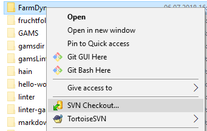
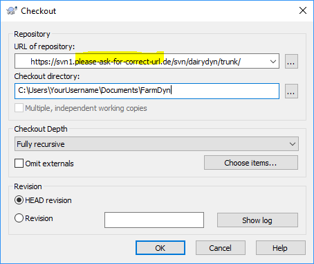
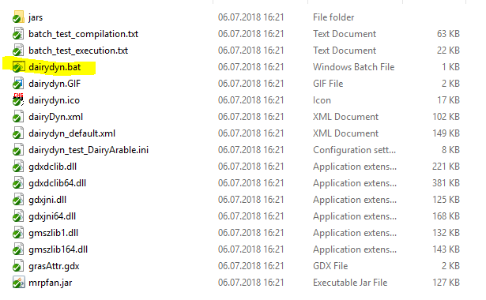
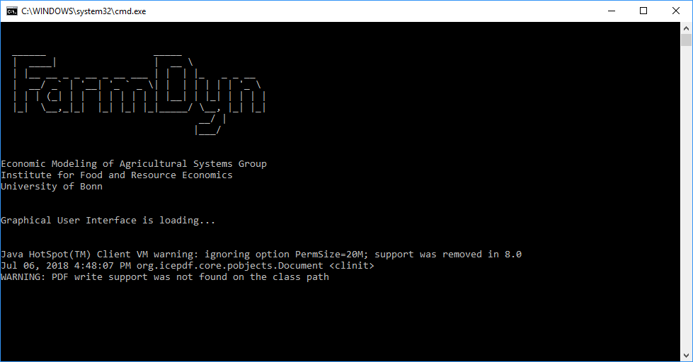
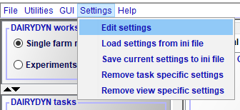
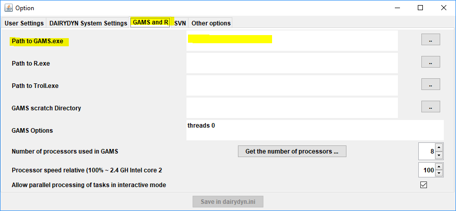
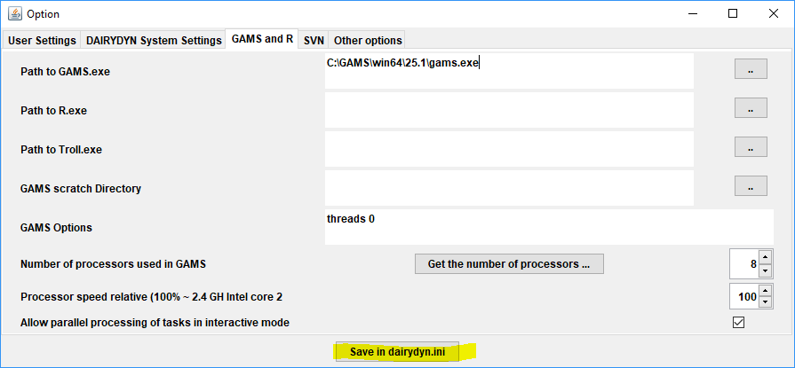

# Getting Started

## Prerequisites

### Java
In order to run the FarmDyn model, a working Java installation with a Version > 8 is required and needs to be in the path variable. It can be acquired free of charge from the official Java [website](https://java.com/de/download/).

### SVN

FarmDyn is using the centralized version control system *Subversion* (short [*SVN*](https://subversion.apache.org/)). In order to obtain, be able to update, or eventually commit changes to the model, a so called SVN client needs to be installed on the computer. The client of choice depends on the operating system in use:

#### Windows
[TortoiseSVN](https://tortoisesvn.net/downloads.html) is used here at our Institute. The following images and examples will be done using TortoiseSVN, other SVN clients (or CLIs) may work as well.

#### MacOS
[SnailSVN](https://langui.net/snailsvn/) is a TortoiseSVN look-alike for MacOS. Most features therefore look and act like their Windows counter-part. The free version offers only one repo to be checked out, which should be sufficient in most use cases though.

#### Linux
[RabbitVCS](http://rabbitvcs.org/) is a graphical SVN-client for Linux. It hasn't been officially tested with FarmDyn yet.

### GAMS (optional)
FarmDyn may be operated without an installation of GAMS. However, notice that without a valid GAMS installation, including a valid license file, the model cannot be run (-> only existing results may be inspected). FarmDyn requires a GAMS Version > 25.0 to fully operate.
GAMS can be acquired from the official [website](https://www.gams.com/). Note that degree granting institution may qualify for a [free GAMS license](https://support.gams.com/solver:academic_programs_by_solver_partners).

## Obtaining the model

In order to obtain the latest model version from the version control server, login credentials (username, password) are required. If you are not a registered user yet please feel free to [contact us](http://www.ilr.uni-bonn.de/em/em_e.htm). 

Navigate to a directory where you would like to store the FarmDyn main folder, e.g. your `Documents` folder

`%USERPROFILE%\documents\`

In this directory, create a new folder, e.g. `FarmDyn` or `Model`

Perform a right click on the folder and select `SVN checkout`

In the *Checkout* dialog box that appeared, enter the SVN URL you received, and click the **Ok** button.

If you did not enter your credentials before, you will be asked to input these before the checkout will proceed.

Once the checkout process is finished, close the dialog box by clicking **Ok** again.

## Starting the program
Navigate into the `GUI` folder in the directory where you saved the FarmDyn checkout. 

### Windows
If you followed the above example, the path will look like similar to

`C:\Users\YourUsername\Documents\FarmDyn\GUI`

(in this case, you can also copy `%USERPROFILE%\documents\FarmDyn\GUI` into the explorer window). 

In the `GUI` folder, double-click the `dairydyn.bat` file

If everything was set-up alright, you will see the following loading screen

Upon first start, a dialog window will appear, stating that the path to the systems GAMS executable needs to be set in the settings.

Proceed by clicking the **Ok** button. You will then be presented with the main menu of the program.

#### Setting up GAMS
In case you have a valid GAMS installation on your computer, you may finalize the installation by setting up the correct GAMS path.
In the main menu, select **Settings** -> **Edit Settings**

In the upcoming dialog box, select the **GAMS and R** tab

In the `Path to GAMS.exe` input field, paste the path to the GAMS executable on your system. In most cases, this will be similar to `C:\GAMS\win64\25.x\gams.exe`, where x needs to be substituted by the actual GAMS version number on your system.

Once you are done, click the **Save in dairydyn.ini** button. FarmDyn is now fully operational (as long as a valid GAMS license is present).

