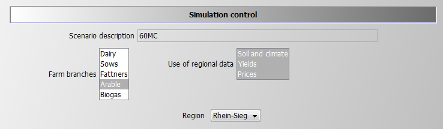
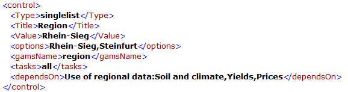
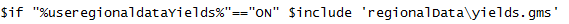
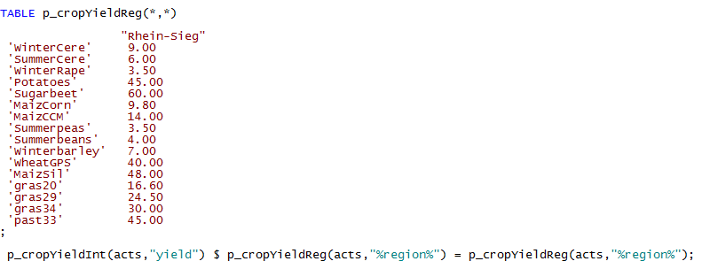
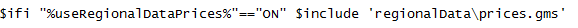
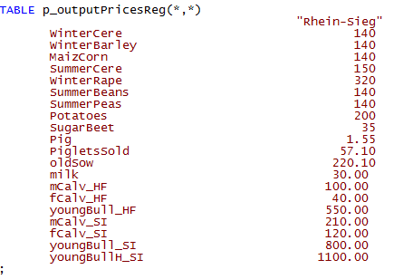
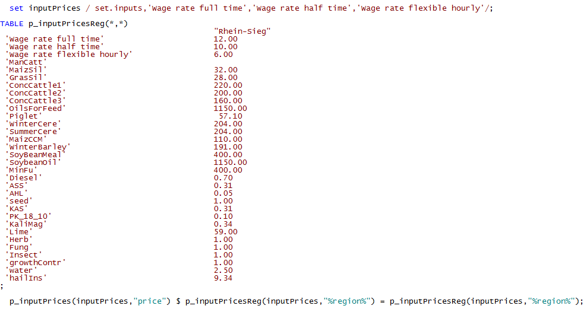

# The Coefficient Generator


## Concept and File Structure

The coefficient generator comprises a number of small modules, realised in GAMS, which define the various exogenous parameters comprised in the template. It is designed such that it can generate from a few central characteristics of the farm (herd size, current milk yield, existing stables and their construction year, labour force and available land) and the realised crop yields a plausible set of coefficients for the
template model. The coefficient generator can also be set-up to load
parameters for a specific region.

The coefficient generator is divided in:

-   **Buildings:** includes bunker silos for silage maize and
    potatoes.

-   **Cows**: cows, heifers and calves are defined that have different
    milk yield potentials. Additionally, a maximum number of lactation
    is defined. It depends on the milk output level of the lactating
    cows (diminishes with increasing milk output potential).

-   **Credit**: different credit types are defined. These vary by
    interest rate and payback time.

-   **Cropping**: defines different activities for cash-crop production
    with specific restrictions concerning crop rotation, fertilizer
    demand and yield potentials.

-   **Environmental accounting**: defines environmental impact due to
    manure and fertiliser application.

-   **Farm constructor**: the farm constructor defines the relationships
    between benchmark data of the farms and production specific
    endowments e.g. of land, stables and machinery in the initial
    situation.

-   **Farm\_Ini:** Initialises the farms land endowment and plot
    distribution

-   **Feeds**: possible fodder compounds are listed with their specific
    contents of ingredients (N, C, DM, XP,\...).

-   **Fermenter\_tech**: includes all data regarding the technical
    aspects of the biogas fermenter, the different inputs and their
    related biogas yields.

-   **Fertilising**: defines coefficients for various application
    techniques for organic and synthetic fertilisers.

-   **Greening \<not yet included\>:** Adds the restrictions of the CAP
    Greening into the model.

-   **Indicators**: this module gives a definition of the different GHG
    indicators and a description of the underlying calculation schemes
    and parameters. The majority is taken from IPCC methodology and
    completed by other literature findings.

-   **Ini\_herds**: it defines the initial herds of the farm.

-   **Labour**: defines labour needs on a monthly basis for herds and
    crops and wages for the off-farm work.

-   **Mach**: defines the different types of machinery that are
    available for the farmer and it quantifies the useful lifetime
    (defined according to years or on hourly basis) as well as
    investments and variable costs.

-   **Manure**: quantifies amount of animal excreta with respect to
    livestock category. For cows manure amount is controlled by yearly
    milk output level. Furthermore, coefficients for different manure
    storage and application types are derived by this module.

-   **Pigs:** defines output coefficients, production lengths and other
    variable costs for fatteners and sows.

-   **Prices**: different default values are defined if prices for
    variables are not defined by the GUI.

-   **Prices\_eeg**: contains the prices applied in the different EEGs
    as well as investment prices for different biogas plant parts.

-   **Requ**: definitions of requirement functions for lactating cows in
    relation to their milk yield, live weight etc., as well as for
    heifers and calves are included in this module.

-   **Silos**: in this module the definition of different types of
    surface reservoirs for liquid manure is set. It differentiates
    concerning capacity and related investment costs. Furthermore,
    additional costs of specific coverage types of the surface manure
    reservoirs are defined for straw coverage and coverage with foil.

-   **Stables:** stable types with stable places and required workload
    for the respective stables for all herd types

-   **StochProg**: defines the decision tree and further GAMS symbols
    used in the stochastic programming version

-   **Tech:** defines all machinery, crop specific operation
    requirements and field working days.

## Handling of Regional Data


The interface allows defining which data should be taken from the
regional data base and, in case one or several of these options are
selected, to choose a region:



The list of regions is defined in *gui\\dairydyn\_default.xml*:



The regional data are stored in three files according to the available
options:

-   *regionalData\\prices.gms* -- input and output prices

-   *regionalData\\yields.gms* -- crop yields

-   *regionalData\\Climate\_soil.gms* -- set of climate zone and soil
    shares

The code is set up in a way that in case no data is found the settings
from the interface are used.

### Climate and Soil Data

The climate and soil data are read in by *coeffgen\\farm\_ini.gms*. As
soil shares determine potentially the size of the plots the information
is used in many subsequent programs. The inclusion of the regional data
is conditional on the interface settings:

[embedmd]:# (N:/em/work1/FarmDyn/FarmDyn_QM/gams/coeffgen/farm_ini.gms GAMS /curClima.*?\(/ /Climate_soil\.gms'/)
```GAMS
curClimateZone("%curClimateZone%") = YES;
*
*  --- scale soil shares edited by user to add up to unity
*
   p_soilShare(soil,"Share") = p_soilShare(soil,"Share") * 1 / sum(soil1, p_soilShare(soil1,"Share"));


*
*  --- Regional climate and soil data (overwrites the data given in the GUI for climate zone and soil)
*
$ifi "%useRegionalDataSoilAndClimate%"=="ON" $include 'regionalData/Climate_soil.gms'
```

Soil shares are entered via the interface or a batch file is overwritten if at least one of the soil types data are entered:

[embedmd]:# (N:/em/work1/FarmDyn/FarmDyn_QM/gams/regionalData/Climate_soil.gms GAMS /p_soilShare\("l/ /;/)
```GAMS
p_soilShare("l","Share") = 0.2 ;
```
[embedmd]:# (N:/em/work1/FarmDyn/FarmDyn_QM/gams/regionalData/Climate_soil.gms GAMS /p_soilShare\("m/ /;/)
```GAMS
p_soilShare("m","Share" ) = 0.5 ;
```

[embedmd]:# (N:/em/work1/FarmDyn/FarmDyn_QM/gams/regionalData/Climate_soil.gms GAMS /p_soilShare\("h/ /;/)
```GAMS
p_soilShare("h","Share") = 0.3 ;
```
[embedmd]:# (N:/em/work1/FarmDyn/FarmDyn_QM/gams/regionalData/Climate_soil.gms GAMS /p_soilShare\(soil/ /;/)
```GAMS
p_soilShare(soil,"Share") = p_soilShare(soil,"Share") * 1 / sum(soil1, p_soilShare(soil1,"Share"));
```

### Yield Data

Handling of yields is similar. The inclusion of the data is done by
*coeffgen\\cropping.gms*:



The crop yields data is entered in a table and overwrites the data from
the interface, *p\_cropYieldInt,* only if a non-zero entry is found for
the activity, *acts,* and the current region, *"%region%"*. It is
important to highlight that in order to increase readability the table
is not domain checked. This is despite the fact that the list of
activities, *acts,* is defined in *model\\templ\_decl* with *\$If*
conditions which would need to be repeated here as well.



### Price Data

The information on regional prices is included in
*coeffgen\\prices.gms*:



The file comprises a section for output and another for input prices,
both consisting of a table with regional prices and a statement which
overwrites the information from the interface:



For price data there is as well no domain checking to increase
readability. The section of the inputs is structurally identical to the
one shown above:



The updated prices are used in a next step in *coeffgen\\prices.gms*:

[embedmd]:# (N:/em/work1/FarmDyn/FarmDyn_QM/gams/coeffgen/prices.gms GAMS /\$ifi.*?Regional/ /\.gms'/)
```GAMS
$ifi "%useRegionalDataPrices%"=="ON" $include 'regionalData/prices.gms'
```
