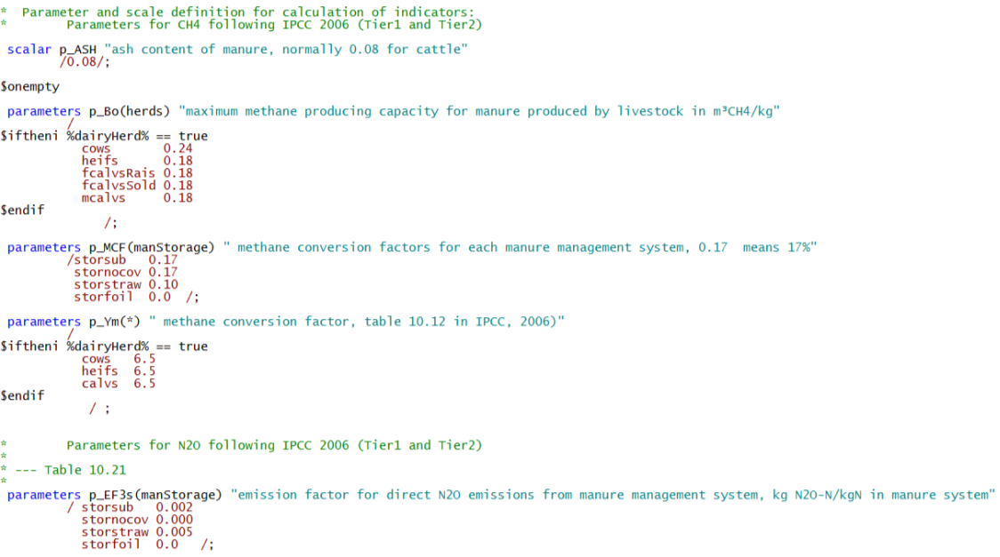
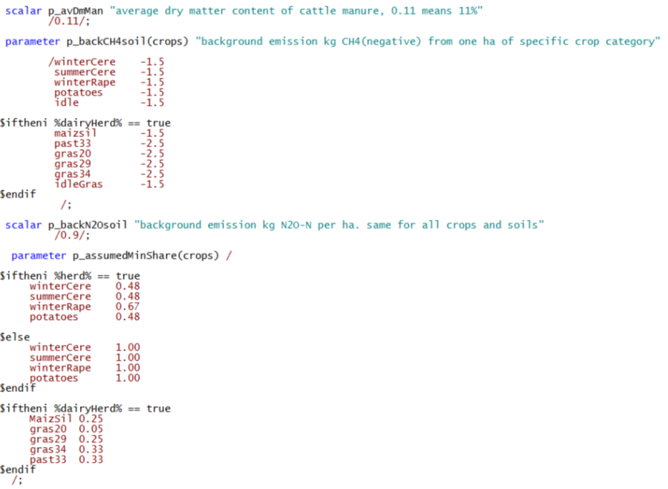
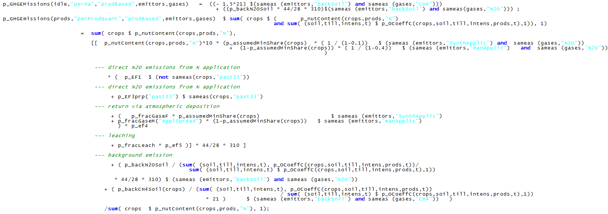
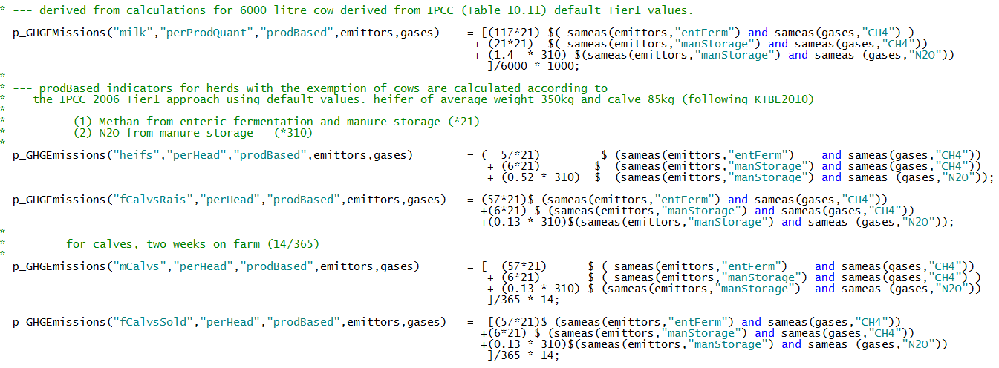
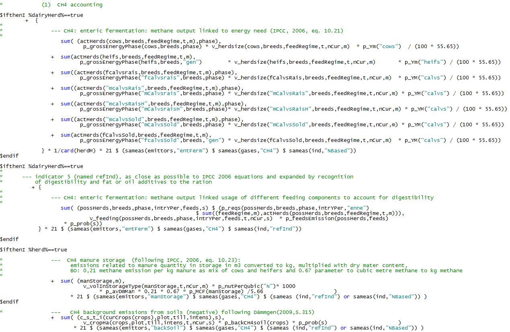
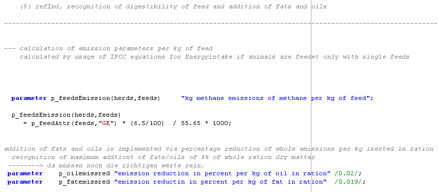

# GHG Accounting and derivation of Marginal Abatement cost

!!! danger "Deprecated"
    This part of the model is deprecated!

The original version with its focus on milk and GHGs was developed as
milk accounts for about one sixth of agricultural revenues in the EU,
being economically the most important single agricultural product. Dairy
farms also occupy an important share of the EU's agricultural area. They
are accordingly also important sources for environmental externalities
such nutrient surpluses, ammonia and greenhouse gas (GHG) emissions or
bio-diversity, but also contribute to the livelihood of rural areas.
With regard to GHGs, dairy farming accounts for a great percentage of
the worlds GHG emissions of CO2, N2O and CH4 (FAO 2006, 2009), and
is hence the most important single farm system with regard to GHG
emissions. Given the envisaged rather dramatic reduction of GHGs,
postulated by the recent climate agreement, it is therefore highly
probable that agriculture, and consequently dairy farms, will be
integrated in GHG abatement efforts. Any related policy instruments, be
it a standard, a tax or tradable emission right, will require an
indicator to define GHG emissions at farm level. Such an indicator sets
up an accounting system, similar to tax accounting rules, which defines
the amount of GHG emissions from observable attributes of the farm such
as the herd size, milk yield, stable system, cropping pattern, soil type
or climate. The interplay of the specific GHG accounting system and the
policy instrument will determine how the farm will react to the policy
instruments and thus impact its abatement costs, but also the
measurement and control costs of society for implementing the policy.
The objective of the paper is to describe the core of a tool to support
the design of efficient indicator by determining private and social
costs of GHG abatement under different GHG indicators. It is based on a
highly detailed farm specific model, able to derive abatement and
marginal abatement cost curves with relation to different farm
characteristics, a highly detailed list of GHG abatement options and for
different designed emission indicators.

The calculation of the farm specific greenhouse gas emissions is defined
by different specified GHG indicators (GHG calculation schemes). The
indicators differ in degree of aggregation and feasibility of required
production data. In the next sections the derivation procedures are
described for all indicators and divided concerning gas types.

*Short conceptual explanation of the implemented indicator schemes:*

The different indicators are mainly based on the IPCC (2006) guidelines
which comprise so-called tiers of increasing complexity to calculate GHG
emission. Tier 1 provides the simplest approach to account emissions
using default parameters. Tier 1 is used as far as possible to define
our simplest indicator, *actBased*, where emission factors are linked to
herds and crop hectares. The exemptions from the IPCC methodology are
manure management and fertilization, for those IPCC links emission
factors to organic and synthetic fertilizer amounts. Whereas average
excretion and fertilizer application rates to derive per animal and per
hectare emission factor coefficients are assumed in the model.

A somewhat more complex indicator called *prodBased* links emission
factors to production quantities of milk and crop outputs. In general,
at the assumed average yields, *actBased* and *prodBased* yield the same
overall emissions. Compared to the activity based indicator, farmers
have somewhat more flexibility as they for example might switch between
different grass land management intensities to abate emissions.

A more complex and also presumably very accurate indicator is called
*NBased*. Values for enteric fermentation are calculated from the
requirement functions, for energy based on IPCC guidelines, which also
drive the feed mix. For manure management, emissions are linked to the
amount of manure N in specific storage types in each month. For
fertilization emission factors are linked to distributed nitrogen and
are differentiated by application techniques. The indicator thus gives
the farmer the chance to abate nitrogen losses by changing storage
types, storage periods or fertilization application technique, beside
changes in herd sizes, herd structure and cropping pattern.

An intermediate indicator linked to production quantities is called
*genProdBased*. The emission factors are linked mainly to output
quantities and as far as possible derived from the indicator NBased. The
differences stem from the calculation of emissions from enteric
fermentation and manure management: the Tier 1 default values are either
directly replaced by Tier 3 values (enteric fermentation) or Tier 3
values for manure management are used in conjunction of assumed shares
for manure storage and application. Specifically, the indicator
introduces milk yield dependent emission factors. This reflects that
higher milk yields reduce per litre emissions by distributing
maintenance and activity need per cow over a larger milk quantity.

The most complex and accurate indicator scheme is the reference
indicator called *refInd*. It is an enhancement of the *NBased*
indicator. The difference is that real feed intake of different feed
compounds is recognized in order to implement the impact of feed
digestibility on emissions from enteric fermentation. Moreover, the
addition of fats and oils to feed is recognized to increase
digestibility and lower methane from ruminant processes.

The different indicator calculation schemes (except of *NBased* and
*refInd*) are listed in a sub-module named *indicators*. In this module
some basic parameters and scale definitions for later emission
calculation formulas are explained. The information is derived from IPCC
(2006) (chapter 10 and 11), Dämmgen (2009),
Velthof and Oenema (1997) and the RAINS
model definition (for changes in NOx and NH3 fluxes concerning
manure application type) (Alcamo et al., 1990).

The parameters and scalars shown above are described by the statements
within the model code excerpt. These are basic emission factors which
are later linked to the indicator schemes representing source specific
emission conversion factors or compound rates. Concerning the
specifications when running the model made by the user, different ways
of GHG calculation are active, depending on the chosen indicator, *ind*.
Hence, the resulting emissions by each simulated farm per year,
*v\_GHGEmissions(ind,t),* are either calculated on per head or hectare
basis, per production quantity or on highly disaggregated way using the
NBased or refInd indicator. The equation *GHGEmissions\_(\*,\*,\*,\*)*
facilitates an indicator and gas and source specific quantification of
emissions according to the chosen indicator scheme,
*v\_GHGs(ind,emitters,gases,t)*. Therefore,
*p\_GHGEmissions(\*,\*,ind,emitters,gases)* are per head or hectare or
per production unit specific emission parameters inserted for
calculation the indicators *actBased*, *prodBased* and *genProdBased*.
Calculation procedures for the *NBased* and *refInd* indicator schemes
are explained later.

For each indicator scheme different parameters per head, hectare or per
production quantity are defined in the indicator module and will be
implemented into the calculation formula in the previous equation
following the chosen indicator in the model run. Hence, if *NBased* is
chosen, only the last summand is active, leaving the lines at the
beginning of the equation disregarded as *NBased* scheme does not hold
any emission parameters per hectare, head or per production quantity.

The detailed calculation schemes for the different chosen indicators are
illustrated in the following subchapters.

## GHG indicators

Conceptually, FARMDYN is a microeconomic supply side model for
"bottom-up" analysis based on a programming approach, i.e. constrained
optimization. A bottom-up approach principally connects sub-models or
modules of a more complex system to create a total simulation model,
which increases the complexity but hopefully also the realism
(Davis, 1993). On farm bio-economic processes are
described in a highly disaggregated way. Whereas so-called engineering
models also optimise farm level production systems, in that type of
model possible changes in management or for instance GHG mitigation
options are predefined (different feed rations, defined N
intensities\...), implemented separately and ordered concerning their
derived single measure mitigation costs to explore the MAC curve.
Contrary to that, the LP-approach of our Supply Side model enables to
solve for optimal adjustments of production processes by continuous
variation of decision variables, such that the optimal combination of
mitigation measures is derived. The same argument holds for analyzing
shocks in prices or other type of policy instruments. With regard to
GHGs, a further advantage of the approach relates to interaction effects
between measures with regard to externalities as different gases and
emission sources along with their interactions are depicted (see e.g.
Vermont and DeCara, 2010). Market prices are
exogenous in supply side models such that market feedback is neglected,
contrary to so called equilibrium models which target regional or sector
wide analyses (such as e.g. the ASMGHG model used by
Schneider and McCarl 2006).

### prodBased Indicator

As first indicator the production based, *prodBased*, is described as
other more general indicators use some calculations build for it, but
those more simple indicators use average data.

The different GHG emission parameters, *p\_GHGEmissions,* per production
quantity are implemented in the submodule *indicators*. For *idle* only
the background emissions per hectare are recognized. Emission parameters
for all other crops are derived by using the equations [^9] shown below,
calculating N inputs from yield level and average N content of crops,
*p\_nContent*, and multiplying this by the above shown standard emission
factors for direct and indirect GHG emissions. Additionally, background
emissions for arable soils are considered *p\_backCH4Soil(crops),
p\_backN2OSoil(crops).* To obtain per unit of product emission
parameters, *p\_GHGEmissions(prods,\...),* the calculated total GHG
amount per hectare is divided by the output quantity per hectare,
*p\_OCoeff(crops,prods,t).*

For dairy cows the GHG emission factor per kg of milk,
*p\_GHGEmissions("milk",\...)*is derived by taking default emission
factors from IPCC (2006) from enteric fermentation (117 kg CH4) and
manure management (21 kg CH4, 1.4 kg N2O) per animal and year and
dividing the resulting CO2-equ. by an average yearly milk yield per
cow (6000 kg).

For emission from heifers and calves, per head default emission factors
from IPPC (2006) are taken. For emission parameter calculation of male
calves and sold female calves, the residence time on farm is recognized
(14 days on average). To calculate the default values of N2O emissions
from herds, calculation functions 10.25, 10.26 and 10.30 of IPCC (2006)
are filled with average weights (e.g. cow: 650kg) and excretion rates of
the different herd categories taken from KTBL (2010).

No differentiation in GHG emission rates of the farm are made concerning
storage and application techniques of manure and synthetic fertilizers.
Moreover, storage time of manure as well as differences in emissions
from applied fertilizer and manure N are not recognized by this
indicator.

### actBased Indicator

The *actBased* indicator denotes the simplest emission indicator
implemented in the model approach of FARMDYN. It just multiplies
activity data (hectare or heads) with specific default emission factors
which are taken from IPCC (2006) on Tier 1 level. For example 117 kg
CH4 per cow and year from enteric fermentation and 21 kg CH4 per cow
from manure management. For N2O emissions per cow and year the default
value of 1.4 kg is taken (see section *prodBased* indicator). For calves
and heifers the default emission indicators are the same as for
*prodBased*. Emission parameters from cropping activities are computed
by the derivation scheme of the *prodBased* indicator taking average
yield levels and fertilizer application rates.

Furthermore, no differentiation concerning emission rates of different
intensity levels for grassland (different pasture types) is made.

## genProdBased Indicator

The indicator scheme called *genProdBased* also accounts for emissions
of cropping activities. It is based on emission parameters per unit of
product, taking the same equations as for the *prodBased* indicator.

For the calculation of emissions due to heifers and calves, the Tier 2
approach from IPCC (2006) is used, taking average weights (350kg for
heifers and 90kg for calves), gross energy (GE) demands following KTBL
(2010) and GE demands from Kirchgessner (2004). [^10] The gross energy
demands of cow species are given by requirement functions implemented in
the sub-module *requ.gms,* considering functions for energy need for
maintenance, activity, gross and lactation. GE demands used are
calculated following equation from IPCC (2006) and taking
a default digestibility of feed from IPCC of 60%.

In case of emission calculations from dairy cows genetic potential is
considered. Therefore, the gross energy demand of each different genetic
yield potential is separately considered. Taking equations from IPCC
Tier 2 approach leads to different per kg milk GE demand due to
maintenance, lactation, gross and activity. The calculated emissions per
cow are then divided by the milk yield potential, leading to a decline
in GHG per kg milk for higher yield levels. For the calculation of
emissions by dairy cows, a table with intensity dependent emission
factors per kg milk is inserted into the module, displaying the
parameter *p\_GHGEmissionsCowsYield(cows,emittors,gases)*. The parameter
value of whole emissions per kg milk diminishes from 0.74 CO2eq/kg for
a cow with 4000 kg milk yield per year to 0.46 CO2eq/kg for a cow with
10000 kg. This decline in emissions per kg of milk with increasing milk
yield is not linear as illustrated in the following Figure 10.

:   Figure 10: GHG emissions per cow and per kg of milk
    depending on milk yield potential.
    Source: Own illustration based on Kirchgessner (2004) and IPCC (2006)

In contrast to the simple *prodBased* indicator, the emissions from
herds are now based on real, output depending energy requirements. Thus,
it is resulting in different output level dependent emission factors per
kg of milk and not a fix emission factor per kg of product disregarding
the efficiency effects shown in Figure 10.

### NBased Indicator

With difference to the other indicator definitions, the calculation
formulas of the *NBased* indicator are not enclosed in the indicator
module, but described in the basic template module. This is necessary
because as it is a highly detailed and disaggregated indicator scheme,
it calls for many model variables which differ between simulation steps.

As the *NBased* indicator up to now presents the reference indicator,
the emissions which are emitted by each source of the production process
(enteric fermentation, soils\...) are calculated by this indicator in
each simulation step. Hence, the GHG calculation is fragmented
concerning the emission origins to credit the emissions to the single
*emitters*. Summing up the source specific emissions lead to the overall
GHGs, *v\_GHGs(emitters,gases,t).*

*CH4 accounting*

The CH4 emissions by enteric fermentation are calculated using
equation 10.21 of IPCC (2006) guidelines, which takes the gross energy
intake of each livestock category, *p\_grossEnergyPhase(\...),* as basic
variable to multiply it with the level, *v\_herdsize,* of each category
and a specific methane conversion factor, *p\_YM*. By multiplying it
with factor 21 CH4 emission are converted to CO2-equivalents.

For the accounting of methane from manure storage, the manure amount,
storage period and differences in methane conversion factors,
*p\_MCF(manStorage),* between different manure storage types are
recognized. This is done following equation 10.23 of IPCC (2006). The
monthly manure amount in each storage type, *v\_manInStorageType(\...),*
is multiplied by specific dry matter content, *p\_avDmMan*, and by a
methane emission factor (0.21 as a mix for cows and heifers) to obtain
the m³ of CH4 due to manure. In a next step multiplying it with 0.67
converts m³ to kg methane. Because manure is quantified on monthly basis
and CH4 emissions are also implemented on monthly basis, the methane
conversion factors, *p\_MCF(manStorage),* have to be divided by 5.66 to
not overestimate monthly methane emissions from manure. [^11]

The background emissions of methane from soils are derived by
multiplying a crop specific emission parameter, *p\_backCH4soil,* (taken
from Dämmgen, 2009:p.315) with the activity level,
*v\_cropHa(crops,t,s).*

With the statement *\$(sameas (emitters,"entFerm"))* the calculated
CH4 emissions are assigned to the source enteric fermentation. The
same is done for all other gases (N2O, CO2) and sources
*(manStorage, backSoil, manApplic, syntApplic)* to be able to analyse
source specific emission developments during the simulation runs.

*N2O accounting*

For N2O emissions from manure storage a differentiation between direct
and indirect N losses is made. N amount in specific storage type,
*v\_NInStorageType(manStorage,t,m),* is multiplied by an emission factor
for direct N2O-N flux from storage systems, *p\_EF3s,* to get direct
nitrous oxide emissions from storage systems in each month. Furthermore,
indirect nitrous oxide emissions are considered following IPCC (2006)
equations 10.27 and 10.29 to account for outgassing of NOx and NH3,
*p\_FracGasMS(manStorage),* and leaching *,p\_FracLeachMS.*

The next excerpt of the model code represents the detailed N2O
derivation concerning manure and synthetic fertilizer application on
agricultural soils. Direct nitrous oxide emissions from soils follow the
equation 11.1 and relating auxiliary calculations from IPCC (2006). The
nitrous oxide amounts produced by cropland, *N2O\_Inputs*, depends on
the applied manure N amounts to the specific crops, on the application
technique, *v\_nManDist(Crops,ManApplicType,t,s,m),* and the N amount
applied by synthetic fertilizer,
*v\_nSyntDist(Crops,syntNFertilizer,t,s,m)*. Applied manure N is
multiplied by an application specific increase factor,
*p\_n2OIncreaseFact,* which is higher for non-surface application
techniques (see RAINS model). The sum of both is then multiplied by the
N input dependent conversion factor for croplands, *p\_EF1*. The same is
done for calculation direct N2O emissions from N deposited to pasture,
*past33*, using a pasture specific conversion parameter,
*p\_EF3prp("past33")*.

The calculation of indirect N2O emissions from atmospheric deposition,
leaching and runoff is corresponding to equations 11.9 and 11.10 from
IPCC (2006) guidelines.

The emission factor for background emissions of N2O from soils are not
taken from IPCC (2006) methodology because these are valued to high, as
they are from a study based on peat soils with very high volatilization
rates. For this reason, data for background emission factors per ha of
land, *p\_backN2Osoil,* from Velthof and
Oenema (1997:p.351) is used. They investigated an emission
factor of 0.9 kg N2O-N per ha, as it was already shown in the
declaration of basic emission parameters.

The parameters 44/28 and 310 which are multiplied with the calculated
N2O-N amounts by each source are on the one hand the conversion factor
from N2O-N to N2O (44/28) and the global warming potential (310) of
nitrous oxide to calculate the corresponding CO2-equ.

### refInd Indicator

As the *NBased* indicator, the *refInd* Indicator calculations are not
enclosed in the indicator module, but described in the basic template
module. This is necessary because it is the most detailed and
disaggregated indicator scheme, it calls for many model variables which
differ between simulation steps.

The reference indicator is the most disaggregated emission accounting
scheme implemented in the model approach. It mainly bases on the
calculation mechanisms of the former explained *NBased* indicator.
Enhancements are made concerning the consideration of differences in
feed compound digestibility, the addition of fat or oils as well as the
impact on methane emissions from ruminant fermentation. The calculation
of emissions from soils, manure and fertilizer application and manure
storage are equal to the accounting procedure of the *NBased* indicator.

Methane calculations only differ between animals due to different
enteric fermentation. The CH4 emissions from intestine processes are
calculated by the following:

The feed use for each animal, *v\_feeding(herds,phase,\...)*, is
multiplied by a specific emission parameter per kg of feed compound,
*p\_feedsEmission(herds,feeds), which depends* on different ingredients
of the component and the animal category.

Therefore emission parameters for different feed ingredients are
calculated following the below stated routine. Per kg feed emission
parameters are derived from IPCC (2006) equations based on GE of
specific feedstuff, *p\_feedAttr(feeds,"GE")*.

### Source Specific Accounting of Emissions

To enable the model user to directly explore emission amounts and gas
types allocated to different production process (enteric fermentation,
manure CH4, CH4,~ and N2O from fertilizer or manure application and
background emissions from soils) specific accounting functions are used.
By using emission indicators they assign emissions to source and gas
type. With this a detailed source specific emission analysis is
possible. Consequently, farm management changes can be analysed also
with respect to GHG mitigation efforts on the whole or part of the farm.

So far land use change, afforestation or change of tillage practices is
not implemented in the overall model approach. This is why no CO2
accounting is implemented into the indicator schemes. For a higher
resolution of land use practices and tillage procedures this has to be
expanded due to potentials of carbon sequestration or release from
soils. Additionally, intensity and production depending CO2 emissions
from fuel use could be implemented.

## Overview on calculation of Marginal Abatement Costs (MAC)

Marginal abatement costs (MAC) are defined in the model as the marginal
loss of profits of a farm due to a marginal reduction of an emission
amount (Decara & Jayet, 2001). In the model GHG emissions
are measured in CO2 equivalents. For our highly detailed template
model, no closed form representation of the abatement costs exist, thus,
the MAC can only be simulated parametrically. Specifically, in a first
step the MAC is derived by introducing a step-wise reduced constraint on
maximal GHG emissions. In the second step resulting changes in GHG
emissions are related to loss of profits. [^12] . As already mentioned in
the introduction the resulting MAC curve is depending on the indicator
used to calculate the emissions, the abatement strategies available to
the firm and, further firm attributes such as market environment. With
regard to the adoption of the farm to new emission constraints, the
model template allows to analyse the amount and structure of chosen
emission abatement options for each reduction level depending on farm
type and chosen emission indicator. This helps the structural analyses
of the level of abatement cost depending on the effective abatement
strategies which are biased by the specification of the emission
indicator.

Under a given indicator a stepwise reduction of the emission constraint
leads to a stepwise reduction in farm profits. Relating the change in
emissions to the changes in profits allows calculating the total and
marginal abatement cost. Henceforth $\varepsilon_{0j}$ stands for
emissions emitted measured with indicator $j$ under the profit maximal
farm plan without any emission target and the zero characterizes the
reduction level. To derive marginal abatement cost curves $n$ reduction
steps, each with the same reduction relative to the base
$\varepsilon_{0j}$, are done, which leads to the objective values from
$\pi_{0j}$ to $\pi_{0j}$. Moreover, $\alpha_i$ denotes the
relative reduction in step $i$ compared to the baseline emissions. The
maximal profit under reduction level of step $i$ and indicator $j$ is
restricted by accounted emissions for the $k$ decision variables
according to:

$$\sum_k ef_{j,k} x_k \leq \left( 1 - \alpha_i \right)\varepsilon_{0j}$$

In this equation $ef_{jk}$ represents the emission factor
attached to decision variable $k$ under indicator$j$, i.e. the
CO2 equivalent emission accounted per unit of variable$j$.
The difference between $\pi_{0j}$ - the profit without GHG restrictions
- and $\pi_{0j}$ measures the profit foregone due to the
specific emission ceiling for the combination of reduction level of step
$i$ and indicator $j$. Therefore, the total *abatement
costs* $(AC$) for the abatement of $\alpha_i\varepsilon_{0j}$ emissions
are defined as:

$$AC_{i,j} = \pi_{0j} - \pi_{0j}$$

The change in profits from step $i - 1$ to $i$ is divided by the
emission reduction from step to step to derive *marginal abatement
costs*:

$$MAC_{i,j} = \frac{\pi_{i -1} - \pi_{i,j}}{\varepsilon{i -1} - \varepsilon{i,j}}$$

where  
<small>
$MAC_{ij} = \text{marginal abatement costs for the reduction step from } \left( i - 1 \right) \text{to } i \text{, using the indicator } j$
$\pi_{ij} = \text{value of objective function in simulation step } i \text{, using the indicator } j$  
$\varepsilon_{ij} = \text{emission amount in simulation step } i \text{, calculated with the indicator } j$  
$i = \text{step of simulation}$  
$\alpha_i = \text{amount of total percentage reduction of emission in step } i\text{ compared to baseline}$  
$\varepsilon_{0j} = \text{baseline emission of the farm without emission restriction}$  
$ef_{jk} = \text{total amount of GHG emissions related to one unit of activity } k$  
</small>

A stepwise reduction of the emission constraint leads to a sequence of
changes in the farm program and related loss of profits. Using this
information a farm specific MAC curves can be generated, which plot
changes in profits against the GHG reduction.

## Normalization of MACs

As shown above, the GHG calculation schemes have significant differences
in detail of emission accounting. Consequently, the marginal abatement
costs of GHG mitigation will be quite different. Furthermore, derived
emission amounts for the very same farm production portfolio will not be
the same for the different indicators. Because of this the directly
calculated MACs are as well not comparable between the indicators as the
MACs depend on indicator specific accounting rules.

For this reason MACs need to be normalized. In order to do this
reference indicator is used. This indicator relates the mitigation costs
induced by the single indicators to the *real* abated emission amounts
calculated with the reference indicator. This enables the model user for
example to make statements concerning cost efficiency in GHG abatement
of different indicator schemes.

When comparing different emission indicators we face the problem that
the MACs of each indicator relate to its specific GHG accounting rules.
From a policy and farm perspective it is essential to know how much GHG
is physically released from the farm to correctly assess costs and
benefits from mitigation strategies. Thus, it is important not to use
the probably rather biased ones which are accounted by a specific
indicator. In an ideal world it would be possible to derive the *real*
GHG emissions from the farm program. As this is not possible, a
so-called reference indicator is constructed. It uses the best available
scientific knowledge to derive from the farm program, i.e. based on all
available decision variables, a total GHG emission estimate from the
farm. The underlying calculation could be highly non-linear and complex
and need not necessarily be integrated in the model template itself.
Equally, it does not matter if it could be implemented in reality on a
dairy farm given its measurement costs. It simply serves as a yard stick
to normalize GHG emissions from different, simpler, but more realistic
and applicable indicators. Relating profit losses under different
indicators and indicator-specific GHG emission targets to the GHGs
abatement under the reference indicator $r$ at the simulated farm
program allows deriving normalized, comparable marginal abatement cost
curves:

$$MAC_{i,j}^{norm} = \frac{\pi_{i - 1,j} - \pi_{i,j}}{\varepsilon{i -1,r} - \varepsilon{i,r}}$$

where  
<small>
$\varepsilon_{i,j} = \text{emission amount in simulation step } i \text{, calculated with reference indicator } r$  
$r = \text{index for reference indicator}$  
$j = \text{index for  other specific indicator}$  
</small>

Normalized MACs show under which indicator the highest efficiency is
obtained, meaning that *real* abated emissions of the optimized
production portfolios are calculated and related to the abatement costs.

The two calculations of MAC curves (normalized to reference indicator
and not normalized) make it possible for the user to compare two
different impacts of an emission abatement scheme. The not normalized
calculated abatement cost curves will show the abatement reactions and
the associated costs on farm level. This will show the charging of costs
that will be induced to the different farm types through a crediting
scheme because the not normalized MAC curves are the ones who drive the
on farm decisions in abatement strategies. On the other hand, one can
evaluate the cost efficiency of different emission indicators by the
normalized MACs, because the calculated abatement amounts by a specific
indicator can show great divergences to the real abatement efforts of
the farm. The second task enables the model to evaluate different
emission indicators concerning their real mitigation effect.

 [^9]: Based on IPCC (2006)

 [^10]: This results in an average per head and year emissions of 1962 kg
    CH4-equ. for heifers and 504 kg CH4-equ. for calves.

 [^11]: Derived by Table 10.17 (continued) of IPCC (2006). Yearly MCF
    =17, monthly MCF=3, 17/3=5.66

 [^12]: Loss of profits are calculated by comparing new profits with
    those of the baseline scenario. These monetary losses occur due to
    higher emission constraints.
