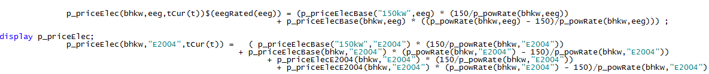
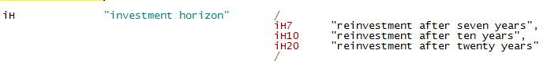
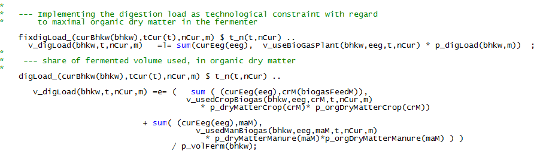

# Biogas Module

!!! abstract
    The biogas module defines the economic and technological relations between components of a biogas plant with a monthly resolution, as well as links to the farm. Thereby, it includes the statutory payment structure and their respective restrictions according to the German Renewable Energy Acts (EEGs) from 2004 up to 2014. The biogas module differentiates between three different sizes of biogas plants and accounts for three different life spans of investments connected to the biogas plant. Data for the technological and economic parameters used in the model are derived from KTBL (2014) and FNR (2013). The equations within the template model related to the biogas module are presented in the following section.

## Biogas Economic Part

The economic part describes at the one hand the revenues stemming from
the heat and electricity production of the biogas plant, and at the
other hand investment and operation costs. The guaranteed feed-in tariff
paid to the electricity producer per kWh, *p\_priceElec*, and underlying
the revenues, is constructed as a sliding scale price and is exemplary
shown in the next equation.

*p\_priceElecBase*, used to calculate the guaranteed feed-in tariff
differentiated by size, includes the base rate and additional
bonuses [^5] according to the legislative texts of the EEGs. For the EEG
2012 it only contains the base rate. In addition, the guaranteed feed-in
tariff is subject to a degressive relative factor, *p\_priceElecDeg,*
which differs between EEGs and describes price reductions over time. The
*p\_priceElecBase* is then used to calculate the electricity based
revenue of the biogas operator by multiplying it with the produced
electricity, *v\_prodElec*. In order to assure a correct representation
of the EEG 2012 payment, the biogas module differentiates the
electricity output by input source *v\_prodElecCrop* and
*v\_prodElecManure* and multiplies it with its respective bonus tariffs
*p\_priceElecInputclass* which are added to the base rate.

In addition to the *traditional* guaranteed-feed in tariff, the biogas
module comprises the payment structure for the so-called *direct
marketing option* which was implemented in the EEG 2012. The calculation
of the revenue with a direct marketing option is defined as the product
of the produced electricity, *v\_prodElec*, the sum of the market
premium, *p\_dmMP*, and the price at the electricity spot exchange EPEX
Spot, *p\_dmsellPriceHigh/Low.* The latter depends on the amount of
electricity sold during high and low stock market prices. Additionally,
it is accounted for a flexibility premium, *p\_flexPrem*.

Furthermore, the revenue stemming from heat is accounted for and it is
included as the product of sold heat, *v\_sellHeat*, times the price of
heat, *p\_priceHeat*, which is set to two cents per kWh. The amount of
head sold is set exogenously and depends on the biogas plant type.

The detailed steps of the construction of prices can be seen in
*\\coeffgen\\prices\_eeg.gms.*

## Biogas Inventory

The biogas plant inventory differentiates biogas plants by size (set
*bhkw*), which determines the engine capacity, the investment costs and
the labour use. Three size classes are currently depicted.

Moreover, in order to use a biogas plant
different components need to be present which differ by lifetime
(investment horizon *ih*). For example, in order to use the original
plant, the decision maker has to re-invest every seventh year in a new
engine but only every twentieth year in a new fermenter.

The biogas plant and their respective parts can either be bought,
*v\_buyBiogasPlant(Parts)*, or an already existing biogas plant can be
used, *p\_iniBioGas*. Both define the size of the inventory of the
biogas plant, *v\_invBioGas(Parts).* The model currently limits the
number of biogas plants present on farm to unity.

Furthermore, the inventory *v\_invBioGas* stores the information under
which EEG the plant was original erected, either by externally setting
the EEG for an existing biogas plant or the initial EEG is endogenously
determined by the year of investment. In addition, the module provides
the plant operator the option to switch from the EEG under which its
plant was original erected to newer EEGs endogenously, such that the
electricity and heat price of the newer legislation determines the
revenues of the plant. For this purpose, the variable *v\_switchBioGas*
transfers the current EEG from *v\_invBioGas* to the variable
*v\_useBioGasPlant*. Hence, the *v\_invBioGas* is used to represent the
inventory while *v\_useBioGasPlant* is used to determine the actual EEG
under which a plant is used, i.e. payment structures and feedstock
restrictions.

## Production Technology

The production technology describes not only the production process, but
also defines the limitations set by technological components such as the
engine capacity, fermenter volume and fermentation process. As heat is
only a by-product of the electricity production and therefore the
production equations do not differ from those for electricity, the heat
production is not explicitly described.

The size of the engine restricts with *p\_fixElecMonth* the maximal
output of electricity in each month. According to the available size
classes, the maximal outputs are 150kW, 250kW and 500kW, respectively,
at 8.000 operating hours per year, as it is assumed that the biogas
plant is not operating for 9% of the available time due to maintenance,
etc.

The production process of electricity, *v\_prodElec,* is constructed in
a two-stage procedure. First, biogas [^6], *v\_methCrop*/*Manure,* is
produced in the fermenter as the product of crops and manure,
*v\_usedCrop/Man,* and the amount of methane content per ton fresh
matter of the respective input. Second, the produced methane is
combusted in the engine in which the electricity--output,
*v\_prodElecCrop/Manure,* is calculated by the energy content of
methane, *p\_ch4Con,* and the conversion efficiency of the respective
engine, *p\_bhkwEffic*.

The bonus structure of the EEG 2012 requires a differentiation between
the two input classes: crop and manure. Thus, the production process is
separated in methane produced from the *Crop* input class and the
*Manure* input class.

The production technology imposes a second bound by connecting a
specific fermenter volume, *p\_volFermMonthly,* to each engine size. The
fermenter volume is exogenously given under the assumption of a 90 day
hydraulic retention time and an input mix of 70 percent maize silage and
30 percent manure. Hence, the input quantity derived from crops,
*v\_usedCropBiogas,* and manure, *v\_usedManBiogas,* is bound by the
fermenter size, *v\_totVolFermMonthly.*

The inputs for the fermentation process can be either externally
purchased, *v\_purchCrop/Manure,* or produced on farm,
*v\_feedBiogas/v\_volManBiogas*. Additionally, the module accounts for
silage losses for purchased crops, as crops from own production already
includes silage losses in the production pattern of the farm. Currently,
the model includes only cattle manure, maize silage and grass silage as
possible inputs.

The third bound imposed by the production technology is the so called
digestion load (*Faulraumbelastung*). The digestion load, *p\_digLoad,*
restricts the amount of organic dry matter within the fermenter to
ensure a healthy bacteria culture. The recommended digestion load of the
three different fermenter sizes ranges from 2.5 to 3
$\frac}*d}$ [^7] and is converted into a monthly
limit.

The data used for the fermenter technology can be seen in
*\\coeffgen\\fermenter\_tech.gms*

## Restrictions Related to the Renewable Energy Act

Within the legislative text of the different Renewable Energy Acts
different restrictions were imposed in order to receive certain bonuses
or to receive any payment at all. In the biogas module most bonuses for
the EEG 2004 and EEG 2009 are inherently included such as the KWK-Bonus
and NawaRo-Bonus, i.e. the plant is already defined such that these
additional subsidies on top of the basic feed-in tariff can be claimed.
Additionally, the biogas operator has the option to receive the
Manure-Bonus, if he ensures that 30 percent of his input quantity is
manure based, as can be seen in the following code.

Furthermore, the EEG 2012 imposes two requirements which have to be met
by the plant operator to receive any statutory payment at all. First,
the operator has to ensure that not more than 60 percent of the used
fermenter volume, *v\_totVolFermMonthly,* is used for maize. Second,
under the assumption that the operator uses 25 percent of the heat
emitted by the combustion engine for the fermenter itself, he has to
sell at least 35 percent of the generated heat externally;

Changes made in EEG 2014 and the amendment of 2016 has not been included
in the model yet.

 [^5]: For the EEG 2004: NawaRo-Bonus, KWK-Bonus; For the EEG 2009:
    Nawaro-Bonus, KWK-Bonus **or** NawaRo-Bonus, KWK-Bonus and
    Manure-Bonus

 [^6]: Biogas is a mixture of methane (CH4), carbon dioxide (CO2),
    water vapor (H2O) and other minor gases. The gas component
    containing the energy content of biogas is methane. Thus, the code
    with respect to production refers to the methane production rather
    than the production of biogas.

 [^7]: oDM = organic dry matter; m3 = cubic meter; d = day
