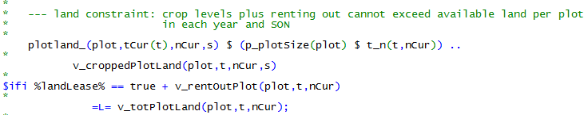
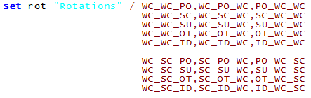
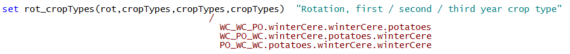
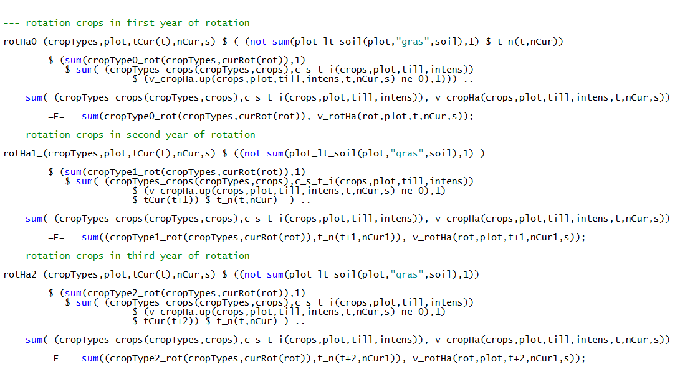

# Cropping, Land and Land Use

!!! abstract
    The cropping module optimizes the cropping pattern subject to land availability, reflecting yields, prices, machinery and fertilizing needs and other variable costs for a selectable longer list of arable crops. The crops can be differentiated by production system (plough, minimal tillage, no tillage, organic) and intensity level (normal and reduced fertilization in 20% steps). Machinery use is linked to field working days requirements depicted with a bi-weekly resolution during the relevant months. Crop rotational constraints can be either depicted by introducing crop rotations or by simple maximal shares. The model can capture plots which are differentiated by soil and land (gras, arable) type and size.

Crop activities are differentiated by crop, *crops*, soil types, *soil,*
management intensity, *intens*, and tillage type, *till*. Use of
different management intensities and tillage types is optional.
Management intensities impact yield levels (see chapter 2.11.1.1).
Necessary field operations and thus variable costs, machinery and labour
needs reflect intensity and tillage type as well.

## Cropping Activities in the Model

Crop activities are defined with a yearly resolution and can be adjusted
to the state of nature in the partially stochastic version. The farmer
is assumed to be able to adjust on a yearly basis its land use to a
specific state of nature as long as the labour, machinery and further
restrictions allow for it. Land is differentiated between arable and
permanent grass land, *landType*, the latter is not suitable for arable
cropping. Land use decisions can be restricted by maximal rotational
shares for the individual crops. The set *plot* differentiates the land
with regard to plot size, soil type and climate zone. The attributes of
plots, as well as the number of plots from 1 to 20, is defined in the
GUI.

The total land endowment is calculated in the equation *totPlotLand\_*
as the sum of the initial endowment, *p\_plotSize(plot)*, and land
purchased, *v\_buyLand*, in the past or current year.

Total cropped land is defined by the land occupied by the different
crops, *v\_cropH*a. The *c\_s\_t\_i* set defines the active possible
combinations of crops, soil type, tillage type and management intensity.

The total land *v\_totPlotLand* can be either used for cropping
(including permanent grassland), *v\_croppedLand*, or rented out,
v*\_rentOutLand*, on a yearly basis. The option to rent out land can be
activated in the GUI:

Maximum rotational shares, *p\_maxRotShare*, enter *cropRot\_*, which is
only active if no crop rotations are used (see chapter 2.3.2).

That a farm stays within a maximum stocking rate ceiling, expressed in
livestock units per ha, is ensured by the following equation. The
maximal allowed stocking rate can be adjusted in the GUI:

## Optional Crop Rotational Module

Alternatively to the use of maximum rotational shares (see previous
section) the model offers an option of a three year crop rotation
system. The rotation names (shown in the following list, see
*model\\templ\_decl.gms*), set *rot*, show the order of the crops in the
rotations. Each line depict a sequence of three crop types (do not have
to be different) in a rotation with only the order being differently.
This avoids unnecessary rigidities in the model.

Remark: WC: winter cereals, SC: summer cereals, PO: potatoes, SU: sugar
beets, ID: idling land, OT: other

The *rotations* are linked to groups of crops in the first, second and
third year of the rotation as can be seen in the following equation
(only cross-set definitions *rot\_cropTypes* for the first rotation are
shown).

The link between individual crops and crop types used in the rotation
definitions is as follows:

In order to use the crop rotations in the model equations, three cross
sets are generated which define the crop type in the first, second and
third year for each rotation:

For each simulation, crops can be selected that are cultivated on farm,
therefore, it can be the case that not all rotations are operational.
Accordingly, in *coeffgen\\coeffgen.gms*, the set of available crop
rotations is defined:

The rotations enter the model via three constraints (*see
model\\templ.gms*). The right hand side sums up the crop hectares of a
certain crop type in the current year in all four constraints, while the
left hand side exhausts these hectares in the current, next and after
next year based on the rotations grown in these years.

The rotations restrict the combination of crops and enter into the
optional soil pool balancing approach.

