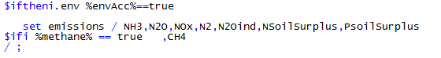
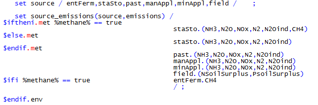
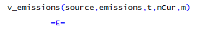
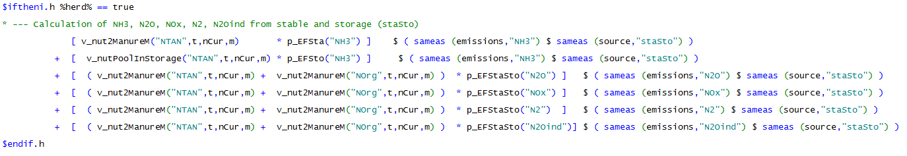
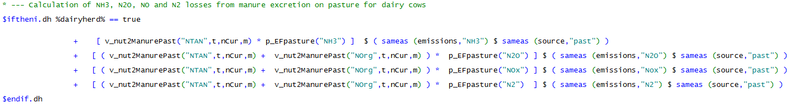
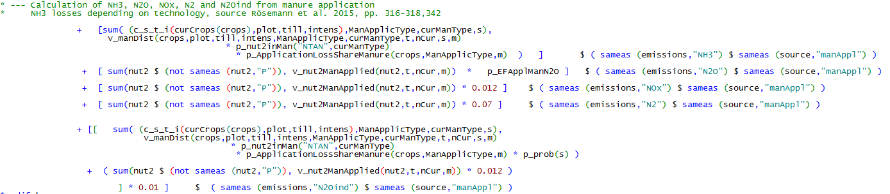
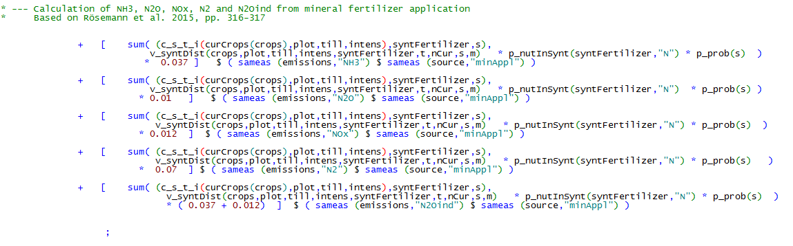
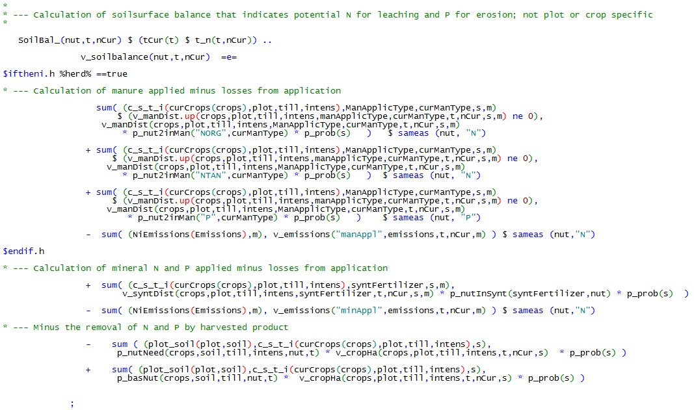

# Environmental Accounting Module

!!! abstract
    The environmental accounting module *env\_acc\_module.gms* allows quantifying Ammonia (NH3), nitrous oxide (N2O), nitrogen oxides (NOx), elemental nitrogen (N2). For nitrogen (N) and phosphate (P), soil surface balances are calculated indicating potential nitrate leaching and phosphate losses. Environmental impacts are related to relevant farming operation.

## Gaseous emissions

All relevant calculations are listed in *model\\env\_acc\_module.gms.*
Emissions of NH3, N2O, NOx and N2 are calculated, following
calculation schemes and emission factors from relevant guidelines (IPCC
2006, Rösemann et al. 2015, EMEP 2013). We apply a mass
balance approach to quantify different N emissions, subtracting emission
factors from different N pools along the nutrient flow of the farm.
Emissions factors are listed in *coeffgen\\env\_acc.gms*.

The sets *emissions* and *sources* contain relevant emissions and their
sources. The cross set *source\_emissions* links emissions to relevant
sources (Methane (CH4) is also included but still on the development
stage and therefore not described here).

All gaseous emissions are calculated in the equation *emissions\_* on a
monthly basis. By the use of *sameas* statements, only relevant sources
and emissions are activated in the corresponding part of the equation.

Calculation of emissions from stable and manure storage.

Calculation of emissions from manure excreted on pasture (only relevant
for dairy).

Calculation of emissions from manure application, application techniques
have different emission factors.

Calculation of emissions from mineral fertilizer application.

## N and P surplus

The losses of N, mainly as Nitrate to groundwater bodies, and P, mainly
via erosion and entry to surface waters, are most relevant environmental
threats of farming systems. Since it is highly depending on
environmental and geographical conditions, fixed emissions factors are
less commonly used than for gaseous losses. Therefore, we calculate N
and P surplus balances in the equation *SoilBal\_* as an indicator for
potential loss of N and P after field application. This part of the
environmental accounting will be replaced by results from crop models as
part as of an ongoing research project
(<http://www.ilr.uni-bonn.de/pe/research/project/pro/pro16_e.html>).

The balance is calculated as the difference between the nutrient input
via organic and mineral fertilizer and the removal of nutrients via the
harvested product.

Note, that the calculated surplus differs from the surplus calculated
for the threshold under the fertilizer directive (see chapter 2.11.4).
For the environmental accounting, the estimated losses from storage,
stable etc. are modelled precisely whereas fixed, prescribed values are
used for the fertilizer directive.

