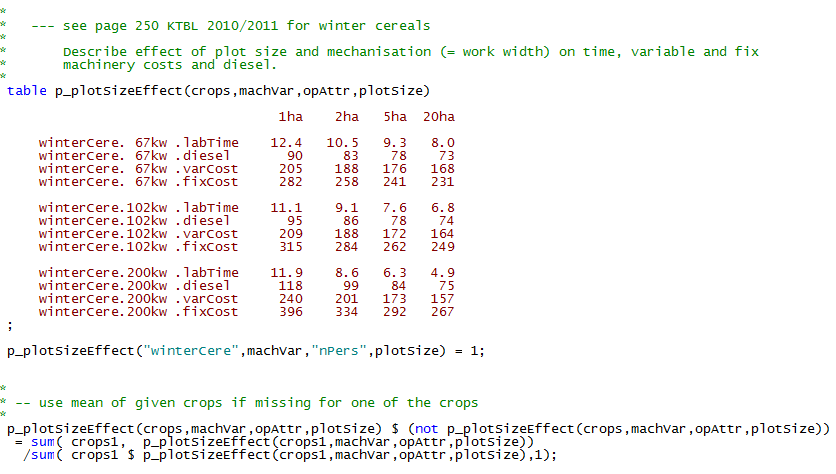
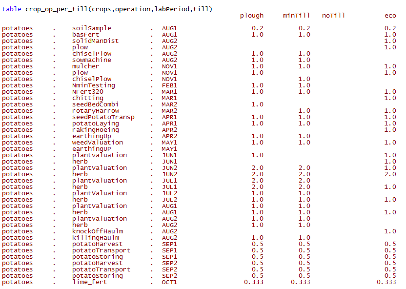
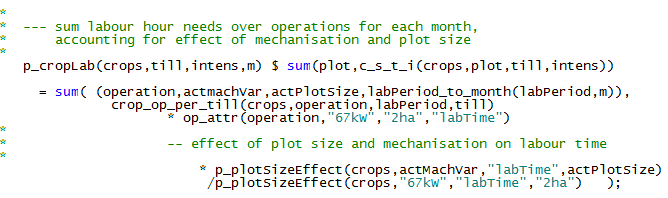
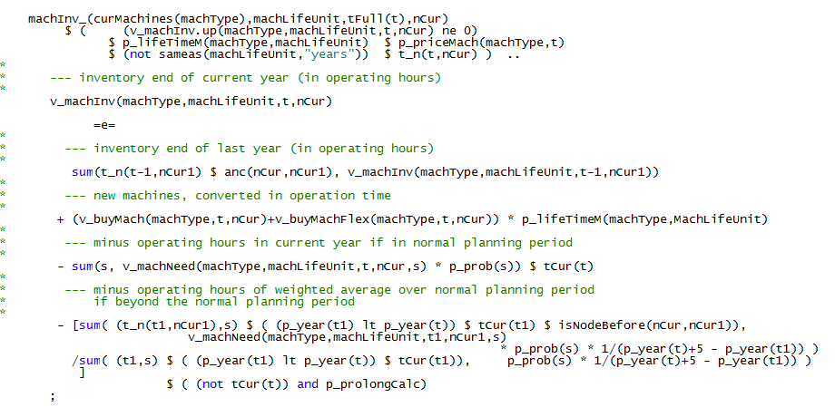
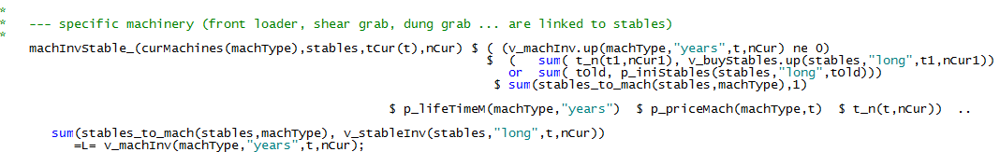

# Farm Machinery

The model includes farm machineries in quite some detail:

For further information see Appendix A1.

Each machinery type is characterized by set of attributes *p\_machAttr*
(see *coeffgen\\mach.gms*), see as an example:

## Farm Operations: Machinery Needs and Related Costs

Machinery is linked to specific farm operations (see *tech.gms*):

For more details see Appendix A2.

Labour needs, diesel, variable and fixed machinery costs are linked to
these operations, an extraction is shown in the following:

Furthermore, the model considers the effect of different plot size and
the mechanisation level:

The farm operations are linked to cropping activities (below an example
for potatoes):

That detailed information on farm operations determines

1.  The **number of necessary field working days** and *monthly labor
    need* per ha (excluding the time used for fertilizing, which is
    determined endogenously)

2.  The **machinery need** for the different crops

3.  Related **variable costs**

The labor needs per month are determined by adding up over all farm
operations, considering the labor period, the effect of plot size and
mechanization (*coeffgen\\labour.gms*):

## Endogenous Machine Inventory

The inventory equation for machinery is shown in *machInv\_*, where
*v\_machInv* is the available inventory by type, *machType,* in
operation hours. *v\_machNeed* is the machinery need of the farm in
operating hours and *v\_buyMach* are investments in new machines.

The last expression is used when the farm program for the simulated
period is used to estimate the machinery needs for all years until the
stables are fully depreciated.

The machinery need in each year is the maximum of the need in any
state-of-nature in that year:

A small set of machinery, such as the front loader, dung grab, shear
grab or fodder mixing vehicles are depreciated by time and not by use:

Those are linked to the existence of stables, i.e. stables cannot be
used if machinery is not present:

