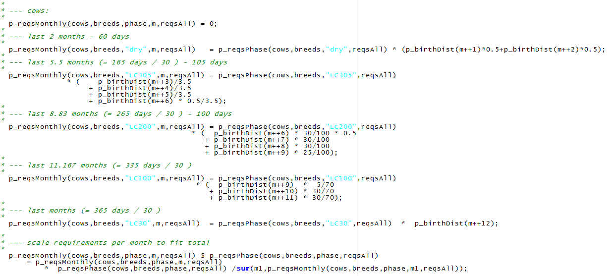
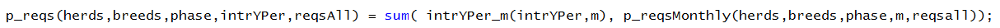
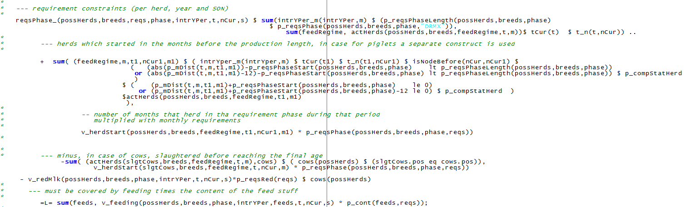
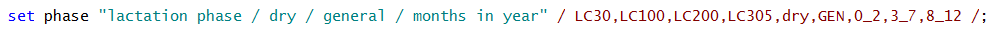
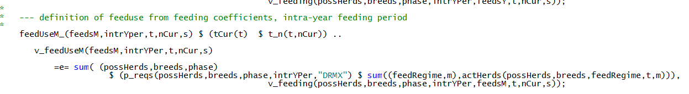
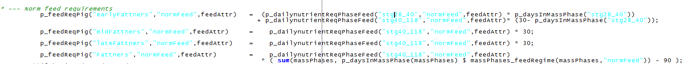

# Feeding module

!!! abstract
    The feed module distinguishes between pig and cattle feeding requirements. For a dairy herd, it captures a cost minimal feed mix from own produced fodder and different types of concentrates at given requirements per head and intra-year feeding periods (energy, protein, dry matter) for each cattle herd. For pigs it determines a cost minimal feed mix from own produced and purchased fodder and concentrates such as soybean meal and soy oil. For both branches, different feeding phases for reduced nitrogen and phosphorus output can be used.

## Cattle Feed Module

The feeding module for cattle consists of two major elements:

1.  **Requirement functions** and related constraints in the model
    template

2.  **Feeding activities**, which ensure that requirements are covered
    and link the animal to the cropping sector as well as to purchases
    of concentrates

The requirements are defined in *coeffgen\\requ.gms*. Requirements for
dairy cows are differentiated by annual milk yield and by lactation
period. The model differentiates 5 lactations period with different
lengths (30 -- 70 -- 100 -- 105 -- 60 days, where the last 60 days are
the dry period). The periods are labelled according to their last day,
e.g. *LC200* is the period from day 101 to day 200, *LC305* is the
period from the 201^st^ to the 305^th^ day and *dry* denotes the last 60
days of lactation.

??? note "Excurse - Computation of Output Coefficients for each Lactation Phase"
    This excurse describes the derivation of the output coefficient
    for each lactation phase, hence how much of yearly milk yield is
    produced by each cow on one day.

    

    5. Lactation curves of different yearly
         milk yield potentials and average milk yield in different
         lactation phases (30-70-100-105-60)

    Remark: Calculation based on Huth (1995:pp.224-226)

    Source: own illustration

    Using the above shown lactation functions, the daily fraction of the
    yearly milk yield in each lactation phase can be derived. The mean
    over the four milk yield potentials of the coefficients are shown in
    table 1.

    6. Daily fraction of whole lactation milk
         yield in different lactation phases

       |                |  LC30   | LC100  |  LC200  | LC3005  | Dry |
       |----------------|---------|--------|---------|---------|-----|
       |Daily fraction  | 0.00356 |0.0043  | 0.00333 | 0.00233 |  0  |

    Remark: Own calculation based on Huth (1995, pp.224-226)

    Following these outputs, e.g. on each of the first 30 days of
    lactation, the cow produces 0.356% of the yearly milk yield (e.g. 28
    kg per day for a cow which produces 8000 kg per year). In a next
    step, these coefficients are used to calculate the sum of milk output
    in each lactation phase to further calculate feed requirements
    stemming from the herds in each phase.

The daily milk yield in each period is based on the following statements
which define milk yield in ton/year, stored on the general output
coefficient parameter *p\_OCoeff*. The coefficient is scaled to match
total yearly milk yield.

The model differentiates for each herd between requirements for energy
in NEL, raw protein and maximum dry matter. So far, for heifers and
calves only one feeding phase is depicted such that daily requirements
during the production process are identical.

The distribution of the requirements for cows in specific lactation
periods *p\_reqsPhase*, over the months, *m*, depends on the monthly
distribution of births, *p\_birthDist*, as can be seen in the following
equation.

In order to test different model configurations and to reduce the number
of equations and variables in the model, the monthly requirements,
*p\_Monthly*, are aggregated to an intra-annual planning period,
*intrYPer*, for which a different feed mix can be used for each type of
herd, see the following equation.

The requirements per planning period, *p\_reqs*, enter the equation
structure of the model. The equations are differentiated by herd, year,
planning period and state-of-nature, and ensure the requirements are
covered by an appropriate feed mix made out of different feeding
stuff [^3]. The composition of the feed mix is determined endogenously.
In general, a herd consists of cows of different milk yield potentials,
heifers and different types of calves. Total feed requirements for a
farm in the different intra-yearly planning periods depend on the
distributions of calving dates in the cow herd, therefore, cows of the
same milk yield potential can be in different lactation phases during
the year. The requirements of tons of feed, *v\_feeding*, are
differentiated by herd, breed, planning period (lactation phase of cow),
state-of-nature and year, if the requirement phases are not defined for
specific time spans after the herd start:

Alternatively, requirements can be linked to the start point of an
animal process to break down the total requirement during the length of
the production processes in phases. The equation is only switched on if
the parameter *p\_reqsPhaseLength* is non-zero:

This extension of the feeding module is used for the raising calves
process. As a representative example the raising calves process for
females calves, fCalvsRais, from birth to the 12th month. Three
requirement phases are defined: *0\_2*, *3\_7* and *8\_12*; the labels
indicate the start and end month of each phase:

The requirements are defined for each phase separately, as
representative examples the first two phases are illustrated in the
following.

The link between the variable *v\_herdStart* and per phase requirements
when using the *reqs1\_* equation is shown in the listing below. The
requirements for the first two months, *0\_2*, are only entering the
first intra-year feeding period (which covers the months January to
April). The requirements for the next 5 months, *3\_7*, are distributed
with a weighting of 2:2:1 over the first three intra-year periods (two
months in the period of January to April, JAN\_APR, two months in the
period of May to June, MAY\_JUN, and one in the period of July to
August, JUL\_AUG). Similarly, the periods for the last five months,
*8\_12*, enter with a weighting of 1:2:2 over the last three feeding
periods of that year.

If the herd starts one month later in February (see the following
listing), the weights are shifted accordingly and one fifth of the
requirements for the last five months, *8\_12*, occurs in the first
feeding period of the next year 2012.

The model allows to not fully exploit the genetic potential of cows,
based on the endogenous variable *v\_redMlk*. Lower utilization reduces
requirements for a specific cow herd, in a specific lactation period,
year and planning period by the amount of energy and protein requirement
for a specific amount of milk and reduces milk production of the farm
accordingly.

In a next step feeding amounts are aggregated to total feed use,
v\_feeduse, per each product and for each year, feed and planning
period.

For own produced feed which is not storable and shows a variable
availability over the year such as grass from pasture, an aggregation to
the intra-year periods is done.

## Pigs Feed Module

The feeding requirements for the piglet production branch differentiate
between sows with the attached young piglets and the piglets after
separation from the sows. Requirements are set for energy, crude
protein, lysin, phosphorus feed and dry matter. Further, minimum and
maximum requirements are set for certain feeds in order to reflect
realistic feeding patterns. For example, a minimum requirement for oil
in the feed intake is assumed to assure a correct viscosity.

The fattening branch distinguishes between four fattening stages to
provide the option of nitrogen and phosphorus reduced feeding (N/P). It
includes the stages *earlyFattners*, *midFattners, lateFattners,
Fattners.* Three feeding regimes are applicable, which are: normal feed,
reduced N/P feed and highly reduced N/P feed. The primary differences
between the feeding schemes are the adjustments of daily nutrient
requirements depending on the stage a fattening pig is currently in. For
instance, with the normal feed there are only to two different feeding
requirements; a daily requirement for the weight range from 28-40 kg
which is in the early fattening phase and a daily requirement from
40-118 kg which assumes daily feed requirements in the mid, late and
finishing fattening stage. In contrast the N/P reduced feeding phase
differentiates between daily nutrient requirements for the weight ranges
28-40kg, 40-70kg and 70-118kg. Thus, all stages require different daily
nutrient requirements. In accordance with the piglet production branch,
the fattening branch also imposes maximal and minimal values for certain
products to account for digestibility, correct feeding textures and
mineral provision.

The following equations and table show a part of the feeding
requirements definition as well as minimum and maximum amounts of
certain feeding products.

The requirements are used to determine the optimal feeding mix shown in
the equation *reqPigs\_*. Hence, it can be seen which feeding products
are used by which herd type at a certain time. The equation
*feedSourcePig\_* determines the source of feed, i.e. whether it is
purchased or produced on farm.

The upper and lower bound for the feeding mix are then determined by
*feedTot\_, feedmax\_, feedMin\_* (not additionally shown here) which
allows certain flexibility in the feeding mix.

[^3]: Grass and maize silage and grass from pasture, which are own
   produced, and three type of concentrates

