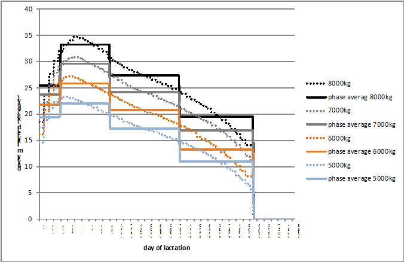

# Feeding module


!!! abstract
    The feed module distinguishes between pig and cattle feeding requirements. For a dairy herd, it captures a cost minimal feed mix from own produced fodder and different types of concentrates at given requirements per head and intra-year feeding periods (energy, protein, dry matter) for each cattle herd. For pigs it determines a cost minimal feed mix from own produced and purchased fodder and concentrates such as soybean meal and soy oil. For both branches, different feeding phases for reduced nitrogen and phosphorus output can be used.

## Cattle Feed Module

The feeding module for cattle consists of two major elements:

1.  **Requirement functions** and related constraints in the model
    template

2.  **Feeding activities**, which ensure that requirements are covered
    and link the animal to the cropping sector as well as to purchases
    of concentrates

The requirements are defined in *coeffgen\\requ.gms*. Requirements for
dairy cows are differentiated by annual milk yield and by lactation
period. The model differentiates 5 lactations period with different
lengths (30 -- 70 -- 100 -- 105 -- 60 days, where the last 60 days are
the dry period). The periods are labelled according to their last day,
e.g. *LC200* is the period from day 101 to day 200, *LC305* is the
period from the 201<sup>st</sup> to the 305<sup>th</sup> day and *dry* denotes the last 60
days of lactation.

This excurse describes the derivation of the output coefficient
for each lactation phase, hence how much of yearly milk yield is
produced by each cow on one day.


:   Figure 6: Lactation curves of different yearly
    milk yield potentials and average milk yield in different
    lactation phases (30-70-100-105-60).
    Remark: Calculation based on Huth (1995:pp.224-226)
    Source: own illustration

Using the above shown lactation functions, the daily fraction of the
yearly milk yield in each lactation phase can be derived. The mean
over the four milk yield potentials of the coefficients are shown in
Table 1.


|                |  LC30   | LC100  |  LC200  | LC3005  | Dry |
|----------------|---------|--------|---------|---------|-----|
|Daily fraction  | 0.00356 |0.0043  | 0.00333 | 0.00233 |  0  |

:   Daily fraction of whole lactation milk
    yield in different lactation phases
    Remark: Own calculation based on Huth (1995, pp.224-226)

Following these outputs, e.g. on each of the first 30 days of
lactation, the cow produces 0.356% of the yearly milk yield (e.g. 28
kg per day for a cow which produces 8000 kg per year). In a next
step, these coefficients are used to calculate the sum of milk output
in each lactation phase to further calculate feed requirements
stemming from the herds in each phase.

The daily milk yield in each period is based on the following statements
which define milk yield in ton/year, stored on the general output
coefficient parameter *p\_OCoeff*. The coefficient is scaled to match
total yearly milk yield.

[embedmd]:# (N:/em/work1/FarmDyn/FarmDyn_QM/gams/coeffgen/requ.gms GAMS /p_mlkPerDay\(dcows,"%basBreed%","LC30"\)/ /0\.002333333 \* sum\(t \$ \(t\.pos eq 1\), p_OCoeff\(dcows,"milk","%basBreed%",t\) \* 1000\);/)
```GAMS
p_mlkPerDay(dcows,"%basBreed%","LC30")  = 0.003555556 * sum(t $ (t.pos eq 1), p_OCoeff(dcows,"milk","%basBreed%",t) * 1000);
p_mlkPerDay(dcows,"%basBreed%","LC92")  = 0.004333333 * sum(t $ (t.pos eq 1), p_OCoeff(dcows,"milk","%basBreed%",t) * 1000);
p_mlkPerDay(dcows,"%basBreed%","LC213") = 0.003333333 * sum(t $ (t.pos eq 1), p_OCoeff(dcows,"milk","%basBreed%",t) * 1000);
p_mlkPerDay(dcows,"%basBreed%","LC305") = 0.002333333 * sum(t $ (t.pos eq 1), p_OCoeff(dcows,"milk","%basBreed%",t) * 1000);
```

The model differentiates between requirements for energy in net-energy for lactation, raw protein and maximum dry matter. The feeding requirements are described by the parameter `p_reqsPhase` for each herd and a certain requirement phase. As described earlier, the requirement phases of cows are differentiated into specific, fixed stages during lactation. For bulls, heifers, and calves, the amount of feeding/requirement phases are defined over the GUI. For each feeding phase, the daily requirements during the production process are identical.

The requirement functions account for differing start and final weights, as well as daily weight gains of the animals. The underlying regression models were kindly provided by the Institut für Tierernährung und Futterwirtschaft of the Bayerische Landesandstalt für Landwirtschaft (LfL)[^1].

The requirements per requirement phase `p_reqsPhase` are subsequently converted into values per month, in order to ensure that the animals are correctly fed throughout the requirement period.

[embedmd]:# (N:/em/work1/FarmDyn/FarmDyn_QM/gams/coeffgen/requ.gms GAMS /p_reqsPhaseMonths\(herds,curBreeds,reqsPhase,reqs\) \$/ /;/)
```GAMS
p_reqsPhaseMonths(herds,curBreeds,reqsPhase,reqs) $ p_reqsPhaseLength(herds,curBreeds,reqsPhase)
  = p_reqsPhase(herds,curBreeds,reqsPhase,reqs)/p_reqsPhaseLength(herds,curBreeds,reqsPhase) * 30.5;
```

The monthly requirements per planning period, `p_reqsPhaseMonths`, enter the equation structure of the model. The equations are differentiated by herd, year,
planning period and state-of-nature (SON), and ensure the requirements are
covered by an appropriate feed mix made out of different feeding
stuff [^3]. The composition of the feed mix is determined endogenously. The total feed requirements for a farm in the different intra-yearly planning periods depend on the
distribution of calving dates in the cow herd, therefore, cows of the
same milk yield potential can be in different lactation phases during
the year. The requirements of tons of feed, *v\_feeding*, are
differentiated by herd, breed, planning period (lactation phase of cow), SON and year, if the requirement phases are not defined for
specific time spans after the herd start:

[embedmd]:# (N:/em/work1/FarmDyn/FarmDyn_QM/gams/model/cattle_module.gms GAMS /reqs_[\S\s][^;]*?\.\./ /;/)
```GAMS
reqs_(possHerds,breeds,feedRegime,reqs,reqsPhase,m,t_n(tCur,nCur))
        $ sum( m_to_herdm(m,herdm)
                                   $ (p_reqsPhaseLengthMonths(possHerds,breeds,"gen")
                                   $ p_reqsPhaseMonths(possHerds,breeds,reqsphase,reqs)),
                                     actHerds(possHerds,breeds,feedRegime,tCur,herdm)) ..
*
*      --- herd size times requirements per head, minus year and SON specific reduction in milk yield

        sum((m_to_herdm(m,herdm)) $ actHerds(possHerds,breeds,feedRegime,tCur,herdm),
               v_herdSize(possHerds,breeds,feedRegime,tCur,nCur,herdm)
                 *p_corrHerdm(possHerds,breeds)*p_reqsPhaseMonths(possHerds,breeds,reqsPhase,reqs))
*
*      --- must be covered by feeding times the content of the feed stuff
*
          =L= sum( feeds,v_feeding(possHerds,breeds,feedRegime,reqsPhase,m,feeds,tCur,nCur) * p_feedContFMton(feeds,reqs))$(sameas(feedregime,"noGraz"))
             +sum( feeds $(not sum( sameas(feeds,roughage),1)),v_feeding(possHerds,breeds,feedRegime,reqsPhase,m,feeds,tCur,nCur) * p_feedContFMton(feeds,reqs))$(not sameas(feedregime,"noGraz"))
             ;
```

Alternatively, requirements can be linked to the start point of an
animal process to break down the total requirement during the length of
the production processes in phases. The equation is only switched on if
the parameter `p_reqsPhaseLength` is non-zero:

[embedmd]:# (N:/em/work1/FarmDyn/FarmDyn_QM/gams/model/cattle_module.gms GAMS /reqsPhase_[\S\s][^;]*?\.\./ /;/)
```GAMS
reqsPhase_(possHerds,breeds,feedRegime,reqs,reqsPhase,m,t_n(tCur,nCur))
             $ (sum(m_to_herdm(m,herdm),actHerds(possHerds,breeds,feedRegime,tCur,herdm))
                  $ (not p_reqsPhaseLengthMonths(possHerds,breeds,"gen"))
                  $ p_reqsPhase(possHerds,breeds,reqsPhase,reqs)) ..
*
*         --- herds which started in the months before the production length
*
*                   -- number of months that herd in that requirement phase during that period
*                      multiplied with monthly requirements
*
              sum((m_to_herdm(m,herdm)) $ actHerds(possHerds,breeds,feedRegime,tCur,herdm),
                     v_herdsReqsPhase(possHerds,breeds,feedRegime,reqsphase,herdm,tCur,nCur)
                       * p_corrHerdm(possHerds,breeds) * p_reqsPhaseMonths(possHerds,breeds,reqsPhase,reqs))
*
*      --- must be covered by feeding times the content of the feed stuff
*
          =L= sum( feeds,v_feeding(possHerds,breeds,feedRegime,reqsPhase,m,feeds,tCur,nCur) * p_feedContFMton(feeds,reqs))$(sameas(feedregime,"noGraz"))
             +sum( feeds $(not sum(sameas(feeds,roughage),1)),v_feeding(possHerds,breeds,feedRegime,reqsPhase,m,feeds,tCur,nCur) * p_feedContFMton(feeds,reqs))$(not sameas(feedregime,"noGraz"))
          ;
```

In a next step feeding amounts are aggregated to total feed use,
*v\_feeduse*, per each product and for each year, feed and planning
period.

[embedmd]:# (N:/em/work1/FarmDyn/FarmDyn_QM/gams/model/cattle_module.gms GAMS /feedUse_[\S\s][^;]*?\.\./ /;/)
```GAMS
feedUse_(feedsY,t_n(tCur,nCur))  ..

       v_feedUse(feedsY,tCur,nCur)

           =e= sum( (possHerds,breeds,feedRegime,reqsPhase,m) $ (actHerds(possHerds,breeds,feedRegime,tCur,m)
                      $ p_reqsPhase(possHerds,breeds,reqsPhase,"DMMX")),
                            v_feeding(possHerds,breeds,feedRegime,reqsPhase,m,feedsY,tCur,nCur));
```

For own produced feed which is not storable and shows a variable
availability over the year, such as grass from pasture, an aggregation to
the intra-year periods is done.

[embedmd]:# (N:/em/work1/FarmDyn/FarmDyn_QM/gams/model/cattle_module.gms GAMS /feedUseM_[\S\s][^;]*?\.\./ /;/)
```GAMS
feedUseM_(feedsM,m,t_n(tCur,nCur)) ..

       v_feedUseM(feedsM,m,tCur,nCur)

           =e= sum( (possHerds,breeds,feedRegime,reqsPhase)
                      $ (p_reqsPhase(possHerds,breeds,reqsPhase,"DMMX")
                       $ sum(m_to_herdm(m,herdm),actHerds(possHerds,breeds,feedRegime,tCur,herdm))),
                                            v_feeding(possHerds,breeds,feedRegime,reqsPhase,m,feedsM,tCur,nCur));
```

## Pigs Feed Module

The feeding requirements for the piglet production branch differentiate
between sows with the attached young piglets and the piglets after
separation from the sows. Requirements are set for energy, crude
protein, lysin, phosphorus feed and dry matter. Further, minimum and
maximum requirements are set for certain feeds in order to reflect
realistic feeding patterns. For example, a minimum requirement for oil
in the feed intake is assumed to assure a correct viscosity.

The fattening branch distinguishes between four fattening stages to
provide the option of nitrogen and phosphorus reduced feeding (N/P). It
includes the stages *earlyFattners*, *midFattners*, and *lateFattners*,
Fattners.* Three feeding regimes are applicable, which are: normal feed,
reduced N/P feed and highly reduced N/P feed. The primary differences
between the feeding schemes are the adjustments of daily nutrient
requirements depending on the stage a fattening pig is currently in. For
instance, with the normal feed there are only two different feeding
requirements; a daily requirement for the weight range from 28-40 kg
which is in the early fattening phase and a daily requirement from
40-118 kg which assumes daily feed requirements in the mid, late and
finishing fattening stage. In contrast the N/P reduced feeding phase
differentiates between daily nutrient requirements for the weight ranges
28-40kg, 40-70kg and 70-118kg. Thus, all stages require different daily
nutrient requirements. In accordance with the piglet production branch,
the fattening branch also imposes maximal and minimal values for certain
products to account for digestibility, correct feeding textures and
mineral provision.

The requirements are used to determine the optimal feeding mix shown in
the equation *reqPigs\_*. Hence, it can be seen which feeding products
are used by which herd type at a certain time. The equation
*feedSourcePig\_* determines the source of feed, i.e. whether it is
purchased or produced on farm.

[embedmd]:# (N:/em/work1/FarmDyn/FarmDyn_QM/gams/model/pig_module.gms GAMS /reqPigs_\(p/ /;/)
```GAMS
reqPigs_(possHerds,feedAttr,feedRegime,tCur(t),nCur,m) $( sum(actHerds(herds,"",feedRegime,t,m),1) $ t_n(t,nCur)
                                           $ (not sameas(possherds,"pigletsBought")) $ (not sameas(possherds,"youngSows"))
                                           $ (not sameas(possherds,"youngPiglets"))) ..

         v_herdSize(possHerds,"",feedRegime,t,nCur,m) * p_feedReqPig(possHerds,feedRegime,feedAttr)

* --- Accounting for temporal resolution for sows

$iftheni.sows "%farmBranchSows%" == "on"
                                                 * 12/card(herdM)
$endif.sows
                                   =L=
                           sum(feedspig , v_feedingPig(possherds,feedsPig,feedRegime,t,nCur,m) * p_feedAttrPig(feedsPig,feedAttr));
```

[embedmd]:# (N:/em/work1/FarmDyn/FarmDyn_QM/gams/model/pig_module.gms GAMS /feedSourcePig_.*?\.\./ /;/)
```GAMS
feedSourcePig_(feedspig,tCur(t),nCur) $ ( sum(actHerds(herds,"",feedRegime,t,m),1) $ t_n(t,nCur))   ..

                (v_feedOwnPig(feedspig,t,nCur) $ (sum(sameas(curProds,feedspig),1))) + v_feedPurchPig(feedspig,t,nCur)
                            =E=
                       sum((possherds,feedRegime,m) $ ((not sameas(possherds,"pigletsBought")) $ (not sameas(possherds,"youngSows"))
                                         $  (not sameas(possherds,"youngPiglets"))),
                                                                                   v_feedingPig(possherds,feedsPig,feedRegime,t,nCur,m));
```

The upper and lower bound for the feeding mix are then determined by
*feedTot\_, feedmax\_, feedMin\_* (not additionally shown here) which
allows certain flexibility in the feeding mix.

However, for the fatteners the feeding mix is fixed for different feeding regimes to
precisely reproduce empirically found feeding ratios.

[embedmd]:# (N:/em/work1/FarmDyn/FarmDyn_QM/gams/coeffgen/requ.gms GAMS /p_feedMinPigday\(f/ /0\.032/)
```GAMS
p_feedMinPigday(feedRegime,massPhases,feedspig)

                                   soybeanMeal     rapeSeedMeal      PlantFat     MinFu      MinFu2      MinFu3     MinFu4

        normFeed.stg28_40            0.23                             0.015       0.037
        normFeed.stg40_118           0.195                            0.015       0.032
```

[^1]: The regression models originate from the ["Zifo2" Target-value fodder optimization program](http://www.zifo-bayern.de/) of the LfL Bayern.
