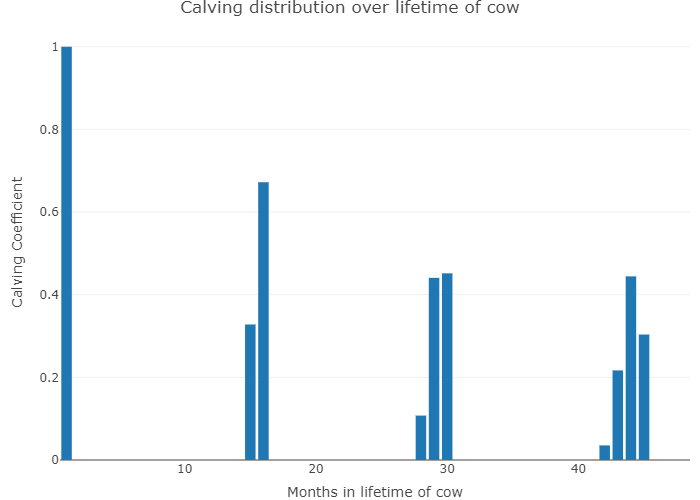
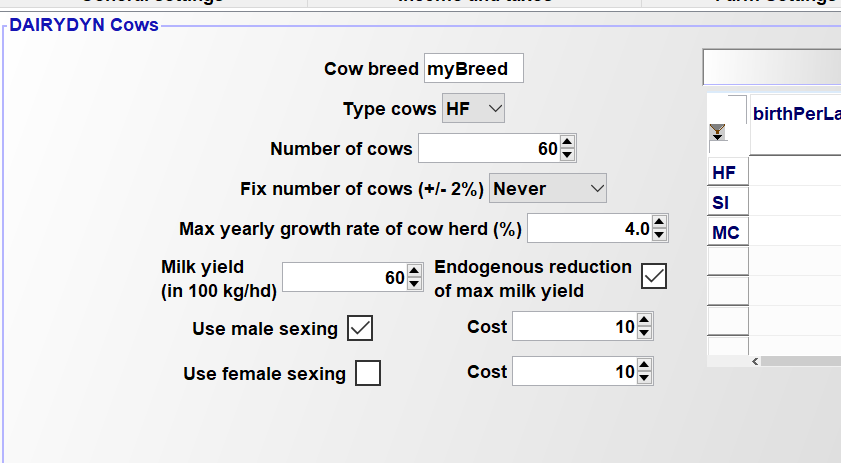
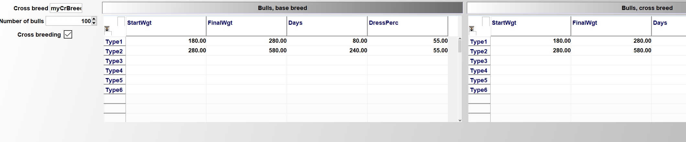

# Herd Module


Animals are dealt with in three parts of the model: the general herd
module, the cattle module and the pig module. The general herd module
depicts the herd demography while the latter two add aspects specific to
cattle and pigs.

## General Herd Module

!!! abstract
    The herd module captures the intra-temporal demographic relations between different herds (number of animals born, replacement rates, raising periods etc.), at a maximal intra-yearly resolution of single months. The temporal resolution can be increased by aggregation on demand to reduce model size.

The general herd module depicts relations between herds of different
animal types on farm. Specifically, herds are differentiated by age,
gender, breeds, production objectives, month in each year.

The model uses two different variables to describe herds: *v\_herdStart*
describes the number of animals by type which enter a production
process at a certain time, while *v\_herdSize* describes the number of
animals by type at the farm at a specific time. More precisely the
standing herd, *v\_herdSize*, can be described as animals which joint
the herd since the beginning of the production process, *v\_herdStart,*
minus sold and slaughtered ones, as can be seen in the following equation. The
parameter *p\_mDist* in the equation describes the difference in months
between two time points defined by year, *t, t1*, and month, *m, m1*,
*p\_prodLength* depicts the length of the production process in months.

[embedmd]:# (N:/em/work1/FarmDyn/FarmDyn_QM/gams/model/general_herd_module.gms GAMS /herdSize_[\S\s][^;]*?\.\./ /;/)
```GAMS
herdSize_(herds,breeds,tCur(t),nCur,m) $ (sum(FeedRegime,actHerds(herds,breeds,feedRegime,t,m))

          $  sum( (t_n(t1,nCur1),feedRegime,m1)
                                     $ ( (   (-p_mDist(t,m,t1,m1)    le (p_prodLength(herds,breeds)-1)
                                          $ (p_mDist(t,m,t1,m1) le 0))

                                         or
                                          ( (abs(p_mDist(t,m,t1,m1)-12) le (p_prodLength(herds,breeds)-1))
                                              $ (p_mDist(t,m,t1,m1)-12 le 0)) $ p_compStatHerd
                                        )
                              $ actHerds(herds,breeds,feedRegime,t1,m1)
                              $ (balherds(herds) or remonte(herds) or sameas("remonte",herds))
                              $ t_n(t,nCur) $ isNodeBefore(nCur,nCur1)),1)
                                 ) ..

     sum(feedRegime $ actHerds(herds,breeds,feedRegime,t,m),v_herdSize(herds,breeds,feedRegime,t,nCur,m))

          =E=
*
*         --- herds which started in the months before the production length, in case for piglets a separate construct is used
*

          +  sum( (t_n(t1,nCur1),m1) $ (
                                       ((   (-p_mDist(t,m,t1,m1)    le (p_prodLength(herds,breeds)-1))
                                          $ (p_mDist(t,m,t1,m1) le 0))

                                         or
                                          ( (abs(p_mDist(t,m,t1,m1)-12) le (p_prodLength(herds,breeds)-1))
                                              $ (p_mDist(t,m,t1,m1)-12 le 0)) $ p_compStatHerd
                                       )
                              $ sum(feedRegime,actHerds(herds,breeds,feedRegime,t1,m1)) $ isNodeBefore(nCur,nCur1)
                     $$iftheni.sows "%farmBranchSows%" == "on"
                              $(not sameas(herds,"piglets"))
                     $$endif.sows
                               ),
                    v_herdStart(herds,breeds,t1,nCur1,m1)


                    $$iftheni.ch %cowHerd%==true
*
*                   --- minus, in case of cows, slaughtered before reaching the final age
*
                         -sum( (slgtCows,cows) $ (sum(feedRegime, actHerds(slgtCows,breeds,feedRegime,t1,m1))
                              $ sameas(cows,herds) $ (slgtCows.pos eq cows.pos)),
                                 v_herdStart(slgtCows,breeds,t1,nCur1,m1))
                    $$endif.ch
            )
*
*         --- Herd size dynamic for piglets separately to depict a correct transfer from year t to year t1 as well as account for temporal resolution adjustments
*

          $$iftheni.sows "%farmBranchSows%" == "on"
        +  sum( (t_n(t1,nCur1),m1) $ ( (abs(p_mDist(t,m,t1,m1)) le (p_prodLengthB(herds,breeds) -1 $ (p_prodLengthB(herds,breeds) eq 1)))
                              $ (p_mDist(t,m,t1,m1) le 0) $ isNodeBefore(nCur,nCur1)
                              $ sum(feedRegime,actHerds(herds,breeds,feedRegime,t1,m1))
                              $ (not sameas(herds,"sows"))
                              ${ ( sameas(t,t1) $ (not sameas(m  - p_prodLengthB(herds,breeds),m1)))
                                or ((not sameas(t,t1)) $ (sameas("Jan",m))$ (sameas( m + 11, m1)))}),

                   v_herdStart(herds,"",t1,nCur1,m1))
          $$endif.sows
    ;
```


The definition of the number of animals being added to the herd,
*v\_herdStart*, is described in the equation *herdBal\_*. In the
simplest case, where a 1:1 relation between a delivery and a use process
exists, the number of new animals entering the different use processes
*balherds* is equal to the number of new animals of the delivery process
*herds*. This relation is depicted by the *herds\_from\_herds* set.

One possible extension is that animals entering the herd can be
alternatively bought from the market, defined by the set
*bought\_to\_herds*. The symmetric case is when the raised/fattened
animals are sold, which is described by the *sold\_from\_herds* set.

For the case where several delivering processes are available, for
example heifers of a different process length replacing cows, the set
*herds\_from\_herds* describes a 1:n relation. A similar case exists if
one type of animal, say a raised female calve, can be used for different
processes such as replacement or slaughter, such that the expression
turns into a n:1 relation. This case is captured by second additive
expression in the equation.

In comparative static mode *p\_compStatHerd*, all lags are removed such
that a steady-state herd model is described.

[embedmd]:# (N:/em/work1/FarmDyn/FarmDyn_QM/gams/model/general_herd_module.gms GAMS /herdsBal_[\S\s][^;]*?\.\./ /;/)
```GAMS
herdsBal_(balHerds,breeds,tCur(t),nCur,m) $ (  sum(feedRegime,actherds(balHerds,breeds,feedRegime,t,m)) $ t_n(t,nCur)
*
     $ (p_Year(t) le p_year("%lastYear%"))
     $ (sum( (herds_from_herds(balHerds,herds,breeds),t1,m1)
                   $ ( (-p_mDist(t,m,t1,m1) eq round(p_prodLengthB(herds,breeds)/(12/card(herdM)))* (12/card(herdM)) )
                           $  sum(feedRegime,actHerds(herds,breeds,feedRegime,t1,m1))),1)
       $$iftheni.compStat "%dynamics%" == "comparative-static"
         or (sum( (herds_from_herds(balHerds,herds,breeds),t1,m1)
                   $ ( (-p_mDist(t,m,t1,m1)+12 eq round(p_prodLengthB(herds,breeds)/(12/card(herdM)))* (12/card(herdM)) )
*                     and not (-p_mDist(t,m,t1,m1) eq round(p_prodLengthB(herds,breeds)/(12/card(herdM)))* (12/card(herdM)) )
                           $  sum(feedRegime,actHerds(herds,breeds,feedRegime,t1,m1))),1))
       $$endif.compStat
                           or sum((bought_to_herds(herds,breeds,balherds),feedRegime) $ actherds(herds,breeds,feedRegime,t,m),1)
                           or sum((sold_from_herds(herds,breeds,balherds),feedRegime) $ actherds(herds,breeds,feedRegime,t,m),1)  )
                        ) ..
*
*      --- herd starting at current time point
*
          v_herdStart(balHerds,breeds,t,nCur,m)/p_herdYearScaler(balHerds,breeds)

*
*      --- plus herd starting at current time point which compete for the same input herds
*

     + sum( herds1 $ [ (sum(herds_from_herds(herds1,herds,breeds)
                                      $ herds_from_herds(balHerds,herds,breeds),1)
                    or sum(bought_to_herds(herds,breeds,herds1)
                            $ bought_to_herds(herds,breeds,balherds),1))
                    $ (not sameas(balHerds,herds1)) $  sum(feedRegime,actherds(herds1,breeds,feedRegime,t,m))],
          v_herdStart(herds1,breeds,t,nCur,m)/p_herdYearScaler(herds1,breeds))

*
*      --- sold animals from the process (e.g. female calv one year old)
*
       + sum( sold_from_herds(herds,breeds,balherds) $ sum(feedRegime,actherds(herds,breeds,feedRegime,t,m)),
                                             v_herdStart(herds,breeds,t,nCur,m))


         =e=
*
*      --- equal to the starting herd of the process wich generates these herds
*
     + sum( (herds_from_herds(balHerds,herds,breeds),t_n(t1,nCur1),m1)
                   $ (( (-p_mDist(t,m,t1,m1)    eq round(p_prodLengthB(herds,breeds)/(12/card(herdM)))* (12/card(herdM)) )
                $$iftheni.compStat "%dynamics%" == "comparative-static"
                     or (-p_mDist(t,m,t1,m1)+12 eq round(p_prodLengthB(herds,breeds)/(12/card(herdM)))* (12/card(herdM)) )
                $$endif.compStat
                      )    $  sum(feedRegime,actHerds(herds,breeds,feedRegime,t1,m1)) $ isNodeBefore(nCur,nCur1)),
                                    v_herdStart(herds,breeds,t1,nCur1,m1))

*
*      --- bought to herd (e.g. heifers bought from market)
*
     + sum( (bought_to_herds(herds,breeds,balherds))
           $ sum(feedRegime,actherds(herds,breeds,feedRegime,t,m)), v_herdStart(herds,breeds,t,nCur,m));
```

## Cattle Module

!!! abstract
     Herds can be differentiated by animal types - such as cow, heifer, calf -, breeds, and feeding regimes.

The cattle module is closely related to the general herd module. It
describes the demographic relations between cattle types (dairy cows,
mother cows, male and female calves, heifers, young bulls) on the farm.
New-born calves can be sold immediately or after one year or being
raised to a heifer or young bulls, respectively. The heifer process,
starting with a female calf raised for one year, is available in three
intensity levels, leading to different process lengths (12, 21, 27
month) and thus first calving ages (12, 33 and 40 months) for the
replacement. In Figure 3 the general concept of the cattle module and its
decision points are illustrated.


:    Figure 3: Cattle herd module management decisions

The number of new calves *v\_herdStart* are differentiated by gender and
breed, in a year *t*, and specific month *m*, and depend on the herd
size of cows of each breed and a specific calving coefficients.
*ActHerds* is a flag set to define which herds might enter the solution
for a specific year.

[embedmd]:# (N:/em/work1/FarmDyn/FarmDyn_QM/gams/model/cattle_module.gms GAMS /newCalves_[\S\s][^;]*?\.\./ /;/)
```GAMS
newCalves_("%basBreed%",t,nCur,m) $ ( sum( (calvs,feedRegime), actHerds(calvs,"%basBreed%",feedRegime,t,m))
                        $ (p_Year(t) le p_year("%lastYear%")) $ t_n(t,nCur)) ..
*
*      --- new born calves (for females by genetic potential for milk yield) are born
*          from the current herd of cows
*
                  v_herdStart("fCalvsRais","%basBreed%",t,nCur,m)  $ sum(feedRegime,actHerds("fCalvsRais","%basBreed%",feedRegime,t,m))
                + v_herdStart("fCalvsSold","%basBreed%",t,nCur,m)  $ sum(feedRegime,actHerds("fCalvsSold","%basBreed%",feedRegime,t,m))
                + v_herdStart("mCalvsSold","%basBreed%",t,nCur,m)  $ sum(feedRegime,actHerds("mCalvsSold","%basBreed%",feedRegime,t,m))
                + v_herdStart("mCalvsRais","%basBreed%",t,nCur,m)  $ sum(feedRegime,actHerds("mCalvsRais","%basBreed%",feedRegime,t,m))
              $$iftheni.crossBreed "%crossBreeding%"=="true"
               + v_herdStart("fCalvsRais","%crossBreed%",t,nCur,m) $ sum(feedRegime,actHerds("fCalvsRais","%crossBreed%",feedRegime,t,m))
               + v_herdStart("fCalvsSold","%crossBreed%",t,nCur,m) $ sum(feedRegime,actHerds("fCalvsSold","%crossBreed%",feedRegime,t,m))
               + v_herdStart("mCalvsSold","%crossBreed%",t,nCur,m) $ sum(feedRegime,actHerds("mCalvsSold","%crossBreed%",feedRegime,t,m))
               + v_herdStart("mCalvsRais","%crossBreed%",t,nCur,m) $ sum(feedRegime,actHerds("mCalvsRais","%crossBreed%",feedRegime,t,m))
             $$endif.crossBreed


          =e= sum( (cows,t1,nCur1,m1,mDist) $ (sum(feedRegime,actHerds(cows,"%basBreed%",feedRegime,t1,m1))
                  $ (      (mDist.pos  eq -p_mDist(t,m,t1,m1))
                         or (mDist.pos eq -p_mDist(t,m,t1,m1)+12) $ p_compStatHerd)
                       $ t_n(t1,nCur1)),
                          v_herdStart(cows,"%basBreed%",t1,nCur1,m1) * p_calvCoeff(cows,"%basBreed%",mDist));
```


The calving coefficients are defined in the *Cows* tab of the GUI.
Here, the amount of births per lactation, living calves per birth, calf losses, and days between births can be set for the different breeds Holstein-Friesian (HF), Simmental (SI, which stands a placeholder for the individual breed defined in the GUI), and mother cows. The values are stored in the parameter ```p_calvAttr```.

The amount of calves that are born in a given month is derived from the information entered in the GUI with the help of an entropy estimator. For the sake of simplicity, but without loss of generality, it is assumed that birth is equally likely in the two months surrounding the average calving interval.

[embedmd]:# (N:/em/work1/FarmDyn/FarmDyn_QM/gams/coeffgen/ini_herds.gms GAMS /set curCycleLength/ /NLP;/)
```GAMS
set curCycleLength / l11*l15 /;
*
*  --- entropy estimator
*
   variable v_ent "Entropy";
   positive variables         v_prob(cowTypes,curCycleLength)

   parameter p_cycleLength(curCycleLength);
   p_cycleLength(curCycleLength) = 10 + curCycleLength.pos;


   equation e_ent                    "Entropy definition"
            e_daysBetweenBirths      "Recover given information on inter calving interval"
            e_sumUnity               "Probs add up to unity"
   ;

   e_ent .. -v_ent =E=  sum( (cowTypes,curCycleLength),v_prob(cowTypes,curCycleLength)
                                 * log(v_prob(cowTypes,curCycleLength)/card(curCycleLength)));

   e_daysBetweenBirths(cowTypes) ..
        p_calvAttr(cowTypes,"daysBetweenBirths")/30.5
                 =E=  sum(curCycleLength, v_prob(cowTypes,curCycleLength)* p_CycleLength(curCycleLength));

   e_sumUnity(cowTypes) ..  sum(curCycleLength, v_prob(cowTypes,CurCycleLength)) =E= 1;

   v_prob.up(cowTypes,curCycleLength) = 1;
   v_prob.lo(cowTypes,curCycleLength) = 1.E-5;

   v_prob.fx(cowTypes,curCycleLength) $ (p_calvAttr(cowTypes,"daysBetweenBirths")/30.5 lt p_CycleLength(curCycleLength)-1) = 1.E-6;
   v_prob.fx(cowTypes,curCycleLength) $ (p_calvAttr(cowTypes,"daysBetweenBirths")/30.5 gt p_CycleLength(curCycleLength)+1) = 1.E-6;

   v_prob.l(cowTypes,CurCycleLength)  = 1/card(CurCycleLength);

   model m_ent / e_ent,e_daysBetweenBirths,e_sumUnity /;
   solve m_ent maximizing v_ent using NLP;
```

The calving probabilities are then mapped to the actual endogenous calving distribution in the parameter `p_calvCoeff`, which is subsequently used in the `herdStart_` equation.  

[embedmd]:# (N:/em/work1/FarmDyn/FarmDyn_QM/gams/coeffgen/ini_herds.gms GAMS /p_calvCoeff\(dCows,"%basBreed%",mDist\)/ /;/)
```GAMS
p_calvCoeff(dCows,"%basBreed%",mDist)
     $ ( (mDist.pos ge 12)
          $ (mDist.pos/12 le (ceil(p_nlac(dcows)))*p_calvAttr("%cowType%","daysBetweenBirths")/365))
            = sum( curCycleLength $ (mod(mDist.pos-1,curCycleLength.pos+11) eq 0),
                p_livingCalvesPerYear(dCows,"%basBreed%") * v_prob.l("%cowType%",curCycleLength)  );
```

For a cow with a lifespan of four lactations, the calving distribution is depicted in the following figure. Notice how the distribution widens with increasing amounts of lactations.


:   Figure 3: Calving distribution of a cow with four lactations, according to the endogenous calculation. Source: Own representation.

In order to provide a better overview of model results in the equation listing, a yearly average herd size is calculated in the equation `sumHerds_`:

[embedmd]:# (N:/em/work1/FarmDyn/FarmDyn_QM/gams/model/cattle_module.gms GAMS /sumHerds_.*?\$/ /;/)
```GAMS
sumHerds_(sumHerds,breeds,feedRegime,t,nCur,m) $ (t_n(t,nCur)
*                       $ sum(sum_herds(sumHerds,PossHerds) $ (p_prodLength(possHerds,breeds) gt 1),1)
                       $  sum(sum_herds(sumHerds,possHerds) $ actHerds(possHerds,breeds,feedRegime,t,m),1)) ..

       v_herdSize(sumHerds,breeds,feedRegime,t,nCur,m)
          =e= sum(sum_herds(sumHerds,possHerds) $ actHerds(possHerds,breeds,feedRegime,t,m) ,
                 v_herdSize(possHerds,breeds,feedRegime,t,nCur,m) $ (p_prodLength(possHerds,breeds) gt 1)
              +  v_herdStart(possHerds,breeds,t,nCur,m) $ (p_prodLength(possHerds,breeds) eq 1));
```
## Sexing

On interface: define if it used to generate males and/or females and define costs


In the “model\templ.gms”, male and female sexing are treated as inputs with their prices:

[embedmd]:# (N:/em/work1/FarmDyn/FarmDyn_QM/gams/model/templ.gms GAMS /buy_\(curi/ /\.\./)
```GAMS
buy_(curinputs(inputs),tCur(t),nCur) $ (t_n(t,nCur)) ..
```

[embedmd]:# (N:/em/work1/FarmDyn/FarmDyn_QM/gams/model/templ.gms GAMS /\*.*?sexing/ /"male.*?"\)/)
```GAMS
*             --- costs of sexing
*
              + sum((breeds,m),v_sexingF(breeds,t,nCur,m)) $ sameas(inputs,"femaleSexing")
              + sum((breeds,m),v_sexingM(breeds,t,nCur,m)) $ sameas(inputs,"maleSexing")
```

The prices are taken from the interface and introduced in “coeffgen\prices.gms”:

[embedmd]:# (N:/em/work1/FarmDyn/FarmDyn_QM/gams/coeffgen/prices.gms GAMS /p_in.*?\("maleS/ /;/)
```GAMS
p_inputPrices("maleSexing","price")   = %costMaleSexing%;
```

[embedmd]:# (N:/em/work1/FarmDyn/FarmDyn_QM/gams/coeffgen/prices.gms GAMS /p_in.*?\("femaleS/ /;/)
```GAMS
p_inputPrices("femaleSexing","price") = %costfemaleSexing%;
```

If the user has sexing switched off, the variable is fixed to zero in “model\define_starting_bounds”:

[embedmd]:# (N:/em/work1/FarmDyn/FarmDyn_QM/gams/model/define_starting_bounds.gms GAMS /\*.*?switch/ /ingM.*?;/)
```GAMS
*   --- switch off sexing if not activated by user

    $$ifi not "%useFemaleSexing%"=="true" v_sexingF.fx(breeds,t_n(t,nCur),m) = 0;
    $$ifi not "%useMaleSexing%"=="true"   v_sexingM.fx(breeds,t_n(t,nCur),m) = 0;
```

Sexing changes the male-female balance equation (see model\cattle_module.gms):

[embedmd]:# (N:/em/work1/FarmDyn/FarmDyn_QM/gams/model/cattle_module.gms GAMS /maleFemaleRel_.*?nCur/ /;/)
```GAMS
maleFemaleRel_(breeds,t,nCur,m) $( sum( (feedRegime,calvs), actHerds(calvs,breeds,feedRegime,t,m))
                        $ (p_Year(t) le p_year("%lastYear%")) $ t_n(t,nCur)) ..


                 [
                   v_herdStart("fCalvsRais",breeds,t,nCur,m) $ sum(feedRegime,actHerds("fCalvsRais",breeds,feedRegime,t,m))
                 + v_herdStart("fCalvsSold",breeds,t,nCur,m) $ sum(feedRegime,actHerds("fCalvsSold",breeds,feedRegime,t,m))
                 ] /0.495

                 + v_sexingF(breeds,t,nCur,m)*0.5
                 - v_sexingM(breeds,t,nCur,m)*0.5

             =E=
                 - v_sexingF(breeds,t,nCur,m)*0.5
                 + v_sexingM(breeds,t,nCur,m)*0.5

             +[
                   v_herdStart("mCalvsRais",breeds,t,nCur,m) $ sum(feedRegime,actHerds("mCalvsRais",breeds,feedRegime,t,m))
                 + v_herdStart("mCalvsSold",breeds,t,nCur,m) $ sum(feedRegime,actHerds("mCalvsSold",breeds,feedRegime,t,m))
              ] / 0.505;
```

If sexing is switched off, the number of female siblings (LHS) must be (approximately) equal to the males ones (RHS). Sexing an insemination to male will take 0.5 female out and increase the number of males of 0.5. Female sexing leads to the opposite effect.

##Cross-Breeding
Cross breeding can be switched on the interface on the “bulls” tab:


As consequence, a second table is offered where data for the cross-breed can be entered.

The cross-breeds enter the calves balance (*model\cattle_module.gms*) The left hand side adds up all male and female calves, if cross-breeding is switched on, adding the cross-breeds.

[embedmd]:# (N:/em/work1/FarmDyn/FarmDyn_QM/gams/model/cattle_module.gms GAMS /newCalves_.*?nCur/ /;/)
```GAMS
newCalves_("%basBreed%",t,nCur,m) $ ( sum( (calvs,feedRegime), actHerds(calvs,"%basBreed%",feedRegime,t,m))
                        $ (p_Year(t) le p_year("%lastYear%")) $ t_n(t,nCur)) ..
*
*      --- new born calves (for females by genetic potential for milk yield) are born
*          from the current herd of cows
*
                  v_herdStart("fCalvsRais","%basBreed%",t,nCur,m)  $ sum(feedRegime,actHerds("fCalvsRais","%basBreed%",feedRegime,t,m))
                + v_herdStart("fCalvsSold","%basBreed%",t,nCur,m)  $ sum(feedRegime,actHerds("fCalvsSold","%basBreed%",feedRegime,t,m))
                + v_herdStart("mCalvsSold","%basBreed%",t,nCur,m)  $ sum(feedRegime,actHerds("mCalvsSold","%basBreed%",feedRegime,t,m))
                + v_herdStart("mCalvsRais","%basBreed%",t,nCur,m)  $ sum(feedRegime,actHerds("mCalvsRais","%basBreed%",feedRegime,t,m))
              $$iftheni.crossBreed "%crossBreeding%"=="true"
               + v_herdStart("fCalvsRais","%crossBreed%",t,nCur,m) $ sum(feedRegime,actHerds("fCalvsRais","%crossBreed%",feedRegime,t,m))
               + v_herdStart("fCalvsSold","%crossBreed%",t,nCur,m) $ sum(feedRegime,actHerds("fCalvsSold","%crossBreed%",feedRegime,t,m))
               + v_herdStart("mCalvsSold","%crossBreed%",t,nCur,m) $ sum(feedRegime,actHerds("mCalvsSold","%crossBreed%",feedRegime,t,m))
               + v_herdStart("mCalvsRais","%crossBreed%",t,nCur,m) $ sum(feedRegime,actHerds("mCalvsRais","%crossBreed%",feedRegime,t,m))
             $$endif.crossBreed


          =e= sum( (cows,t1,nCur1,m1,mDist) $ (sum(feedRegime,actHerds(cows,"%basBreed%",feedRegime,t1,m1))
                  $ (      (mDist.pos  eq -p_mDist(t,m,t1,m1))
                         or (mDist.pos eq -p_mDist(t,m,t1,m1)+12) $ p_compStatHerd)
                       $ t_n(t1,nCur1)),
                          v_herdStart(cows,"%basBreed%",t1,nCur1,m1) * p_calvCoeff(cows,"%basBreed%",mDist));
```

The activation also affect *coeffgen\ini-herds.gms*:

[embedmd]:# (N:/em/work1/FarmDyn/FarmDyn_QM/gams/coeffgen/ini_herds.gms GAMS /\$\$iftheni\.crossB/ /\$\$endif\.crossBreed/)
```GAMS
$$iftheni.crossBreed "%crossBreeding%"=="true"

           actHerds("fCalvsRais","%crossBreed%",feedRegimeCattle,t,m)     = yes;
           actHerds("fCalvsSold","%crossBreed%","",t,m)                   = yes;
           actHerds("mCalvsRais","%crossBreed%",feedRegimeCattle,t,m)     = yes;
           actHerds("mCalvsSold","%crossBreed%","",t,m)                   = yes;
           herds_from_herds("mCalvsRaisSold","mCalvsRais","%crossBreed%") = yes;
*           herds_from_herds(bulls,"mCalvsRais","%crossBreed%") = yes;
*           herds_from_herds(heifsCross,"fCalvsRais","%crossBreed%")            = yes;

       $$endif.crossBreed
```

By setting the *actHerds* indicator set active for the cross-breeds. Accordingly, the sets for bulls work on a set which can include the cross-breed:

[embedmd]:# (N:/em/work1/FarmDyn/FarmDyn_QM/gams/coeffgen/ini_herds.gms GAMS /set.*?bullBreeds/ /yes;/)
```GAMS
set bullBreeds(Breeds) / "%basBreed%" /;
  $$ifi "%crossBreeding%"=="true" bullBreeds("%crossBreed%") = yes;
```


## Pig Module

!!! abstract
    The pig module distinguishes between fattening- and piglet production systems. Fattening pigs are subdivided into different phases to account for different feeding requirements and excretion values. The piglet production system differentiates between sows, young piglets and weaners.

The pig module, similar to the cattle module, is closely linked with the
general herd module. The herd dynamics of the pig module
are shown in Figure 4.


:   Figure 4: Pig module management decisions.

The piglet production process starts with the production of young
piglets born to sows, shown in the following equation:

[embedmd]:# (N:/em/work1/FarmDyn/FarmDyn_QM/gams/model/pig_module.gms GAMS /newPiglets_[\S\s][^;]*?\.\./ /;/)
```GAMS
newPiglets_(tCur(t),nCur,herdm) $  (sum(feedRegime,actHerds("sows","",feedRegime,t,herdm)) $ t_n(t,nCur)) ..

       v_herdStart("youngPiglets","",t,nCur,herdm)
            =e=  sum(feedRegime $ actHerds("sows","",feedRegime,t,herdm),
                   v_herdSize("sows","",feedRegime,t,nCur,herdm) * p_OCoeff("sows","youngPiglet","",t))/card(herdM);
```


Each sow produces on average 26.7 young piglets per year in the default
parameterisation. After one month young piglets become weaners and
remain 2 months within the herd before they are sold or transferred to
the fattener branch. Labour and feed requirements are chosen according to
a growing period of 41 days and a weight gain from 8 to 30 kg. The
feeding-, stable- and labour requirements of the piglet production branch
are steered by the sows and piglets herd size.

The fattener farm branch distinguishes between four different stages of
fatteners to account for different feeding and excretion values during
the production process. Feeding levels and excretion values are
connected via the set *feedregime*. This set allows to adapt feeding
patterns, for instance to adjust nutrient output in response to
legislatively given fertiliser restrictions. For a more thorough
explanation of the feeding options, please refer to the pig feeds module
in section 2.2.2. The piglets bought in a month are immediately
transferred into early fatteners and are transferred to
the next fattening stage after a month until they become fatteners and are sold as
fattened pigs. Each stage lasts for one month. The weight development
during the fattening process is assumed from 28 to 118kg live weight.

As mentioned in the general herd module, the equations such as herd
balance *herdsBal\_* and herd size, *herdSize\_* are used for the herd
dynamic in the pig module. The following model code shows the elements
of the herd used in the farm branch for sows.

[embedmd]:# (N:/em/work1/FarmDyn/FarmDyn_QM/gams/coeffgen/ini_herds.gms GAMS /\$\$iftheni.sows "%farmBranchSows%" == "on"/ /\$\$endif.sows/)
```GAMS
$$iftheni.sows "%farmBranchSows%" == "on"

      herds_from_herds("piglets","youngPiglets","")  = yes;

      bought_to_herds("youngSows","","sows")         = yes;

      actHerds("piglets","",feedRegimePigs,t,m)      = yes;
      actHerds("sows","",feedRegimePigs,t,m)         = yes;
      actHerds("youngPiglets","",feedRegimePigs,t,m) = yes;
      actHerds("youngSows","",feedRegimePigs,t,m)    = yes;
   $$endif.sows
```

The statements below show the elements of the herd used in the farm
branch for fatteners.

[embedmd]:# (N:/em/work1/FarmDyn/FarmDyn_QM/gams/coeffgen/ini_herds.gms GAMS /\$iftheni.pigHerd %pigHerd% == true/ /\$\$endif.fattners/)
```GAMS
$iftheni.pigHerd %pigHerd% == true
   $$iftheni.fattners "%farmBranchFattners%" == "on"

       actHerds("Fattners","",feedRegimePigs,t,m)          = yes;
       actHerds("earlyFattners","",feedRegimePigs,t,m)     = yes;
       actHerds("midFattners","",feedRegimePigs,t,m)       = yes;
       actHerds("lateFattners","",feedRegimePigs,t,m)      = yes;
       actHerds("pigletsBought","",feedRegimePigs,t,m)     = yes;

       bought_to_herds("pigletsBought","","earlyFattners") = yes;

       herds_from_herds("midfattners","earlyfattners","")  = yes;
       herds_from_herds("lateFattners","midFattners","")   = yes;
       herds_from_herds("Fattners","lateFattners","")      = yes;

   $$endif.fattners
```
