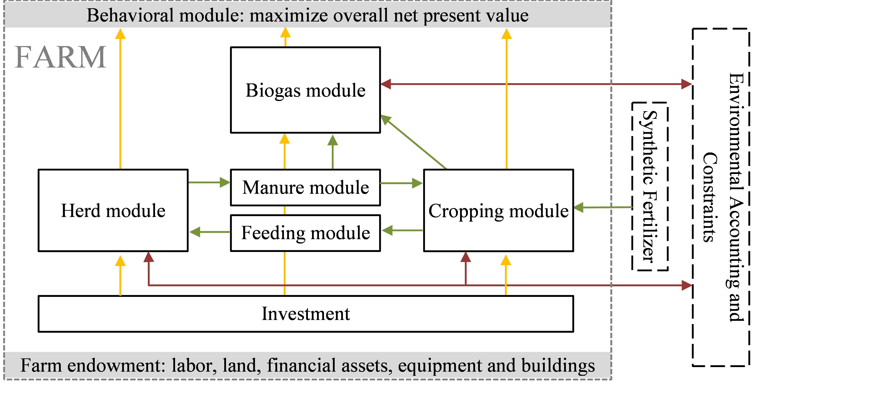

# Introduction

An economic template model uses a declarative approach which depicts in
rather generic terms the physical and financial relations in the system
to analyse. It describes their relations based on a set of decision
variables, exogenous parameters and equations describing their
relations. Template models in that sense have a long-standing tradition
in economics. In macro-applications, template based computable general
equilibrium models, such as GTAP (Hertel 1997) or the
IFPRI [^1] CGE\_template (Lofgren et al. 2002), are quite
common. For regional and farm type applications, programming model
templates are underlying e.g. the regional or farm type model in CAPRI
(Britz & Witzke 2008) or the bio-economic typical farm
type models in FFSIM (Louhichi et al. 2010). The aim of a
template model is to differentiate between structural elements which are
common to any instance of the system analysed and attributes of a
specific instance. A specific instance of a farm would capture those
attributes which are specific to e.g. location, firm and time point or
period analysed, including attributes of the farmer (and its family)
such as his management abilities and preferences.

A template model can be coded and documented independently from a
specific instance. It also features clearly defined inputs and outputs
so that generic interfaces to other modules can be developed. These
modules could e.g. deliver the necessary inputs to generate instances or
to use the template model's results as inputs, e.g. for reporting
purposes or systematic analysis.

For our purposes, a suitable template must be able to generate instances
representing farms characteristics by differing initial conditions and
further attributes, specific to the firm and farmer. Initial conditions
are for example the existing herds, available family labour, capital
stock such as stables, machinery or storage facilities and its age, land
owned and rented by the farm or his equity. Further attributes could
describe the firm's market environment such as input and output prices,
yield potentials, household expenditures, the willingness of the farmer
and family members to work off-farm and the potential farm branches.

Farming is characterized by long lasting and relatively expensive
stationary capital stock, especially in form of stables and related
equipment. High sunk costs related to past investments can lead to
sticky farm programs, as key management possibilities such as reducing
the herd size lead to modest saving of variable costs compared to losses
in revenues. Consequently, strategies of farms as a response to changes
in market and policy environment such as GHG emission ceilings are path
dependent on investment decisions in the past. Whereas all farms can
implement certain short term adjustments regarding herd-, feed- or
fertilizer-management, investment based strategies are not very likely
to be adjusted for farms which invested recently in new buildings or
expensive machinery. These characteristics imply individual farms and
the industry as a whole that optimal short and long term strategies
might differ considerably.

Accordingly, a framework is needed which covers a longer planning period
to capture (re)investment decisions and their impact on the farm program
and on externalities such as nutrient surpluses or GHG emissions. Figure
1 depicts the basic structure of the template model with different
module interactions.

:   Figure 1: Overview of template model

In the following, the GAMS code is directly used to document the
equations in the different modules to avoid a second layer of mnemonics.
The following naming conventions are used in the GAMS code and also in
the documentation. All decision variables of the farmers start with a
*v\_*. They are endogenous to the simultaneous solution of all equations
when maximizing the objective function and hence depend on each other.
Exogenous parameters start with a *p\_*. They can typically be changed
in an experiment. Sets, i.e. collection of index elements, do not carry
a specific prefix.

The model equations are defined in *model\\templ.gms*, declarations of
parameters and sets also used outside of the model equations can be
found in *model\\templ\_decl.gms*.

 [^1]: International Food Policy Research Institute

