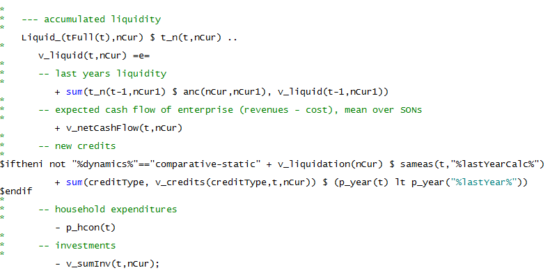
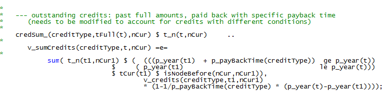
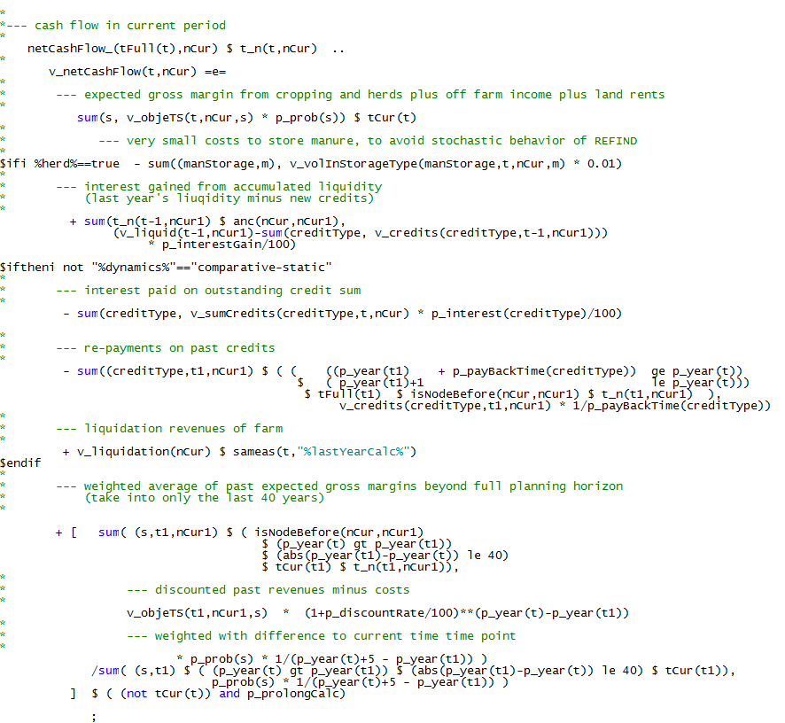
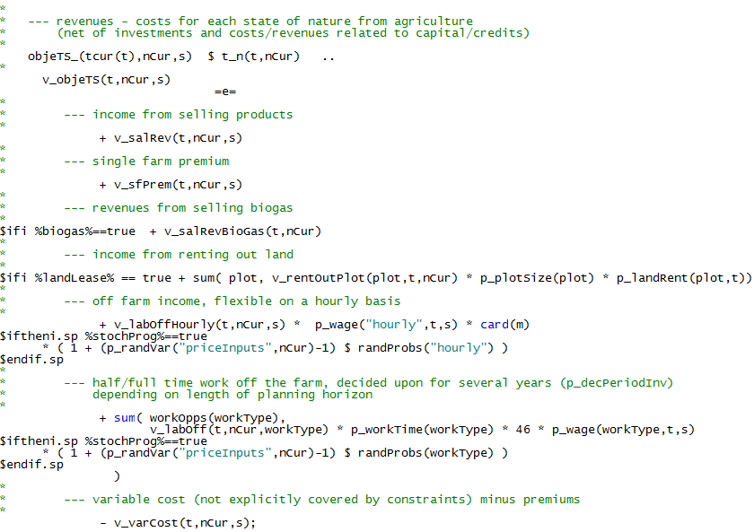
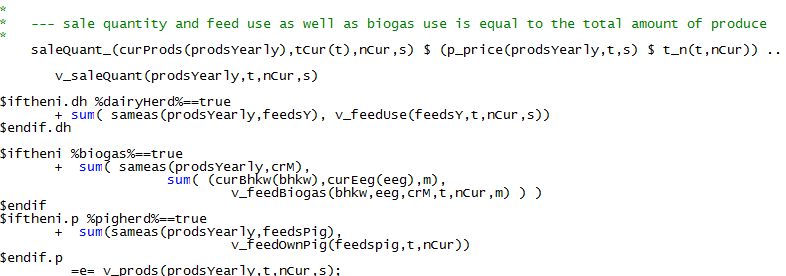

# Investments, Financing and Cash Flow Definition

!!! abstract
    The investment module depicts investment decisions in machinery, stables and structures (silos, biogas plants, storage) as binary variables with a yearly resolution. Physical depreciation can be based on lifetime or use. Machinery use can be alternatively depicted as continuous re-investment rendering investment costs variable, based on a Euro per ha threshold. Investment can be financed out of (accumulated) cash flow or by credits of different length and related interest rates. For stables and biogas plants, maintenance investment is reflected as well.

The total investment sum *v\_sumInv* in each year is defined by:

It can be financed either by equity or by credits, and enters
accordingly the cash balance definition, *v\_liquid*. The cash balance
is the cash at the end of the last year plus the net cash flow,
*v\_netCashFlow*, in the current year plus new credits, *v\_credits*,
minus fixed household expenditures, *p\_hcon*, and new investments,
*v\_sumInv*:

The model differentiates credits by repayment period, *p\_payBackTime*,
and interest rate. Credits are paid back in equal instalments over the
repayment period, hence, annuities decrease over time. The amount of
outstanding credits is defined by the following equation:

The net cash flow is defined as the sum of the gross margins in each
SON, *v\_objeTS* plus received interest and revenue from liquidation
(selling equipment or land) minus storing costs for manure, interest
paid on outstanding credits and repayment of credits:

Revenues from liquidation are only assumed to take place in the last
year (of the farm's life):

Liquidation is active if the model runs in fully dynamic mode and not in
comparative-static and short run mode.

The gross margin for each state-of-nature is defined as revenues from
sales, *v\_salRev*, income from renting out land, *v\_rentOutLand*, and
salary from working off farm minus variable costs. The latter relate to
costs of buying intermediate inputs such as fertilizer, feed or young
animals comprised in the equations structure of the model template,
*v\_buyCost*, and other variable costs, *v\_varCosts*. For off-farm work
(full and half time, v*\_workOff*) the weekly work time in hours,
*p\_weekTime*, is given. In addition, it is assumed that off-farm week
covers 46 weeks each year, so that income is defined then from
multiplying these two terms with hourly wage, *p\_wage*.

The sales revenues, *v\_salRev*, that enter the equation above are
defined from net production quantities, *v\_prods*, and given prices in
each year and state of nature, *p\_price*:

The sale quantity, *v\_saleQuant*, plus feed use, *v\_feedUse*, must
exhaust the production quantity, *v\_prods*:

The production quantities are derived by summing the production
quantities of animal and crop production. Additionally, for milk
quantities reduction of yield for specific cows and phases is
considered:

The variable *v\_redMlk* allows the farmer to not fully use the genetic
potential of the milk cow by adjusting the feed mix. This could be of
relevance in the optimization process for instance if the yield
potential of different herds are very high, but price combinations of
in- and output lead to an economic optimal intensity level that is below
the maximum milk yield potential. Without this variable, cows would have
always to be milked at the maximum level.

