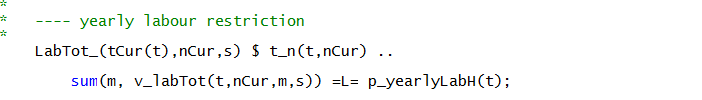
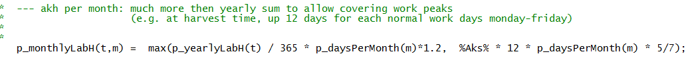
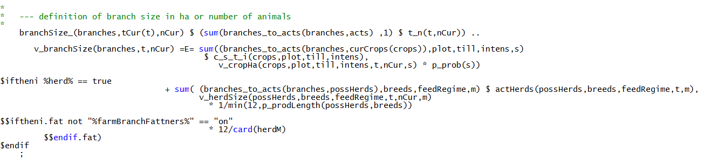
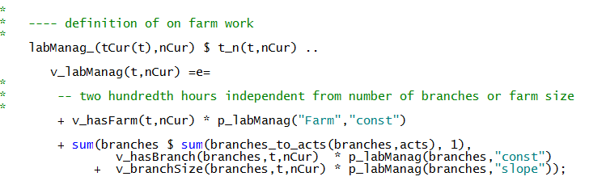
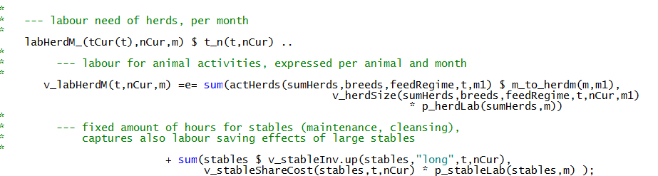
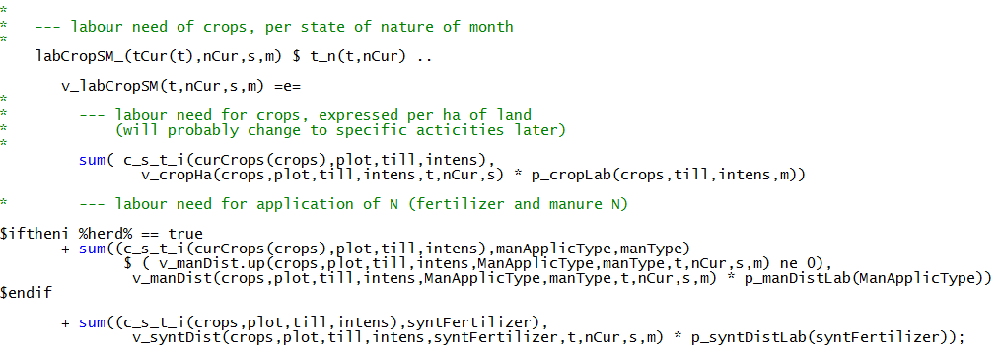
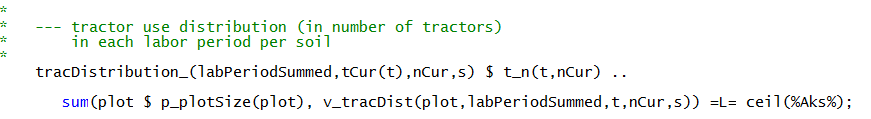
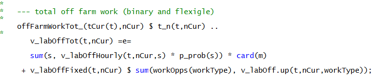

# Labour

!!! abstract
    The labour module optimizes work use on- and off farm with a monthly resolution, depicting in detail labour needs for different farm operations, herds and stables as well as management requirements for each farm branch and the farm as a whole. Off farm work distinguishes between half and full time work (binaries) and working flexibly for a low wage rate.

## General Concept

The template differentiates between three type of labour on farm:

1.  **General management and further activities for the whole farm,**
    *p\_labManag("farm","const"*, which are needed as long as the farm
    is not given up ,*v\_hasFarm* = 1, *binary variable*, and not
    depending on the level of individual farm activities.

2.  **Management activities and further activities depending on the size
    of farm branches** such as arable cropping, dairying, pig fattening,
    sows. The necessary working hours are broken down into a base need,
    *const* which is linked to having the farm branch, *v\_hasBranch*,
    *integer*, and a linear term depending on its size, *slope*.

3.  **Labour needs for certain farm operations** (aggregated to
    *v\_totLab*).

The sum of total labour needs cannot exceed total yearly available
labour (see following equation). As discussed below, there are further
restrictions with regard to monthly labour and available field working
days.

The maximal yearly working hours, *p\_yearlyLabH,* are defined in the
statement shown below. The maximal labour hours for the first, second
and further labour units can be entered via the GUI.

The maximal work hours per month is defined in the following statement,
represented by the parameter *p\_monthlyLabH*:

The template considers sum of labour needs for each month, *m,* and each
SON, *s*. Farm labour needs are related to certain farm activities on
field and in stable. The labour need for work on farm and flexibly off
farm is defined by the following equation. The variables that enter in
the equation are explained in the next section of the labour section.

## Labour Need for Farm Branches

Farmdyn comprises currently five different farm branches: cropping,
cattle, fatteners, sows and biogas. The (management) labour needs for
the biogas branch is accounted for in the biogas module. For the other
branches, their size *v\_branchSize*, is endogenously defined from
activity levels mapped to it:

\
Where the cross-set, *branches\_to\_acts,* defines which activities
count to a certain branch:

The binary variable *v\_hasBranch* which relates to the general
management need for branch is triggered as follows:

The *hasFarm* trigger depends on the trigger for the individual
branches:

The hours are needed for yearly farm management are defined from a
constant and the branch specific values:

## Labour Need for Herd, Cropping, Operations and Off-Farm Work

***Herd Activities and Cropping***

The labour need for animals, *v\_herdLabM,* is defined by an animal type
specific requirement parameter, *p\_herdLab,* in hours per animal and
month (see in the next equation, working hours per animal and month) and
in addition by the time requirement per stable place, which is
differentiated by stable type. This formulation allows labour saving
scale effects related to the stable size:

A similar equation exists for crops, however, crop labour need is
differentiated here by state of nature in the partial stochastic
version. The parameter *p\_cropLab* defines the labour hours per hectare
and month for each crop. In addition, the parameters *p\_manDistLab* and
*p\_syntDistLab* multiplied by the *N type* applied to each crop are
added to the overall crop labour demand for the application of synthetic
and manure:

***Farm Operations***

Field working days define the number of days available in a labour
period of half a month, *labPeriod,* during which soil conditions allow
specific types of operations, *labReqLevl*:

The number of field work hours cannot exceed a limit which is defined by
the available field working days, *p\_fieldWorkingDays.* Field working
days depend on climate zone, soil type (*light, middle, heavy*) and
distribution of available tractors to the soil type, *v\_tracDist*. It
is assumed that farm staff will be willing to work up to 15 hours a day,
still with the total work load per month being restricted:

Furthermore, the distribution of tractors is determined endogenously:

It implicitly assumes that farm family members are willing to spend
hours for on farm work even if working off farm, e.g. by taking days
off.

***Off-Farm Work***

Farm family members can optionally work half or full time, *v\_workoff*,
or on an hourly basis off farm, *v\_workHourly*. Half and full time work
are realized as integer variables. In the normal setting the wage per
hour for working half time exceeds the wage of short time hourly work.
Moreover, the per hour wage of full time work is higher than of working
half time one. For half and full time work commuting time can be
considered:

The set *workType* lists the possible combinations:

It is assumed that decisions about how much to work flexibly on an
hourly basis are taken on a yearly basis (i.e. the same amount of hours
are inputted in each month) and can be adjusted to the state of nature.

The total number of hours worked off-farm is defined as:


