# Manure


!!! abstract
    Manure excretion from animals is calculated based on fixed factors, differentiated by animal type, yield level and feeding practice. For biogas production, the composition of different feed stock is taken into account. Manure is stored subfloor in stables and in silos. Application of manure has to follow legal obligations and interacts with plant nutrient need from the cropping module. Different N losses are accounted for in stable, storage and during application.

## Manure Excretion

With regard to excretion of animals, relevant equations and variables
can be found in the *general\_herd\_module.gms*. *v\_manQuantM* is the
monthly volume in cubic meter of manure produced. It is computed by
summing the monthly manure for the herd with considering the amount
excreted while grazing, shown in the following equation:

[embedmd]:# (N:/agpo/work1/FarmDyn_QM/gams/model/general_herd_module.gms GAMS /manQuantM_[\S\s][^;]*?\.\./ /;/)
```GAMS
manQuantM_(curManChain(manChain),tCur(t),nCur,m) $ t_n(t,nCur) ..

         v_manQuantM(manChain,t,nCur,m) =e=
               sum( actherds(herds,breeds,feedRegime,t,m1) $ manChain_herd(manChain,herds),
                   p_manQuantMonth(herds) * ( 1 - 1   $ sameas(feedRegime,"fullGraz")
                                                - 0.5 $ sameas(feedRegime,"partGraz"))

                    * sum(m_to_herdm(m,m1), v_herdSize(herds,breeds,feedRegime,t,nCur,m1)));
```

Furthermore, the monthly excretion of nutrients, NTAN, Norg and P is
calculated, multiplying *v\_herdsize* and *p\_nut2ManMonth*. For cows,
excretion rate depends on animal category, feeding regime and yield
level. For fatteners and sows, excretion depends on animal category and
feeding regime. Corresponding parameters can be found in
*coeffgen\\manure.gms* (not shown here). For dairy cows, excretion on
pasture is subtracted.

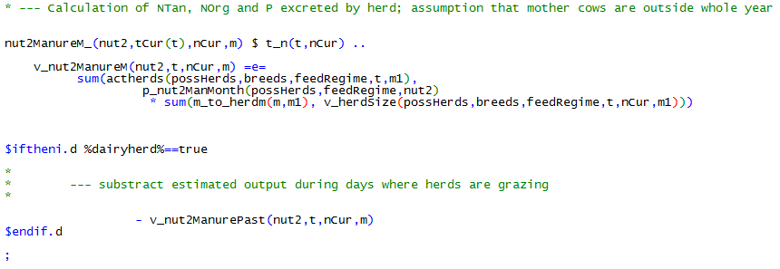

Biogas production involves the production of digestates. Four sources
can be differentiated depending on the origin of the feed crop: use of
manure produced on farm, manure imported to the farm, crops grown on
farm and crops imported on farm. Manure produced on farm is treated like
not fermented manure, as though it is not entering the biogas plant.

For digestates from imported manure and from crops, volume of digestates
in cubic meter is calculated in the *biogas\_module.gms* by multiplying
amount of used feed stock, *v\_usedCropBiogas* and *v\_purchManure*, and
a fugal factor. The latter represents the decrease of volume during the
fermentation process.

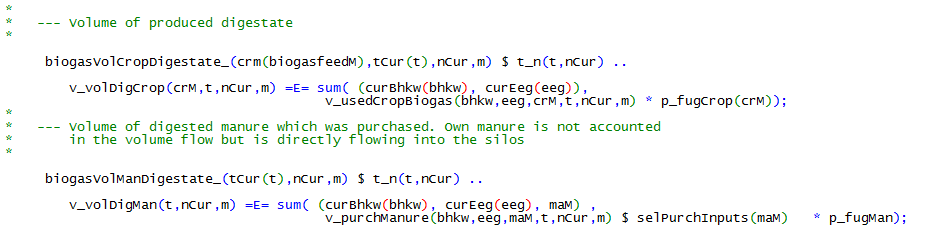

The amount of nutrients produced in the biogas plant and entering the
manure storage is computed by multiplying the amount of feed stock and
the corresponding nutrient content. It is assumed, that N and P is not
lost during fermentation. Furthermore, nutrients from crop inputs are
calculated as an annual average since no short term changes are common.

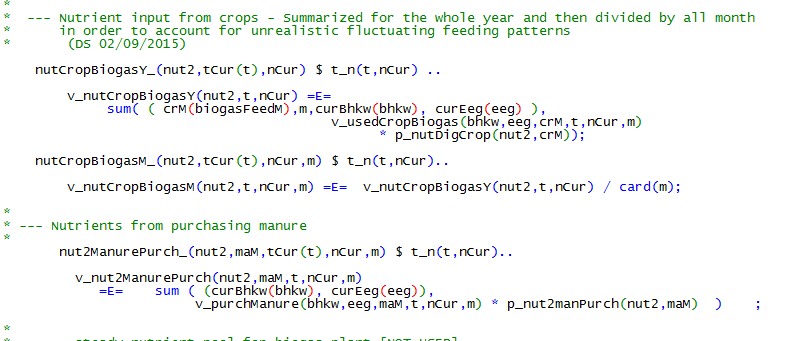

## Manure Storage

Equations related to manure storage serve mainly for the calculation of
the needed storage capacity, linked to investment, and for the
calculation of emissions during storage. The *manure\_module.gms* is
activated when fattners, sows, dairy and/or biogas is activated in the
GUI.

The amount of manure in the storage in cubic meter is described in the
following equation. Manure is emptied by field application,
*v\_volManApplied*. When activated in the GUI, manure can also be
exported from the farm.

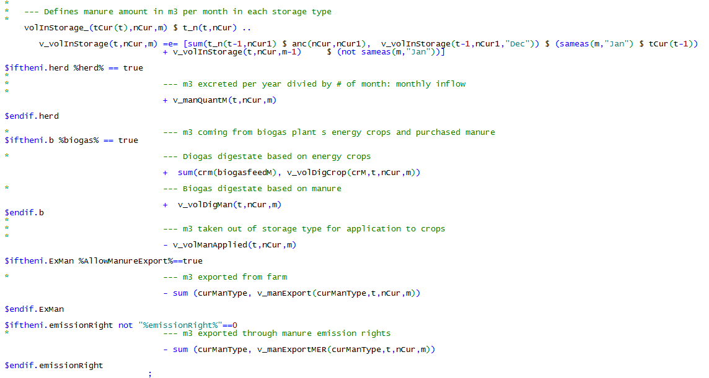

Following the same structure as the equation above, there is a nutrient
pool for NTAN, Norg and P in the storage. Losses of NTAN and Norg during
storage are subtracted. When environmental accounting is switched off,
standard loss factors are subtracted directly in the equation.

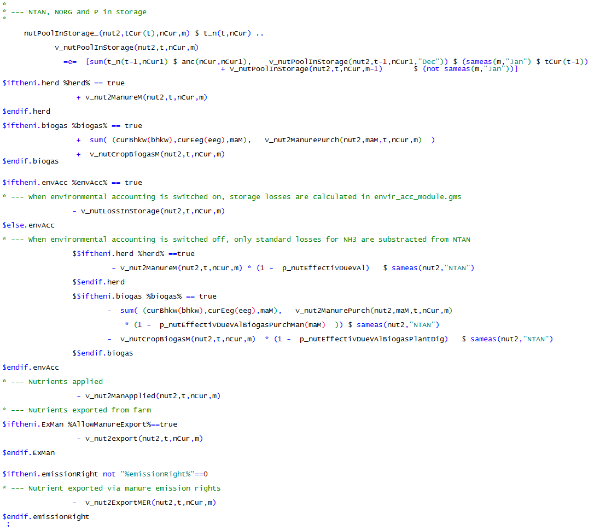

When environmental accounting is switched on, losses are calculated in
the equation *nutLossInStorage\_*, using emission factors from the
environmental impact accounting module (see chapter 2.12).

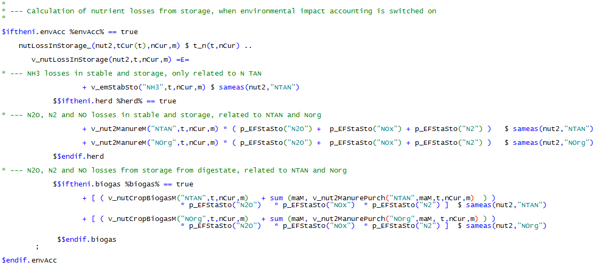

The amount of manure in the storage needs to fit to the available
storage capacity which is calculated in the equation
*totalManStorCap\_*. The total storage capacity is the sum of the sub
floor storage in stables, silos and silos for digestates from biogas
production. Note: when the biogas branch is active without herds, the
storage concept is simplified.

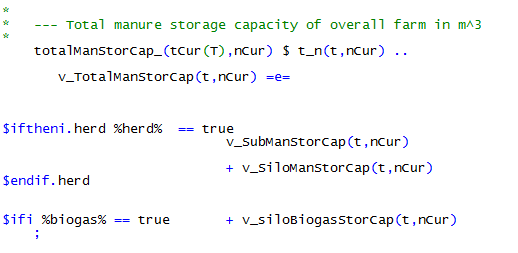

The storage capacity of silos *v\_SiloManStorCap* is derived by
multiplying the silo inventory with parameters characterizing the
corresponding storage capacity.

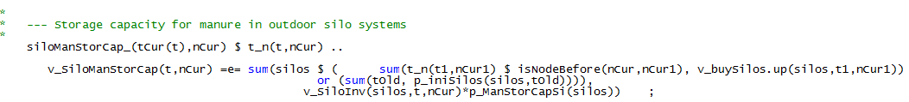

The subfloor storage capacity of stables *v\_SubManStorCap* is
calculated in the *general\_herd\_module.gms*. The stable inventory is
multiplied with parameters characterizing the corresponding subfloor
storage capacity. The amount of manure which can be stored in the stable
building, *p\_ManStorCap*, depends on the stable system. Slurry based
systems with a plane floor normally only have small cesspits which
demand the addition of manure silo capacities. The manure storage
capacity of stables with slatted floor depends on the size of the
stable, where a storage capacity for manure of three month in a fully
occupied stable is assumed. A set of different dimensioned liquid manure
reservoirs is depicted in the code, *p\_ManStorCapSi*, from 500 to 4000
m³.

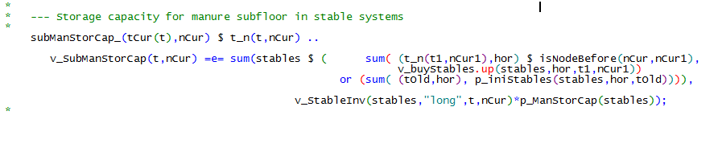

The storage capacity for digestates from biogas plants,
*v\_siloBiogasStorCap*, is linked to the size of the biogas plant and
calculated in the *biogas\_module.gms*.

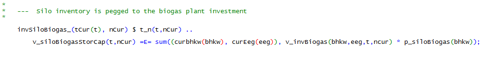

The total volume is distributed to the different storage type based on
the following equations.

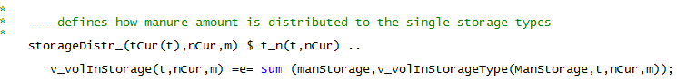

For the silos related to animal husbandry, different coverage of silos
can be applied. The type of silo cover used for a certain type of silo,
*v\_siCovComb*, is a binary variable, i.e. one type of silo must be
fully covered or not.

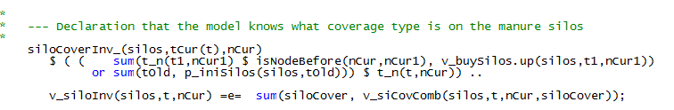

The amount of storage capacity is prescribed by environmental law.
FARMDYN allows applying different regulations with regard to required
storage capacity, changed in the GUI. The necessary silo capacity can be
set (1) to 6 month, i.e. 50 % of annual manure excretion, or to (2)
amount of month when manure application is forbidden in winter. For (2),
there is a differentiation for arable land and grassland.

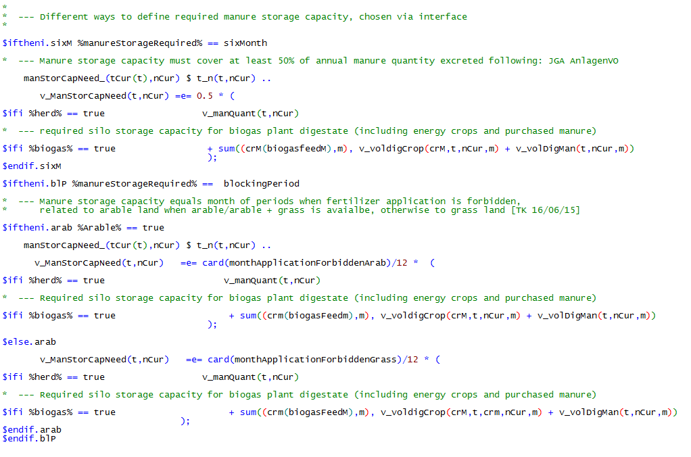

The total manure storage capacity *v\_TotalManStorCap* must be greater
than the required storage capacity *v\_ManStorCapNeed*.

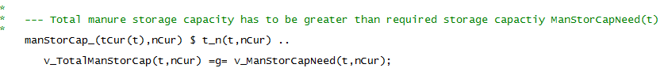

Besides requirement with regard to the storage capacity, there are
equations which make sure that the storage is emptied in certain points
of time. Every spring, the storage has to be emptied completely with
regard to nutrients and volume, what is made sure of in the equations
*emptyStorageVol\_* and *emptyStorageNut\_*. On the one hand, this
represents typical manure management of farms. On the other hand, the
restriction is necessary to make sure that the storage can be emptied
when relation between nutrients and volume changes due to nutrient
losses during storage (see chapter 2.9.3).

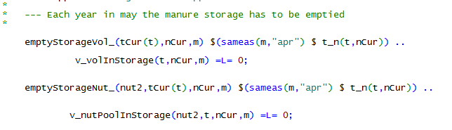

Furthermore, at the end of the time period modelled, only 1/3 of the
annual excreted manure is allowed to remain in the storage, to avoid
unrealistic behaviour in the last year modelled. This is made sure in
the following equations.

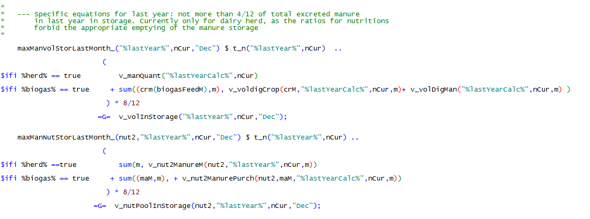

## Manure Application

Different application procedures for manure N are implemented,
*ManApplicType*, including broad spread, drag hose spreader and
injection of manure. The core variable is *v\_mandist* that represents
the amount of manure in cubic meter. The different techniques are
related to different application costs, labour requirements as well as
effects on different emissions. Furthermore, manure application is
linked to the nutrient balance (see chapter 2.11.2 and 2.11.3) and the
manure storage (see chapter 2.9.2).

The application of manure links nutrient with volumes. The nutrient
content of the manure is depending on the herd's excretion as well as on
the losses during storage. The parameter *p\_nut2inMan* contains the
amount of NTAN, Norg and P per cubic meter of manure applied. Relevant
parameters are calculated in *coeffgen\\manure.gms*. There are two
approaches to calculate the parameter, (1) environmental accounting not
activated and (2) environmental accounting activated.

For both systems, the amount of different nutrients per cubic meter is
calculated without losses, *p\_nut2inManNoLoss*. In the following
equation, *p\_nut2inMan* is calculated when the environmental accounting
is not active. In this case, only a fixed factor for NH<sub>3</sub> emissions is
subtracted from NTAN contained in the manure. The parameter is
calculated for the types of manure from different herds, *mantype.* The
herds and types of manure are linked via the cross set *herds\_mantype*.
This calculation implies that there is one type of manure for every herd
activated in FARMDYN.

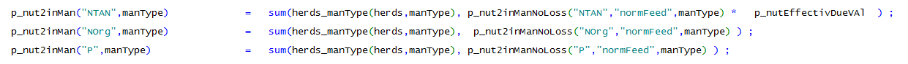

If environmental accounting is active, the calculation of *p\_nut2inMan*
differs. It is taken into account, the storage time of manure varies
and, therefore, losses during storage vary. For the manure of every
herd, two types of manure are calculated, representing the maximum and
minimum possible amount of losses during one year. This allows a
complete emptying of the storage in a linear programming setting.

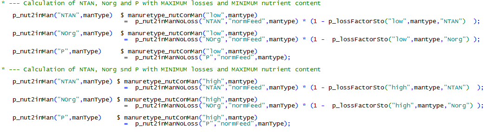

The total manure distributed in cubic meter and in nutrients per month
is summarized in the following equations according to:

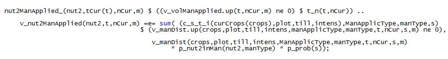

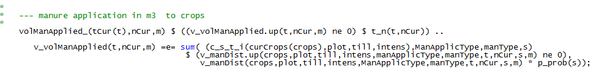

There are several restrictions with regard to the application of manure.
First of all, the application of manure is not possible in some crops in
some month, e.g. in maize at certain height of growth.

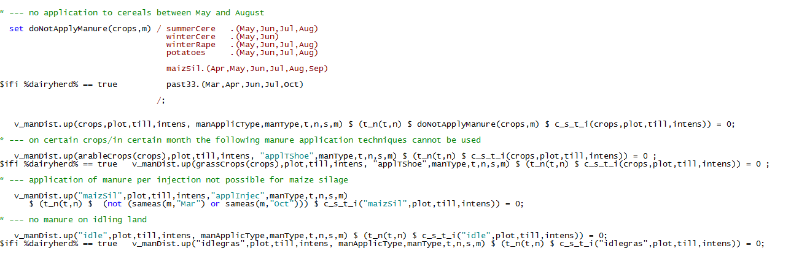

There are restrictions with the timing and the quantity of applied
manure coming from the German fertilizer directive. Generally, the
application of manure is forbidden during winter. Depending on settings
in the GUI, manure application can be forbidden only three month during
winter or more restrictive regulations apply.

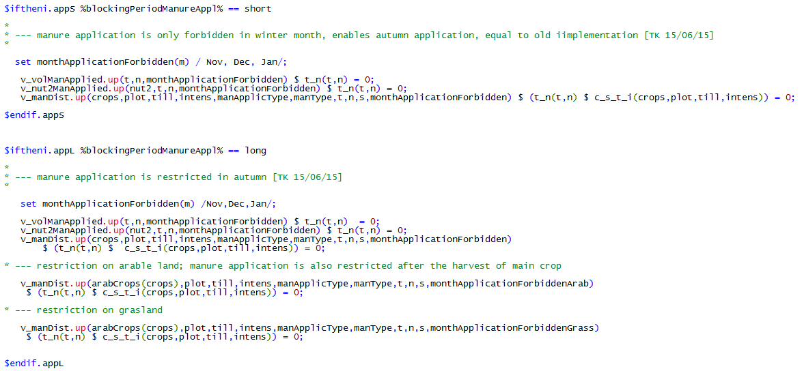

Furthermore, there is the option to ban certain manure application
techniques to represent technical requirements given by the German
fertilizer directive. These requirements can be activated in the GUI.
The sets *tNotLowAppA(t)* and *tLowAppA(t)* represents the years with
certain technical requirements.

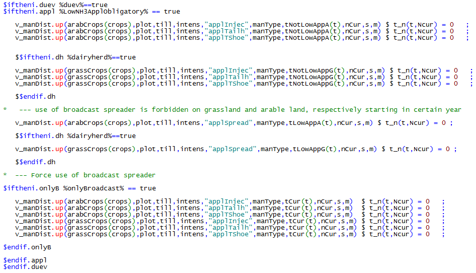

In the German fertilizer directive, the total amount of Nitrogen from
manure is restricted to 170 kilogram N per ha and year in farm average.
For grassland, there is the possibility to apply 230 kilogram. The
restrictions can be switched on or off in the GUI. In the following
equations, *v\_DueVOrgN* represent the amount of organic nutrients
excreted by animals minus nutrient exports from the farm.
*v\_nutExcrDueV* is calculated in the *general\_herd\_module.gms and*
*v\_nutBiogasDueV* in the *biogas\_module.gms* (equations not shown
here).

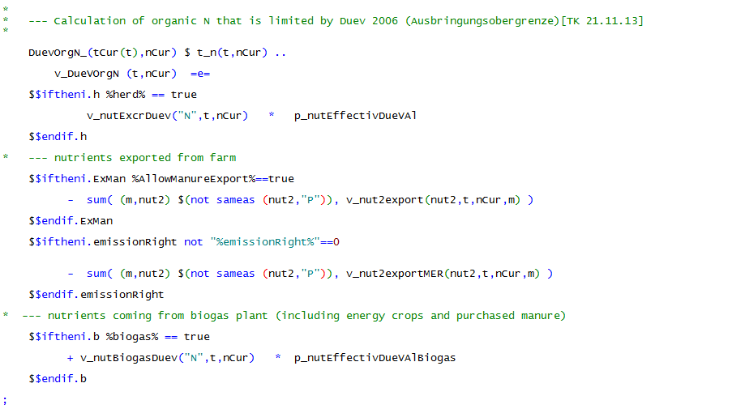

The applied N is not allowed to exceed the given threshold,
*p\_nutManApplLimit*, as stated in the following equation. In current
legislation, organic N from digestates of plant origin is excluded in
the calculation of this threshold. Note that the organic N application
according to the fertilizer directive is always calculated in FARMDYN.
The restrictive threshold can be switched on and off in the GUI.

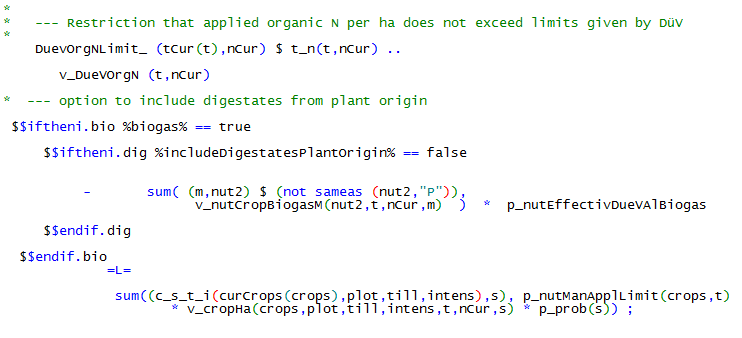
