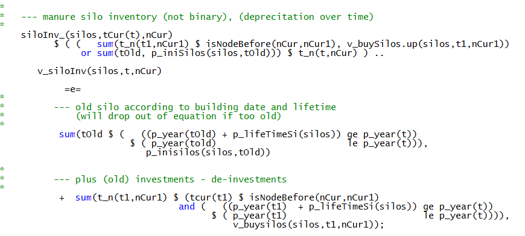

# Other Type of Buildings

Besides stables the model currently includes silos for more manure,
bunker silos for maize or grass silage and storages for potatoes.

Each type of manure silo is linked to an inventory equation:

The manure silos are linked to the manure storage needs which are
described in chapter Manure. A similar inventory equation as for manure
silos is implemented for the other buildings:

The buildings included in the model are:

The attributes of the buildings are defined in
*coeffgen\\buildings.gms*:

The inventory of the buildings is linked to building needs of certain
activities:


