# Plant Nutrition

The equations related to the plant nutrition make sure that the nutrient
need of crops is met. Nutrient need can be derived from N response
functions or from planning data for fixed yield levels. Needed nutrients
are provided by manure and synthetic fertilizer. There are two
approaches to model the nutrient need and supply of crops, a fixed
factor approach and detailed nutrient fate model.

## Calculation of plant need

The template supports two differently detailed ways to account for plant
nutrition need.

1.  A **fixed factor approach** with yearly nutrient balances per crop

    a.  Using N response curves

    b.  Using planning data

2.  A detailed **flow model** with a monthly resolution by soil depth
    (deprecated).

    c.  Using N response curves

*p\_nutNeed* is the nutrient need for different crops and enters the
equation for fixed factor approach and the flow model. For the fixed
factor approach, nutrient need can be calculated based on N response
curves and alternatively based on planning data. In the detailed flow
model, nutrient need needs to be calculated based on N response curves.
All relevant calculation can be found in *coeffgen\\cropping.gms*.

## N response curves

The yield level of different crops is chosen in the GUI. The following
equations show, at the example of winter cereals, that the yield,
*p\_OCoeffC*, equals the yield given by the GUI, *p\_cropYieldInt* , and
takes a growth rate given by the GUI into account.

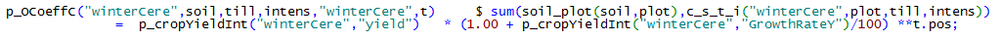

In the next step, the nutrient need for crops are linked to the
different cropping intensities. There are five different intensity
levels with regard the amount of N fertilizer applied:

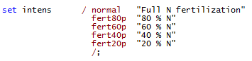

These nutrient needs for the different intensities are based on nitrogen
response functions from field trials. The intensity can be reduced from
100 % to an N fertilizer application of 80 %, 60 %, 40 % and 20 %. The
yield level is reduced to 96 %, 90 %, 82 % and 73 %, respectively. These
steps reflect the diminishing yield increases from increased N
fertilizer application.

The output coefficients, *p\_OCoeffC*, represents the yields per hectar.
They are used to define the nutrient uptake by the crops, *p\_nutNeed,*
based on the nutrient content, *p\_nutContent*. Values for
*p\_nutContent* are taken from the German fertilizer directive
(DüV 2007, Appendix 1).

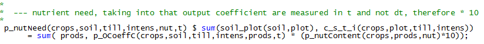

For different intensities, the corresponding amount of nutrient applied
has to be determined to fulfil the need *p\_nutNeed*.

The parameter *p\_basNut* defines the amount of nutrients coming from
other sources than directly applied fertilizer. The curve suggests that
for a 53%-level of yield, only 20% of the N dose at full yield is
necessary. Assuming a minimum nutrient loss factor that allows defining
how much N a crop takes up from other sources (mineralisation,
atmospheric deposition):

The amount of nutrient applied, *p\_nutApplied,* is estimated as shown
in the following equation, it is assumed that at least 20% of the
default leaching and NH3 losses will occur.

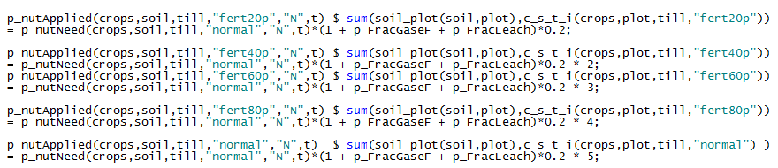

The nutrient application, *p\_nutApplied,* in combination with the basis
delivery from soil and air, *p\_basNut,* allows defining the loss rates
for each intensity level, *p\_nutLossUnavoidable,* as the difference
between the deliveries and the nutrient uptake, *p\_nutNeed,* by the
plants:

*p\_nutLossUnavoidable* enters the Standard Nutrient Fate Model (see
chapter 2.11.2). It represents the factor that has to be applied over
the plant removal, *p\_nutNeed*, to reach a certain yield level. It
indicates the nutrient efficiency of the fertilizer management.

## Planning Data

The nutrient need can also derived from planning data from the revised
Fertilizer directive (BMEL 2015). The proposed directive includes
compulsory fertilizer planning to increase N use efficiency on farms.
This measure is included in FARMDYN. When fertilizer management follows
the planning data, different intensities do not exist and yield levels
are fixed, i.e. cannot be changed by the GUI.

The yield level *p\_OCoeffC* is fixed in the following equation, showing
the example of winter cereals.

The yield corresponds to a certain amount of needed N, *p\_nutNeed*,
given by the directive.

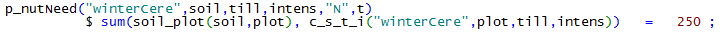

In the case of P, it is assumed that the nutrients need correspond to
the nutrients removed by the harvested product.

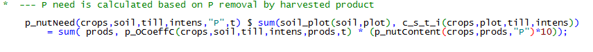

The directive prescribes that nutrients delivered from soil and air have
to be taken into account. This reduces the amount of fertilizer that
needs to be applied. The parameter, *p\_basNut*, enters the Standard
Nutrient Fate Model (see chapter 2.11.2). We assume a fixed amount of 30
kg N per hectar and year for every crop.

The directive does not allow applying more nutrients than required
following the planning data. Unavoidable losses are already reflected in
*p\_nutNeed*. In the GUI, a factor for *over fertilization* can be
activated. In this case, the N need for plant increases. This feature
can be used to assess the impact of inefficient N management of farms.

Furthermore, the directive prescribes the share of N from organic
sources that has to be accounted for in the fertilizing management. The
requirements of the directive can be activated in the GUI and enter the
Standard Nutrient Fate Model (see chapter 2.11.2).

## Standard Nutrient Fate Model

The standard nutrient fate model defines the necessary fertilizer
applications based on yearly nutrient balances for each crop category,
*NutBalCrop\_*. In the equation below, the left hand side defines the
nutrient need plus the application of manure over plant need. The right
hand side captures the net deliveries from mineral and manure
application plus deliveries from soil and air.

FARMDYN allows different ways to account for N from manure. Organic N
can be accounted for based on (1) requirements from the Fertilizer
Directive, (2) a given factor by the interface and (3) exogenous
calculated losses. Losses are calculated using the environmental
accounting module (see chapter 2.12). If the environmental accounting
module is switched off, calculated losses are derived using standard
loss factors from the Fertilizer directive. Different elements of the
equation *NutBalCrop\_* are explained below.

The crop need is derived from *p\_nutneed*. In the case of using N
response functions, the needed nutrients increase by unavoidable losses,
*p\_nutLossUnavoidable*. In the case of using planning data, unavoidable
losses are already included in *p\_nutNeed* and, therefore,
*p\_nutLossUnavoidable* is set to 0 (see chapter 2.11.1.2).

When activated in the GUI, more organic N and P than needed for plant
nutrition can be applied.

The plant need (including over application of manure) has to equal the
offered nutrients. For pasture, there is a special accounting needed
since loss factors differ from stable. Furthermore, nutrients excreted
during grazing are only available on the pasture. As stated above, there
are different ways to account for N from manure.

The following elements determine the amount of N and P entering the
nutrient balance with applied manure. Again, different ways to account
for organic N are represented in the equation.

Losses can be calculated representing exogenous estimated N emissions.
The reader should note that nutrients applied from manure are net of
losses during storage.

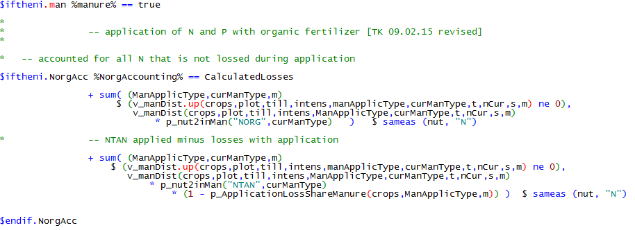

The amount of organic N accounted for in fertilizing can be chosen in
the GUI.

Furthermore, the requirements of the fertilizer planning from the German
fertilizer directive can be followed.

For P from manure, no losses are taken into account.

Nutrients from mineral fertilizer application are added. No losses are
taken into account since they are already included in the calculation of
*p\_nutLossUnavoidable* (see chapter 2.11.1).

Delivery of nutrients from soil and air are included.

In the equation *nutSurplusMax\_*, the application of nutrients from
manure over plant need is restricted for each crop type:

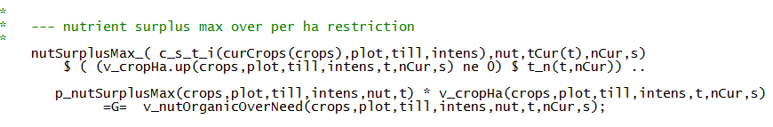

*p\_nutSurplusMax* is calculated in *coeffgen\\cropping.gms*.

In the standard nutrient fate model the reductions in soil nutrient can
be managed by:

1.  reducing unnecessary manure applications which decrease
    *v\_nutSurplusField*

2.  lowering cropping intensity (when nutrient need is derived using N
    response curves). It reduces not only the overall nutrient needs and
    therefore the losses, but also reduces the loss rates per kg of
    synthetic fertilizer

3.  switching between mineral and organic fertilization

4.  changing the cropping pattern

## Deprecated: Detailed Nutrient Fate Model by Crop, Month, Soil Depth and Plot

The detailed soil accounting module considers nutrient flows both from
month to month and between different soil layers (top, middle, deep). It
replaces the equations used in the standard nutrient fate model shown in
the section above. The central equation is the following:

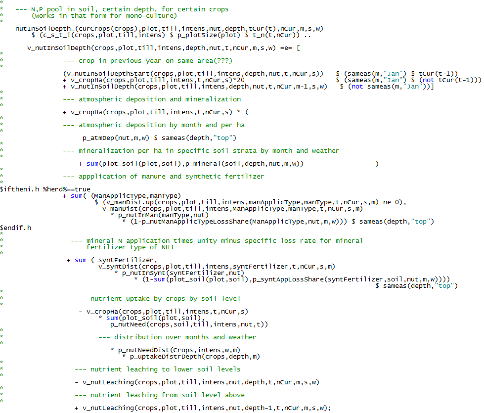

The detailed nutrient fate model considers as input flows:

-   Application of organic and mineral fertilizers net of NH3 and other
    gas losses from application, they are brought to the top layer,

-   atmospheric deposition (to the top layer),

-   net mineralisation and

-   nutrient leaching from the layer above.

The considered output flows are:

-   Uptake by crops and

-   leaching to the layer below.

The difference between the variables updates next month's stock based on
current month's stock. Monthly leaching to the next deeper soil layer,
*v\_nutLeaching,* is determined as a fraction of plant available
nutrients (starting stock plus inflows):

The leaching losses below the root zone in combination with ammonia,
other gas losses from mineral and organic fertilizer applications define
the total nutrient losses at farm level in each month:

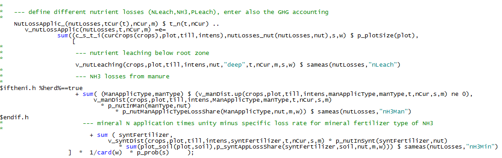

The approach requires defining the nutrient needs of each crop per
month, which is currently estimated:

Similarly, the nutrient uptake by the crop from different soil layers is
determined:

A weakness of this approach is how changes of cropping patterns are
handled between years. It would be favourable to define the transition
of nutrient pools from year to year based on a "crop after crop"
variable in hectares for each soil type. However, this leads to
quadratic constraints which failed to be solved by the industry QIP
solvers [^4]. Instead, the pool is simply redistributed across crops and
a maximum content of 50 kg of nutrient per soil depth layer is fixed:

If the user switches on crop rotations a further restriction is added:

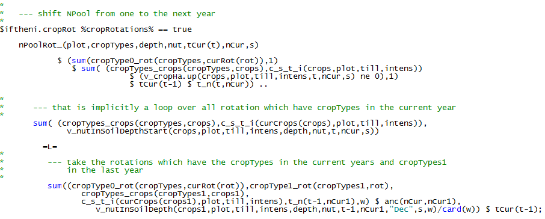

## Nutrient Balance According to the Fertilizer directive

The German fertilizer directive requires that farms calculate a nutrient
balance on an annual basis (DüV 2007). It combines nutrients input via
manure and synthetic fertilizer with nutrients removal via the harvested
crops. The surplus, i.e. the balance, is not allowed to exceed a certain
threshold. In FARMDYN, the nutrient balance is always calculated. The
threshold can be switched on and off in the GUI. Relevant equations can
be found in *model\\templ.gms*.

Nutrient removal via harvested product is calculated.

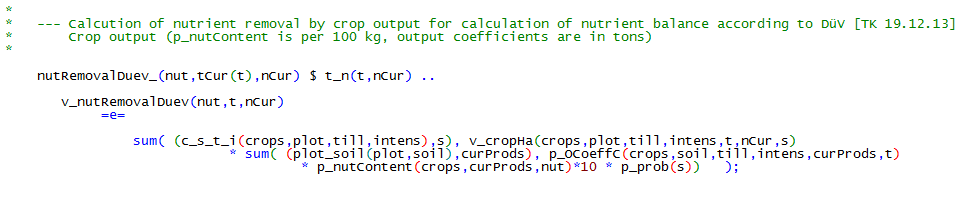Nutrient input via synthetic fertilizer is
calculated.

In the equation *nutBalDuev\_*, nutrient input and output are combined.
Input from organic sources, *v\_nutExcrDuev* and *v\_nutBiogasDuev,* are
calculated in the *manure\_module.gms* and the *biogas\_module.gms*
(equations not shown here). Furthermore, nutrients export via manure
export is taken into account. *v\_surplusDueV* is the surplus of the
nutrient balance.

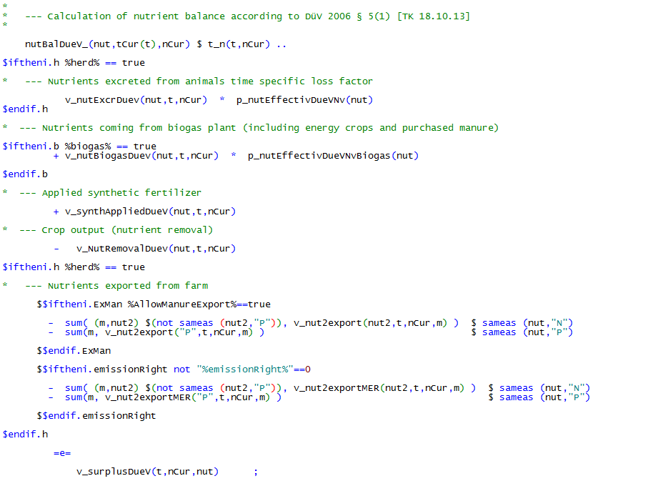

The surplus, *v\_surplusDueV,* is not allowed to exceed a certain
threshold given by the GUI.

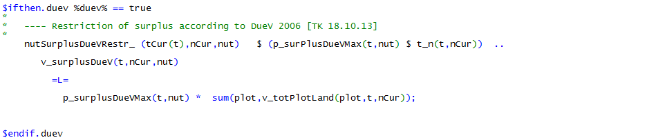

[^4]: QIP solvers do not allow for equality conditions which are by
   definition non-convex
