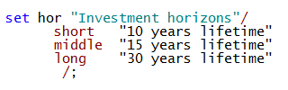
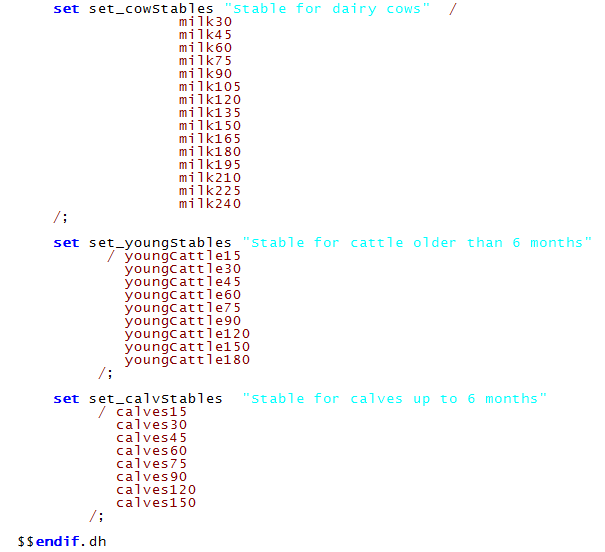
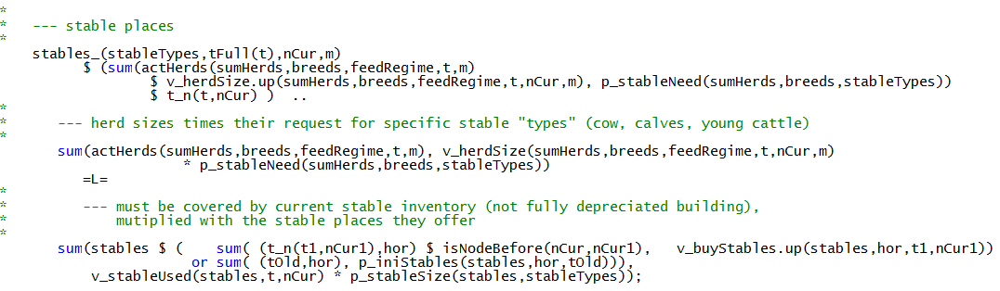

# Stables

The template applies a vintage based model for different stable types in
addition to other buildings and selected machinery, and a physical use
based depreciation for the majority of the machinery park. Under the
vintage based model stables, other buildings and machinery become
unusable after a fixed number of years. In the case of physical
depreciation machinery becomes inoperative when its maximum number of
operating hours or another measurement of use (e.g. the amount handled)
is reached. Investments in stable, buildings and machinery are
implemented as binary variables. In order to keep the possible branching
trees at an acceptable size, the re-investment points can be restricted
to specific years. For longer planning horizon covering several decades,
investment could e.g. only be allowed every fourth or fifth year.

The stable inventory, *v\_stableInv,* for each type of stable,
*stables,* is defined as can be seen in *stableInv\_*. *p\_iniStables*
is the initial endowment of stables by the construction year,
*p\_lifeTimeS* is the maximal physical life time of the stables and
*v\_buyStables* are newly constructed stables.

For cow stables a differentiation is introduced between the initial
investment into the building, assumed to last for 30 years, and certain
equipment for which maintenance investments are necessary after 10 or 15
years, as defined by the investment horizon set *hor*:

A stable can only be used, if short and middle term maintenance
investment is done.

The model distinguishes between several stable types for cattle, shown
in the following list). They differ in capacity, cattle type, investment
cost and labour need per stable place.

For pigs the following stable sizes are available:

The used part of the stable inventory (a fractional variable) must cover
the stable place needs for the herd:

The used part cannot exceed the current inventory (a binary variable):

As certain maintenance costs are linked to stables, the share of the
used stable is restricted to minimum 75%, which assumes that maximal 25%
of the maintenance costs can be saved when the stable is not fully used:

The different stable attributes are defined in
"*coeffgen\\stables.gms*".

