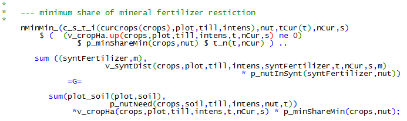

# Synthetic Fertilizers

To meet the N and P demand of crops, synthetic fertilizer can be applied
besides manure, *v\_syntDist*. Synthetic fertilizer application enters
equations with regard to the buying of inputs, *buy\_* and *varcost\_*,
the labour need for application, *labCropSM\_*, the field work hours and
machinery, *fieldWorkHours\_* and *machines\_*, and with regard to plant
nutrition (see chapter 2.11). The equation *nMinMan\_* makes sure that
minimum amounts of mineral fertilizer are applied for certain crops. It
represents the limitation meeting the plant need with nutrients from
manure, e.g. fertilizing short before harvest for baking wheat cannot be
done with manure.


