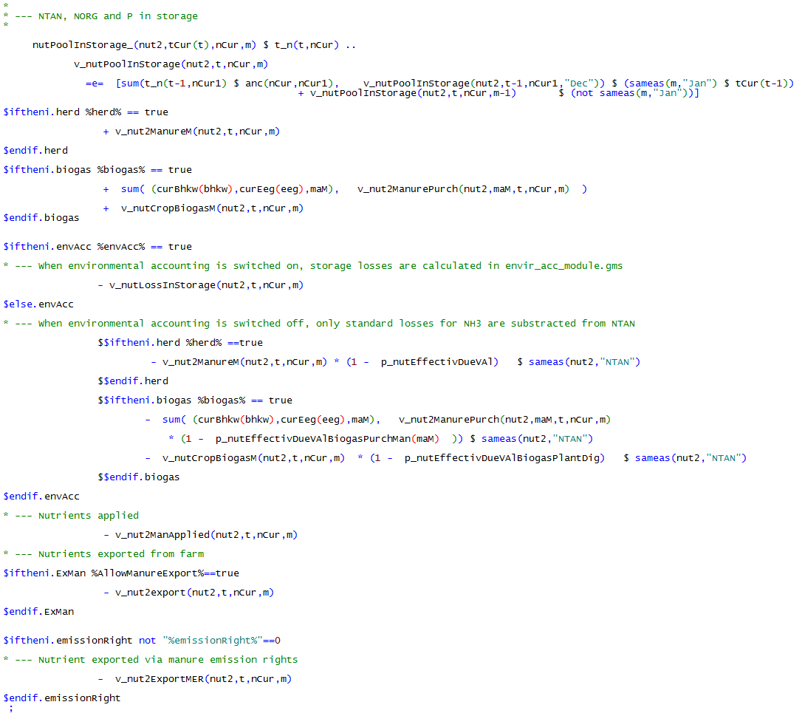
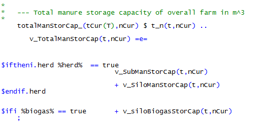
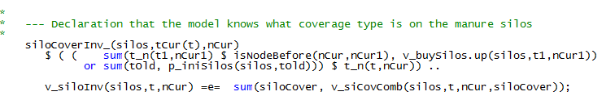
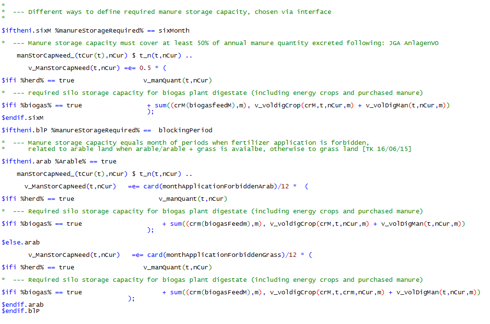
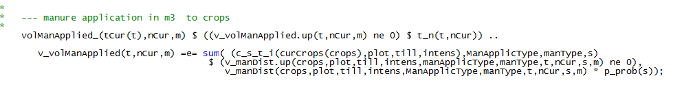
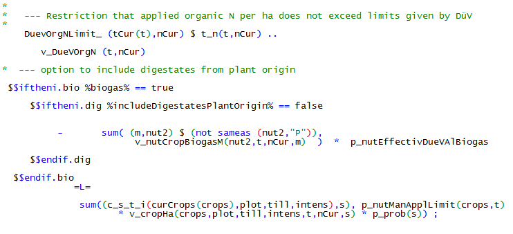
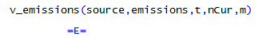
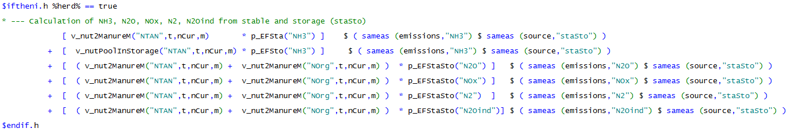
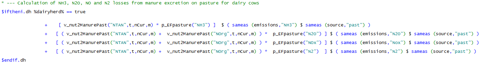
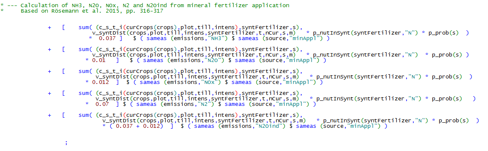

# The Template Model
# Introduction

An economic template model uses a declarative approach which depicts in
rather generic terms the physical and financial relations in the system
to analyse. It describes their relations based on a set of decision
variables, exogenous parameters and equations describing their
relations. Template models in that sense have a long-standing tradition
in economics. In macro-applications, template based computable general
equilibrium models, such as GTAP (Hertel 1997) or the
IFPRI [^1] CGE\_template (Lofgren et al. 2002), are quite
common. For regional and farm type applications, programming model
templates are underlying e.g. the regional or farm type model in CAPRI
(Britz & Witzke 2008) or the bio-economic typical farm
type models in FFSIM (Louhichi et al. 2010). The aim of a
template model is to differentiate between structural elements which are
common to any instance of the system analysed and attributes of a
specific instance. A specific instance of a farm would capture those
attributes which are specific to e.g. location, firm and time point or
period analysed, including attributes of the farmer (and its family)
such as his management abilities and preferences.

A template model can be coded and documented independently from a
specific instance. It also features clearly defined inputs and outputs
so that generic interfaces to other modules can be developed. These
modules could e.g. deliver the necessary inputs to generate instances or
to use the template model's results as inputs, e.g. for reporting
purposes or systematic analysis.

For our purposes, a suitable template must be able to generate instances
representing farms characteristics by differing initial conditions and
further attributes, specific to the firm and farmer. Initial conditions
are for example the existing herds, available family labour, capital
stock such as stables, machinery or storage facilities and its age, land
owned and rented by the farm or his equity. Further attributes could
describe the firm's market environment such as input and output prices,
yield potentials, household expenditures, the willingness of the farmer
and family members to work off-farm and the potential farm branches.

Farming is characterized by long lasting and relatively expensive
stationary capital stock, especially in form of stables and related
equipment. High sunk costs related to past investments can lead to
sticky farm programs, as key management possibilities such as reducing
the herd size lead to modest saving of variable costs compared to losses
in revenues. Consequently, strategies of farms as a response to changes
in market and policy environment such as GHG emission ceilings are path
dependent on investment decisions in the past. Whereas all farms can
implement certain short term adjustments regarding herd-, feed- or
fertilizer-management, investment based strategies are not very likely
to be adjusted for farms which invested recently in new buildings or
expensive machinery. These characteristics imply individual farms and
the industry as a whole that optimal short and long term strategies
might differ considerably.

Accordingly, a framework is needed which covers a longer planning period
to capture (re)investment decisions and their impact on the farm program
and on externalities such as nutrient surpluses or GHG emissions. Figure
1 depicts the basic structure of the template model with different
module interactions.


2. Overview of template model

Remark: represents mass transfers from one module to another

represents monetary transfers

represents environmental and related transfers.

Source: Own illustration

In the following, the GAMS code is directly used to document the
equations in the different modules to avoid a second layer of mnemonics.
The following naming conventions are used in the GAMS code and also in
the documentation. All decision variables of the farmers start with a
*v\_*. They are endogenous to the simultaneous solution of all equations
when maximizing the objective function and hence depend on each other.
Exogenous parameters start with a *p\_*. They can typically be changed
in an experiment. Sets, i.e. collection of index elements, do not carry
a specific prefix.

The model equations are defined in *model\\templ.gms*, declarations of
parameters and sets also used outside of the model equations can be
found in *model\\templ\_decl.gms*.

# Herd Module


Animals are dealt with in three parts of the model: the general herd
module, the cattle module and the pig module. The general herd module
depicts the herd demography while the latter two add aspects specific to
cattle and pigs

## General Herd Module

!!! abstract
    The herd module captures the intra-temporal demographic relations between different herds (number of animals born, replacement rates, raising periods etc.), at a maximal intra-yearly resolution of single months. The temporal resolution can be increased by aggregation on demand to reduce model size.

The general herd module depicts relations between herds of different
animal types on farm. Specifically, herds are differentiated by age,
gender, breeds, production objectives, month in each year. Female cows
of milk breeds can be optionally differentiated by their genetic
potential regarding the milk yield.

The model uses two different variables to describe herds: *v\_herdStart*
describes the number of animals by type which enter the production
process at a certain time, while *v\_herdSize* describes the number of
animals by type at the farm at a specific time. More precisely the
standing herd, *v\_herdSize*, can be described as animals which joint
the herd since the beginning of the production process, *v\_herdStart,*
minus slaughtered ones, as can be seen in the following equation. The
parameter *p\_mDist* in the equation describes the difference in months
between two time points defined by year, *t,t1*, and month, *m,m1*,
*p\_prodLength* depicts the length of the production process in months.

```GAMS
*
*   --- definition of standing herds
*
    herdSize_(herds,breeds,tCur(t),nCur,m) $ (sum(FeedRegime,actHerds(herds,breeds,feedRegime,t,m))

          $  sum( (t_n(t1,nCur1),feedRegime,m1)
                                     $ ( (   (-p_mDist(t,m,t1,m1)    le (p_prodLength(herds,breeds)-1)
                                          $ (p_mDist(t,m,t1,m1) le 0))

                                         or
                                          ( (abs(p_mDist(t,m,t1,m1)-12) le (p_prodLength(herds,breeds)-1))
                                              $ (p_mDist(t,m,t1,m1)-12 le 0)) $ p_compStatHerd
                                        )
                              $ actHerds(herds,breeds,feedRegime,t1,m1)
                              $ (balherds(herds) or remonte(herds) or sameas("remonte",herds))
                              $ t_n(t,nCur) $ isNodeBefore(nCur,nCur1)),1)
                                 ) ..

     sum(feedRegime $ actHerds(herds,breeds,feedRegime,t,m),v_herdSize(herds,breeds,feedRegime,t,nCur,m))

          =E=
*
*         --- herds which started in the months before the production length, in case for piglets a separate construct is used
*

          +  sum( (t_n(t1,nCur1),m1) $ (
                                       ((   (-p_mDist(t,m,t1,m1)    le (p_prodLength(herds,breeds)-1))
                                          $ (p_mDist(t,m,t1,m1) le 0))

                                         or
                                          ( (abs(p_mDist(t,m,t1,m1)-12) le (p_prodLength(herds,breeds)-1))
                                              $ (p_mDist(t,m,t1,m1)-12 le 0)) $ p_compStatHerd
                                       )
                              $ sum(feedRegime,actHerds(herds,breeds,feedRegime,t1,m1)) $ isNodeBefore(nCur,nCur1)
                     $$iftheni.sows "%farmBranchSows%" == "on"
                              $(not sameas(herds,"piglets"))
                     $$endif.sows
                               ),
                    v_herdStart(herds,breeds,t1,nCur1,m1)


                    $$iftheni.ch %cowHerd%==true
*
*                   --- minus, in case of cows, slaughtered before reaching the final age
*
                         -sum( (slgtCows,cows) $ (sum(feedRegime, actHerds(slgtCows,breeds,feedRegime,t1,m1))
                              $ sameas(cows,herds) $ (slgtCows.pos eq cows.pos)),
                                 v_herdStart(slgtCows,breeds,t1,nCur1,m1))
                    $$endif.ch
            )
*
*         --- Herd size dynamic for piglets separately to depict a correct transfer from year t to year t1 as well as account for temporal resolution adjustments
*

          $$iftheni.sows "%farmBranchSows%" == "on"
        +  sum( (t_n(t1,nCur1),m1) $ ( (abs(p_mDist(t,m,t1,m1)) le (p_prodLengthB(herds,breeds) -1 $ (p_prodLengthB(herds,breeds) eq 1)))
                              $ (p_mDist(t,m,t1,m1) le 0) $ isNodeBefore(nCur,nCur1)
                              $ sum(feedRegime,actHerds(herds,breeds,feedRegime,t1,m1))
                              $ (not sameas(herds,"sows"))
                              ${ ( sameas(t,t1) $ (not sameas(m  - p_prodLengthB(herds,breeds),m1)))
                                or ((not sameas(t,t1)) $ (sameas("Jan",m))$ (sameas( m + 11, m1)))}),

                   v_herdStart(herds,"",t1,nCur1,m1))
          $$endif.sows
    ;
```

The definition of the number of animals being added to the herd,
*v\_herdStart*, is described in the equation *herdBal\_*. In the
simplest case, where a 1:1 relation between a delivery and a use process
exists, the number of new animals entering the different use processes
*balherds* is equal to the number of new animals of the delivery process
*herds*. This relation is depicted by the *herds\_from\_herds* set.

One possible extension is that animals entering the herd can be
alternatively bought from the market, defined by the set
*bought\_to\_herds*. The symmetric case is when the raised/fattened
animals are sold, which is described by the *sold\_from\_herds* set.

For the case where several delivering processes are available, for
example heifers of a different process length replacing cows, the set
*herds\_from\_herds* describes a 1:n relation. A similar case exists if
one type of animal, say a raised female calve, can be used for different
processes such as replacement or slaughter, such that the expression
turns into a n:1 relation. This case is captured by second additive
expression in the equation.

In comparative-static mode *p\_compStatHerd*, all lags are removed such
that a steady-state herd model is described.

```GAMS
*
*   --- general balance definition
*
    herdsBal_(balHerds,breeds,tCur(t),nCur,m) $ (  sum(feedRegime,actherds(balHerds,breeds,feedRegime,t,m)) $ t_n(t,nCur)
*
     $ (p_Year(t) le p_year("%lastYear%"))
     $ (sum( (herds_from_herds(balHerds,herds,breeds),t1,m1)
                   $ ( (-p_mDist(t,m,t1,m1) eq round(p_prodLengthB(herds,breeds)/(12/card(herdM)))* (12/card(herdM)) )
                           $  sum(feedRegime,actHerds(herds,breeds,feedRegime,t1,m1))),1)
       $$iftheni.compStat "%dynamics%" == "comparative-static"
         or (sum( (herds_from_herds(balHerds,herds,breeds),t1,m1)
                   $ ( (-p_mDist(t,m,t1,m1)+12 eq round(p_prodLengthB(herds,breeds)/(12/card(herdM)))* (12/card(herdM)) )
*                     and not (-p_mDist(t,m,t1,m1) eq round(p_prodLengthB(herds,breeds)/(12/card(herdM)))* (12/card(herdM)) )
                           $  sum(feedRegime,actHerds(herds,breeds,feedRegime,t1,m1))),1))
       $$endif.compStat
                           or sum((bought_to_herds(herds,breeds,balherds),feedRegime) $ actherds(herds,breeds,feedRegime,t,m),1)
                           or sum((sold_from_herds(herds,breeds,balherds),feedRegime) $ actherds(herds,breeds,feedRegime,t,m),1)  )
                        ) ..
*
*      --- herd starting at current time point
*
          v_herdStart(balHerds,breeds,t,nCur,m)/p_herdYearScaler(balHerds,breeds)

*
*      --- plus herd starting at current time point which compete for the same input herds
*

     + sum( herds1 $ [ (sum(herds_from_herds(herds1,herds,breeds)
                                      $ herds_from_herds(balHerds,herds,breeds),1)
                    or sum(bought_to_herds(herds,breeds,herds1)
                            $ bought_to_herds(herds,breeds,balherds),1))
                    $ (not sameas(balHerds,herds1)) $  sum(feedRegime,actherds(herds1,breeds,feedRegime,t,m))],
          v_herdStart(herds1,breeds,t,nCur,m)/p_herdYearScaler(herds1,breeds))

*
*      --- sold animals from the process (e.g. female calv one year old)
*
       + sum( sold_from_herds(herds,breeds,balherds) $ sum(feedRegime,actherds(herds,breeds,feedRegime,t,m)),
                                             v_herdStart(herds,breeds,t,nCur,m))


         =e=
*
*      --- equal to the starting herd of the process wich generates these
*          these herds

     + sum( (herds_from_herds(balHerds,herds,breeds),t_n(t1,nCur1),m1)
                   $ (( (-p_mDist(t,m,t1,m1)    eq round(p_prodLengthB(herds,breeds)/(12/card(herdM)))* (12/card(herdM)) )
                $$iftheni.compStat "%dynamics%" == "comparative-static"
                     or (-p_mDist(t,m,t1,m1)+12 eq round(p_prodLengthB(herds,breeds)/(12/card(herdM)))* (12/card(herdM)) )
                $$endif.compStat
                      )    $  sum(feedRegime,actHerds(herds,breeds,feedRegime,t1,m1)) $ isNodeBefore(nCur,nCur1)),
                                    v_herdStart(herds,breeds,t1,nCur1,m1))

*
*      --- bought to herd (e.g. heifers bought from market)
*
     + sum( (bought_to_herds(herds,breeds,balherds))
           $ sum(feedRegime,actherds(herds,breeds,feedRegime,t,m)), v_herdStart(herds,breeds,t,nCur,m));
```

## Cattle Module

!!! abstract
    Cow herds can be distinguished by genetic potential, including endogenous breeding towards higher milk yield. Herds can be differentiated by animal types - such as cow, heifer, calf -, breeds, intensity levels (milk yield, daily weight gain) and feeding regimes.

The cattle module is closely related to the general herd module. It
describes the demographic relations between cattle types (dairy cows,
mother cows, male and female calves, heifers, young bulls) on the farm.
New-born calves can be sold immediately or after one year or being
raised to a heifer or young bulls, respectively. The heifer process,
starting with a female calf raised for one year is available in three
intensity levels, leading to different process lengths (12, 21, 27
month) and thus first calving ages (12, 33 and 40 months) for the
remonte. In Figure 2 the general concept of the cattle module and its
decision points are illustrated.


3. Cattle herd module management decisions

Remark: represents reproduction processes\
represents animal life development\
: being slaughtered or sold

Source: Own illustration

The number of new calves *v\_herdStart* are differentiated by gender and
breed, in a year *t*, and specific month *m*, and depend on the herd
size of cows of each breed and a specific calving coefficients.
*ActHerds* is a flag set to define which herds might enter the solution
for a specific year.

```GAMS
*
*   --- definition of calves born
*
    newCalves_("%basBreed%",t,nCur,m) $ ( sum( (calvs,feedRegime), actHerds(calvs,"%basBreed%",feedRegime,t,m))
                        $ (p_Year(t) le p_year("%lastYear%")) $ t_n(t,nCur)) ..
*
*      --- new born calves (for females by genetic potential for milk yield) are born
*          from the current herd of cows
*
                  v_herdStart("fCalvsRais","%basBreed%",t,nCur,m)  $ sum(feedRegime,actHerds("fCalvsRais","%basBreed%",feedRegime,t,m))
                + v_herdStart("fCalvsSold","%basBreed%",t,nCur,m)  $ sum(feedRegime,actHerds("fCalvsSold","%basBreed%",feedRegime,t,m))
                + v_herdStart("mCalvsSold","%basBreed%",t,nCur,m)  $ sum(feedRegime,actHerds("mCalvsSold","%basBreed%",feedRegime,t,m))
                + v_herdStart("mCalvsRais","%basBreed%",t,nCur,m)  $ sum(feedRegime,actHerds("mCalvsRais","%basBreed%",feedRegime,t,m))
              $$iftheni.crossBreed "%crossBreeding%"=="true"
               + v_herdStart("fCalvsRais","%crossBreed%",t,nCur,m) $ sum(feedRegime,actHerds("fCalvsRais","%crossBreed%",feedRegime,t,m))
               + v_herdStart("fCalvsSold","%crossBreed%",t,nCur,m) $ sum(feedRegime,actHerds("fCalvsSold","%crossBreed%",feedRegime,t,m))
               + v_herdStart("mCalvsSold","%crossBreed%",t,nCur,m) $ sum(feedRegime,actHerds("mCalvsSold","%crossBreed%",feedRegime,t,m))
               + v_herdStart("mCalvsRais","%crossBreed%",t,nCur,m) $ sum(feedRegime,actHerds("mCalvsRais","%crossBreed%",feedRegime,t,m))
             $$endif.crossBreed


          =e= sum( (cows,t1,nCur1,m1,mDist) $ (sum(feedRegime,actHerds(cows,"%basBreed%",feedRegime,t1,m1))
                  $ (      (mDist.pos  eq -p_mDist(t,m,t1,m1))
                         or (mDist.pos eq -p_mDist(t,m,t1,m1)+12) $ p_compStatHerd)
                       $ t_n(t1,nCur1)),
                          v_herdStart(cows,"%basBreed%",t1,nCur1,m1) * p_calvCoeff(cows,"%basBreed%",mDist));
```

The calving coefficients take into account different breed specific
parameters (see *coeffgen\\ini\_herds.gms*) [^2]:


In order to allow for an increase of the genetic yield potential of
herd, two mechanisms are available. If the farmer is allowed to buy
heifers from the market, the bought heifers can have a higher milk yield
than the replaced ones; the price for heifers depends on their milk
yield potential. The second mechanism is to systematically breed towards
higher milk yields. Breeding progress is restricted to about 200 kg per
year and cow, which can be seen from the following equation.


Most equations - such as those relating to stable place needs -
differentiate by genetic potential. Therefore, in the following equation
the individual herds are aggregated to summary herds which are partly
used in other equations where differentiation by genetic potential is
not needed. Additionally, this provides a better overview on model
results in the equation listing.


## Pig Module

!!! abstract
    The pig module distinguishes between fattening- and piglet production systems. Fattening pigs are subdivided into different phases to account for different feeding requirements and excretion values. The piglet production system differentiates between sows, young piglets and piglets, which are separated from their mother after two weeks.

The pig module, similar to the cattle module, is closely linked with the
general herd module. It distinguishes between a fattening branch and a
piglet production branch with sows. The herd dynamics of the pig module
are shown in Figure 3.

4. Pig module management decisions

Remark: represents reproduction processes\
represents animal life development\
being bought or sold

Source: Own illustration

The piglet production process starts with the production of young
piglets born to sows, shown in the following equation.


Each sow produces on average 26.7 young piglets per year in the default
parameterization. After one month young piglets become piglets and
remain 2 months within the herd before they are sold or transferred to
the fattener branch. Labor and feed requirements are chosen according to
a growing period of 41 days and a weight gain from 8 to 30 kg. The
feeding-, stable- and labor requirements of the piglet production branch
are steered by the sows and piglets herd size.

The fattener farm branch distinguishes between four different stages of
fatteners to account for different feeding and excretion values during
the production process. Feeding levels and excretion values are
connected via the set *feedregime*. That allows to adapt feeding
patterns, for instance to adjust nutrient output in response to
legislatively given fertilizer restrictions. For a more thorough
explanation of the feeding options, please refer to the pig feeds module
in section 2.2.2. The piglets bought in a month are immediately
transferred into early fatteners and are after a month transferred to
the next fattening stage until they become fatteners and are sold as
fattened pigs. Each stage lasts for one month. The weight development
during the fattening process is assumed from 28 to 118kg live weight.

As mentioned in the general herd module, the equations such as herd
balance *herdsBal\_* and herd size, *herdSize\_* are used for the herd
dynamic in the pig module. The following model code shows the elements
of the herd used in the farm branch for sows.


The statements below show the elements of the herd used in the farm
branch for fatteners.


# Feeding module


!!! abstract
    The feed module distinguishes between pig and cattle feeding requirements. For a dairy herd, it captures a cost minimal feed mix from own produced fodder and different types of concentrates at given requirements per head and intra-year feeding periods (energy, protein, dry matter) for each cattle herd. For pigs it determines a cost minimal feed mix from own produced and purchased fodder and concentrates such as soybean meal and soy oil. For both branches, different feeding phases for reduced nitrogen and phosphorus output can be used.

## Cattle Feed Module

The feeding module for cattle consists of two major elements:

1.  **Requirement functions** and related constraints in the model
    template

2.  **Feeding activities**, which ensure that requirements are covered
    and link the animal to the cropping sector as well as to purchases
    of concentrates

The requirements are defined in *coeffgen\\requ.gms*. Requirements for
dairy cows are differentiated by annual milk yield and by lactation
period. The model differentiates 5 lactations period with different
lengths (30 -- 70 -- 100 -- 105 -- 60 days, where the last 60 days are
the dry period). The periods are labelled according to their last day,
e.g. *LC200* is the period from day 101 to day 200, *LC305* is the
period from the 201<sup>st</sup> to the 305<sup>th</sup> day and *dry* denotes the last 60
days of lactation.


??? note "Excurse - Computation of Output Coefficients for each Lactation Phase"
    This excurse describes the derivation of the output coefficient
    for each lactation phase, hence how much of yearly milk yield is
    produced by each cow on one day.

    

    5. Lactation curves of different yearly
         milk yield potentials and average milk yield in different
         lactation phases (30-70-100-105-60)

    Remark: Calculation based on Huth (1995:pp.224-226)

    Source: own illustration

    Using the above shown lactation functions, the daily fraction of the
    yearly milk yield in each lactation phase can be derived. The mean
    over the four milk yield potentials of the coefficients are shown in
    table 1.

    6. Daily fraction of whole lactation milk
         yield in different lactation phases

       |                |  LC30   | LC100  |  LC200  | LC3005  | Dry |
       |----------------|---------|--------|---------|---------|-----|
       |Daily fraction  | 0.00356 |0.0043  | 0.00333 | 0.00233 |  0  |

    Remark: Own calculation based on Huth (1995, pp.224-226)

    Following these outputs, e.g. on each of the first 30 days of
    lactation, the cow produces 0.356% of the yearly milk yield (e.g. 28
    kg per day for a cow which produces 8000 kg per year). In a next
    step, these coefficients are used to calculate the sum of milk output
    in each lactation phase to further calculate feed requirements
    stemming from the herds in each phase.

The daily milk yield in each period is based on the following statements
which define milk yield in ton/year, stored on the general output
coefficient parameter *p\_OCoeff*. The coefficient is scaled to match
total yearly milk yield.


The model differentiates for each herd between requirements for energy
in NEL, raw protein and maximum dry matter. So far, for heifers and
calves only one feeding phase is depicted such that daily requirements
during the production process are identical.

The distribution of the requirements for cows in specific lactation
periods *p\_reqsPhase*, over the months, *m*, depends on the monthly
distribution of births, *p\_birthDist*, as can be seen in the following
equation.


In order to test different model configurations and to reduce the number
of equations and variables in the model, the monthly requirements,
*p\_Monthly*, are aggregated to an intra-annual planning period,
*intrYPer*, for which a different feed mix can be used for each type of
herd, see the following equation.


The requirements per planning period, *p\_reqs*, enter the equation
structure of the model. The equations are differentiated by herd, year,
planning period and state-of-nature, and ensure the requirements are
covered by an appropriate feed mix made out of different feeding
stuff [^3]. The composition of the feed mix is determined endogenously.
In general, a herd consists of cows of different milk yield potentials,
heifers and different types of calves. Total feed requirements for a
farm in the different intra-yearly planning periods depend on the
distributions of calving dates in the cow herd, therefore, cows of the
same milk yield potential can be in different lactation phases during
the year. The requirements of tons of feed, *v\_feeding*, are
differentiated by herd, breed, planning period (lactation phase of cow),
state-of-nature and year, if the requirement phases are not defined for
specific time spans after the herd start:


Alternatively, requirements can be linked to the start point of an
animal process to break down the total requirement during the length of
the production processes in phases. The equation is only switched on if
the parameter *p\_reqsPhaseLength* is non-zero:


This extension of the feeding module is used for the raising calves
process. As a representative example the raising calves process for
females calves, fCalvsRais, from birth to the 12th month. Three
requirement phases are defined: *0\_2*, *3\_7* and *8\_12*; the labels
indicate the start and end month of each phase:


The requirements are defined for each phase separately, as
representative examples the first two phases are illustrated in the
following.


The link between the variable *v\_herdStart* and per phase requirements
when using the *reqs1\_* equation is shown in the listing below. The
requirements for the first two months, *0\_2*, are only entering the
first intra-year feeding period (which covers the months January to
April). The requirements for the next 5 months, *3\_7*, are distributed
with a weighting of 2:2:1 over the first three intra-year periods (two
months in the period of January to April, JAN\_APR, two months in the
period of May to June, MAY\_JUN, and one in the period of July to
August, JUL\_AUG). Similarly, the periods for the last five months,
*8\_12*, enter with a weighting of 1:2:2 over the last three feeding
periods of that year.


If the herd starts one month later in February (see the following
listing), the weights are shifted accordingly and one fifth of the
requirements for the last five months, *8\_12*, occurs in the first
feeding period of the next year 2012.


The model allows to not fully exploit the genetic potential of cows,
based on the endogenous variable *v\_redMlk*. Lower utilization reduces
requirements for a specific cow herd, in a specific lactation period,
year and planning period by the amount of energy and protein requirement
for a specific amount of milk and reduces milk production of the farm
accordingly.

In a next step feeding amounts are aggregated to total feed use,
v\_feeduse, per each product and for each year, feed and planning
period.


For own produced feed which is not storable and shows a variable
availability over the year such as grass from pasture, an aggregation to
the intra-year periods is done.


## Pigs Feed Module

The feeding requirements for the piglet production branch differentiate
between sows with the attached young piglets and the piglets after
separation from the sows. Requirements are set for energy, crude
protein, lysin, phosphorus feed and dry matter. Further, minimum and
maximum requirements are set for certain feeds in order to reflect
realistic feeding patterns. For example, a minimum requirement for oil
in the feed intake is assumed to assure a correct viscosity.

The fattening branch distinguishes between four fattening stages to
provide the option of nitrogen and phosphorus reduced feeding (N/P). It
includes the stages *earlyFattners*, *midFattners, lateFattners,
Fattners.* Three feeding regimes are applicable, which are: normal feed,
reduced N/P feed and highly reduced N/P feed. The primary differences
between the feeding schemes are the adjustments of daily nutrient
requirements depending on the stage a fattening pig is currently in. For
instance, with the normal feed there are only to two different feeding
requirements; a daily requirement for the weight range from 28-40 kg
which is in the early fattening phase and a daily requirement from
40-118 kg which assumes daily feed requirements in the mid, late and
finishing fattening stage. In contrast the N/P reduced feeding phase
differentiates between daily nutrient requirements for the weight ranges
28-40kg, 40-70kg and 70-118kg. Thus, all stages require different daily
nutrient requirements. In accordance with the piglet production branch,
the fattening branch also imposes maximal and minimal values for certain
products to account for digestibility, correct feeding textures and
mineral provision.

The following equations and table show a part of the feeding
requirements definition as well as minimum and maximum amounts of
certain feeding products.


The requirements are used to determine the optimal feeding mix shown in
the equation *reqPigs\_*. Hence, it can be seen which feeding products
are used by which herd type at a certain time. The equation
*feedSourcePig\_* determines the source of feed, i.e. whether it is
purchased or produced on farm.


The upper and lower bound for the feeding mix are then determined by
*feedTot\_, feedmax\_, feedMin\_* (not additionally shown here) which
allows certain flexibility in the feeding mix.

# Cropping, Land and Land Use


!!! abstract
    The cropping module optimizes the cropping pattern subject to land availability, reflecting yields, prices, machinery and fertilizing needs and other variable costs for a selectable longer list of arable crops. The crops can be differentiated by production system (plough, minimal tillage, no tillage, organic) and intensity level (normal and reduced fertilization in 20% steps). Machinery use is linked to field working days requirements depicted with a bi-weekly resolution during the relevant months. Crop rotational constraints can be either depicted by introducing crop rotations or by simple maximal shares. The model can capture plots which are differentiated by soil and land (gras, arable) type and size.

Crop activities are differentiated by crop, *crops*, soil types, *soil,*
management intensity, *intens*, and tillage type, *till*. Use of
different management intensities and tillage types is optional.
Management intensities impact yield levels (see chapter 2.11.1.1).
Necessary field operations and thus variable costs, machinery and labour
needs reflect intensity and tillage type as well.

## Cropping Activities in the Model

Crop activities are defined with a yearly resolution and can be adjusted
to the state of nature in the partially stochastic version. The farmer
is assumed to be able to adjust on a yearly basis its land use to a
specific state of nature as long as the labour, machinery and further
restrictions allow for it. Land is differentiated between arable and
permanent grass land, *landType*, the latter is not suitable for arable
cropping. Land use decisions can be restricted by maximal rotational
shares for the individual crops. The set *plot* differentiates the land
with regard to plot size, soil type and climate zone. The attributes of
plots, as well as the number of plots from 1 to 20, is defined in the
GUI.

The total land endowment is calculated in the equation *totPlotLand\_*
as the sum of the initial endowment, *p\_plotSize(plot)*, and land
purchased, *v\_buyLand*, in the past or current year.


Total cropped land is defined by the land occupied by the different
crops, *v\_cropH*a. The *c\_s\_t\_i* set defines the active possible
combinations of crops, soil type, tillage type and management intensity.


The total land *v\_totPlotLand* can be either used for cropping
(including permanent grassland), *v\_croppedLand*, or rented out,
v*\_rentOutLand*, on a yearly basis. The option to rent out land can be
activated in the GUI:


Maximum rotational shares, *p\_maxRotShare*, enter *cropRot\_*, which is
only active if no crop rotations are used (see chapter 2.3.2).


That a farm stays within a maximum stocking rate ceiling, expressed in
livestock units per ha, is ensured by the following equation. The
maximal allowed stocking rate can be adjusted in the GUI:


## Optional Crop Rotational Module

Alternatively to the use of maximum rotational shares (see previous
section) the model offers an option of a three year crop rotation
system. The rotation names (shown in the following list, see
*model\\templ\_decl.gms*), set *rot*, show the order of the crops in the
rotations. Each line depict a sequence of three crop types (do not have
to be different) in a rotation with only the order being differently.
This avoids unnecessary rigidities in the model.


Remark: WC: winter cereals, SC: summer cereals, PO: potatoes, SU: sugar
beets, ID: idling land, OT: other

The *rotations* are linked to groups of crops in the first, second and
third year of the rotation as can be seen in the following equation
(only cross-set definitions *rot\_cropTypes* for the first rotation are
shown).


The link between individual crops and crop types used in the rotation
definitions is as follows:


In order to use the crop rotations in the model equations, three cross
sets are generated which define the crop type in the first, second and
third year for each rotation:


For each simulation, crops can be selected that are cultivated on farm,
therefore, it can be the case that not all rotations are operational.
Accordingly, in *coeffgen\\coeffgen.gms*, the set of available crop
rotations is defined:


The rotations enter the model via three constraints (*see
model\\templ.gms*). The right hand side sums up the crop hectares of a
certain crop type in the current year in all four constraints, while the
left hand side exhausts these hectares in the current, next and after
next year based on the rotations grown in these years.


The rotations restrict the combination of crops and enter into the
optional soil pool balancing approach.

# Labour


!!! abstract
    The labour module optimizes work use on- and off farm with a monthly resolution, depicting in detail labour needs for different farm operations, herds and stables as well as management requirements for each farm branch and the farm as a whole. Off farm work distinguishes between half and full time work (binaries) and working flexibly for a low wage rate.

## General Concept

The template differentiates between three type of labour on farm:

1.  **General management and further activities for the whole farm,**
    *p\_labManag("farm","const"*, which are needed as long as the farm
    is not given up ,*v\_hasFarm* = 1, *binary variable*, and not
    depending on the level of individual farm activities.

2.  **Management activities and further activities depending on the size
    of farm branches** such as arable cropping, dairying, pig fattening,
    sows. The necessary working hours are broken down into a base need,
    *const* which is linked to having the farm branch, *v\_hasBranch*,
    *integer*, and a linear term depending on its size, *slope*.

3.  **Labour needs for certain farm operations** (aggregated to
    *v\_totLab*).

The sum of total labour needs cannot exceed total yearly available
labour (see following equation). As discussed below, there are further
restrictions with regard to monthly labour and available field working
days.


The maximal yearly working hours, *p\_yearlyLabH,* are defined in the
statement shown below. The maximal labour hours for the first, second
and further labour units can be entered via the GUI.


The maximal work hours per month is defined in the following statement,
represented by the parameter *p\_monthlyLabH*:


The template considers sum of labour needs for each month, *m,* and each
SON, *s*. Farm labour needs are related to certain farm activities on
field and in stable. The labour need for work on farm and flexibly off
farm is defined by the following equation. The variables that enter in
the equation are explained in the next section of the labour section.


## Labour Need for Farm Branches

Farmdyn comprises currently five different farm branches: cropping,
cattle, fatteners, sows and biogas. The (management) labour needs for
the biogas branch is accounted for in the biogas module. For the other
branches, their size *v\_branchSize*, is endogenously defined from
activity levels mapped to it:

\
Where the cross-set, *branches\_to\_acts,* defines which activities
count to a certain branch:


The binary variable *v\_hasBranch* which relates to the general
management need for branch is triggered as follows:


The *hasFarm* trigger depends on the trigger for the individual
branches:


The hours are needed for yearly farm management are defined from a
constant and the branch specific values:


## Labour Need for Herd, Cropping, Operations and Off-Farm Work

***Herd Activities and Cropping***

The labour need for animals, *v\_herdLabM,* is defined by an animal type
specific requirement parameter, *p\_herdLab,* in hours per animal and
month (see in the next equation, working hours per animal and month) and
in addition by the time requirement per stable place, which is
differentiated by stable type. This formulation allows labour saving
scale effects related to the stable size:


A similar equation exists for crops, however, crop labour need is
differentiated here by state of nature in the partial stochastic
version. The parameter *p\_cropLab* defines the labour hours per hectare
and month for each crop. In addition, the parameters *p\_manDistLab* and
*p\_syntDistLab* multiplied by the *N type* applied to each crop are
added to the overall crop labour demand for the application of synthetic
and manure:


***Farm Operations***

Field working days define the number of days available in a labour
period of half a month, *labPeriod,* during which soil conditions allow
specific types of operations, *labReqLevl*:


The number of field work hours cannot exceed a limit which is defined by
the available field working days, *p\_fieldWorkingDays.* Field working
days depend on climate zone, soil type (*light, middle, heavy*) and
distribution of available tractors to the soil type, *v\_tracDist*. It
is assumed that farm staff will be willing to work up to 15 hours a day,
still with the total work load per month being restricted:


Furthermore, the distribution of tractors is determined endogenously:


It implicitly assumes that farm family members are willing to spend
hours for on farm work even if working off farm, e.g. by taking days
off.

***Off-Farm Work***

Farm family members can optionally work half or full time, *v\_workoff*,
or on an hourly basis off farm, *v\_workHourly*. Half and full time work
are realized as integer variables. In the normal setting the wage per
hour for working half time exceeds the wage of short time hourly work.
Moreover, the per hour wage of full time work is higher than of working
half time one. For half and full time work commuting time can be
considered:


The set *workType* lists the possible combinations:


It is assumed that decisions about how much to work flexibly on an
hourly basis are taken on a yearly basis (i.e. the same amount of hours
are inputted in each month) and can be adjusted to the state of nature.

The total number of hours worked off-farm is defined as:


# Stables


The template applies a vintage based model for different stable types in
addition to other buildings and selected machinery, and a physical use
based depreciation for the majority of the machinery park. Under the
vintage based model stables, other buildings and machinery become
unusable after a fixed number of years. In the case of physical
depreciation machinery becomes inoperative when its maximum number of
operating hours or another measurement of use (e.g. the amount handled)
is reached. Investments in stable, buildings and machinery are
implemented as binary variables. In order to keep the possible branching
trees at an acceptable size, the re-investment points can be restricted
to specific years. For longer planning horizon covering several decades,
investment could e.g. only be allowed every fourth or fifth year.

The stable inventory, *v\_stableInv,* for each type of stable,
*stables,* is defined as can be seen in *stableInv\_*. *p\_iniStables*
is the initial endowment of stables by the construction year,
*p\_lifeTimeS* is the maximal physical life time of the stables and
*v\_buyStables* are newly constructed stables.


For cow stables a differentiation is introduced between the initial
investment into the building, assumed to last for 30 years, and certain
equipment for which maintenance investments are necessary after 10 or 15
years, as defined by the investment horizon set *hor*:


A stable can only be used, if short and middle term maintenance
investment is done.

The model distinguishes between several stable types for cattle, shown
in the following list). They differ in capacity, cattle type, investment
cost and labour need per stable place.


For pigs the following stable sizes are available:


The used part of the stable inventory (a fractional variable) must cover
the stable place needs for the herd:


The used part cannot exceed the current inventory (a binary variable):


As certain maintenance costs are linked to stables, the share of the
used stable is restricted to minimum 75%, which assumes that maximal 25%
of the maintenance costs can be saved when the stable is not fully used:


The different stable attributes are defined in
"*coeffgen\\stables.gms*".

# Other Type of Buildings


Besides stables the model currently includes silos for more manure,
bunker silos for maize or grass silage and storages for potatoes.

Each type of manure silo is linked to an inventory equation:


The manure silos are linked to the manure storage needs which are
described in chapter Manure. A similar inventory equation as for manure
silos is implemented for the other buildings:


The buildings included in the model are:


The attributes of the buildings are defined in
*coeffgen\\buildings.gms*:


The inventory of the buildings is linked to building needs of certain
activities:


# Farm Machinery


The model includes farm machineries in quite some detail:


For further information see Appendix A1.

Each machinery type is characterized by set of attributes *p\_machAttr*
(see *coeffgen\\mach.gms*), see as an example:


## Farm Operations: Machinery Needs and Related Costs

Machinery is linked to specific farm operations (see *tech.gms*):


For more details see Appendix A2.

Labour needs, diesel, variable and fixed machinery costs are linked to
these operations, an extraction is shown in the following:


Furthermore, the model considers the effect of different plot size and
the mechanisation level:


The farm operations are linked to cropping activities (below an example
for potatoes):


That detailed information on farm operations determines

1.  The **number of necessary field working days** and *monthly labor
    need* per ha (excluding the time used for fertilizing, which is
    determined endogenously)

2.  The **machinery need** for the different crops

3.  Related **variable costs**

The labor needs per month are determined by adding up over all farm
operations, considering the labor period, the effect of plot size and
mechanization (*coeffgen\\labour.gms*):


## Endogenous Machine Inventory

The inventory equation for machinery is shown in *machInv\_*, where
*v\_machInv* is the available inventory by type, *machType,* in
operation hours. *v\_machNeed* is the machinery need of the farm in
operating hours and *v\_buyMach* are investments in new machines.


The last expression is used when the farm program for the simulated
period is used to estimate the machinery needs for all years until the
stables are fully depreciated.

The machinery need in each year is the maximum of the need in any
state-of-nature in that year:


A small set of machinery, such as the front loader, dung grab, shear
grab or fodder mixing vehicles are depreciated by time and not by use:


Those are linked to the existence of stables, i.e. stables cannot be
used if machinery is not present:


# Investments, Financing and Cash Flow Definition

!!! abstract
    The investment module depicts investment decisions in machinery, stables and structures (silos, biogas plants, storage) as binary variables with a yearly resolution. Physical depreciation can be based on lifetime or use. Machinery use can be alternatively depicted as continuous re-investment rendering investment costs variable, based on a Euro per ha threshold. Investment can be financed out of (accumulated) cash flow or by credits of different length and related interest rates. For stables and biogas plants, maintenance investment is reflected as well.

The total investment sum *v\_sumInv* in each year is defined by:


It can be financed either by equity or by credits, and enters
accordingly the cash balance definition, *v\_liquid*. The cash balance
is the cash at the end of the last year plus the net cash flow,
*v\_netCashFlow*, in the current year plus new credits, *v\_credits*,
minus fixed household expenditures, *p\_hcon*, and new investments,
*v\_sumInv*:


The model differentiates credits by repayment period, *p\_payBackTime*,
and interest rate. Credits are paid back in equal instalments over the
repayment period, hence, annuities decrease over time. The amount of
outstanding credits is defined by the following equation:


The net cash flow is defined as the sum of the gross margins in each
SON, *v\_objeTS* plus received interest and revenue from liquidation
(selling equipment or land) minus storing costs for manure, interest
paid on outstanding credits and repayment of credits:


Revenues from liquidation are only assumed to take place in the last
year (of the farm's life):


Liquidation is active if the model runs in fully dynamic mode and not in
comparative-static and short run mode.

The gross margin for each state-of-nature is defined as revenues from
sales, *v\_salRev*, income from renting out land, *v\_rentOutLand*, and
salary from working off farm minus variable costs. The latter relate to
costs of buying intermediate inputs such as fertilizer, feed or young
animals comprised in the equations structure of the model template,
*v\_buyCost*, and other variable costs, *v\_varCosts*. For off-farm work
(full and half time, v*\_workOff*) the weekly work time in hours,
*p\_weekTime*, is given. In addition, it is assumed that off-farm week
covers 46 weeks each year, so that income is defined then from
multiplying these two terms with hourly wage, *p\_wage*.


The sales revenues, *v\_salRev*, that enter the equation above are
defined from net production quantities, *v\_prods*, and given prices in
each year and state of nature, *p\_price*:


The sale quantity, *v\_saleQuant*, plus feed use, *v\_feedUse*, must
exhaust the production quantity, *v\_prods*:


The production quantities are derived by summing the production
quantities of animal and crop production. Additionally, for milk
quantities reduction of yield for specific cows and phases is
considered:


The variable *v\_redMlk* allows the farmer to not fully use the genetic
potential of the milk cow by adjusting the feed mix. This could be of
relevance in the optimization process for instance if the yield
potential of different herds are very high, but price combinations of
in- and output lead to an economic optimal intensity level that is below
the maximum milk yield potential. Without this variable, cows would have
always to be milked at the maximum level.

# Manure


!!! abstract
    Manure excretion from animals is calculated based on fixed factors, differentiated by animal type, yield level and feeding practice. For biogas production, the composition of different feed stock is taken into account. Manure is stored subfloor in stables and in silos. Application of manure has to follow legal obligations and interacts with plant nutrient need from the cropping module. Different N losses are accounted for in stable, storage and during application.

## Manure Excretion

With regard to excretion of animals, relevant equations and variables
can be found in the *general\_herd\_module.gms*. *v\_manQuantM* is the
monthly volume in cubic meter of manure produced. It is computed by
summing the monthly manure for the herd with considering the amount
excreted while grazing, shown in the following equation:


Furthermore, the monthly excretion of nutrients, NTAN, Norg and P is
calculated, multiplying *v\_herdsize* and *p\_nut2ManMonth*. For cows,
excretion rate depends on animal category, feeding regime and yield
level. For fatteners and sows, excretion depends on animal category and
feeding regime. Corresponding parameters can be found in
*coeffgen\\manure.gms* (not shown here). For dairy cows, excretion on
pasture is subtracted.


Biogas production involves the production of digestates. Four sources
can be differentiated depending on the origin of the feed crop: use of
manure produced on farm, manure imported to the farm, crops grown on
farm and crops imported on farm. Manure produced on farm is treated like
not fermented manure, as though it is not entering the biogas plant.

For digestates from imported manure and from crops, volume of digestates
in cubic meter is calculated in the *biogas\_module.gms* by multiplying
amount of used feed stock, *v\_usedCropBiogas* and *v\_purchManure*, and
a fugal factor. The latter represents the decrease of volume during the
fermentation process.


The amount of nutrients produced in the biogas plant and entering the
manure storage is computed by multiplying the amount of feed stock and
the corresponding nutrient content. It is assumed, that N and P is not
lost during fermentation. Furthermore, nutrients from crop inputs are
calculated as an annual average since no short term changes are common.


## Manure Storage

Equations related to manure storage serve mainly for the calculation of
the needed storage capacity, linked to investment, and for the
calculation of emissions during storage. The *manure\_module.gms* is
activated when fattners, sows, dairy and/or biogas is activated in the
GUI.

The amount of manure in the storage in cubic meter is described in the
following equation. Manure is emptied by field application,
*v\_volManApplied*. When activated in the GUI, manure can also be
exported from the farm.


Following the same structure as the equation above, there is a nutrient
pool for NTAN, Norg and P in the storage. Losses of NTAN and Norg during
storage are subtracted. When environmental accounting is switched off,
standard loss factors are subtracted directly in the equation.



When environmental accounting is switched on, losses are calculated in
the equation *nutLossInStorage\_*, using emission factors from the
environmental impact accounting module (see chapter 2.12).


The amount of manure in the storage needs to fit to the available
storage capacity which is calculated in the equation
*totalManStorCap\_*. The total storage capacity is the sum of the sub
floor storage in stables, silos and silos for digestates from biogas
production. Note: when the biogas branch is active without herds, the
storage concept is simplified.



The storage capacity of silos *v\_SiloManStorCap* is derived by
multiplying the silo inventory with parameters characterizing the
corresponding storage capacity.


The subfloor storage capacity of stables *v\_SubManStorCap* is
calculated in the *general\_herd\_module.gms*. The stable inventory is
multiplied with parameters characterizing the corresponding subfloor
storage capacity. The amount of manure which can be stored in the stable
building, *p\_ManStorCap*, depends on the stable system. Slurry based
systems with a plane floor normally only have small cesspits which
demand the addition of manure silo capacities. The manure storage
capacity of stables with slatted floor depends on the size of the
stable, where a storage capacity for manure of three month in a fully
occupied stable is assumed. A set of different dimensioned liquid manure
reservoirs is depicted in the code, *p\_ManStorCapSi*, from 500 to 4000
m.


The storage capacity for digestates from biogas plants,
*v\_siloBiogasStorCap*, is linked to the size of the biogas plant and
calculated in the *biogas\_module.gms*.


The total volume is distributed to the different storage type based on
the following equations.


For the silos related to animal husbandry, different coverage of silos
can be applied. The type of silo cover used for a certain type of silo,
*v\_siCovComb*, is a binary variable, i.e. one type of silo must be
fully covered or not.



The amount of storage capacity is prescribed by environmental law.
FARMDYN allows applying different regulations with regard to required
storage capacity, changed in the GUI. The necessary silo capacity can be
set (1) to 6 month, i.e. 50 % of annual manure excretion, or to (2)
amount of month when manure application is forbidden in winter. For (2),
there is a differentiation for arable land and grassland.



The total manure storage capacity *v\_TotalManStorCap* must be greater
than the required storage capacity *v\_ManStorCapNeed*.


Besides requirement with regard to the storage capacity, there are
equations which make sure that the storage is emptied in certain points
of time. Every spring, the storage has to be emptied completely with
regard to nutrients and volume, what is made sure of in the equations
*emptyStorageVol\_* and *emptyStorageNut\_*. On the one hand, this
represents typical manure management of farms. On the other hand, the
restriction is necessary to make sure that the storage can be emptied
when relation between nutrients and volume changes due to nutrient
losses during storage (see chapter 2.9.3).


Furthermore, at the end of the time period modelled, only 1/3 of the
annual excreted manure is allowed to remain in the storage, to avoid
unrealistic behaviour in the last year modelled. This is made sure in
the following equations.


## Manure Application

Different application procedures for manure N are implemented,
*ManApplicType*, including broad spread, drag hose spreader and
injection of manure. The core variable is *v\_mandist* that represents
the amount of manure in cubic meter. The different techniques are
related to different application costs, labour requirements as well as
effects on different emissions. Furthermore, manure application is
linked to the nutrient balance (see chapter 2.11.2 and 2.11.3) and the
manure storage (see chapter 2.9.2).

The application of manure links nutrient with volumes. The nutrient
content of the manure is depending on the herd's excretion as well as on
the losses during storage. The parameter *p\_nut2inMan* contains the
amount of NTAN, Norg and P per cubic meter of manure applied. Relevant
parameters are calculated in *coeffgen\\manure.gms*. There are two
approaches to calculate the parameter, (1) environmental accounting not
activated and (2) environmental accounting activated.

For both systems, the amount of different nutrients per cubic meter is
calculated without losses, *p\_nut2inManNoLoss*. In the following
equation, *p\_nut2inMan* is calculated when the environmental accounting
is not active. In this case, only a fixed factor for NH<sub>3</sub> emissions is
subtracted from NTAN contained in the manure. The parameter is
calculated for the types of manure from different herds, *mantype.* The
herds and types of manure are liked via the cross set *herds\_mantype*.
This calculation implies that there is one type of manure for every herd
activated in FARMDYN.


If environmental accounting is active, the calculation of *p\_nut2inMan*
differs. It is taken into account, the storage time of manure varies
and, therefore, losses during storage vary. For the manure of every
herd, two types of manure are calculated, representing the maximum and
minimum possible amount of losses during one year. This allows a
complete emptying of the storage in a linear programming setting.


The total manure distributed in cubic meter and in nutrients per month
is summarized in the following equations according to:




There are several restrictions with regard to the application of manure.
First of all, the application of manure is not possible in some crops in
some month, e.g. in maize at certain height of growth.


There are restrictions with the timing and the quantity of applied
manure coming from the German fertilizer directive. Generally, the
application of manure is forbidden during winter. Depending on settings
in the GUI, manure application can be forbidden only three month during
winter or more restrictive regulations apply.


Furthermore, there is the option to ban certain manure application
techniques to represent technical requirements given by the German
fertilizer directive. These requirements can be activated in the GUI.
The sets *tNotLowAppA(t)* and *tLowAppA(t)* represents the years with
certain technical requirements.


In the German fertilizer directive, the total amount of Nitrogen from
manure is restricted to 170 kilogram N per ha and year in farm average.
For grassland, there is the possibility to apply 230 kilogram. The
restrictions can be switched on or off in the GUI. In the following
equations, *v\_DueVOrgN* represent the amount of organic nutrients
excreted by animals minus nutrient exports from the farm.
*v\_nutExcrDueV* is calculated in the *general\_herd\_module.gms and*
*v\_nutBiogasDueV* in the *biogas\_module.gms* (equations not shown
here).


The applied N is not allowed to exceed the given threshold,
*p\_nutManApplLimit*, as stated in the following equation. In current
legislation, organic N from digestates of plant origin is excluded in
the calculation of this threshold. Note that the organic N application
according to the fertilizer directive is always calculated in FARMDYN.
The restrictive threshold can be switched on and off in the GUI.



# Synthetic Fertilizers


To meet the N and P demand of crops, synthetic fertilizer can be applied
besides manure, *v\_syntDist*. Synthetic fertilizer application enters
equations with regard to the buying of inputs, *buy\_* and *varcost\_*,
the labour need for application, *labCropSM\_*, the field work hours and
machinery, *fieldWorkHours\_* and *machines\_*, and with regard to plant
nutrition (see chapter 2.11). The equation *nMinMan\_* makes sure that
minimum amounts of mineral fertilizer are applied for certain crops. It
represents the limitation meeting the plant need with nutrients from
manure, e.g. fertilizing short before harvest for baking wheat cannot be
done with manure.


# Plant Nutrition


The equations related to the plant nutrition make sure that the nutrient
need of crops is met. Nutrient need can be derived from N response
functions or from planning data for fixed yield levels. Needed nutrients
are provided by manure and synthetic fertilizer. There are two
approaches to model the nutrient need and supply of crops, a fixed
factor approach and detailed nutrient fate model.

## Calculation of plant need

The template supports two differently detailed ways to account for plant
nutrition need.

1.  A **fixed factor approach** with yearly nutrient balances per crop

    a.  Using N response curves

    b.  Using planning data

2.  A detailed **flow model** with a monthly resolution by soil depth
    (deprecated).

    c.  Using N response curves

*p\_nutNeed* is the nutrient need for different crops and enters the
equation for fixed factor approach and the flow model. For the fixed
factor approach, nutrient need can be calculated based on N response
curves and alternatively based on planning data. In the detailed flow
model, nutrient need needs to be calculated based on N response curves.
All relevant calculation can be found in *coeffgen\\cropping.gms*.

## N response curves

The yield level of different crops is chosen in the GUI. The following
equations show, at the example of winter cereals, that the yield,
*p\_OCoeffC*, equals the yield given by the GUI, *p\_cropYieldInt* , and
takes a growth rate given by the GUI into account.


In the next step, the nutrient need for crops are linked to the
different cropping intensities. There are five different intensity
levels with regard the amount of N fertilizer applied:


These nutrient needs for the different intensities are based on nitrogen
response functions from field trials. The intensity can be reduced from
100 % to an N fertilizer application of 80%, 60%, 40% and 20 %. The
yield level is reduced to 96%, 90%, 82% and 73%, respectively. These
steps reflect the diminishing yield increases from increased N
fertilizer application.


The output coefficients, *p\_OCoeffC*, represents the yields per hectar.
They are used to define the nutrient uptake by the crops, *p\_nutNeed,*
based on the nutrient content, *p\_nutContent*. Values for
*p\_nutContent* are taken from the German fertilizer directive
(DV 2007, Appendix 1).


For different intensities, the corresponding amount of nutrient applied
has to be determined to fulfil the need *p\_nutNeed*.

The parameter *p\_basNut* defines the amount of nutrients coming from
other sources than directly applied fertilizer. The curve suggests that
for a 53%-level of yield, only 20% of the N dose at full yield is
necessary. Assuming a minimum nutrient loss factor that allows defining
how much N a crop takes up from other sources (mineralisation,
atmospheric deposition):


The amount of nutrient applied, *p\_nutApplied,* is estimated as shown
in the following equation, it is assumed that at least 20% of the
default leaching and NH<sub>3</sub> losses will occur.


The nutrient application, *p\_nutApplied,* in combination with the basis
delivery from soil and air, *p\_basNut,* allows defining the loss rates
for each intensity level, *p\_nutLossUnavoidable,* as the difference
between the deliveries and the nutrient uptake, *p\_nutNeed,* by the
plants:


*p\_nutLossUnavoidable* enters the Standard Nutrient Fate Model (see
chapter 2.11.2). It represents the factor that has to be applied over
the plant removal, *p\_nutNeed*, to reach a certain yield level. It
indicates the nutrient efficiency of the fertilizer management.

## Planning Data

The nutrient need can also derived from planning data from the revised
Fertilizer directive (BMEL 2015). The proposed directive includes
compulsory fertilizer planning to increase N use efficiency on farms.
This measure is included in FARMDYN. When fertilizer management follows
the planning data, different intensities do not exist and yield levels
are fixed, i.e. cannot be changed by the GUI.

The yield level *p\_OCoeffC* is fixed in the following equation, showing
the example of winter cereals.


The yield corresponds to a certain amount of needed N, *p\_nutNeed*,
given by the directive.


In the case of P, it is assumed that the nutrients need correspond to
the nutrients removed by the harvested product.


The directive prescribes that nutrients delivered from soil and air have
to be taken into account. This reduces the amount of fertilizer that
needs to be applied. The parameter, *p\_basNut*, enters the Standard
Nutrient Fate Model (see chapter 2.11.2). We assume a fixed amount of 30
kg N per hectar and year for every crop.


The directive does not allow applying more nutrients than required
following the planning data. Unavoidable losses are already reflected in
*p\_nutNeed*. In the GUI, a factor for *over fertilization* can be
activated. In this case, the N need for plant increases. This feature
can be used to assess the impact of inefficient N management of farms.


Furthermore, the directive prescribes the share of N from organic
sources that has to be accounted for in the fertilizing management. The
requirements of the directive can be activated in the GUI and enter the
Standard Nutrient Fate Model (see chapter 2.11.2).

## Standard Nutrient Fate Model

The standard nutrient fate model defines the necessary fertilizer
applications based on yearly nutrient balances for each crop category,
*NutBalCrop\_*. In the equation below, the left hand side defines the
nutrient need plus the application of manure over plant need. The right
hand side captures the net deliveries from mineral and manure
application plus deliveries from soil and air.

FARMDYN allows different ways to account for N from manure. Organic N
can be accounted for based on (1) requirements from the Fertilizer
Directive, (2) a given factor by the interface and (3) exogenous
calculated losses. Losses are calculated using the environmental
accounting module (see chapter 2.12). If the environmental accounting
module is switched off, calculated losses are derived using standard
loss factors from the Fertilizer directive. Different elements of the
equation *NutBalCrop\_* are explained below.


The crop need is derived from *p\_nutneed*. In the case of using N
response functions, the needed nutrients increase by unavoidable losses,
*p\_nutLossUnavoidable*. In the case of using planning data, unavoidable
losses are already included in *p\_nutNeed* and, therefore,
*p\_nutLossUnavoidable* is set to 0 (see chapter 2.11.1.2).


When activated in the GUI, more organic N and P than needed for plant
nutrition can be applied.


The plant need (including over application of manure) has to equal the
offered nutrients. For pasture, there is a special accounting needed
since loss factors differ from stable. Furthermore, nutrients excreted
during grazing are only available on the pasture. As stated above, there
are different ways to account for N from manure.


The following elements determine the amount of N and P entering the
nutrient balance with applied manure. Again, different ways to account
for organic N are represented in the equation.

Losses can be calculated representing exogenous estimated N emissions.
The reader should note that nutrients applied from manure are net of
losses during storage.


The amount of organic N accounted for in fertilizing can be chosen in
the GUI.


Furthermore, the requirements of the fertilizer planning from the German
fertilizer directive can be followed.


For P from manure, no losses are taken into account.


Nutrients from mineral fertilizer application are added. No losses are
taken into account since they are already included in the calculation of
*p\_nutLossUnavoidable* (see chapter 2.11.1).


Delivery of nutrients from soil and air are included.


In the equation *nutSurplusMax\_*, the application of nutrients from
manure over plant need is restricted for each crop type:


*p\_nutSurplusMax* is calculated in *coeffgen\\cropping.gms*.


In the standard nutrient fate model the reductions in soil nutrient can
be managed by:

1.  reducing unnecessary manure applications which decrease
    *v\_nutSurplusField*

2.  lowering cropping intensity (when nutrient need is derived using N
    response curves). It reduces not only the overall nutrient needs and
    therefore the losses, but also reduces the loss rates per kg of
    synthetic fertilizer

3.  switching between mineral and organic fertilization

4.  changing the cropping pattern

## Deprecated: Detailed Nutrient Fate Model by Crop, Month, Soil Depth and Plot

The detailed soil accounting module considers nutrient flows both from
month to month and between different soil layers (top, middle, deep). It
replaces the equations used in the standard nutrient fate model shown in
the section above. The central equation is the following:


The detailed nutrient fate model considers as input flows:

-   Application of organic and mineral fertilizers net of NH3 and other
    gas losses from application, they are brought to the top layer,

-   atmospheric deposition (to the top layer),

-   net mineralisation and

-   nutrient leaching from the layer above.

The considered output flows are:

-   Uptake by crops and

-   leaching to the layer below.

The difference between the variables updates next month's stock based on
current month's stock. Monthly leaching to the next deeper soil layer,
*v\_nutLeaching,* is determined as a fraction of plant available
nutrients (starting stock plus inflows):


The leaching losses below the root zone in combination with ammonia,
other gas losses from mineral and organic fertilizer applications define
the total nutrient losses at farm level in each month:


The approach requires defining the nutrient needs of each crop per
month, which is currently estimated:


Similarly, the nutrient uptake by the crop from different soil layers is
determined:


A weakness of this approach is how changes of cropping patterns are
handled between years. It would be favourable to define the transition
of nutrient pools from year to year based on a "crop after crop"
variable in hectares for each soil type. However, this leads to
quadratic constraints which failed to be solved by the industry QIP
solvers [^4]. Instead, the pool is simply redistributed across crops and
a maximum content of 50 kg of nutrient per soil depth layer is fixed:


If the user switches on crop rotations a further restriction is added:


## Nutrient Balance According to the Fertilizer directive

The German fertilizer directive requires that farms calculate a nutrient
balance on an annual basis (DV 2007). It combines nutrients input via
manure and synthetic fertilizer with nutrients removal via the harvested
crops. The surplus, i.e. the balance, is not allowed to exceed a certain
threshold. In FARMDYN, the nutrient balance is always calculated. The
threshold can be switched on and off in the GUI. Relevant equations can
be found in *model\\templ.gms*.

Nutrient removal via harvested product is calculated.

Nutrient input via synthetic fertilizer is
calculated.


In the equation *nutBalDuev\_*, nutrient input and output are combined.
Input from organic sources, *v\_nutExcrDuev* and *v\_nutBiogasDuev,* are
calculated in the *manure\_module.gms* and the *biogas\_module.gms*
(equations not shown here). Furthermore, nutrients export via manure
export is taken into account. *v\_surplusDueV* is the surplus of the
nutrient balance.


The surplus, *v\_surplusDueV,* is not allowed to exceed a certain
threshold given by the GUI.


# Environmental Accounting Module


!!! abstract
    The environmental accounting module *env\_acc\_module.gms* allows quantifying Ammonia (NH<sub>3</sub>), nitrous oxide (N<sub>2</sub>O), nitrogen oxides (NO<sub>x</sub>), elemental nitrogen (N<sub>2</sub>). For nitrogen (N) and phosphate (P), soil surface balances are calculated indicating potential nitrate leaching and phosphate losses. Environmental impacts are related to relevant farming operation.

## Gaseous emissions

All relevant calculations are listed in *model\\env\_acc\_module.gms.*
Emissions of NH<sub>3</sub>, N<sub>2</sub>O, NO<sub>x</sub> and N<sub>2</sub> are calculated, following
calculation schemes and emission factors from relevant guidelines (IPCC
2006, Rsemann et al. 2015, EMEP 2013). We apply a mass
balance approach to quantify different N emissions, subtracting emission
factors from different N pools along the nutrient flow of the farm.
Emissions factors are listed in *coeffgen\\env\_acc.gms*.

The sets *emissions* and *sources* contain relevant emissions and their
sources. The cross set *source\_emissions* links emissions to relevant
sources (Methane (CH<sub>4</sub>) is also included but still on the development
stage and therefore not described here).


All gaseous emissions are calculated in the equation *emissions\_* on a
monthly basis. By the use of *sameas* statements, only relevant sources
and emissions are activated in the corresponding part of the equation.



Calculation of emissions from stable and manure storage.



Calculation of emissions from manure excreted on pasture (only relevant
for dairy).



Calculation of emissions from manure application, application techniques
have different emission factors.


Calculation of emissions from mineral fertilizer application.



## N and P surplus

The losses of N, mainly as Nitrate to groundwater bodies, and P, mainly
via erosion and entry to surface waters, are most relevant environmental
threats of farming systems. Since it is highly depending on
environmental and geographical conditions, fixed emissions factors are
less commonly used than for gaseous losses. Therefore, we calculate N
and P surplus balances in the equation *SoilBal\_* as an indicator for
potential loss of N and P after field application. This part of the
environmental accounting will be replaced by results from crop models as
part as of an ongoing research project
(<http://www.ilr.uni-bonn.de/pe/research/project/pro/pro16_e.html>).

The balance is calculated as the difference between the nutrient input
via organic and mineral fertilizer and the removal of nutrients via the
harvested product.


Note, that the calculated surplus differs from the surplus calculated
for the threshold under the fertilizer directive (see chapter 2.11.4).
For the environmental accounting, the estimated losses from storage,
stable etc. are modelled precisely whereas fixed, prescribed values are
used for the fertilizer directive.

# Biogas Module

!!! abstract
    The biogas module defines the economic and technological relations between components of a biogas plant with a monthly resolution, as well as links to the farm. Thereby, it includes the statutory payment structure and their respective restrictions according to the German Renewable Energy Acts (EEGs) from 2004 up to 2014. The biogas module differentiates between three different sizes of biogas plants and accounts for three different life spans of investments connected to the biogas plant. Data for the technological and economic parameters used in the model are derived from KTBL (2014) and FNR (2013). The equations within the template model related to the biogas module are presented in the following section.

## Biogas Economic Part

The economic part describes at the one hand the revenues stemming from
the heat and electricity production of the biogas plant, and at the
other hand investment and operation costs. The guaranteed feed-in tariff
paid to the electricity producer per kWh, *p\_priceElec*, and underlying
the revenues, is constructed as a sliding scale price and is exemplary
shown in the next equation.


*p\_priceElecBase*, used to calculate the guaranteed feed-in tariff
differentiated by size, includes the base rate and additional
bonuses [^5] according to the legislative texts of the EEGs. For the EEG
2012 it only contains the base rate. In addition, the guaranteed feed-in
tariff is subject to a degressive relative factor, *p\_priceElecDeg,*
which differs between EEGs and describes price reductions over time. The
*p\_priceElecBase* is then used to calculate the electricity based
revenue of the biogas operator by multiplying it with the produced
electricity, *v\_prodElec*. In order to assure a correct representation
of the EEG 2012 payment, the biogas module differentiates the
electricity output by input source *v\_prodElecCrop* and
*v\_prodElecManure* and multiplies it with its respective bonus tariffs
*p\_priceElecInputclass* which are added to the base rate.

In addition to the *traditional* guaranteed-feed in tariff, the biogas
module comprises the payment structure for the so-called *direct
marketing option* which was implemented in the EEG 2012. The calculation
of the revenue with a direct marketing option is defined as the product
of the produced electricity, *v\_prodElec*, the sum of the market
premium, *p\_dmMP*, and the price at the electricity spot exchange EPEX
Spot, *p\_dmsellPriceHigh/Low.* The latter depends on the amount of
electricity sold during high and low stock market prices. Additionally,
it is accounted for a flexibility premium, *p\_flexPrem*.

Furthermore, the revenue stemming from heat is accounted for and it is
included as the product of sold heat, *v\_sellHeat*, times the price of
heat, *p\_priceHeat*, which is set to two cents per kWh. The amount of
head sold is set exogenously and depends on the biogas plant type.

The detailed steps of the construction of prices can be seen in
*\\coeffgen\\prices\_eeg.gms.*

## Biogas Inventory

The biogas plant inventory differentiates biogas plants by size (set
*bhkw*), which determines the engine capacity, the investment costs and
the labour use. Three size classes are currently depicted.


Moreover, in order to use a biogas plant
different components need to be present which differ by lifetime
(investment horizon *ih*). For example, in order to use the original
plant, the decision maker has to re-invest every seventh year in a new
engine but only every twentieth year in a new fermenter.


The biogas plant and their respective parts can either be bought,
*v\_buyBiogasPlant(Parts)*, or an already existing biogas plant can be
used, *p\_iniBioGas*. Both define the size of the inventory of the
biogas plant, *v\_invBioGas(Parts).* The model currently limits the
number of biogas plants present on farm to unity.


Furthermore, the inventory *v\_invBioGas* stores the information under
which EEG the plant was original erected, either by externally setting
the EEG for an existing biogas plant or the initial EEG is endogenously
determined by the year of investment. In addition, the module provides
the plant operator the option to switch from the EEG under which its
plant was original erected to newer EEGs endogenously, such that the
electricity and heat price of the newer legislation determines the
revenues of the plant. For this purpose, the variable *v\_switchBioGas*
transfers the current EEG from *v\_invBioGas* to the variable
*v\_useBioGasPlant*. Hence, the *v\_invBioGas* is used to represent the
inventory while *v\_useBioGasPlant* is used to determine the actual EEG
under which a plant is used, i.e. payment structures and feedstock
restrictions.


## Production Technology

The production technology describes not only the production process, but
also defines the limitations set by technological components such as the
engine capacity, fermenter volume and fermentation process. As heat is
only a by-product of the electricity production and therefore the
production equations do not differ from those for electricity, the heat
production is not explicitly described.

The size of the engine restricts with *p\_fixElecMonth* the maximal
output of electricity in each month. According to the available size
classes, the maximal outputs are 150kW, 250kW and 500kW, respectively,
at 8.000 operating hours per year, as it is assumed that the biogas
plant is not operating for 9% of the available time due to maintenance,
etc.


The production process of electricity, *v\_prodElec,* is constructed in
a two-stage procedure. First, biogas [^6], *v\_methCrop*/*Manure,* is
produced in the fermenter as the product of crops and manure,
*v\_usedCrop/Man,* and the amount of methane content per ton fresh
matter of the respective input. Second, the produced methane is
combusted in the engine in which the electricity--output,
*v\_prodElecCrop/Manure,* is calculated by the energy content of
methane, *p\_ch4Con,* and the conversion efficiency of the respective
engine, *p\_bhkwEffic*.


The bonus structure of the EEG 2012 requires a differentiation between
the two input classes: crop and manure. Thus, the production process is
separated in methane produced from the *Crop* input class and the
*Manure* input class.

The production technology imposes a second bound by connecting a
specific fermenter volume, *p\_volFermMonthly,* to each engine size. The
fermenter volume is exogenously given under the assumption of a 90 day
hydraulic retention time and an input mix of 70 percent maize silage and
30 percent manure. Hence, the input quantity derived from crops,
*v\_usedCropBiogas,* and manure, *v\_usedManBiogas,* is bound by the
fermenter size, *v\_totVolFermMonthly.*


The inputs for the fermentation process can be either externally
purchased, *v\_purchCrop/Manure,* or produced on farm,
*v\_feedBiogas/v\_volManBiogas*. Additionally, the module accounts for
silage losses for purchased crops, as crops from own production already
includes silage losses in the production pattern of the farm. Currently,
the model includes only cattle manure, maize silage and grass silage as
possible inputs.


The third bound imposed by the production technology is the so called
digestion load (*Faulraumbelastung*). The digestion load, *p\_digLoad,*
restricts the amount of organic dry matter within the fermenter to
ensure a healthy bacteria culture. The recommended digestion load of the
three different fermenter sizes ranges from 2.5 to 3
$\frac{\text{kg oDM}}{m^3 \cdot d}$ [^7] and is converted into a monthly
limit.


The data used for the fermenter technology can be seen in
*\\coeffgen\\fermenter\_tech.gms*

## Restrictions Related to the Renewable Energy Act

Within the legislative text of the different Renewable Energy Acts
different restrictions were imposed in order to receive certain bonuses
or to receive any payment at all. In the biogas module most bonuses for
the EEG 2004 and EEG 2009 are inherently included such as the KWK-Bonus
and NawaRo-Bonus, i.e. the plant is already defined such that these
additional subsidies on top of the basic feed-in tariff can be claimed.
Additionally, the biogas operator has the option to receive the
Manure-Bonus, if he ensures that 30 percent of his input quantity is
manure based, as can be seen in the following code.


Furthermore, the EEG 2012 imposes two requirements which have to be met
by the plant operator to receive any statutory payment at all. First,
the operator has to ensure that not more than 60 percent of the used
fermenter volume, *v\_totVolFermMonthly,* is used for maize. Second,
under the assumption that the operator uses 25 percent of the heat
emitted by the combustion engine for the fermenter itself, he has to
sell at least 35 percent of the generated heat externally;


Changes made in EEG 2014 and the amendment of 2016 has not been included
in the model yet.

 [^1]: International Food Policy Research Institute

 [^2]: Remark: *mc* are mother cows, sales prices for animals are assumed
    to be equal to the Simmental breed.

 [^3]: Grass and maize silage and grass from pasture, which are own
    produced, and three type of concentrates

 [^4]: QIP solvers do not allow for equality conditions which are by
    definition non-convex

 [^5]: For the EEG 2004: NawaRo-Bonus, KWK-Bonus; For the EEG 2009:
    Nawaro-Bonus, KWK-Bonus **or** NawaRo-Bonus, KWK-Bonus and
    Manure-Bonus

 [^6]: Biogas is a mixture of methane (CH<sub>4</sub>), carbon dioxide (CO<sub>2</sub>),
    water vapor (H<sub>2</sub>O) and other minor gases. The gas component
    containing the energy content of biogas is methane. Thus, the code
    with respect to production refers to the methane production rather
    than the production of biogas.

 [^7]: oDM = organic dry matter; m<sup>3</sup> = cubic meter; d = day
